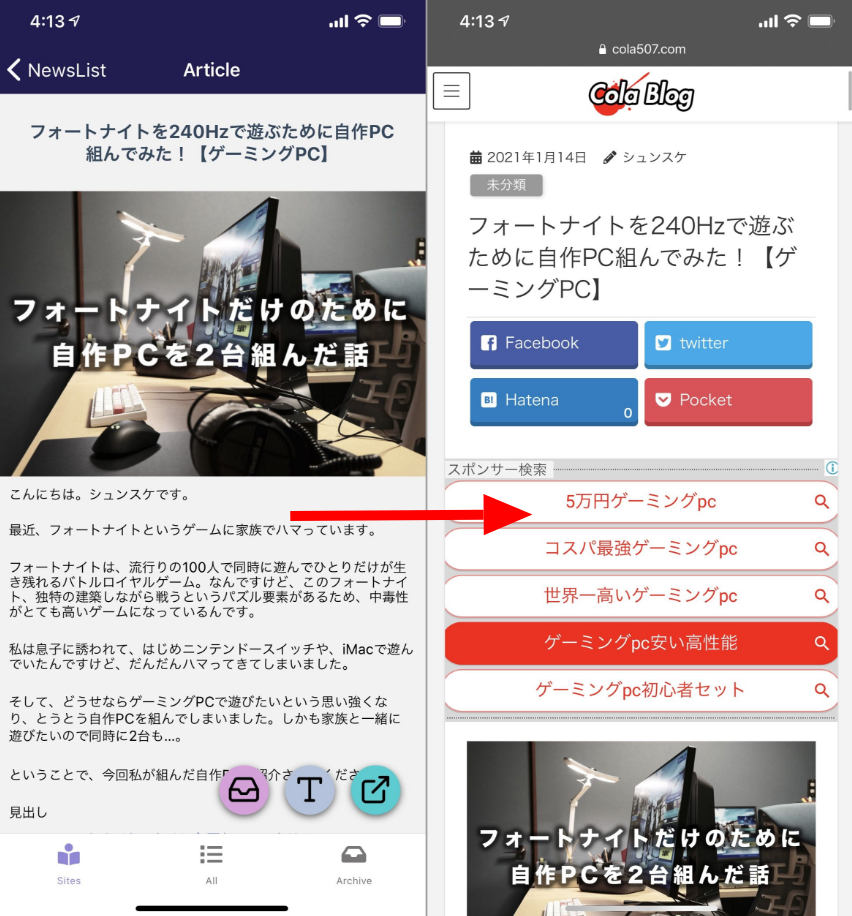
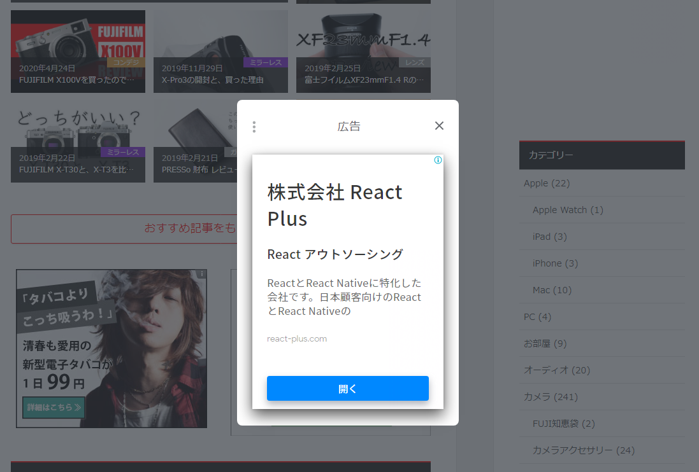
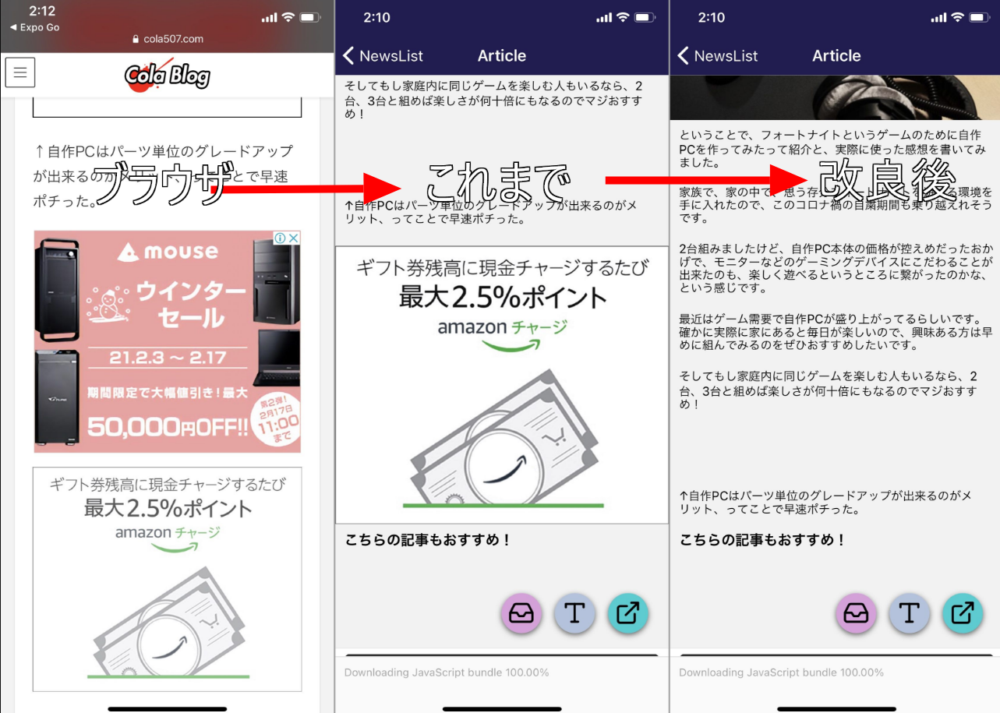
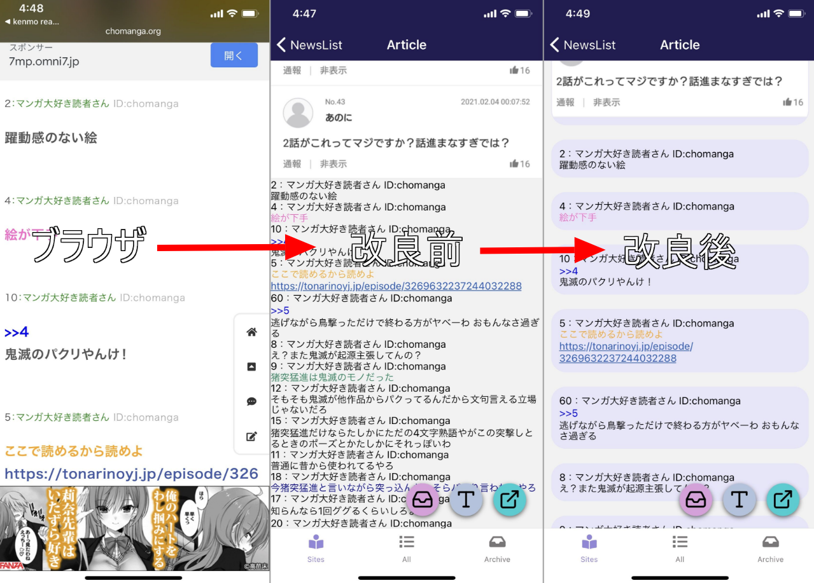
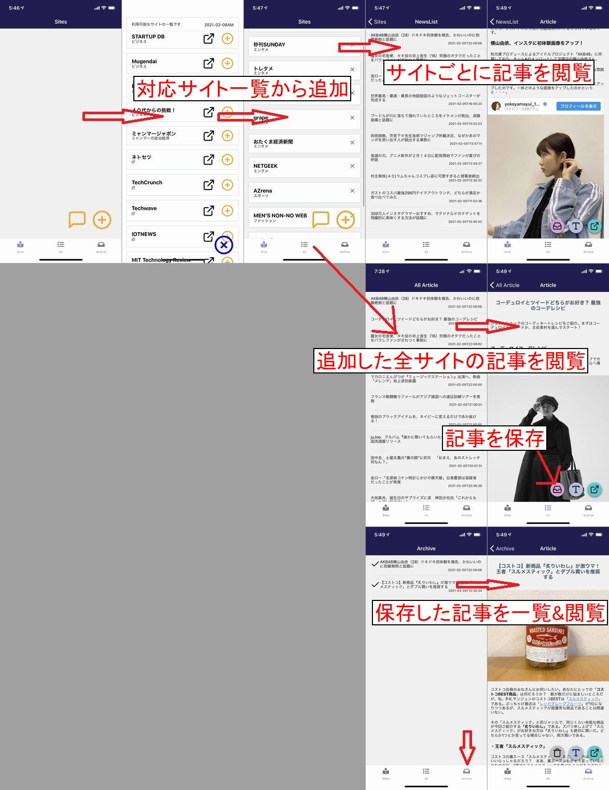
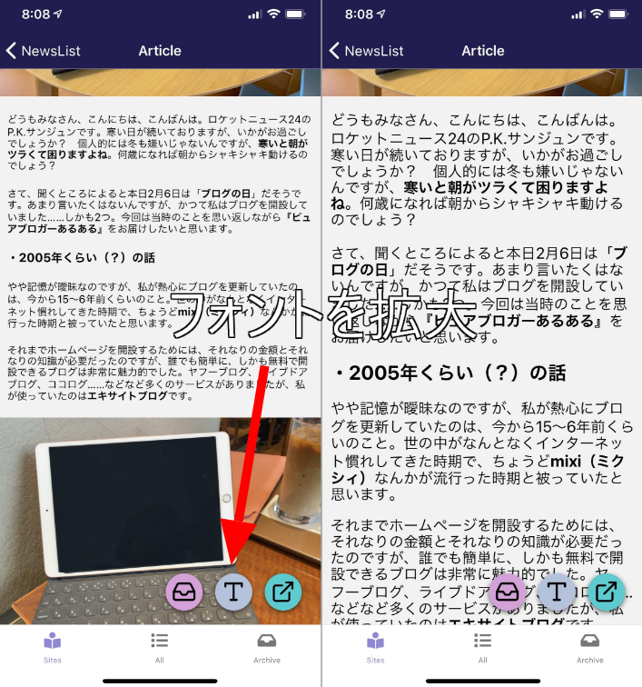

import { Link } from 'gatsby';

kenmo readerの広告排除機能の強化とまとめサイトの表示改善について書きます。

## kenmo readerの広告排除機能を強化しました

ダークモードの実装に手を付けたのですが、色々やり方があってベストなやり方が見つかりません。

なので<Link to="/blog/2021-02-03">前回</Link>予告した通り、正しく表示されないサイトのスタイルをちまちまと調整しました。

その過程で記事本文に手動で差し込まれてる広告も排除しました。その一部を書きます。

### ブラウザで表示した場合との比較

これまでのkenmo readerでもブラウザで開く場合よりは広告の排除はできていました。





### 今回排除した広告

こういう広告がないだけでも、十分な価値だとは思いますが**記事本文に含まれるバナー**などは排除できてませんでした。今回は記事本文に含まれる広告を排除しました。

今回の成果を画像で表したものがこちらです。



除去し切れていなかった、本文内のバナー広告を排除しました。

### 実装したコード

<Link to="/blog/2021-01-15">以前</Link>やったことと同じです。

<br/><br/>

[react-native-render-html](https://github.com/meliorence/react-native-render-html)の`tagsStyles`と`classesStyles`を使います。

まずは該当のページのHTMLを確認します。

**フォートナイトを240Hzで遊ぶために自作PC組んでみた！【ゲーミングPC】**

`https://www.cola507.com/fortnite-240fps-jisaku-pc/`

```html
<p>↑自作PCはパーツ単位のグレードアップが出来るのがメリット、ってことで早速ポチった。</p>
<aside class="row veu_insertAds after">
  <div class="col-md-6">
    <script async src="//pagead2.googlesyndication.com/pagead/js/adsbygoogle.js"></script> <!-- 広告１ --> <ins
      class="adsbygoogle" style="display:block" data-ad-client="ca-pub-3636186007576698" data-ad-slot="6504839163"
      data-ad-format="rectangle"></ins>
    <script> (adsbygoogle = window.adsbygoogle || []).push({}); </script>
  </div>
  <div class="col-md-6"><a href="https://amzn.to/2WetPhH" class="imgxxx" target="_blank" rel="nofollow"></a></div>
</aside>
<div class="upbyw601d7ac4897aa">
  <h2>こちらの記事もおすすめ！</h2>
  <script async src="//pagead2.googlesyndication.com/pagead/js/adsbygoogle.js"></script> <ins class="adsbygoogle"
    style="display:block" data-ad-format="autorelaxed" data-ad-client="ca-pub-3636186007576698"
    data-ad-slot="2381197569" data-matched-content-ui-type="image_card_stacked" data-matched-content-rows-num="3"
    data-matched-content-columns-num="3"></ins>
  <script> (adsbygoogle = window.adsbygoogle || []).push({}); </script>
</div>
```

ページ全体を貼ると無駄に長くなるので該当部分の前後を抜粋しました。

広告は`aside`タグの`veu_insertAds`クラスに割り当てられてるのが分かります。これにスタイルを当てます。

**src\scenes\article\style.js**

```javascript
'yyi-rinker-contents': {
  display: "none"
},
'veu_socialSet': {
  display: "none"
},
/* ここから */
'veu_insertAds': {
  display: "none"
},
/* ここまで追加 */
'wp-embedded-content': {
  display: "none"
},
'r-buy': {
  display: "none"
},
'rakuten-buy-box': {
  display: "none"
},
'adsbygoogle': {
  display: "none"
},
```

前後の部分も貼りましたが、こんな感じで広告部分に`display: "none"`を当てます。これで広告が消えます。

こんな感じで、1個1個HTMLを調べてスタイルを当てていった結果、かなり広告排除機能が強化できたと思います。

## まとめサイトの表示改善

改良した結果を画像にしました。



もともと画面下に表示されるバナー広告は排除できてますが、レス表示が見にくかったので改善しました。

これも上記と同じ要領でページのHTMLを調べてスタイルを当てるというやり方です。

### 実装したコード

当てたスタイルはこんな感じです。

```javascript
'matome-res': {
  backgroundColor: "#e6e6fa",
  padding: 10,
  borderRadius: 20,
  borderWidth: 1,
  borderColor: "#e6e6fa",
  overflow: "hidden",
  margin: 10
},
```

実装したコードは以上です。

## まとめ

そもそもkenmo readerの目的はウェブの閲覧体験を向上するためのアプリなので、本来の目的がブラッシュアップできてよかったです。

## 現在の機能





---