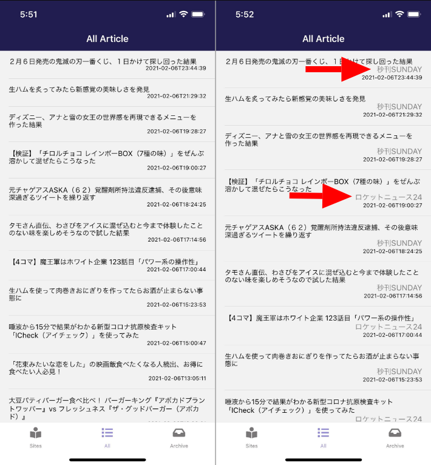
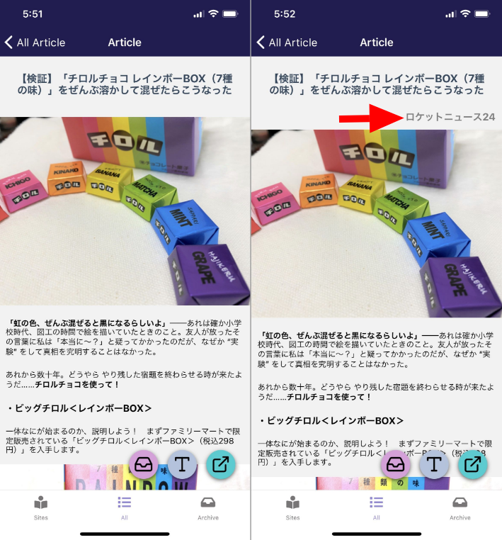

import { Link } from 'gatsby';

## kenmo readerを更新しました

いただいた意見に「記事一覧、閲覧画面でどこのサイトの記事かわかるようにしてほしい」というのがあったのでサイト名を表示するようにしました。





## 仕組み

記事一覧画面と記事閲覧画面では、画面に表示してないだけで**それぞれの記事のURL**を持っています。

なので

1. 各記事のURLからドメインを取得
1. アプリ内部で持っているサイト情報から一致するドメインを検索
1. 一致したもののサイト名を表示

という仕組みにしました。

## 実装したコード

### サイト情報を更新

アプリ内部で持っている対応サイト一覧に検索用の`domain`フィールドを追加します。

**src\scenes\sites\list.js**

```javascript
export const sites = [
  {
    ID: 6,
    name: 'ロケットニュース24',
    url: 'https://rocketnews24.com',
    domain: 'rocketnews24.com', // ここに追加
    caption: 'エンタメ'
  },
  {
    ID: 9,
    name: '秒刊SUNDAY',
    url: 'https://yukawanet.com',
    domain: 'yukawanet.com', // ここに追加
    caption: 'エンタメ'
  },
  {
    ID: 90,
    name: 'トレタメ',
    url: 'https://toretame.jp',
    domain: 'toretame.jp', // ここに追加
    caption: 'エンタメ'
  },
  /* 以下は省略 */
]
```

### 記事一覧画面を編集

ここでは追加したサイトの全記事一覧画面での変更箇所を書きます。保存した記事一覧画面にも同じ変更を加えました。

**src\scenes\all\all.js**

検索用のサイト情報をインポートします。

```javascript
import { sites } from '../sites/list'
```

URLを渡すとサイト名を返す関数を作りました。

ドメインを抽出してインポートしたサイト情報からドメインが一致する配列を探します、その後その配列の`name`を返します。

```javascript
siteName(url) {
	const domain = url.match(/^https?:\/{2,}(.*?)(?:\/|\?|#|$)/)[1]
	const site = sites.find((v) => v.domain === domain);
	return site.name
}
```

作った関数に記事のURLを渡して、返ってきたサイト名を表示します。

```javascript
<View style={styles.list}>
  <Text style={styles.title}>{item.title}</Text>
  <Text style={styles.site}>{this.siteName(item.url)}</Text> {/* ここに追加 */}
  <Text style={styles.date}>{item.date}</Text>
</View>
```


### 記事閲覧画面の編集

記事閲覧画面でも同じやり方でサイト名を取得します。持っているURLからドメインを抽出して、一致するドメインを探してサイト名を表示します。

この画面はURLを一つしか持っていないので関数を作る必要はありません。

**src\scenes\article\article.js**

検索用のサイト情報をインポートします。

```javascript
import { sites } from '../sites/list'
```

```javascript
render() {
  const defaultStyle = this.state.largeFont
  const defaultClass = this.state.largeFont
  const content = this.props.route.params.content
  const url = this.props.route.params.url
  const title = this.props.route.params.title
  const arrival = this.props.route.params.from
  const date = this.props.route.params.date

  const domain = url.match(/^https?:\/{2,}(.*?)(?:\/|\?|#|$)/)[1] // URLからドメインを抽出
  const site = sites.find((v) => v.domain === domain); // インポートしたサイト情報からドメインが一致する配列を検索

  return (
    <View style={styles.container}>
      <StatusBar barStyle="light-content" />
      <View style={styles.content}>
        <ScrollView contentContainerStyle={styles.scrollContentContainer}>
          <Text style={styles.paragraph}>
            {title}
          </Text>
          <Text style={styles.site}>{site.name}</Text> {/* 一致した配列のnameを表示 */}
          <HTML
            source={{ html:content }}
{/* 以下は省略 */}
```


実装したコードは以上です。

---