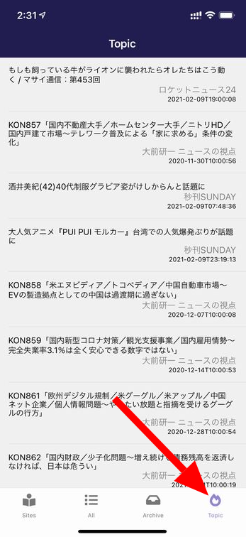
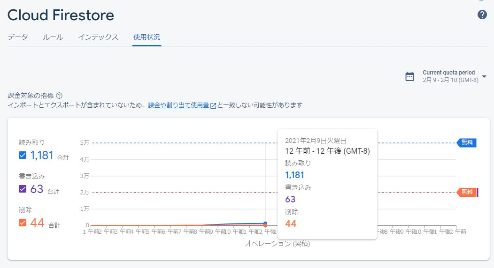

import { Link } from 'gatsby';

## kenmo readerを更新しました

kenmo readerに**Topic**機能を追加しました。



<Link to="/blog/2021-01-24">以前</Link>に追加した、記事をアーカイブする機能の拡張版です。アーカイブした記事を全ユーザーで共有します。

**ユーザーAがアーカイブした記事がユーザーBやCのTopic画面に表示される**というものです。

スレを立てたときにもらった意見に触発されて実装しました。

さすがに今回の機能ではバックエンドが必要なので[Firebase](https://firebase.google.com/?hl=ja)を利用しました。AWSとかAzureなども選択肢だとは思いますが、今回はFirebaseです。

理由は

- [ランディングページ](https://kenmo-reader.ml/)ですでにFirebase Hostingを利用していること
- ある程度まで無料で使えること
- 何度か触ったことがある

です。

## 機能の仕組み

仕組みは単純です。

これまでは記事閲覧画面でアーカイブボタンをタップすると**ローカルストレージに記事を保存**してましたが、今回の機能ではローカルストレージに加えて**Firestore**にも保存するようにします。

Topic画面ではFirestoreに保存された記事を呼び出します。


## 実装したコード

### Firestoreの準備

まずはFirebaseのコンソールでFirestoreを有効にします。


データ構造は

1. コレクション: article
1. ドキュメント: 記事一覧
1. データ: 記事のタイトル、日付、URL、本文、保存した日付と時間(これは後述)

としました。ローカルストレージに保存するときの構造と同じです。


これでFirestore側の準備は完了です。

### Firestoreとアプリを接続する

アプリからFirestoreのデータを読み書きできるようにします。

Firebaseコンソールから接続用のkeyを取得します。


**firebaseConfig**の部分が必要です。

依存関係をインストールします。

```shell
expo install firebase
```

接続用のファイルをアプリに作成します。

**firebase.js**

```javascript
import * as firebase from 'firebase';

//import "firebase/auth";
//import "firebase/database";
import "firebase/firestore";
//import "firebase/functions";
//import "firebase/storage";

const firebaseKey = {
  apiKey: "取得したkey",
  authDomain: "取得したkey",
  projectId: "取得したkey",
  storageBucket: "取得したkey",
  messagingSenderId: "取得したkey",
  appId: "取得したkey",
  measurementId: "取得したkey"
};

if (!firebase.apps.length) {
  firebase.initializeApp(firebaseKey);
  }

const dbh = firebase.firestore();

export default dbh
```

今回使う**firestore**だけをインポートします。

これでアプリからFirestoreにデータを読み書きする準備ができました。

### 記事をFirestoreに保存する機能を作成

今回の機能は、記事をアーカイブするボタンに追加したいのでその部分を編集します。

**src\scenes\article\article.js**

記事閲覧画面です。

```javascript
import dbh from '../../../firebase'
```

まずは先ほど作ったFirestore接続用ファイルをインポートします。

```javascript
render() {
  const defaultStyle = this.state.largeFont
  const defaultClass = this.state.largeFont
  const content = this.props.route.params.content
  const url = this.props.route.params.url
  const title = this.props.route.params.title
  const arrival = this.props.route.params.from
  const date = this.props.route.params.date

  const domain = url.match(/^https?:\/{2,}(.*?)(?:\/|\?|#|$)/)[1]
  const site = sites.find((v) => v.domain === domain);

  const date1 = new Date(); // ここに追加
  const formatedTitle = title.replace("/", " ") // ここに追加
```

Topic画面で記事を一覧表示するときに、ユーザーが保存した順番でソートしたいので、現在時刻を定義します。

ローカルストレージに保存したときと同じく、Firestoreに保存するときの`key`も記事のタイトルにしたかったのですが、半角`/`が入ってるとエラーが出るので`/`を取り除きます。`formatedTitle`として定義しました。

```javascript
<Button
  onlyIcon
  icon="inbox"
  iconFamily="Feather"
  iconSize={30}
  color="#dda0dd"
  iconColor="black"
  style={{ width: 45, height: 45 }}
  onPress={() => {
    var archiveData = {
      title: title,
      url: url,
      date: date,
      content: content
    }
    global.storage.save({
      key: 'archive',
      id: title,
      data: archiveData,
    });
    {/* ここから */}
    dbh.collection("article").doc(formatedTitle).set({
      title:title,
      url: url,
      date: date,
      content: content,
      date1: date1
    })
    {/* ここまで追加 */}
    Haptics.notificationAsync(Haptics.NotificationFeedbackType.Success)
  }}
/>
```

作っておいたコレクション`article`に、`formatedTitle`を**key**として、`title`と`url`と`date`と`content`と`dete1`を保存します。

現在時刻が増えてるだけで、すぐ上のローカルストレージに保存する場合と変わりません。

もしこれが**ユーザーごとの機能**であれば、コレクションを変数にするところですが、今回は全ユーザーで共有するためのコレクションなので`article`は決め打ちします。

これで、保存ボタンをタップすると**ローカルストレージ**と**Firestore**の両方に記事が保存されるようになりました。


### Topic画面の作成

Firestoreに保存した記事を一覧する画面を作ります。


これまで、記事は日付順でソートしていました。ただ、今回の機能は**ユーザーに保存されてる人気記事**を表示するためのものです。

日付順だとつまらないので、保存された日付が新しい順で表示することにします。

上で定義した`date1`の降順にします。

さらに、keyを記事のタイトルにしてあるので、同じ記事を他のユーザーが保存したときにはそのときの`date1`で上書きされます。

そのため、保存ボタンを押される回数が多い記事が上に表示されやすい仕組みです。

#### Topic画面を作成

仕組みがほとんど同じな、アーカイブ記事一覧画面から流用してTopic画面を作ります。スタイリングは省略します。

**src\scenes\topic\index.js**

```javascript
import Topic from './topic'

export default Topic
```

**src\scenes\topic\topic.js**

```javascript
import React from 'react'
import { Text, View, StatusBar, StyleSheet, TouchableOpacity, RefreshControl } from 'react-native'
import { List, ListItem } from 'native-base'
import { sites } from '../sites/list'
import dbh from '../../../firebase'

class WPPost {
	constructor(post) {
		this.post = post;
		this.title = post.title;
		this.content = post.content;
		this.date = post.date;
		this.url = post.url;
	}
}

export default class Topic extends React.Component {

	constructor(props) {
		super(props);
		this.state = { 
			items: [] ,
		};
	}

componentDidMount() {
	this.getTopic();
}

getTopic() {
	const arrays = [];
	dbh.collection("article").orderBy("date1", "desc").limit(20).get().then((querySnapshot) => {
		querySnapshot.forEach((doc) => {
			arrays.push(doc.data());
		});
		for(var i in arrays) {
			var p = new WPPost(arrays[i]);
			this.setState({ items: this.state.items.concat([p]) });
		}
	});
}

clearData() {
	this.setState({items: []})
}

siteName(url) {
	const domain = url.match(/^https?:\/{2,}(.*?)(?:\/|\?|#|$)/)[1]
	const site = sites.find((v) => v.domain === domain);
	return site.name
}
	
	render() {
		var items = this.state.items;
		items.sort(function(a, b) {
			if (a.date1 > b.date1) {
				return -1;
			} else {
				return 1;
			}
		});
		return (
			<View style={styles.container}>
			<StatusBar barStyle="light-content" />
				<View style={styles.content}>
					<List
						refreshControl={
							<RefreshControl
								onRefresh={() => {this.getTopic(), this.clearData()}}
							/>
						}
						dataArray={items}
						renderRow={
							(item) =>
							<ListItem
								onPress={() => this.props.navigation.navigate('Article', { url: item.url, content:item.content, title:item.title, from: 'arrival', date: item.date })}
							>
								<View style={{ flexDirection: 'row'}}>
									<View style={styles.list}>
										<Text style={styles.title}>{item.title}</Text>
										<Text style={styles.site}>{this.siteName(item.url)}</Text>
										<Text style={styles.date}>{item.date}</Text>
									</View>
								</View>
							</ListItem>} >
					</List>
				</View>
			</View>
		);
	}
}
```

```javascript
import dbh from '../../../firebase'
```

Firestoreからデータを読むので接続用ファイルをインポートします。

```javascript
getTopic() {
	const arrays = [];
	dbh.collection("article").orderBy("date1", "desc").limit(20).get().then((querySnapshot) => {
		querySnapshot.forEach((doc) => {
			arrays.push(doc.data());
		});
		for(var i in arrays) {
			var p = new WPPost(arrays[i]);
			this.setState({ items: this.state.items.concat([p]) });
		}
	});
}
```

Firestoreからデータをロードする関数を定義します。

コレクション`article`を指定して、保存された日付`date1`の`desc`順で、20件`limit(20)`を取得するようにしました。

20件に深い意味はないのでリクエストがあれば調整していきたいです。

データの構造はローカルストレージに保存する場合と同じなので取得した値は同じように格納します。

```javascript
render() {
  var items = this.state.items;
  items.sort(function(a, b) {
    if (a.date1 > b.date1) {
      return -1;
    } else {
      return 1;
    }
  });
  return (
```

実際に表示する場合も保存された日付順`date1`にしたいので並べ替えます。

```javascript
componentDidMount() {
	this.getTopic();
}
```

```javascript
<List
refreshControl={
  <RefreshControl
    onRefresh={() => {this.getTopic(), this.clearData()}}
  />
```

定義した`getTopic`関数を画面のマウント時とリフレッシュ時に動かして手動で更新できるようにします。

```javascript
<ListItem
  onPress={() => this.props.navigation.navigate('Article', { url: item.url, content:item.content, title:item.title, from: 'arrival', date: item.date })}
>
```

記事閲覧画面の**記事を保存するボタン**、**保存した記事を削除するボタン**は以前書いたように記事一覧画面から渡される識別用の値`from`で表示/非表示を切り替えています。

今回は、記事をローカルストレージに保存するボタンを表示させたいので`from`を渡しています。

あとは他の画面と同じように`title`、`date`、`url`、`content`を記事表示画面に渡すと、同じように記事が閲覧できます。


### 作った画面をルーティングに追加

Topic記事一覧→記事閲覧画面、と遷移するタブを作ります。

**src\routes\navigation\stacks\index.js**

```javascript
import { HomeNavigator, ProfileNavigator, NewsListNavigator, AllNewsNavigator, ArchiveNavigator, TopicNavigator } from './Stacks'

export { NewsListNavigator, HomeNavigator, ProfileNavigator, AllNewsNavigator, ArchiveNavigator, TopicNavigator }
```

**src\routes\navigation\stacks\Stacks.js**

```javascript
import Topic from 'scenes/topic'
```

```javascript
export const TopicNavigator = () => (
  <Stack.Navigator
    initialRouteName="Topic"
    headerMode="screen"
    screenOptions={navigationProps}
  >
    <Stack.Screen
      name="Topic"
      component={Topic}
      options={({ navigation }) => ({
        title: 'Topic',
      })}
    />
    <Stack.Screen
      name="Article"
      component={Article}
      options={({ navigation }) => ({
        title: 'Article',
      })}
    />
  </Stack.Navigator>
)
```

**Topic**と**Article**を`TopicNavigator`としてスタックにまとめます。

**src\routes\navigation\tabs\index.js**

```javascript
import Tabs from './Tabs'

export default Tabs
```

**src\routes\navigation\tabs\Tabs.js**

```javascript
import { HomeNavigator, ProfileNavigator, NewsListNavigator, AllNewsNavigator, ArchiveNavigator, TopicNavigator } from '../stacks'
```

```javascript
case 'Topic':
  return (
    <FontIcon
      name="fire-alt"
      color={focused ? colors.lightPurple : colors.gray}
      size={20}
      solid
    />
  )
```

```javascript
<Tab.Screen name="Topic" component={TopicNavigator} />
```

作った`TopicNavigator`を**TabNavigator**に配置します。

実装したコードは以上です。

## まとめ

ソーシャル的なお遊びを追加したかったのでTopic機能を実装できてよかったです。

Firestoreを使ったのは初めてでしたが、思った以上に簡単に実装できました。

無料枠で収まるかどうかは不明ですが、おそらく今のユーザー数のままなら余裕だと思います。



---