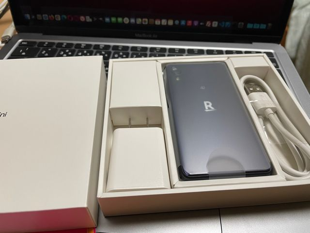
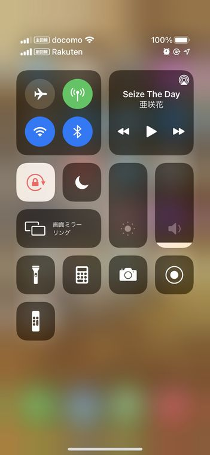

import { Link } from 'gatsby';

## kenmo readerを更新しました

普段、開発するときとか実際にアプリを使うときはiPhoneを使っています。

検証用にはAquos Sense 2を使っていました。しかし、性能が低いのが原因かアプリが悪いのかはわかりませんがAquos Sense 2ではアプリのクラッシュが多発するためまともに検証できなかったのです。

そのため、Androidでスワイプして前の画面に戻れないという指摘はもらってましたがなかなか直す気にならず放置してました。

そんなところに、楽天モバイルが回線と端末のバラまきキャンペーンを始めたので私もRakuten Miniをもらうことにしました。



そうして届いたRakuten Miniでkenmo readerを動かしてみたところ多少もっさりしますがクラッシュしないでアプリが動きます。普段使いする気はないですが、検証用にはよさそうです。

というわけでAndroidでもスワイプして戻れるようにしました。

## 変更したコード

**src\routes\navigation\stacks\Stacks.js**

スワイプして戻る機能は[React Navigation](https://reactnavigation.org)では`Stack.Navigator`の`screenOptions`で設定するようになってます。

私が使ってる[ボイラープレート](https://github.com/WataruMaeda/react-native-boilerplate)では`navigationProps`に定義されてるのでここにプロパティを追加します。

```javascript
export const TopicNavigator = () => (
  <Stack.Navigator
    initialRouteName="Topic"
    headerMode="screen"
    screenOptions={navigationProps}
  >
    <Stack.Screen
      name="Topic"
      component={Topic}
      options={({ navigation }) => ({
        title: 'Topic',
      })}
    />
    <Stack.Screen
      name="Article"
      component={Article}
      options={({ navigation }) => ({
        title: 'Article',
      })}
    />
  </Stack.Navigator>
)
```

こんな感じです。

```javascript
const Stack = createStackNavigator()

const navigationProps = {
  headerTintColor: 'white',
  headerStyle: { backgroundColor: colors.darkPurple },
  headerTitleStyle: { fontSize: 18 },
  /* ここから */
  gestureEnabled: true,
  gestureDirection: 'horizontal',
  gestureResponseDistance: {
    horizontal: 300,
  },
  /* ここまで追加 */
}
```

以上です。

## まとめ

楽天からもらったタダの回線はiPhoneのeSIMに設定しました。SMS認証用に使う予定です。



---