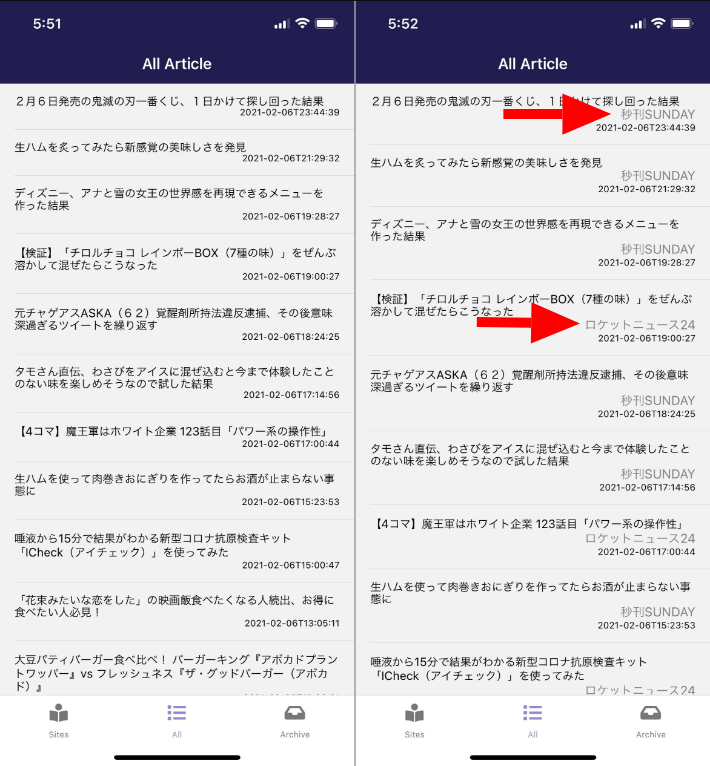
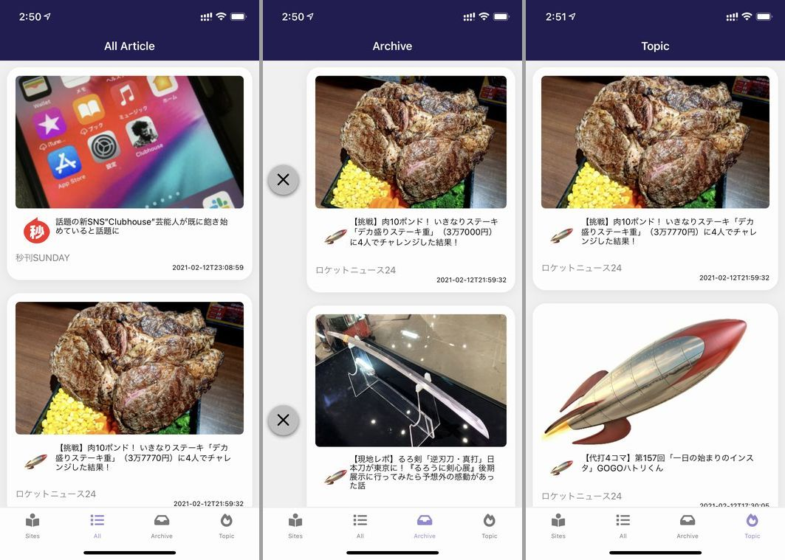
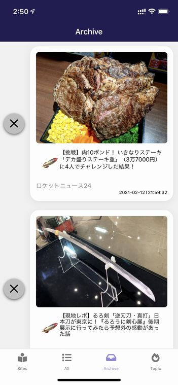
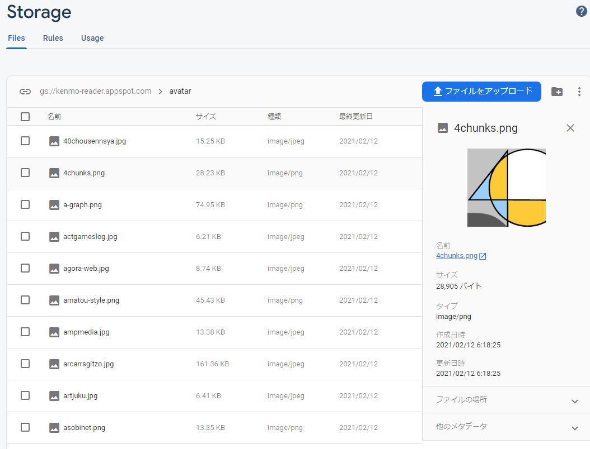
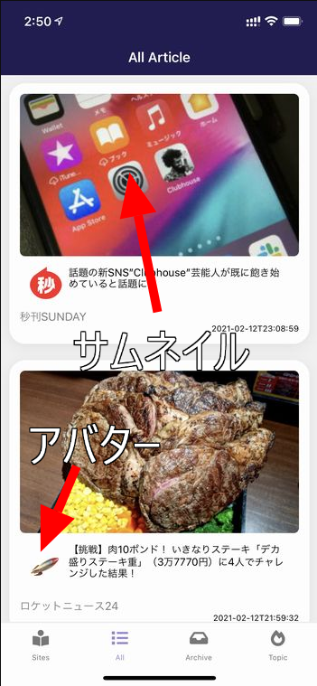
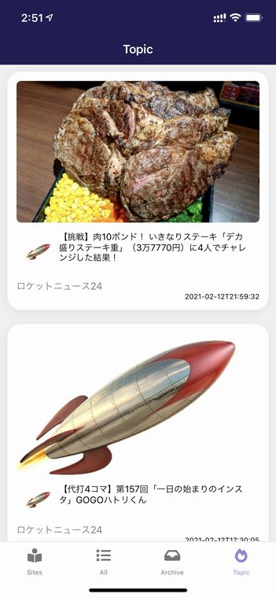

import { Link } from 'gatsby';

## kenmo readerを更新しました

記事を一覧する画面の表示を改良しました。





変更点は

- リスト表示からカード表示に変更
- サイトごとのアバターを表示するように変更
- 記事のサムネイルを表示するように変更

です。

アーカイブ画面では削除ボタンを表示する代わりに左右スワイプで記事を削除することも試したのですが、ボタンを表示しないと機能に気付いてもらえないと思ったのでやめました。



## 変更したコード

### アバターの用意

サイトごとのアバター画像を準備します。手作業です。主にツイッターアカウントのプロフィール画像か、SNSがない場合はサイトのスクリーンショットを利用します。

用意したアバター画像を格納します。

格納場所にはFirebase Storageを使用しました。アプリ内のアセットに置くことも考えたのですがパスの指定方法が分からなかったのでFirebaseにしました。



### アバターの格納場所をサイト情報に追記

Firebase Storageにアップロードしたアバター画像のURLをアプリ内のサイト情報に追記します。

**src\scenes\sites\list.js**

```javascript
export const sites = [
  {
    ID: 6,
    name: 'ロケットニュース24',
    url: 'https://rocketnews24.com',
    domain: 'rocketnews24.com',
    caption: 'エンタメ',
    avatar: 'https://firebasestorage.googleapis.com/v0/b/kenmo-reader.appspot.com/o/avatar%2Frocketnews24.jpg?alt=media&token=fedc89a6-74e1-47df-b12e-d4220b794bc4',
    avatarlocal: '../../../assets/avatar/rocketnews24.jpg'
  },
  {
    ID: 9,
    name: '秒刊SUNDAY',
    url: 'https://yukawanet.com',
    domain: 'yukawanet.com',
    caption: 'エンタメ',
    avatar: 'https://firebasestorage.googleapis.com/v0/b/kenmo-reader.appspot.com/o/avatar%2Fyukawanet.png?alt=media&token=61b46296-9f85-4735-85f8-4e7cc4acac3b',
    avatarlocal: '../../../assets/avatar/yukawanet.png'
  },
  /* 省略 */
]
```

これも手作業で追加しました。

### 記事のサムネイルを取得

続いて、WordPress APIから取得したJSONの中から記事のサムネイル画像のURLを取得できるようにします。

サイトからJSONを取得する処理が発生する画面は以下の二つです。

- サイトごとの記事一覧
- 追加した全サイトの記事一覧

**src\scenes\newslist\newslist.js**

**src\scenes\all\all.js**

```javascript
class WPPost {
	constructor(post) {
		this.post = post;
		this.title = post.title.rendered;
		this.content = post.content.rendered;
		this.date = post.date;
		this.thumbnail = this.getThumbnail(); // ここに追加
		this.url = post.link;
	}

  // サムネイルを取得する関数を定義
	getThumbnail() {
		const domain = this.post.link.match(/^https?:\/{2,}(.*?)(?:\/|\?|#|$)/)[1]
		const site = sites.find((v) => v.domain === domain);
		try {
			var wpfm = this.post["_embedded"]["wp:featuredmedia"][0]["media_details"]["sizes"]["medium"]["source_url"];
			return wpfm
		} catch(e) {
		try {
			var wpfm = this.post["_embedded"]["wp:featuredmedia"][0]["media_details"]["sizes"]["thumb240"]["source_url"];
			return wpfm
		} catch(e) {
			return site.avatar
			}
		}
	}

}
```

サムネイル画像のURLを取得する関数を定義する必要があります。

これは、サイトによってURLが入ってるフィールドが違ってることと記事にサムネイルが設定されてないことがあるためです。

なのでフィールドのパターンを変えて`try…catch`するようにしました。サムネイルを見つけられなかった場合は上で定義したサイト情報のアバター画像のURLを返すようにしました。

今後、別パターンのフィールドが見つかれば`try…catch`の入れ子を深くすることで対応します。

### 記事表示用のカードを定義



Cardコンポートネントは色々と種類がありますが、今回は[Galio framework](https://galio.io/)を使用しました。

タイトル、日付、サイト名はすでに表示できるので、サイトごとのアバターと記事のサムネイルを追加してカードの見た目を調整しました。

**アバター画像の表示**

<Link to="/blog/2021-02-07">以前の記事</Link>で、記事ごとのサイト名を表示するようにしましたが、同じようにアバター画像のURLを取得します。

記事のURLからドメインを抽出してアプリ内のサイト情報から一致するドメインが含まれる配列を返す関数を少し変更しました。

```javascript
siteName(url) {
	const domain = url.match(/^https?:\/{2,}(.*?)(?:\/|\?|#|$)/)[1]
	const site = sites.find((v) => v.domain === domain);
	return site // ここを変更
}
```

以前はサイト名だけが必要だったので`return site.name`としていましたが、今回は**サイト名**と**アバターのURL**が必要なので、`return site`にします。

サムネイルは上で定義した関数で取得できるようにしたので、これで必要な情報が揃いました。

あとは`Card`コンポーネントに必要な情報を入れていきます。

```javascript
<ScrollView
  contentContainerStyle={styles.scrollContentContainer}
  refreshControl={
    <RefreshControl
      onRefresh={() => {this.getNews(), this.clearData()}}
    />
  }
>
  {
    items.map((item, i) => {
      return (
        <TouchableOpacity
          onPress={() => this.props.navigation.navigate('Article', { url: item.url, content:item.content, title:item.title, from: 'arrival', date:item.date, thumbnail:item.thumbnail })}
        >
          <Card
            key={i}
            flex
            style={styles.card}
            shadow
            avatar={this.siteName(item.url).avatar}
            image={item.thumbnail}
            title={item.title}
          >
            <Text style={styles.site}>{this.siteName(item.url).name}</Text>
            <Text style={styles.date}>{item.date}</Text>
          </Card>
        </TouchableOpacity>
        );
    })
  }
</ScrollView>
```

アーカイブ画面とトピック画面でも記事のサムネイルを表示します。そのため、記事をローカルストレージやFirestoreに記事を保存するときにサムネイルのURLも必要です。

なので`Article`画面に遷移するときに`thumbnail:item.thumbnail`も渡すようにします。

これで、サイトごと記事一覧(newslist)と全サイト記事一覧(all)画面は完成しました。

### 記事表示画面

記事一覧画面からサムネイルのURLを渡すようにしたので、渡されたURLを保存するようにします。

**src\scenes\article\article.js**

```javascript
<Button
  onlyIcon
  icon="inbox"
  iconFamily="Feather"
  iconSize={30}
  color="#dda0dd"
  iconColor="black"
  style={{ width: 45, height: 45 }}
  onPress={() => {
    var archiveData = {
      title: title,
      url: url,
      date: date,
      content: content,
      thumbnail :thumbnail // ここに追加
    }
    global.storage.save({
      key: 'archive',
      id: title,
      data: archiveData,
    });
    dbh.collection("article").doc(formatedTitle).set({
      title:title,
      url: url,
      date: date,
      content: content,
      date1: date1,
      thumbnail :thumbnail // ここに追加
    })
    Haptics.notificationAsync(Haptics.NotificationFeedbackType.Success)
  }}
/>
```

これで、ローカルストレージとFirestoreにサムネイルのURLも保存されるようになりました。

### 保存したURLを使う

アーカイブ画面(archive)とトピック画面(topic)では、ローカルストレージとFirestoreに保存された記事情報を元にしています。

ここまでで、ローカルストレージとFirestoreにはサムネイルのURLが格納されているのでそれを使います。

**src\scenes\archive\archive.js**

**src\scenes\topic\topic.js**

```javascript
class WPPost {
	constructor(post) {
		this.post = post;
		this.title = post.title;
		this.content = post.content;
		this.date = post.date;
		this.url = post.url;
		this.thumbnail = post.thumbnail; // ここに追加
	}
}
```

```javascript
<ScrollView contentContainerStyle={styles.scrollContentContainer}>
  {
    items.map((item, i) => {
      return (
        <View style={{flex: 1, flexDirection: 'row'}}>
          <View style={{flex: 1, justifyContent: 'center'}}>
            <Button
              onlyIcon
              icon="x"
              iconFamily="Feather"
              iconSize={30}
              color="#c0c0c0"
              iconColor="black"
              style={{ width: 45, height: 45 }}
              onPress={() => {
                global.storage.remove({
                  key: 'archive',
                  id: item.title,
                });
                Haptics.impactAsync(Haptics.ImpactFeedbackStyle.Medium) 
                this.clearData()
                this.loadStorage()
              }}
            />
          </View>
          <View style={{flex: 7}}>
            <TouchableOpacity
              onPress={() => this.props.navigation.navigate('Article', { url: item.url, content:item.content, title:item.title, thumbnail:item.thumbnail })}
            >
              <Card
                key={i}
                flex
                style={styles.card}
                shadow
                avatar={this.siteName(item.url).avatar}
                image={item.thumbnail}
                title={item.title}
              >
                <Text style={styles.site}>{this.siteName(item.url).name}</Text>
                <Text style={styles.date}>{item.date}</Text>
              </Card>
            </TouchableOpacity>
          </View>
        </View>
        );
    })
  }
</ScrollView>
```

アーカイブ画面で、記事を削除するボタンをどこに置くか悩んだのですが、とりあえず今までと同じ位置に配置しました。

実装したコードは以上です。

## まとめ

リスト表示からカード表示に切り替えて、更に記事のサムネイルとサイトのアバターも追加しました。

画面に表示できる情報量は減りましたが、画面が派手になって良かったです。実用的なニュースリーダーアプリになったと思います。

あとはダークモードの実装をしたいと思っています。



---