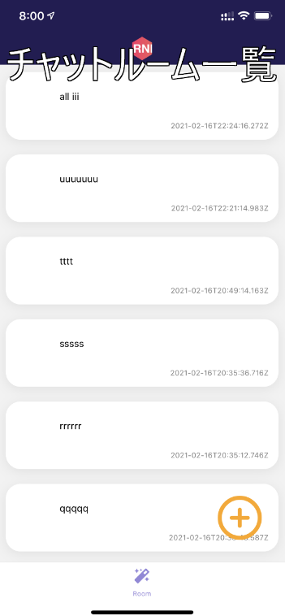
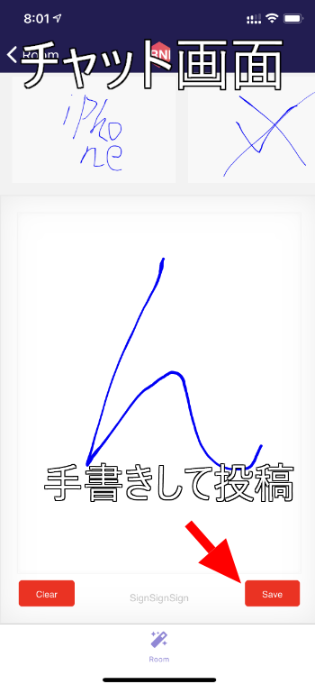
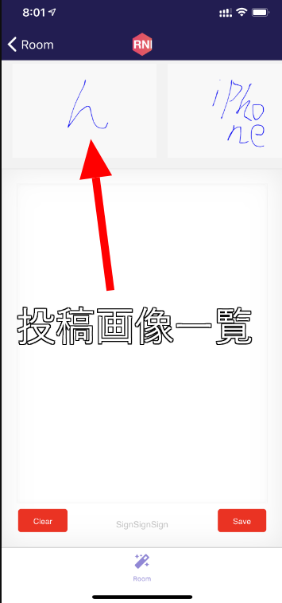
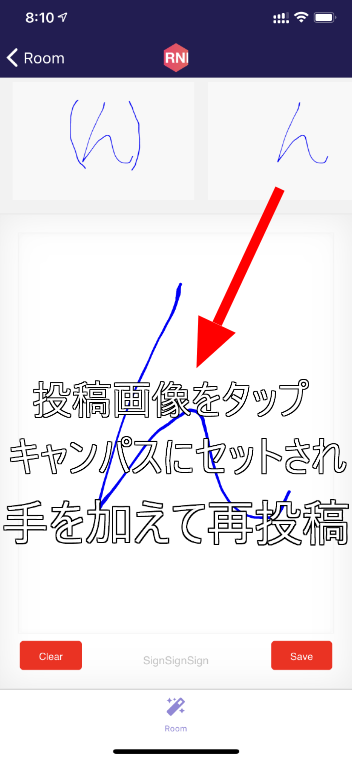
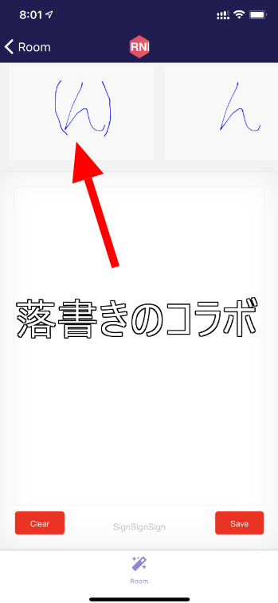

import { Link } from 'gatsby';

## 新しいアプリを開発中です

ここ数日、kenmo readerもブログも更新せずに何をしていたかというと、新作アプリを作っていました。

コンセプトは「落書き」と「コラボレーション」です。

## デモ動画

動いてる様子をYouTubeにアップしましたのでご覧ください。

`youtube: zZW9z6kDV1w`

## アプリの説明

チャットアプリに近いです。

チャットは文字を使ってやりとりしますが、このアプリでは手書き画像でコミュニケーションします。

バックエンドは[Firebase Realtime Database](https://firebase.google.com/docs/database?hl=ja)を使用しています。

アプリはデータベースを監視しているのでいずれの画面でも**リアルタイムに更新**されます。

### チャットルーム一覧

### ルーム作成

### キャンバス画面

### キャンバス画面2

### 落書きをコラボ

### 落書きをコラボ2

## まとめ

kenmo readerにFirestoreを使ってトピック機能を実装したときに、かなり簡単にできたので、Firebaseをもっと活用したアプリを作りたくなりました。

画像(正確にはBase64文字列)を保存する必要があったのでRealtime Databaseを使わざるを得なかったのですが、取得できるJSONの構造が独特で結構苦労しました。

勢いだけで作ったのでアプリの名前もアイコンも全然思いつきません。これが一番の課題かもしれません。

ストアでのリリースはしていませんが、Expoで公開していますので試してみてください。

[sketch share By votepurchase](https://expo.io/@votepurchase/projects/sketch-share)

---