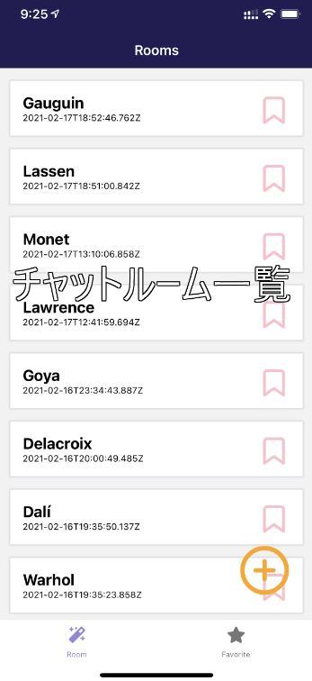
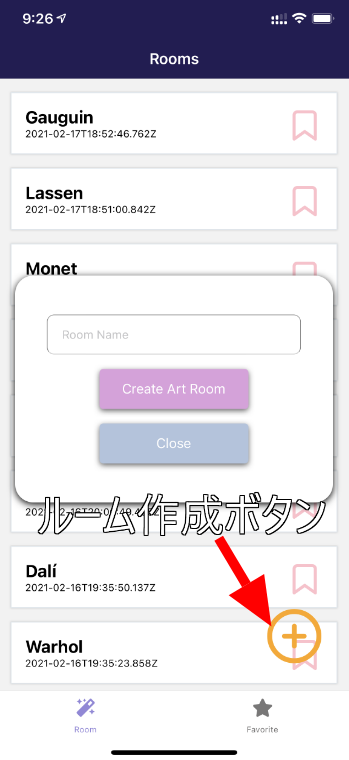
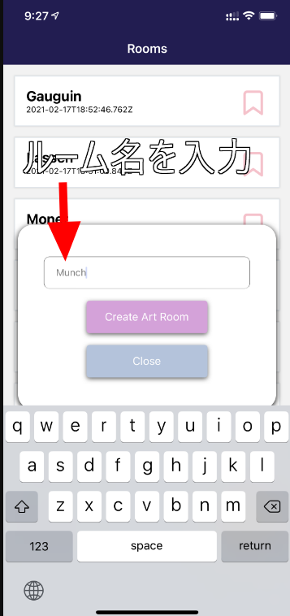
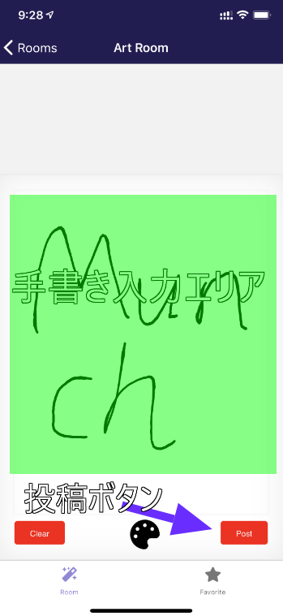
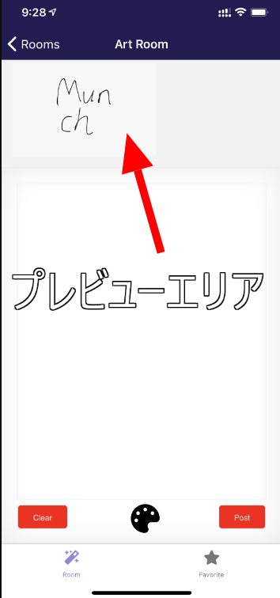
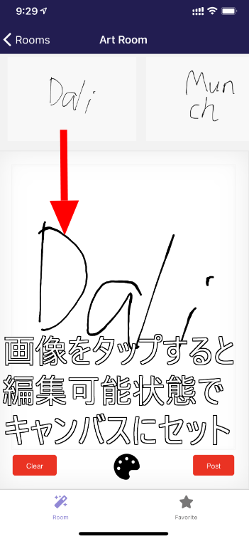
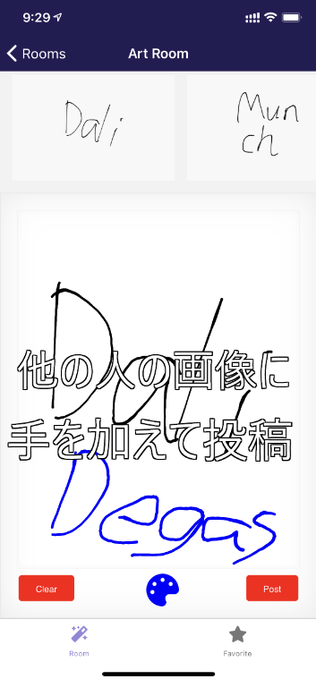
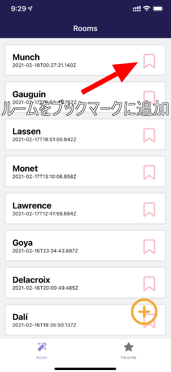
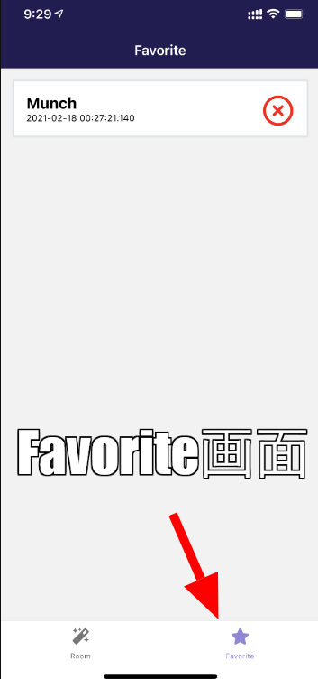
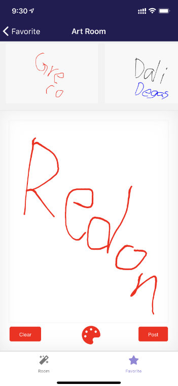

import { Link } from 'gatsby';

<Link to="/blog/2021-02-17">前回</Link>の続きです。

## アプリの名前を決めました

ケンモリーダーを作ったときは「勝手に嫌儲名乗るな」って散々叩かれたので、今回はスレを立ててアプリの名前とアイコンを募集しました。

色々なアイディアをもらいましたが最後まで候補に残ったのは

- Kakoz(カコーゼ)
- Rakugaki Crossing
- Grafhouse

の3つでした。

最終的に、今が旬のアプリにあやかった「Grafhouse」でいくことにしました。"Graffiti House"、略してGrafhouseです。

アイコンもそれっぽくしたいので渋めのおじさんの写真を加工したものにしたかったのですが、いいフリー素材が見つかりませんでした。

なので、ウィキメディア・コモンズから拾ってきたRembrandtの絵画にしました。

## アプリの説明

App Store提出時にレビュアー用にアプリの使い方を説明する必要があるのでいったんここに書いて、提出時にコピペできるようにしておきます。

### チャットルーム一覧画面

チャットルームの一覧画面です。いずれかのカードをタップすることでチャットルームに遷移します。

### ルーム作成

右下の+ボタンをタップするとルーム作成モーダルが表示されます。

ルームの名前を入力して"Create Art Room"をタップするとチャットルームが作成されて、その部屋に入ります。

### チャット画面

画面中央部がキャンバス(手書き入力エリア)です。ここにイラストやメッセージを手書きします。右下の"Post"ボタンをタップするとイラストが投稿されます。

画面上部には自分及び他のユーザーが投稿した画像が表示されます(プレビューエリア)。プレビューエリアに表示されている画像は全てのユーザーが閲覧可能です。

プレビューエリアの画像をタップすると、編集可能な状態で自分のキャンバスに画像がセットされます。

セットされた画像に編集を加えて再投稿することができます。他の人の投稿とコラボを繰り返して楽しむことができます。

### ルームをブックマークする機能

チャットルーム一覧画面のブックマークボタンをタップすることで、ルームをブックマーク(Favorite)に追加することができます。

"Favorite"タブをタップすると、ブックマークしたルームの一覧画面に遷移します。

タップすることでそのルームに入ることができます。

## まとめ

App Storeではプライバシーポリシーを記載したURLが必要なので、これからランディングページを作る予定です。

---