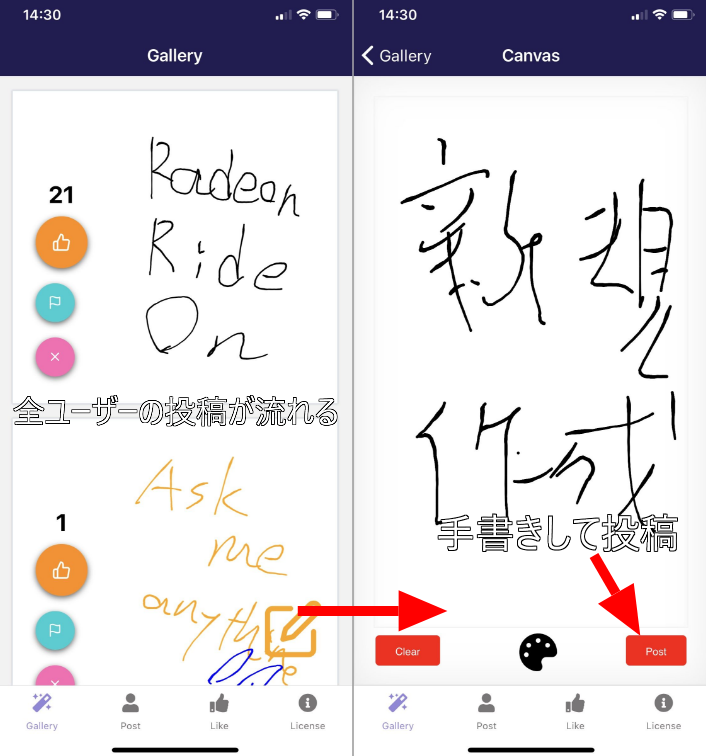
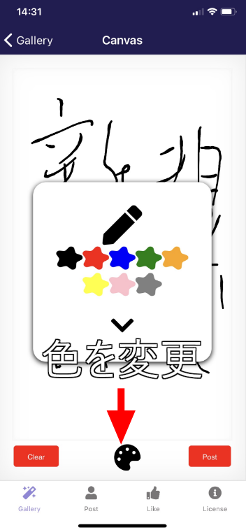
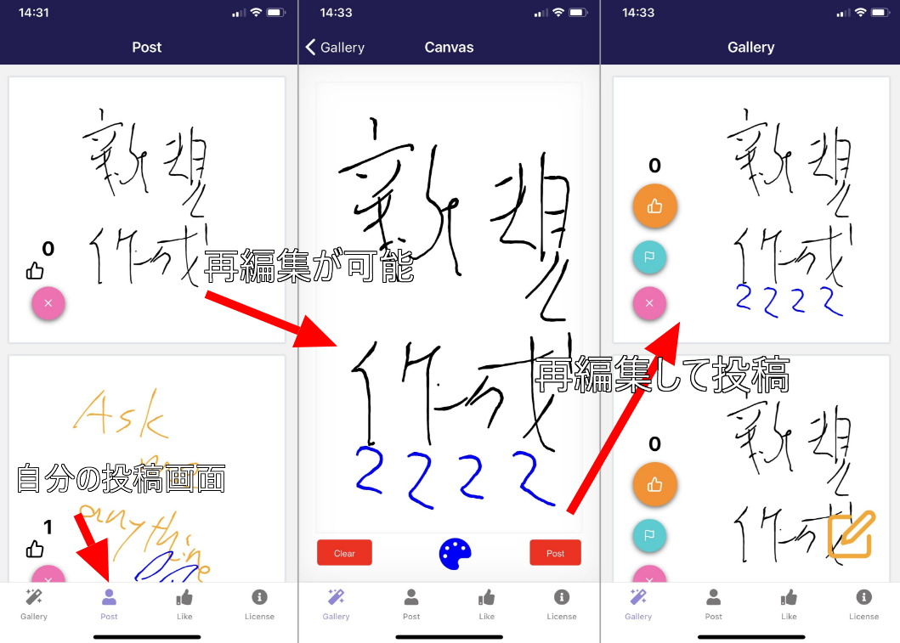
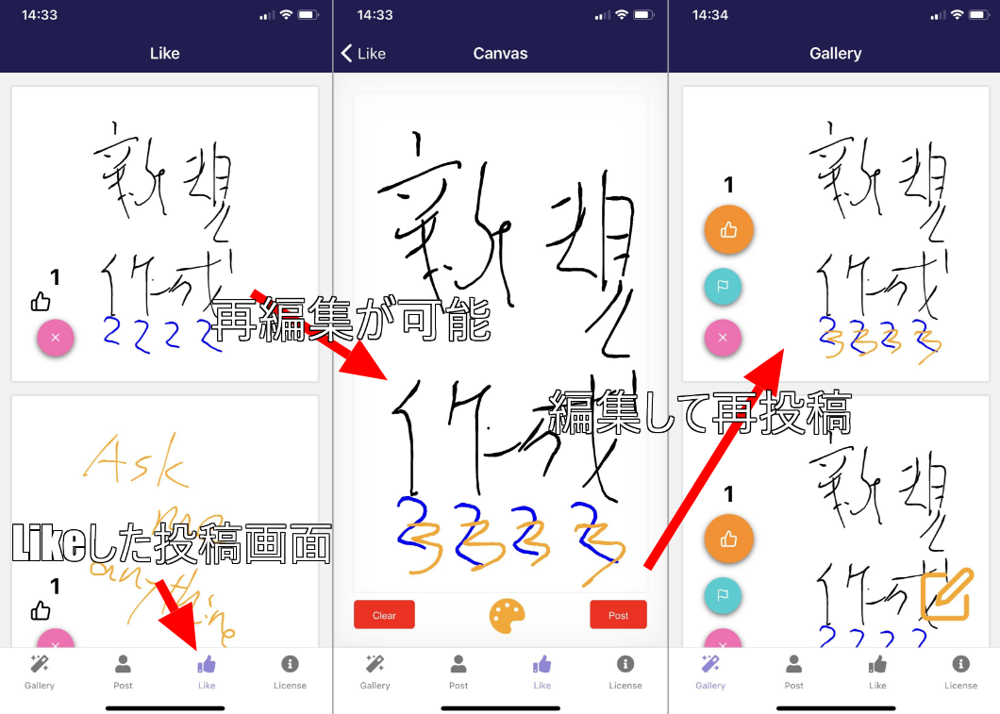
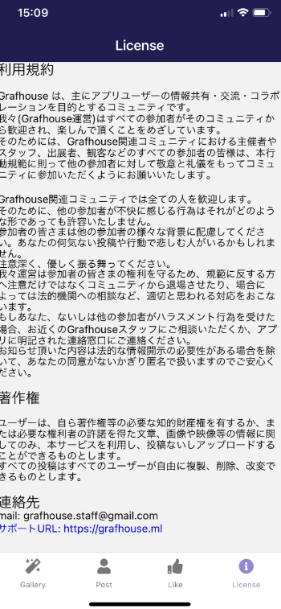
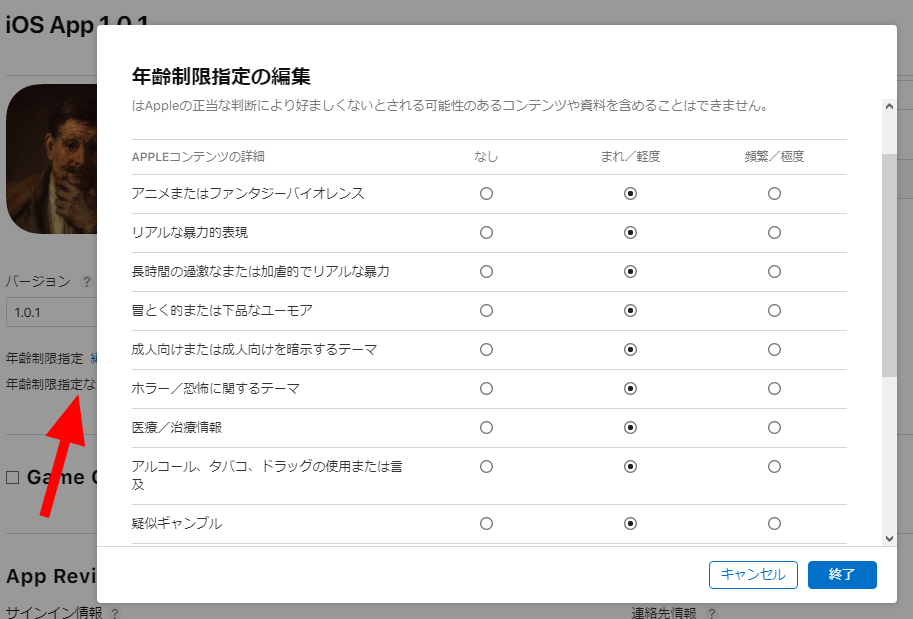

import { Link } from 'gatsby';

<Link to="/blog/2021-02-19">前回</Link>の続きです。

  

## Grafhouseをかなり変更してAppStoreに再提出しました

変更前のバージョンは**お絵描きチャット**色が強かったですが、変更後バージョンは明確に**落書きSNS**アプリにしました。

## アプリの説明

### Gallery画面

Gallery画面は全ユーザーの投稿の最新10件が表示されます。新しい投稿があった場合はリアルタイムで更新されます。

サムズアップボタンをタップすると投稿をLikeできます。ボタンの上の数字はLikeされた回数です。何回でもLikeできます。

フラッグボタンをタップすると投稿を開発者に通報できます。AppStoreの審査で実装するように求められた機能です。

xボタンをタップするとその投稿が削除されます。サーバーから削除されるので全ユーザーのフィードから消えます。**誰でも誰の投稿でも削除可能**です。

右下のEditボタンをタップするとCanvas画面に遷移します。

### Canvas画面

Canvas画面は投稿を作成する画面です。手書き入力ができます。色を変更することも可能です。

右下のPostボタンをタップすると手書きしたものが投稿されます。

### Post画面

Post画面では自分の過去の投稿が表示されます。表示件数に制限はありません。全て表示されます。ただし、自分及び他のユーザーによって削除された投稿は表示されません。

xボタンをタップすると削除されます。これもサーバーから消えるので全ユーザーの画面から消えます。

表示された投稿をタップすると、キャンバスに投稿がセットされた状態でCanvas画面に遷移します。再編集して投稿することができます。

再投稿後でも**Like数は引き継がれます**。

### Like画面

Like画面では自分がLikeした投稿が表示されます。表示件数に制限はありません。ただし、ここでも自分及び他のユーザーによって削除された投稿は表示されません。

xボタンをタップすると削除されます。ここでもサーバーから消えるので全ユーザーの画面から消えます。

ここでも、表示された投稿をタップすると、キャンバスにセットされた状態でCanvas画面に遷移します。再編集して投稿することができます。

ここも再投稿に**Like数が引き継がれます**。

### License画面

前回の審査で却下されときに求められたので利用規約を作りました。

アプリの初回起動時にも利用規約を表示して、ユーザーに同意を求めるようにしました。

### AppStore対策

画面の説明ではありませんが、審査を通すためにレビュアー用のメモとして

- 管理者は、管理画面で毎日確認して手動で不快な投稿をフィルタリングします。。
- 通報された投稿は管理画面で毎日確認します。
- 利用規約に違反する投稿をしたユーザーはブロックします。

ということを書きました。

懸念点は対象年齢です。却下されたときにアプリの**対象年齢を17歳以上**にするよう求められたのですが、提出ページに明確に対象年齢を設定する箇所がないことです。

**年齢制限指定の編集**で全ての項目を`まれ／軽度`に設定したのですが`年齢制限指定なし`になってしまいます。検索して出てくる記事ではここで設定するらしいですが、明確に設定するところはないみたいです。

## まとめ

レビュアーに指摘された箇所は全て対策したつもりです。提出が土曜の朝だったためまだ審査は始まらないですが、さてどうなることやら。

---