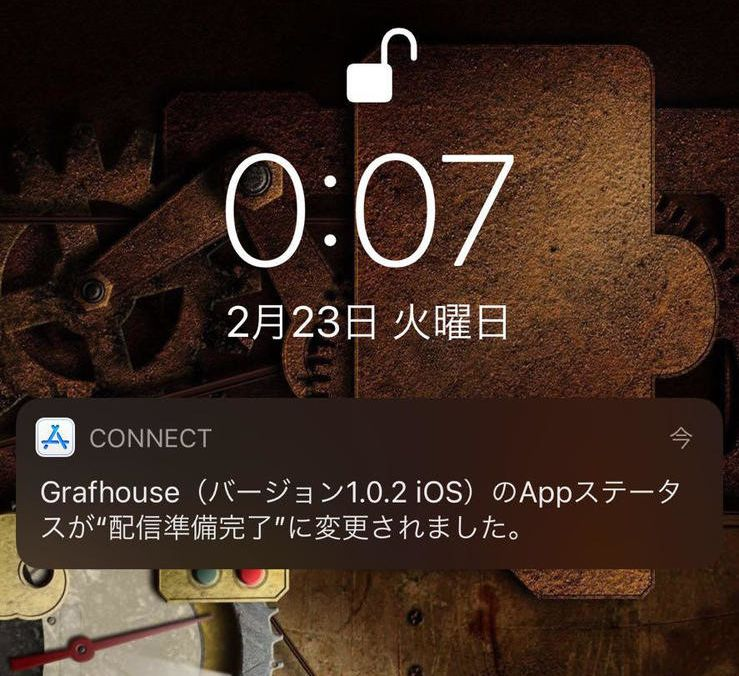
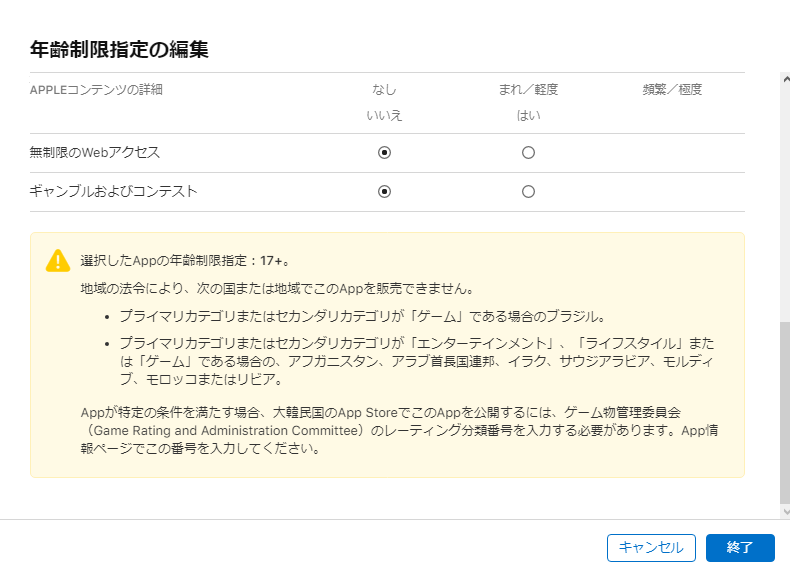
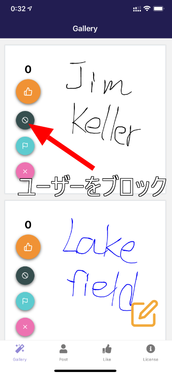

import { Link } from 'gatsby';

## ようやくGrafhouseがApple様に承認されました

最初のビルドを提出してから5日にわたるレビュアーさんとのやり取りの末にようやくAppStoreの承認がとれました。



[Google Play](https://play.google.com/store/apps/details?id=net.votepurchase.grafhouse)は提出してから数日かかりましたが却下されることもなく配信が始まりました。

<Link to="/blog/2021-02-19">最初のバージョンの時のレビュアーの指摘</Link>は以下の通りでした。

```
- Age rating must reflect 17+
- Require that users agree to terms (EULA) and these terms must make it clear that there is no tolerance for objectionable content or abusive users
- A method for filtering objectionable content
- A mechanism for users to flag objectionable content
- A mechanism for users to block abusive users
- A mechanism for users to immediately remove posts from the feed
- Developer must act on objectionable content reports within 24 hours by removing the content and ejecting the user who provided the offending content
- Developer must provide contact information in the app itself, giving users the ability to report inappropriate activity
```

次に提出した、<Link to="/blog/2021-02-21">前回</Link>のバージョンも実は以下の指摘をされて却下されてしまいました。

```
- Age rating must reflect 17+
- A mechanism for users to block abusive users
```

日本語だと

- 対象年齢を17歳以上にしてください
- ユーザーが悪質なユーザーをブロックできるようにしてください

という感じです。

Grafhouseはアカウント制ではないので、ユーザーをブロックする機能の実装は難しいかなと思って、レビュアー用のメモに

- 管理者は、管理画面で毎日確認して手動で不快な投稿をフィルタリングします。
- 通報された投稿は管理画面で毎日確認します。
- 利用規約に違反する投稿をしたユーザーはブロックします。

ということを書いたのですが、アプリの機能としてブロックする仕組みを実装しないといけなかったようです。

ちなみに対象年齢の設定は、年齢制限指定の編集でいくつかの項目を`頻繁／極度`にしたところ`17+`にできました。



今回はこれが一番難関だったかもしれないです。ほんと分かりにくいです。

## ブロック機能の実装

それで、レビュアーから求められたブロック機能ですが、実装しました。

非アカウント制というアプリの仕様はそのままです。



Slashボタンをタップするとその投稿をしたユーザーをブロックリストに登録して、そのユーザーの投稿が非表示になります。

コードは貼りませんが、仕組みは単純です。画面には表示してませんが、投稿にデバイス固有のIDを付与するようにしました。

React Nativeでは[react-native-device-info](https://www.npmjs.com/package/react-native-device-info)というデバイスIDやデバイス情報などが取得できるライブラリがあるのですが、Expo環境では使えません。

そこで、[react-native-get-random-values](https://www.npmjs.com/package/react-native-get-random-values)を使うことにしました。

初めてCanvas画面(イラストを書く画面)を開いたときにUUIDを発行してストレージに保存します。あとは、Canvas画面を開くたびにUUIDが存在するかチェックして、存在したら投稿にそのIDを付与、存在しなかったら初めての投稿とみなしてUUIDを払いだします。

あとは、Gallery画面で投稿を表示するときに**ストレージに保存してあるブロックしたIDリスト**と**投稿に付与されてるID**を突き合わせて、投稿の表示/非表示を処理するようにしました。

## まとめ

kenmo readerでFirestoreを使った機能を簡単に実装できたので作り始めたGrafhouseでしたが、Realtime Databaseの構造に悩まされたり、ストアの審査の厳しさに悩まされたり結構苦労してしまいました。

やはりユーザー参加型のアプリはストアの審査が厳しかったです。

あと、いつものGatsbyJS + Freenom + Firebaseの三連コンボでランディングページも用意しました。

よろしければ使ってみてください。

[Grafhouse landing page](https://grafhouse.ml)

---