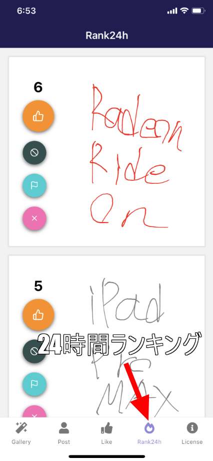

import { Link } from 'gatsby';

## ランキング機能



Grafhouseに24時間以内のLike数ランキングを表示するタブを追加しました。

スレを立てて宣伝したらもらえたアイディアです。Firebaseのドキュメントを読んだら簡単に実装できそうだったので追加しました。

タブを開いたときの時間から過去24時間以内の投稿20件を取得してLike数で並べ替えをしています。

画面に表示してないだけで投稿日時のデータは持っているので`startAt`で楽に実装できました。

ただし、持っている日付データはこれまで

```javascript
const date = new Date()
```

で生成してたのでこんな感じになってました。

```
2021-02-23T05:55:24.751Z
```

この形式だと**過去24時間**を取得するときに大変なので、非常に迷ったのですがいったん過去の投稿を全消ししました。

一応利用規約には**すべてのユーザーは全ての投稿を複製、削除、改変できる**と書いたので許してください。

新しくした時刻の取得方法はこれです

```javascript
const date = Date.now()
```

実際取得できる時刻はこんな感じです。

```
1614117183761
```

過去24時間を取得するときはこんな感じ

```javascript
let before24Hour = new Date().getTime() - (24 * 3600 * 1000)
```

これで24時間前の時刻を生成してFirebaseの`.startAt(before24Hour)`と`.limitToLast(20)`クエリでRealtime Databaseからデータを取得しています。

あとはLike数で並べ替えて表示しました。

---