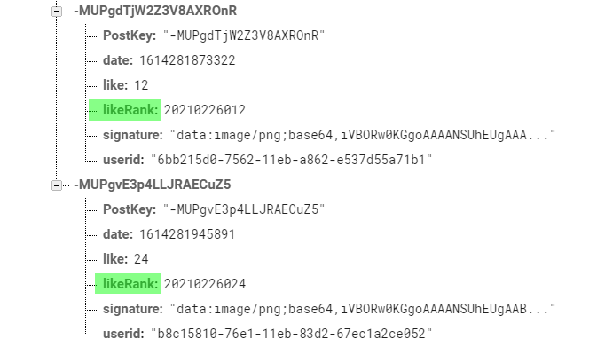

import { Link } from 'gatsby';

## 前回のあらすじ

<Link to="/blog/2021/02/24">前回</Link>実装したLikeランキング機能ですが、当初考えた機能とは別物でした。

本当にやりたかったのは**過去24時間の投稿をLike数でソートして上位20件を表示**というものです。

ところが実際に実装できたのは**過去24時間のうち最新20件の投稿をLike数順に表示**というものでした。

これはFirebase Realtime databaseの制限によるものです。

本来やりたかった機能をFirebaseでやろうとすると、**過去24時間の投稿を探し**て**Like数で並べ替える**という2段階のクエリが必要になります。

Realtime Databaseでは`orderBy`メソッドは1度しか使えないので素直に実装するのは不可能でした。

## 改善策

そこで、1つのクエリで取得できるように**投稿日時**と**Like数**を合体させたフィールドを用意することにしました。

考え方は`2021 02 26 * 1000 + Like数で格納`して`2021 02 26 000`以上を取り出してソートするということです。

```
2021/02/25
20210225001 ←Like数1
20210225002 ←Like数2
20210225003 ←Like数3
...
20210225999 ←Like数999

2021/02/26
20210226001 ←Like数1
20210226002 ←Like数2
20210226003 ←Like数3
...
20210226999 ←Like数999
```

というようにLike数を格納するフィールドを用意して、**今日**取り出すときは`20210226000`以上の投稿を最大20件取得するようにします。

ゼロ埋め用に1000をかけてますが、アプリの構造とかユーザー数的にLike数が1000を超える投稿はないだろうという判断です。

というわけで、このやり方でRealtime Databaseに格納するとこんな感じになります。



取り出すときのクエリはこんな感じです。

```javascript
onValueChanged() {
	var today = new Date();
	var todaystr = today.getFullYear() + ('0' + (today.getMonth() + 1)).slice(-2) + ('0' + today.getDate()).slice(-2)
	var todayRank = todaystr * 1000
	this.dbh
	.ref(`gallery/`)
	.orderByChild('likeRank')
	.startAt(todayRank)
	.limitToLast(20)
	.on("value", snapshot => {
		hogehoge
	}).bind(this);
}
```
`orderByChild`メソッドで**likeRank**フィールドをソートして**24時間前の時刻**を`startAt`メソッドで足きりすると、今日の投稿がLike数順でソートされます。

Realtime Databaseでは昇順でソートされるので、Like数が多いものが後ろに来ます。なので`limitToLast`メソッドで、最後の20件を取り出します。

これで**今日の投稿をLike数順に最大20件**取り出せました。

## まとめ

スレでアイディアをもらったときには簡単に実装できるかなと思ったのですが、Realtime Databaseの仕様的に一工夫が必要でした。


なにはともあれ当初考えた形で実装できてよかったです。

---