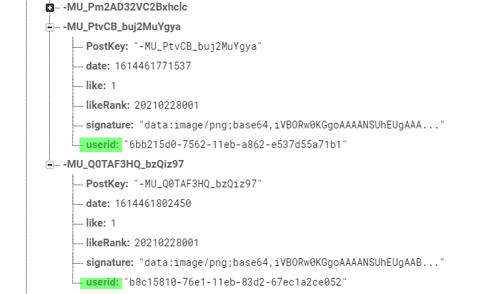

import { Link } from 'gatsby';

## 実装した機能

Grafhouseに特定のユーザーの投稿を一覧表示する機能を追加しました。


イラスト右下のユーザーアイコンをタップするとそのユーザーの投稿を一覧できるようにしました。

## 機能の仕組み

<Link to="/blog/2021-02-23">AppStoreの審査を通す</Link>ためにブロック機能を実装したことを以前書きました。

実はブロック機能を実装するにあたって、画面に表示してないだけでユーザー固有のIDを投稿に付与しています。



これを利用して、同一のユーザーIDからの投稿を一覧する画面を追加しました。

Firebaseから取得するときのクエリはこんな感じです。

```javascript
onValueChanged() {
	const userid = this.props.route.params.userid
	var prevTask = Promise.resolve()
	prevTask = prevTask.finally(async () => {
		this.dbh
		.ref(`gallery/`)
		.orderByChild('userid')
		.equalTo(userid)
		.limitToLast(20)
		.on("value", snapshot => {
			hogehoge
		}).bind(this);
	})
}
```

`.orderByChild()`と`.equalTo()`メソッドを使って、前の画面(Gallery, Like, Rank24h)から受け取った`userid`と一致する投稿を見つけて一覧しています。

## まとめ

匿名SNSとはいえ、過去ポストくらいは見れたほうが良かろうということで実装してみました。もう持ってる情報を使ってお手軽に追加できるというのも理由です。

---