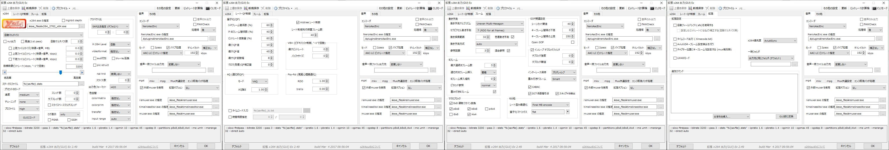

import { Link } from 'gatsby';

## 今日はアプリ開発の話ではない

最近アプリ開発のエントリーが続きましたが、久々に自作パソコンの話を書きます。

広告排除ニュース/ブログリーダーアプリ[kenmo reader](https://kenmo-reader.ml)と、落書きコラボレーションSNS[Grafhouse](https://grafhouse.ml)をよろしくお願いします。

<Link to="/blog/2021-02-02">以前の投稿</Link>でAGESA1.2.0.0の性能を検証しましたが、その2回目です。

<br/><br/>

## B550 AORUS ELITEに新BIOSが出ているよ


[B550 AORUS ELITE](https://www.gigabyte.com/jp/Motherboard/B550-AORUS-ELITE-rev-10/support#support-dl-bios)のBIOSが`F13c`に更新されていたので、適用して性能を検証しました。

ただし、ランダムリブート対策のため以下の設定をしています。

- **Precision Boost Overdrive**を`Advanced`
- **Curve Optimizer**を`All Core`、`Positive`
- **Magnitude**を`3`

<br/>

これは前回`F13a`に更新した記事を書いた後でもランダムリブートが発生したためです。私の環境ではAGESA1.2.0.0でも解決していませんでした。

1ヶ月に渡るランダムリブート問題との対決は<Link to="/blog/2020-12-12">以前の記事</Link>をご覧ください。


---

## 検証機材

- Ryzen 9 5950X
- GIGABYTE B550 AORUS ELITE
- Crucial CT2K16G4DFD832A
- 玄人志向 RD-RX550-E2GB/OC
- Scythe 虎徹Mark2
- Windows10 `20H2`

<br/>

これは以前と変わっていません。BIOSを`F13a`から`F13c`に更新しただけです。

---

## AviUtl

### コーデックの設定

x264の設定


x265の設定


### AviUtlの設定


コーデックとAviUtlの設定もいつもと同じやつです。

### エンコード所要時間

比較用にサブ機のCore i7 6700Kでもエンコードしました。

**サブ機構成**

- Core i7 6700K
- Scythe SCRT-1000
- Asus Z170-A
- UMAX DDR4 2400 8GB*2
- 玄人志向 GF-GT710-E1GB/HS

<br/>

**メイン機(Ryzen 9 5950X)**


**サブ機(Core i7 6700K)**


### まとめ表とグラフ

| x264     |Ryzen 9 5950X      |Core i7 6700K         |
|-----------|:------------:|:------------:|
| 1pass      | 5:29.0       | 14:25.4      |
| 2pass      | 5:09.7       | 13:09.8      |
| Total      | 10:59.4       | 27:58.3      |

| x265     |Ryzen 9 5950X      |Core i7 6700K         |
|-----------|:------------:|:------------:|
| 1pass      | 8:18.7       | 19:05.7      |
| 2pass      | 8:03.0       | 18:09.2      |
| Total      | 16:59.0       | 37:50.2      |


---

## Blackmagic RAW Speed Test

続いてBlackmagic RAW Speed Testの結果です。

| Blackmagic RAW Speed Test(8K)     |AGESA1.0.8.0         |AGESA1.2.0.0      |
|-----------|:------------:|:------------:|
| BRAW 12:1      |  63      |61	       |
| BRAW 8:1      | 63      | 60       |
| BRAW 5:1      |  59      |58       |
| BRAW 3:1      | 57      | 56       |


AGESA1.0.8.0の結果は<Link to="/blog/2020-11-07">以前の結果</Link>からの流用です。

微妙に下がってるのは部屋に暖房を入れてるのが原因の可能性が高いですが、まぁほぼ誤差といえる範囲ではないでしょうか。

---

## 開発コマンドの所要時間

このブログ(GatsbyJS)とkenmo reader、Grafhouseにおいて`yarn install`で依存関係をインストールしたときの実行時間。

そしてこのブログを`gatsby build`したときの実行時間をメイン機(Ryzen9 5950X)とサブ機(Core i7 6700K)で比較しました。

なお、速度の計測はそれぞれ

```shell
date; yarn install; date
date; gatsby build; date
```

で行った簡易的な測定であることに留意してください。

|command|Ryzen 9 5950X|Core i7 6700K|
|---|:---:|:---:|
|blog yarn install|0:31|1:28|
|gatsby build|4:16|7:21|
|Grafhouse yarn install|0:32|1:04|
|kenmo reader yarn install|0:28|0:52|


---

## まとめ

BIOS更新によるパフォーマンス向上はさすがにAGESAが同じだと効果はありませんでした。

### アプリ開発におけるRyzen 9 5950X

最近はスマホアプリの開発とかこのブログの更新にRyzen9 5950Xをメインに使っています。それとは別にCore i5 6500も使っていて、割合としては半々くらいです。

スマホアプリの開発にはReact Native(Expo)を、ブログ更新はGatsbyJSを使っています。

開発にRyzen 9 5950Xを使ってみて実感したのはCPUの速さは開発効率に直結するということです。

まず、Githubからリポジトリをクローンしたあとに依存関係をnpmでインストールする時点でかなり違います。

4コアのCore i5を使ってるときはインストールが終わるまでCPU使用率が100%に張り付いてその他の作業が全てストップしてしまいますが、Ryzen 9 5950Xだとかなり余裕があります。

そのためインストール中の数分間に他の作業が余裕でできますし、そもそもインストール自体が明らかに速く終わります。

そして開発体験もパワフルなCPUだと明らかに違います。

まず、ブログの更新です。

このブログはGatsbyJSを使っているので更新するときはローカルにマークダウンで記事を書いて`npm run develop`してブラウザでプレビュー、完成したら`gatsby build`して`firebase deploy`という手順で更新しています。

プレビューやデプロイのためにビルドする必要があります。このとき、Ryzen 9では明らかにビルドが速く完了します。

ホットリロードで修正がうまく反映されない場合は再ビルドしますが、Ryzen 9では高速にビルドが終わるのでこのときの精神的ハードルが随分と下がりました。

そして、アプリ開発でも高速なCPUの効果は顕著です。

React Navive(Expo)を使っているので、コードを書いて`expo start`してビルドして、実機orエミュレータで確認というのが私のアプリ開発の手順です。

React Nativeもホットリロード機能はありますが、アプリのクラッシュ時などは再ビルドする必要があるためCPUが速ければ速いほど**コードを書く**→**デバッグ**の**サイクルを高速で回せます**。

この2ヶ月、アプリ開発とブログ更新にRyzen9機を使用してみて、パワフルなCPUの良さを改めて実感しました。

あとはいまだに解決してないランダムリブート問題を完全に直したBIOSが出るのを待つのみです。

---