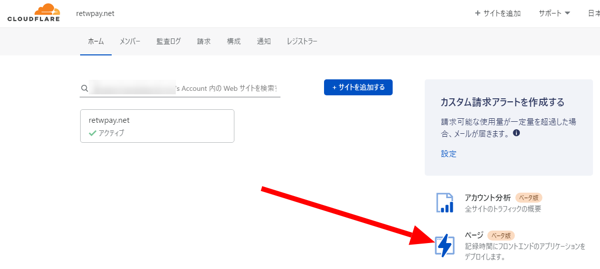
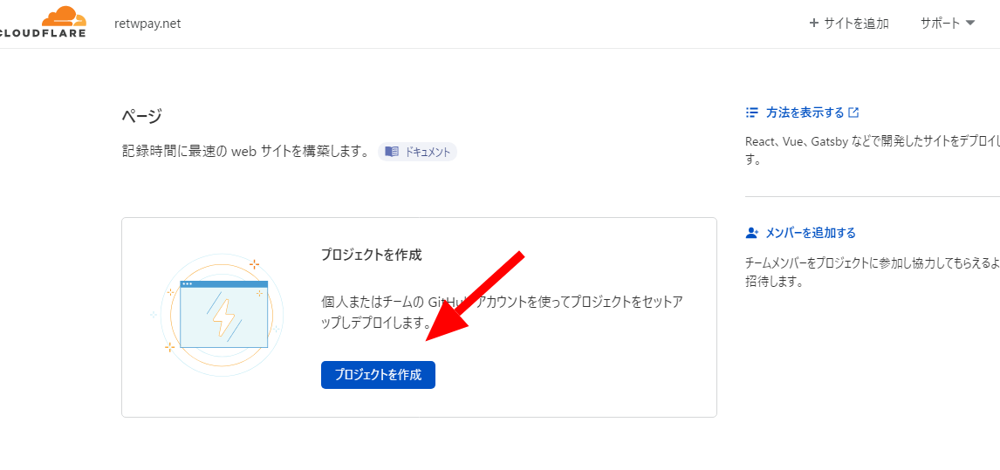
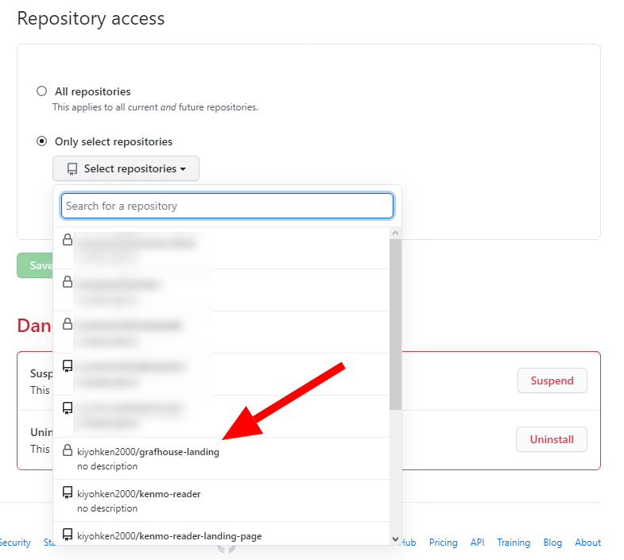
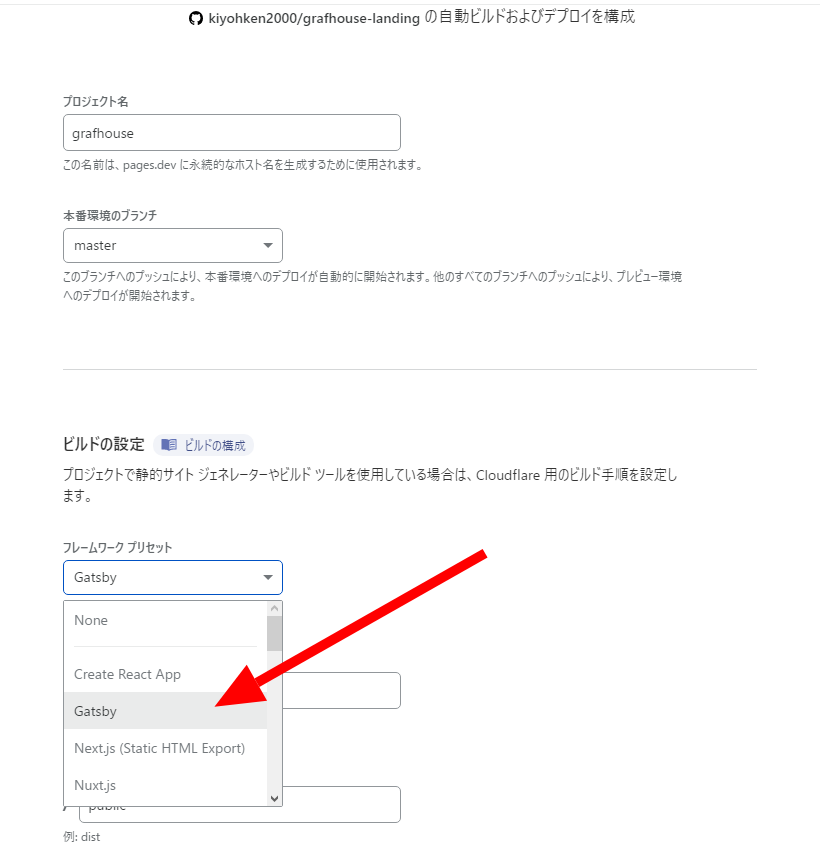
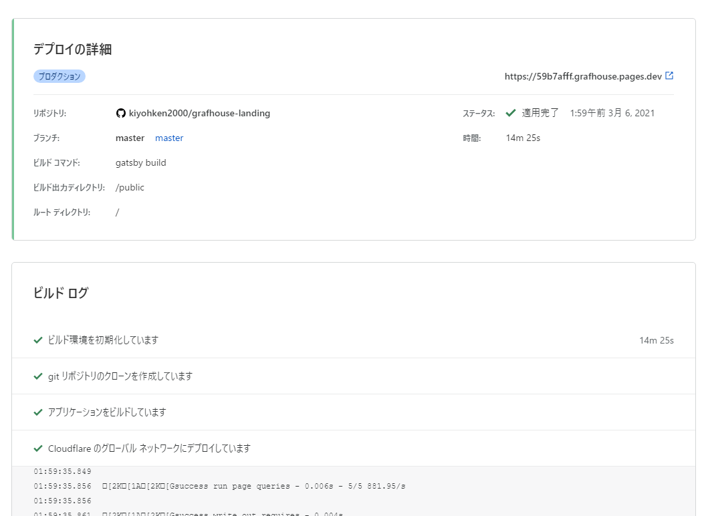
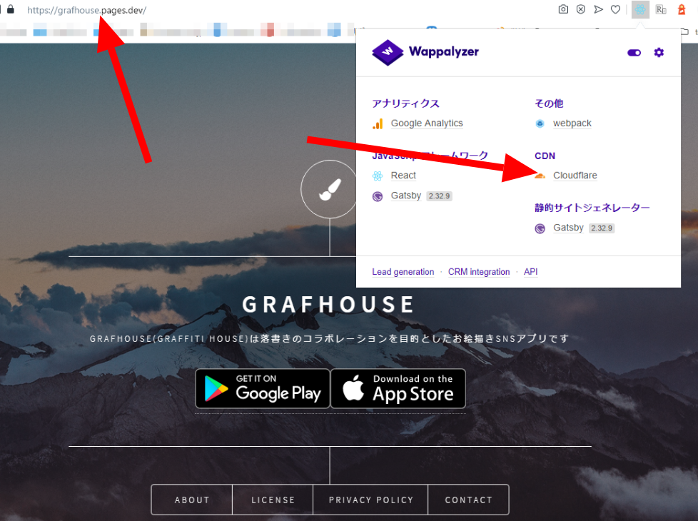
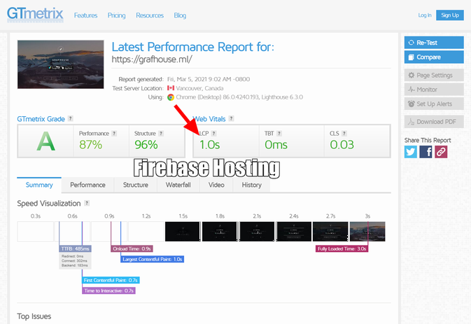
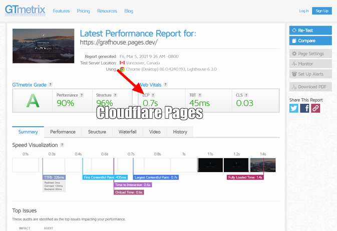
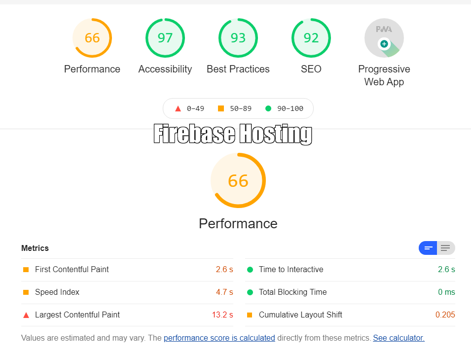
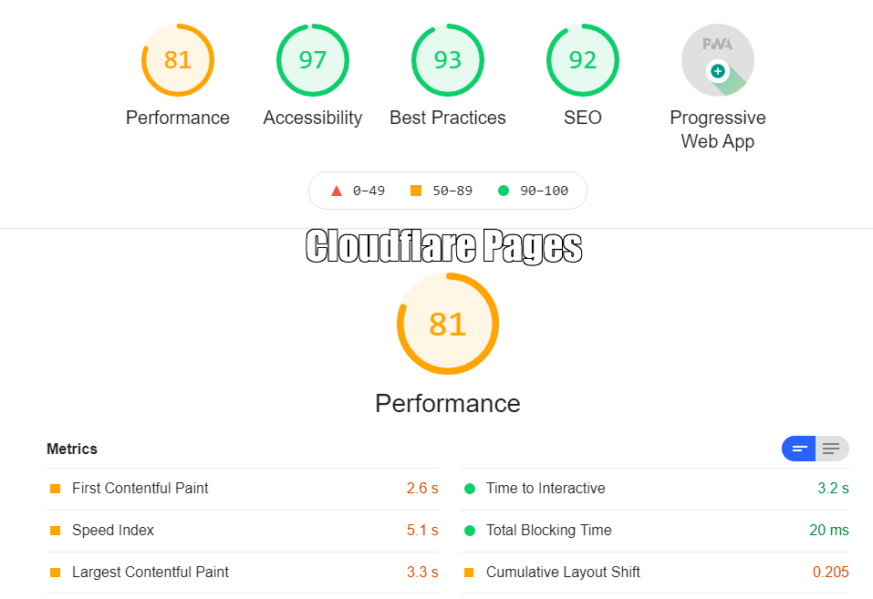

import { Link } from 'gatsby';

3/3に[Cloudflare Pages](https://pages.cloudflare.com/)のオープンベータ版が利用可能になりました。

## Cloudflare Pagesとは

Cloudflare PagesはCDN屋さんのCloudflareが提供する静的サイトのホスティングサービスです。

同様のサービスには[Netlify](https://www.netlify.com/)と[Vercel](https://vercel.com/)があり、Cloudflare Pagesはその直接の競合となります。

去年末にアナウンスはされていましたが、そのベータ版が利用可能になりました。

- [Cloudflareがソースコードから一瞬でウェブサイトを構築できるJAMstackプラットフォーム「Cloudflare Pages」を発表](https://gigazine.net/news/20201222-cloudflare-pages/)

 

今回は実際にCloudflare PagesにGrafhouseのランディングページをデプロイして、Firebase Hostingにデプロイ中の本番サイトとパフォーマンスを比較しました。

ランディングページはGatsbyJSで作成しました。

- [Grafhouse landing page](https://grafhouse.ml/)(Firebase Hosting)
- [Grafhouse landing page](https://grafhouse.pages.dev/)(Cloudflare Pages)

 

---

## Cloudflare Pagesにデプロイする

使い方は簡単で、Cloudflareのダッシュボード上でGithubのリポジトリを選択するだけです。

Cloudflarのダッシュボードにアクセスして`ページ ベータ版`を選択します。

`プロジェクトを作成`をクリックします。

関連付けるGithubリポジトリを選択します。`アカウントを追加`をクリックします。

Githubに移動するので関連付けるリポジトリを選択します。

Cloudflareに戻るので**選択したリポジトリにチェック**を入れて、`セットアップの開始`をクリックします。

`フレームワーク プリセット`を選択します。ランディングページはGatsbyJSなので**Gatsby**を選択します。

`ビルドコマンド`と`ビルド出力ディレクトリ`を確認します。↑でGatsbyを選択したので変更する必要はありませんでした。`保存してデプロイする`をクリックします。

ビルドが始まるので待ちます。

これでデプロイ完了です。アカウントのトップページに戻り改めて**Pages**のページに戻るとステータスが確認できます。

**ドメイン**(grafhouse.pages.dev)をクリックするとデプロイしたページが表示されます。

---

## ページパフォーマンス

上にも書きましたがGrafhouseのランディングページはFirebase Hostingにデプロイ中です。Cloudflare Pagesにデプロイしたものとページパフォーマンスを比較しました。

[GTmetrix](https://gtmetrix.com/)と[Lighthouse](https://chrome.google.com/webstore/detail/lighthouse/blipmdconlkpinefehnmjammfjpmpbjk?hl=ja)を使いました。

### GTmetrix

どちらも**Web Vitals**の目標値(1.2s/150ms/0.1)は全て達成していますが、全体的なスコアは**Cloudflare Pages**が上回りました。

### Lighthouse

Lighthouseでもパフォーマンススコアは**Cloudflare Pages**が上回りました。

---

## まとめ

体感できるほどではないですが、ページパフォーマンスは現在使っているFirebaseを上回りました。

また、Firebase Hostingの無料枠では`ストレージ1GB` / `ダウンロード10GB/月` の制限がありますが、Cloudflare Pagesは`最大ファイル数20,000` / `ダウンロード無制限`/ `500ビルド/月` となっています。

このブログは頻繁に更新してるし、ファイル数が多いのでCloudflare Pagesは不向きですが、アプリのランディングページ程度ならダウンロード帯域の制限がないので良いかもしれません。

---