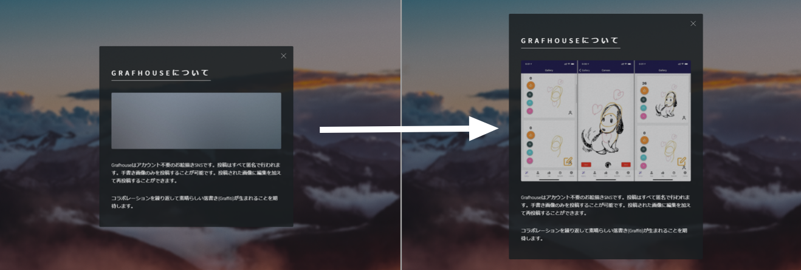
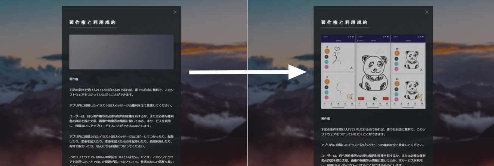
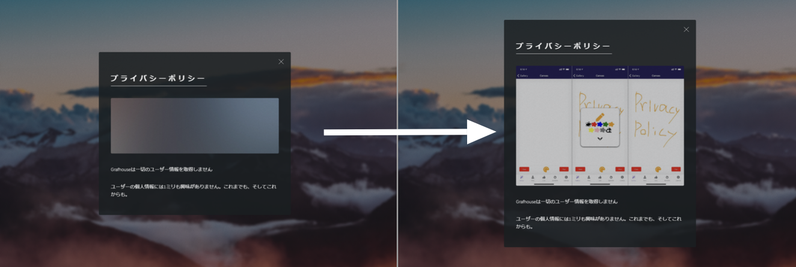
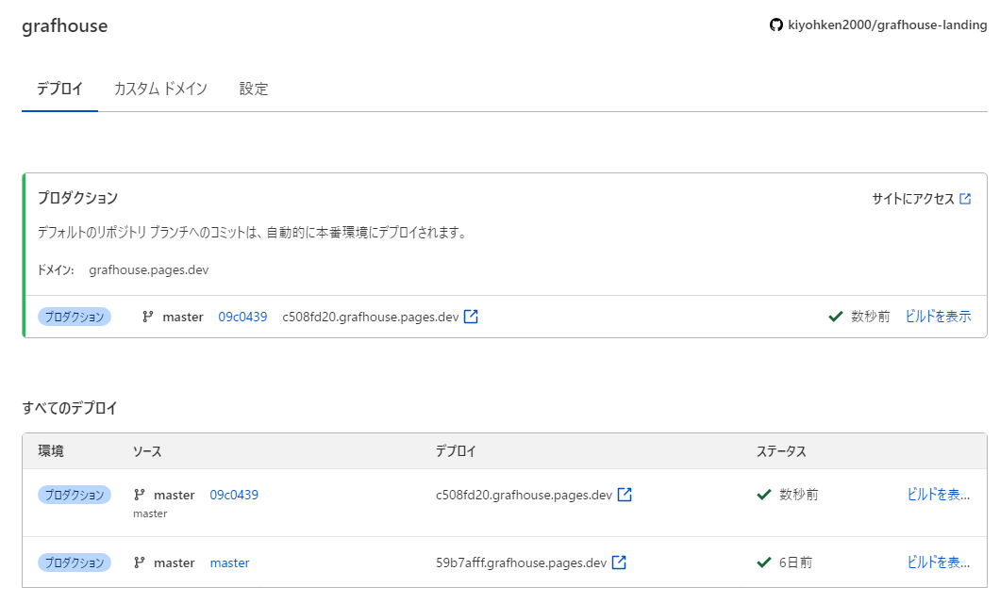

import { Link } from 'gatsby';

[Grafhouseのランディングページ](https://grafhouse.ml/)は、AppStoreの審査時にプライバシーポリシーを掲載したウェブページが必要なため作成しました。

とりあえずの間に合わせで作ったため画像は全部プレースホルダーだったのですが、あまりにも寂しかったのでちゃんとアプリのスクリーンショットに差し替えました。

### 追記

他のホスティングサービスでおなじみの機能ですが、Githubのリポジトリにpushすると自動でビルドとデプロイされる機能は[Cloudflare pages](https://grafhouse.pages.dev/)でもちゃんと動作しました。

---