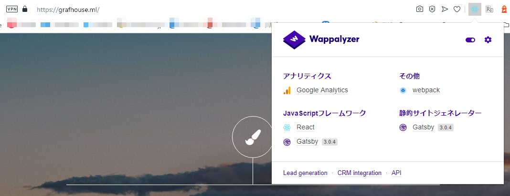
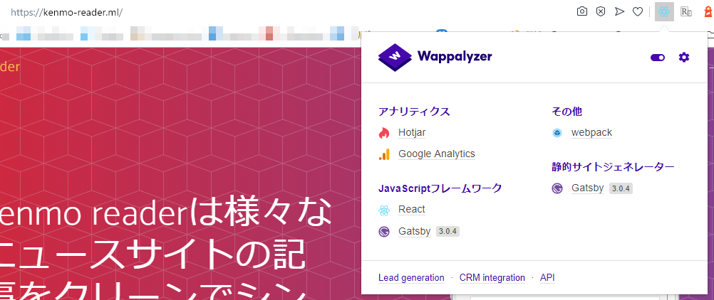
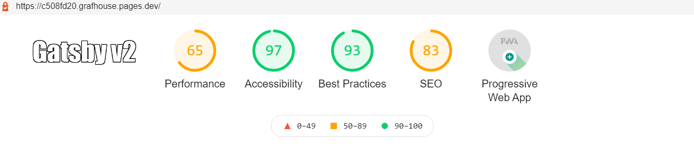
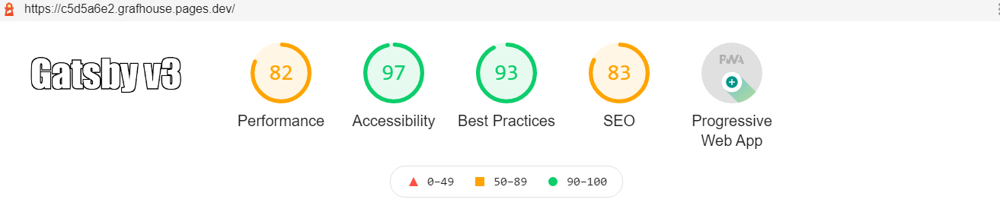
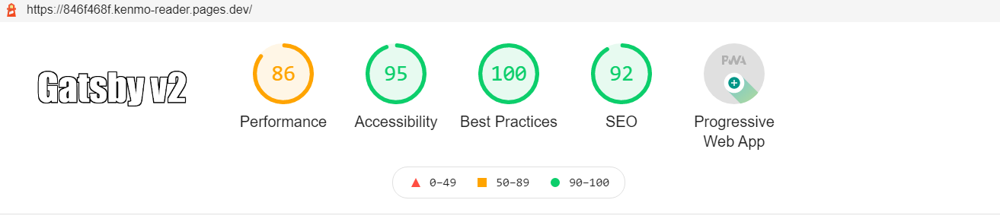
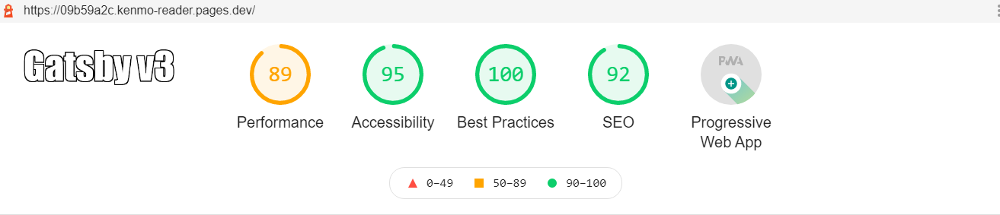

import { Link } from 'gatsby';

3/2にGatsby バージョン3が[リリース](https://www.gatsbyjs.com/blog/gatsbyconf-product-announcements/)されました。


主な変更点は

- インクリメンタルビルドによるビルド時間の短縮
- Lighthouse最適化
- Gatsby Hosting

となっています。

実際に[kenmo reader](https://kenmo-reader.ml/)と[Grafhouse](https://grafhouse.ml/)のランディングページをGatsby v3にしてLighthouseスコアの変化を調べてみました。

## Gatsby v3へのアップデート

ラッキーなことにコードの変更は必要ありませんでした。コマンド2つでアップデートが完了しました。

### Step 1

念のためいったんキャッシュを削除します。

```shell
gatsby clean
```

### Step 2

全パッケージアップグレードします。

```shell
yarn upgrade --latest
```

## v3へアップデートできました





## Lighthouseスコア

無事アップデートできたのでLighthouseのスコアを調べます。

各ランディングページはFirebaseにホスティングしていますが、リポジトリの更新ごとにページが生成されるCloudflare Pagesにデプロイしたときのスコアを調べました。

### Grafhouse landing

[Gatsby v2](https://c508fd20.grafhouse.pages.dev/)



[Gatsby v3](https://c5d5a6e2.grafhouse.pages.dev/)



### kenmo reader landing

[Gatsby v2](https://846f468f.kenmo-reader.pages.dev/)



[Gatsby v3](https://09b59a2c.kenmo-reader.pages.dev/)



## まとめ

パフォーマンススコアは顕著に上がりました。Gatsby v3良いですね。このサイトも更新したいと思います。

---