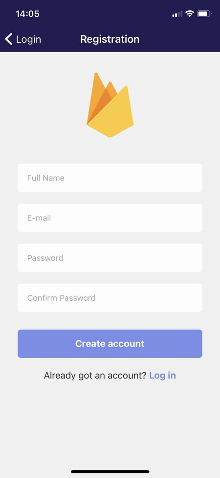

import { Link } from 'gatsby';

具体的に作りたいアプリを思いついたわけではないですが、最近コードを書いてなかったので[Firebase Authentication](https://firebase.google.com/docs/auth?hl=ja)をReact Nativeで使ってみました。

## 作ったもの


作ったのは以下の3つです。

- ログイン画面
- サインアップ画面
- ユーザー情報表示画面

Firebase AuthenticationはGoogleやTwitterなど多くのSNSを利用したOAuthをサポートしていますが、とりあえずメールアドレスとパスワードでサインアップ/ログインできるようにしました。

## 構成

[kenmo reader](https://kenmo-reader.ml)や[Grafhouse](https://grafhouse.ml)でも使用した[ボイラープレート](https://github.com/WataruMaeda/react-native-boilerplate)を今回も使いました。

なのでExpo SDKは**40**です。

[Firebase用のボイラープレート](https://github.com/instamobile/react-native-firebase)も見つけたのですが、SDKバージョンが**37**でした。そのまま使うのは躊躇われるのでこれを参考にしつつ、バージョン**40**のボイラープレートを改造しました。

# 実際のコード

上記のFirebase用ボイラープレートのほぼそのままですが、一応コードも載せます。[リポジトリ](https://github.com/kiyohken2000/kenmochat)は公開しています。

## Firebase接続用ファイルを作成

まずはFirebaseのダッシュボードで取得した各種keyを記述したファイルを作ります。

**src\firebase\config.js**

```javascript
import * as firebase from 'firebase';
import "firebase/auth"
import "firebase/firestore"

const firebaseConfig = {
  apiKey: "xxxxxxxxxxxx",
  authDomain: "xxxxxxxxxxxx",
  databaseURL: "xxxxxxxxxxxx",
  projectId: "xxxxxxxxxxxx",
  storageBucket: "xxxxxxxxxxxx",
  messagingSenderId: "xxxxxxxxxxxx",
  appId: "xxxxxxxxxxxx",
  measurementId: "xxxxxxxxxxxx"
};

if (!firebase.apps.length) {
  firebase.initializeApp(firebaseConfig);
}

export { firebase };
```

## 各スクリーンを作成

ログイン/サインアップ/ユーザー情報、の各画面を作っていきます。スタイリングは省略します。

### ログイン画面


**src\scenes\login\index.js**

```javascript
import Login from './Login'

export default Login
```

**src\scenes\login\Login.js**

```javascript
import React, { useState } from 'react'
import { Text, View, StatusBar, Image, TextInput, TouchableOpacity } from 'react-native'
import { KeyboardAwareScrollView } from 'react-native-keyboard-aware-scroll-view'
import styles from './styles'
import { firebase } from '../../firebase/config'

export default function Login({navigation}) {
  const [email, setEmail] = useState('')
  const [password, setPassword] = useState('')

  const onFooterLinkPress = () => {
    navigation.navigate('Registration')
  }

  const onLoginPress = () => {
    firebase
      .auth()
      .signInWithEmailAndPassword(email, password)
      .then((response) => {
        const uid = response.user.uid
        const usersRef = firebase.firestore().collection('users')
        usersRef
          .doc(uid)
          .get()
          .then(firestoreDocument => {
            if (!firestoreDocument.exists) {
              alert("User does not exist anymore.")
              return;
            }
          })
          .catch(error => {
            alert(error)
          });
      })
      .catch(error => {
        alert(error)
      })
  }

  return (
    <View style={styles.container}>
      <KeyboardAwareScrollView
        style={{ flex: 1, width: '100%' }}
        keyboardShouldPersistTaps="always">
        <Image
          style={styles.logo}
          source={require('../../../assets/icon.png')}
        />
        <TextInput
          style={styles.input}
          placeholder='E-mail'
          placeholderTextColor="#aaaaaa"
          onChangeText={(text) => setEmail(text)}
          value={email}
          underlineColorAndroid="transparent"
          autoCapitalize="none"
        />
        <TextInput
          style={styles.input}
          placeholderTextColor="#aaaaaa"
          secureTextEntry
          placeholder='Password'
          onChangeText={(text) => setPassword(text)}
          value={password}
          underlineColorAndroid="transparent"
          autoCapitalize="none"
        />
        <TouchableOpacity
          style={styles.button}
          onPress={() => onLoginPress()}>
          <Text style={styles.buttonTitle}>Log in</Text>
        </TouchableOpacity>
        <View style={styles.footerView}>
          <Text style={styles.footerText}>Don't have an account? <Text onPress={onFooterLinkPress} style={styles.footerLink}>Sign up</Text></Text>
        </View>
      </KeyboardAwareScrollView>
    </View>
  )
}
```

### サインアップ画面



**src\scenes\registration\index.js**

```javascript
import Registration from './Registration'

export default Registration
```

**src\scenes\registration\Registration.js**

```javascript
import React, { useState } from 'react'
import { Image, Text, TextInput, TouchableOpacity, View } from 'react-native'
import { KeyboardAwareScrollView } from 'react-native-keyboard-aware-scroll-view';
import styles from './styles';
import { firebase } from '../../firebase/config'

export default function Registration({navigation}) {
  const [fullName, setFullName] = useState('')
  const [email, setEmail] = useState('')
  const [password, setPassword] = useState('')
  const [confirmPassword, setConfirmPassword] = useState('')

  const onFooterLinkPress = () => {
    navigation.navigate('Login')
  }

  const onRegisterPress = () => {
    if (password !== confirmPassword) {
      alert("Passwords don't match.")
      return
    }
  
    firebase
      .auth()
      .createUserWithEmailAndPassword(email, password)
      .then((response) => {
        const uid = response.user.uid
        const data = {
          id: uid,
          email,
          fullName,
        };
        const usersRef = firebase.firestore().collection('users')
        usersRef
          .doc(uid)
          .set(data)
          .then(() => {
            navigation.navigate('Home', {user: data})
          })
          .catch((error) => {
            alert(error)
          });
      })
      .catch((error) => {
        alert(error)
    });
  }

  return (
    <View style={styles.container}>
        <KeyboardAwareScrollView
          style={{ flex: 1, width: '100%' }}
          keyboardShouldPersistTaps="always">
          <Image
            style={styles.logo}
            source={require('../../../assets/icon.png')}
          />
          <TextInput
            style={styles.input}
            placeholder='Full Name'
            placeholderTextColor="#aaaaaa"
            onChangeText={(text) => setFullName(text)}
            value={fullName}
            underlineColorAndroid="transparent"
            autoCapitalize="none"
          />
          <TextInput
            style={styles.input}
            placeholder='E-mail'
            placeholderTextColor="#aaaaaa"
            onChangeText={(text) => setEmail(text)}
            value={email}
            underlineColorAndroid="transparent"
            autoCapitalize="none"
          />
          <TextInput
            style={styles.input}
            placeholderTextColor="#aaaaaa"
            secureTextEntry
            placeholder='Password'
            onChangeText={(text) => setPassword(text)}
            value={password}
            underlineColorAndroid="transparent"
            autoCapitalize="none"
          />
          <TextInput
            style={styles.input}
            placeholderTextColor="#aaaaaa"
            secureTextEntry
            placeholder='Confirm Password'
            onChangeText={(text) => setConfirmPassword(text)}
            value={confirmPassword}
            underlineColorAndroid="transparent"
            autoCapitalize="none"
          />
          <TouchableOpacity
            style={styles.button}
            onPress={() => onRegisterPress()}>
            <Text style={styles.buttonTitle}>Create account</Text>
          </TouchableOpacity>
          <View style={styles.footerView}>
            <Text style={styles.footerText}>Already got an account? <Text onPress={onFooterLinkPress} style={styles.footerLink}>Log in</Text></Text>
          </View>
        </KeyboardAwareScrollView>
    </View>
  )
}
```

### ユーザー情報表示画面


**src\scenes\home\index.js**

```javascript
import Home from './Home'

export default Home
```

**src\scenes\home\Home.js**

```javascript
import React, { useEffect, useState } from 'react'
import { StyleSheet, Text, View, StatusBar, TouchableOpacity } from 'react-native'
import Button from 'components/Button'
import { colors } from 'theme'
import { firebase } from '../../firebase/config'
import styles from './styles';

export default function Home(props) {
  const userData = props.extraData
  const signOut = () => {
    firebase.auth().signOut();
  }
  return (
    <View style={styles.container}>
      <Text>ID: {userData.id}</Text>
      <Text>Mail: {userData.email}</Text>
      <Text>Name: {userData.fullName}</Text>
      <TouchableOpacity style={styles.button} onPress={signOut}>
        <Text style={styles.buttonText}>Log out</Text>
      </TouchableOpacity>
    </View>
  )
}
```

## ルーティングに追加

作った各画面をルーティングに追加していきます。

**src\routes\navigation\Navigation.js**

```javascript
import 'react-native-gesture-handler';
import React, { useEffect, useState } from 'react'
import { firebase } from '../../firebase/config'
import { colors } from 'theme'
import { NavigationContainer } from '@react-navigation/native'
import { createStackNavigator } from '@react-navigation/stack'
import Login from '../../scenes/login'
import Registration from '../../scenes/registration'
import Home from '../../scenes/home'
// import DrawerNavigator from './drawer'
import TabNavigator from './tabs'
import {decode, encode} from 'base-64'
if (!global.btoa) {  global.btoa = encode }
if (!global.atob) { global.atob = decode }

const Stack = createStackNavigator();

const navigationProps = {
  headerTintColor: 'white',
  headerStyle: { backgroundColor: colors.darkPurple },
  headerTitleStyle: { fontSize: 18 },
}

export default function App() {
  const [loading, setLoading] = useState(true)
  const [user, setUser] = useState(null)

  useEffect(() => {
    const usersRef = firebase.firestore().collection('users');
    firebase.auth().onAuthStateChanged(user => {
      if (user) {
        usersRef
          .doc(user.uid)
          .get()
          .then((document) => {
            const userData = document.data()
            setLoading(false)
            setUser(userData)
          })
          .catch((error) => {
            setLoading(false)
          });
      } else {
        setLoading(false)
      }
    });
  }, []);

  if (loading) {
    return (
      <></>
    )
  }

  return(
    <NavigationContainer>
      <Stack.Navigator headerMode="screen" screenOptions={navigationProps}>
        { user ? (
          <Stack.Screen name="Home">
            {props => <Home {...props} extraData={user} />}
          </Stack.Screen>
        ) : (
          <>
            <Stack.Screen name="Login" component={Login} />
            <Stack.Screen name="Registration" component={Registration} />
          </>
        )}
      </Stack.Navigator>
    </NavigationContainer>
  )
}
```

# まとめ

以上です。ボイラープレートからボイラープレートにコピペしただけでした。

何か具体的に作りたいものが思い浮かべばもうちょっとモチベーションが保てると思うのですが、今のところ何も思いつきません。

---