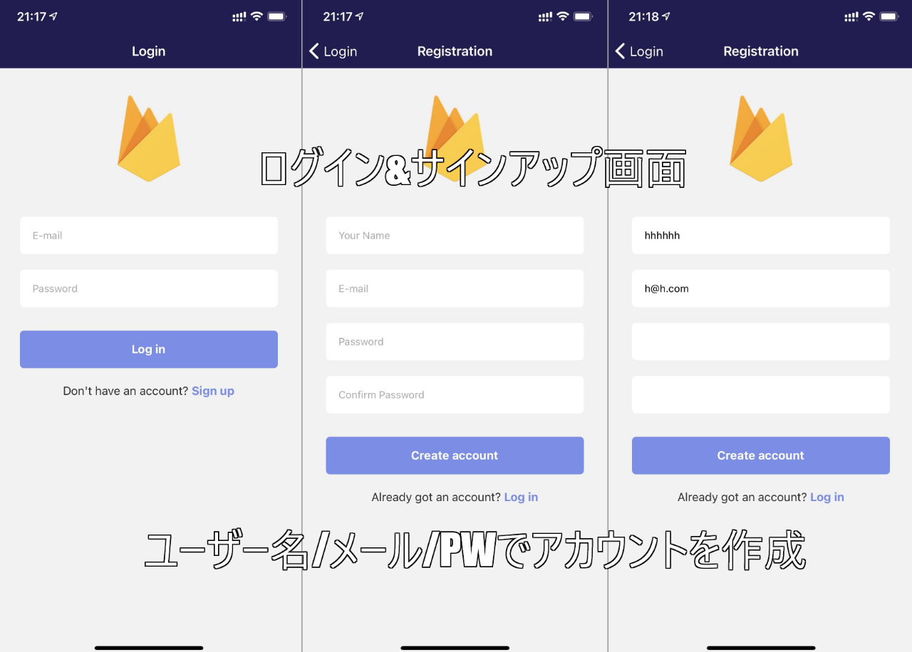
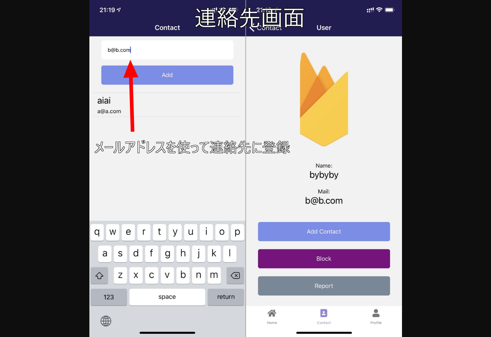
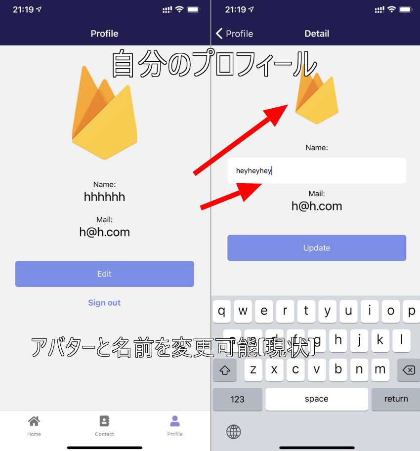
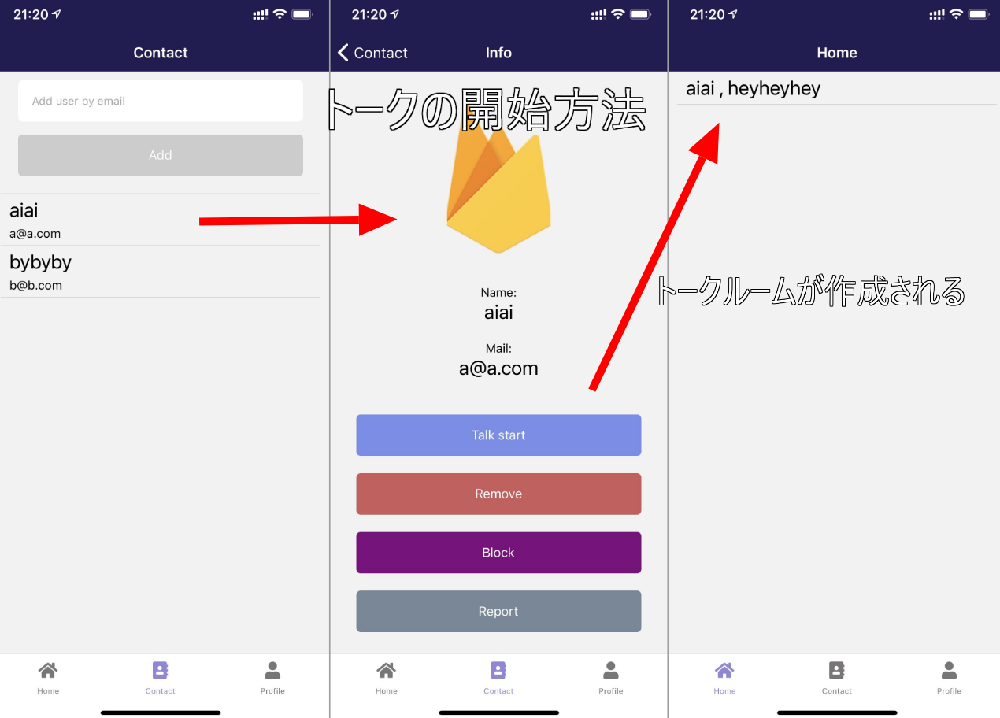
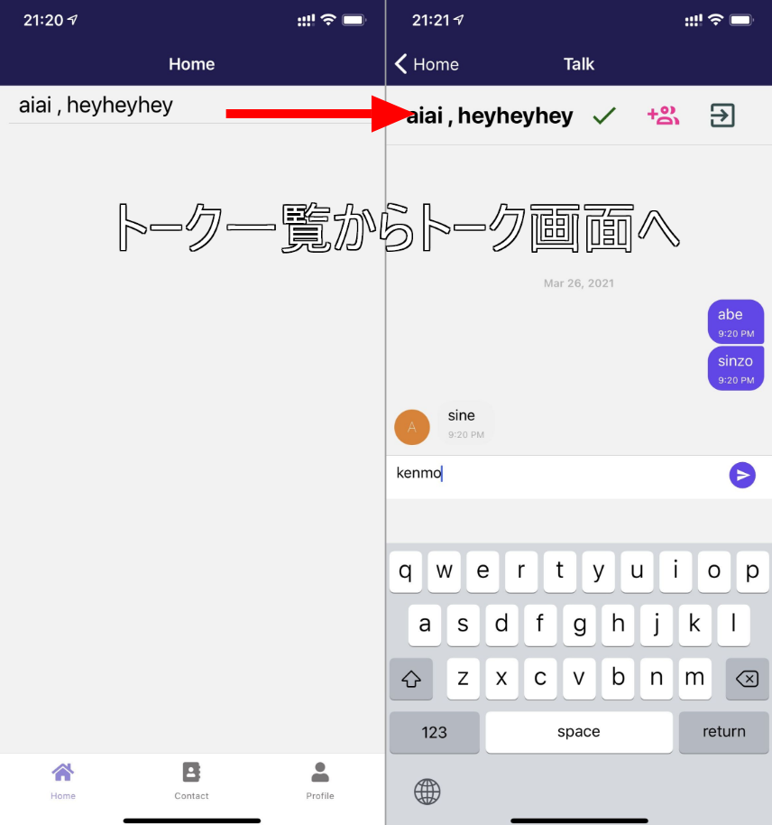
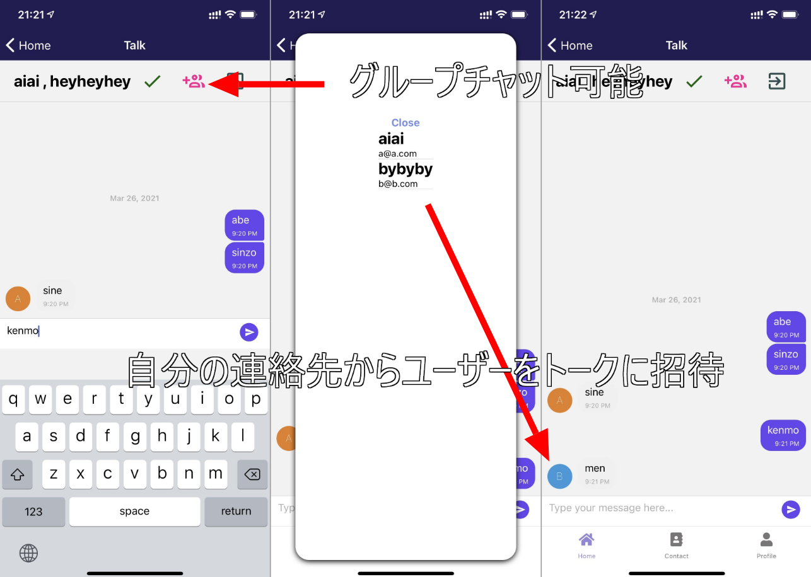
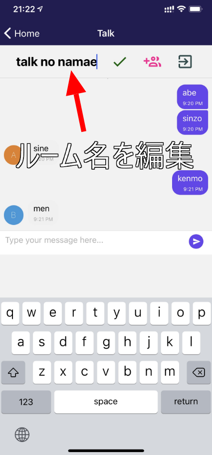

import { Link } from 'gatsby';

<Link to="/blog/2021-03-21">前回</Link>の続きです。

前回はFirebase Authenticationを使って`サインアップ/ログイン/アカウント表示`をするだけのReact Nativeアプリを作りました。

そこから更に発展させて簡単なメッセンジャーアプリを作ることにしました。

## アプリの説明

ひとまず現状できているものを紹介します。

### ログイン&サインアップ画面

メッセンジャーアプリなのでアカウントが必要です。メールアドレス/PWでアカウントを作ります。ユーザー名は自由に決められます。

### 連絡先画面

連絡先一覧画面です。メールアドレスでユーザーを探して、連絡先に追加します。

### プロフィール画面

他のユーザーに見せる自分のプロフィールを編集できます。現在は名前のみ変更可能です。Firebaseロゴの部分が自分のアバターです。アバターも変更できるようにする予定です。

### トークの開始方法

連絡先に追加したユーザーをタップしてそのユーザーのプロフィールを表示します。`Talk start`をタップするとホーム画面(トーク一覧)にそのユーザーとのトークルームが作成されます。

### トーク画面

一覧からトークをタップするとそのトークルームに入ります。トーク一覧では現状ルーム名しか表示されてませんが、最新メッセージとか時間とか色々表示させる予定です。

他のユーザーが自分とのトークルームを作るとリアルタイムでルームが表示されます。

### グループトーク機能

今いるトークルームに自分の連絡先からユーザーを招待できます。Flexbox難しくてデザインがガタガタです。なおしたい。

### ルーム名を変更

デフォルトのルーム名はトークを開始した最初の二人の名前になっています。ルーム内の全てのユーザーが編集可能です。

## まとめ

現在できている機能はここまでです。リリースできたらコードの解説をする予定です。

---