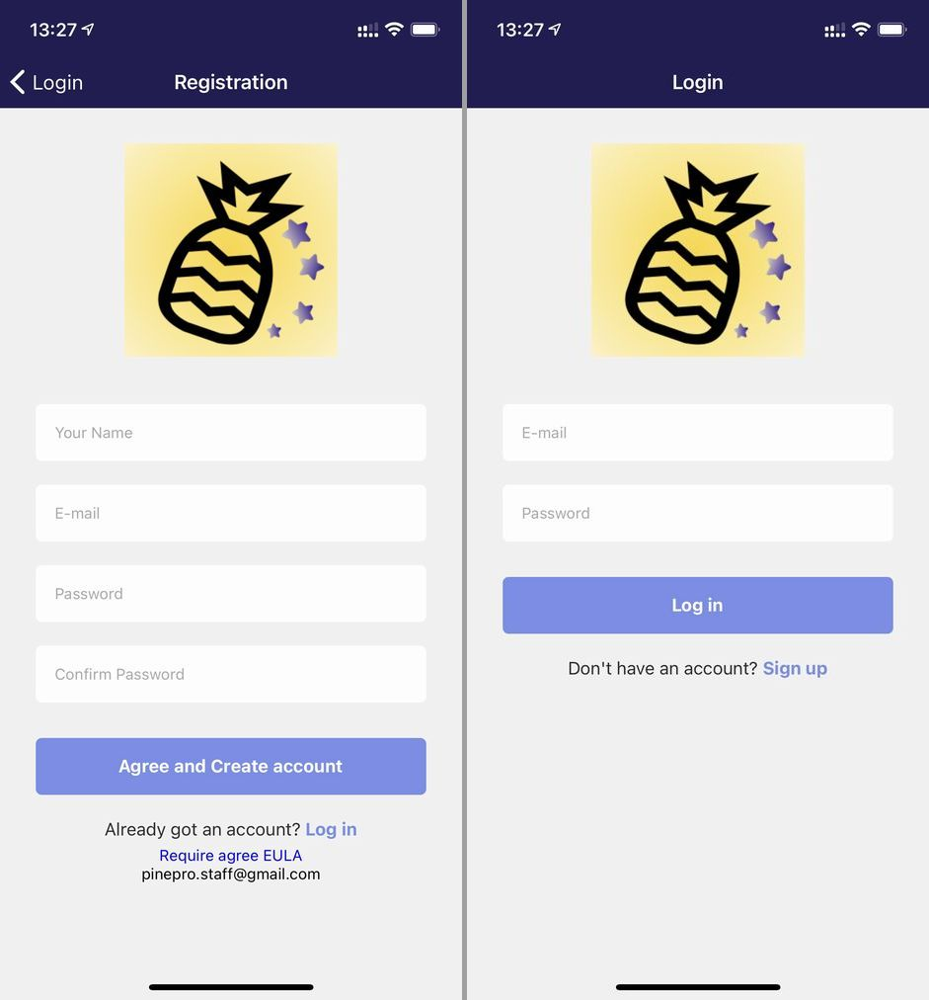
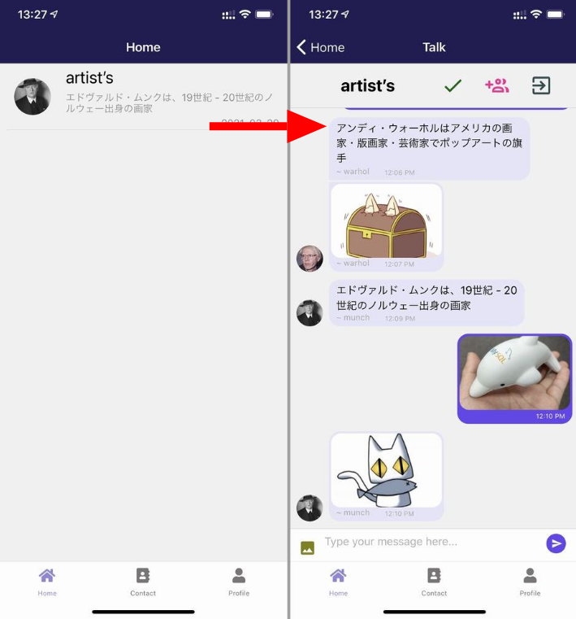
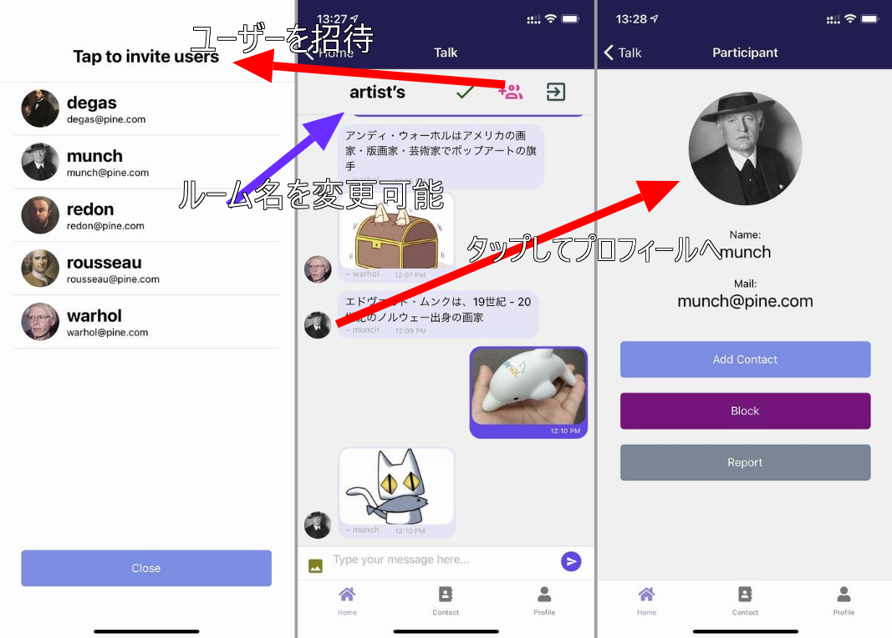
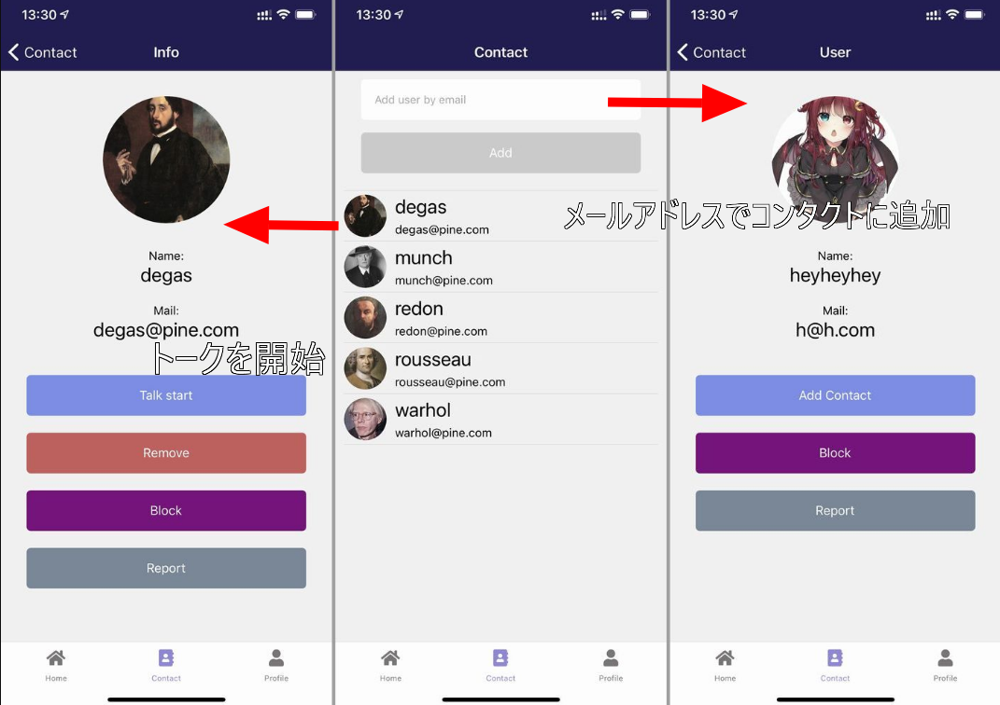
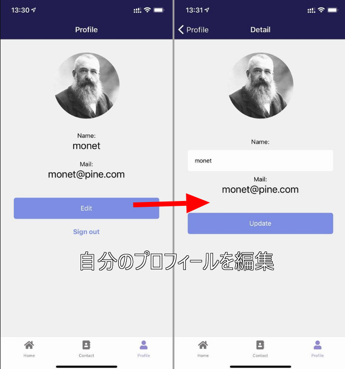

import { Link } from 'gatsby';

<Link to="/blog/2021-03-26">前回</Link>の続きです。

  

バックエンドにFirebaseを使ったReact Native製のメッセンジャーアプリが完成したのでApp StoreとGoogle Playに提出しました。今は審査待ちです。

## アプリの説明

メールアドレスでつながるメッセンジャーです。

### RegistrationとLogin

アカウント作成画面とログイン画面です。自分の名前、メールアドレス、パスワードを入力してアカウントを作成します。名前とメールアドレスは他のユーザーに公開されます。アプリのEULAを記載したWebページへのリンクは下部にあります。

メールアドレスの存在チェックはしていません。正しい形式であれば存在しないメールアドレスでも登録できます。

### Home

トークルームの一覧画面です。トークルームのタイトル、最新のメッセージと受信日と発言したユーザーのアバターが表示されます。トークルームをタップすると**Talk**に遷移します。

### Talk

アプリのメイン画面です。テキストメッセージと画像を送信できます。画像は端末のフォトライブラリーから選択します。メッセージを長押しして発言を削除できます。画面上部にトークルームのタイトルが表示されます。隣のチェックマークをタップするとタイトルがアップデートされます。その隣のユーザーアイコンをタップするとユーザーを招待するモーダルが開きます。自分のコンタクトリストからトークルームに招待することができます。隣のExitアイコンをタップするとトークルームから退出します。ユーザーのアバターをタップすると**Participant**に遷移します。

#### Participant

Talkから遷移する画面です。Talkでタップしたユーザーのプロフィールが表示されます。**[Add Contact]**をタップすると自分のコンタクトリストへ追加できます。**[Block]**をタップするとブロックリストに追加します。**[Report]**をタップするとそのユーザーを運営に報告します。

#### Tap to invite users

ルーム名の右側のユーザーアイコンをタップするとモーダルが開きます。自分のコンタクトリストのユーザーをトークルームに招待することができます。

### Contact

自分のコンタクトリストです。上部のテキストボックスに他のユーザーのメールアドレスを入力します。**[Add]**をタップするとそのメールアドレスのユーザーの**User**に遷移します。コンタクトリストには自分が追加したユーザーが一覧表示されます。各ユーザーをタップするとそのユーザーの**Info**に遷移します。

#### User

**Contact**で入力したメールアドレスのユーザーのプロフィールが表示されます。**[Add Contact]**をタップすると自分のコンタクトリストへ追加できます。**[Block]**をタップするとブロックリストに追加します。**[Report]**をタップするとそのユーザーを運営に報告します。

#### Info

**[Talk start]**をタップするとそのユーザーとのトークルームが作成されてチャットができるようになります。**[Remove]**をタップするとユーザーをコンタクトリストから削除します。**[Block]**をタップするとブロックリストに追加します。**[Report]**をタップするとそのユーザーを運営に報告します。

### Profile

自分のプロフィールが表示されます。**[Edit]**をタップすると**Detail**に遷移します。

#### Detail

自分のプロフィールを編集する画面です。名前とアバターを変更できます。メールアドレスは変更できません。アバター画像をタップして端末のフォトギャラリーから画像をアップロードできます。**[Update]**をタップするとプロフィールが更新されます。

## まとめ

AppStoreではプライバシポリシーを記載したウェブページが必要なので、いつもの通りGatsbyJS + Firebase Hosting + Freenomの無料3連コンボを使ったランディングページを用意しました。

- [PINE pro](https://pinepro.ml)

 

もともと**React NativeでFirebase Authenticationを使ってみたい**という動機で作り始めたアプリでしたが、作業開始から1週間程度でストアに提出するところまでたどり着けました。

これほど高速にアプリを作れたのは人気のチャットUIライブラリ[react-native-gifted-chat](https://github.com/FaridSafi/react-native-gifted-chat)を使ったのが大きいと思います。

ストアで公開できたらコードの説明を載せたいと思っています。

---