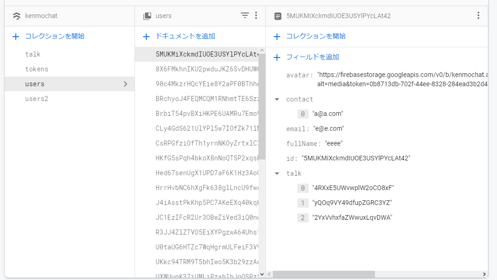
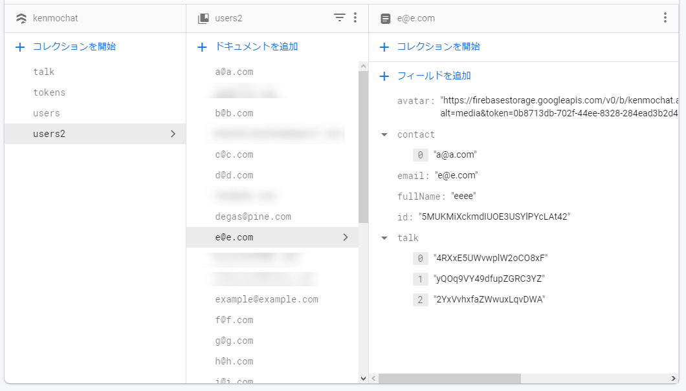
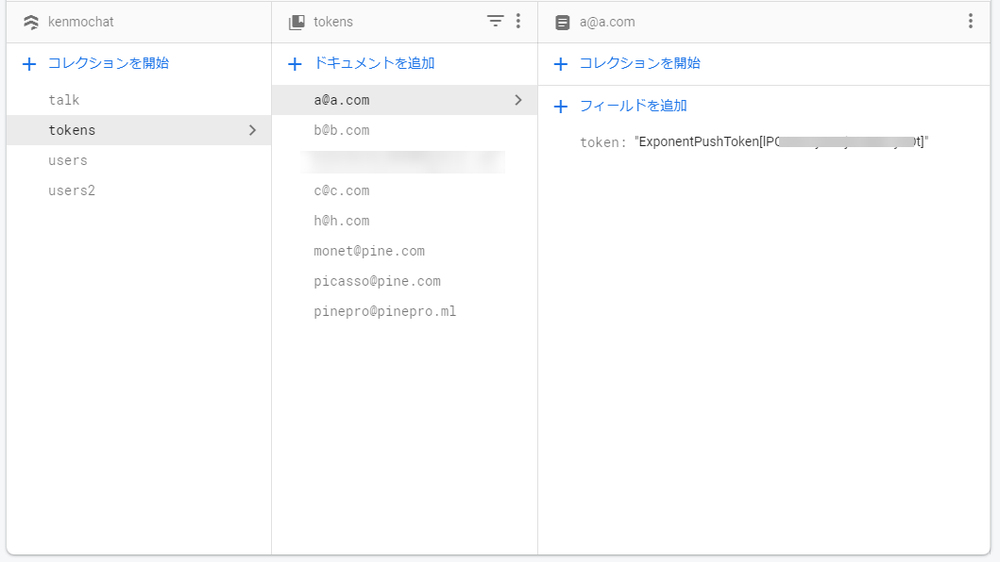
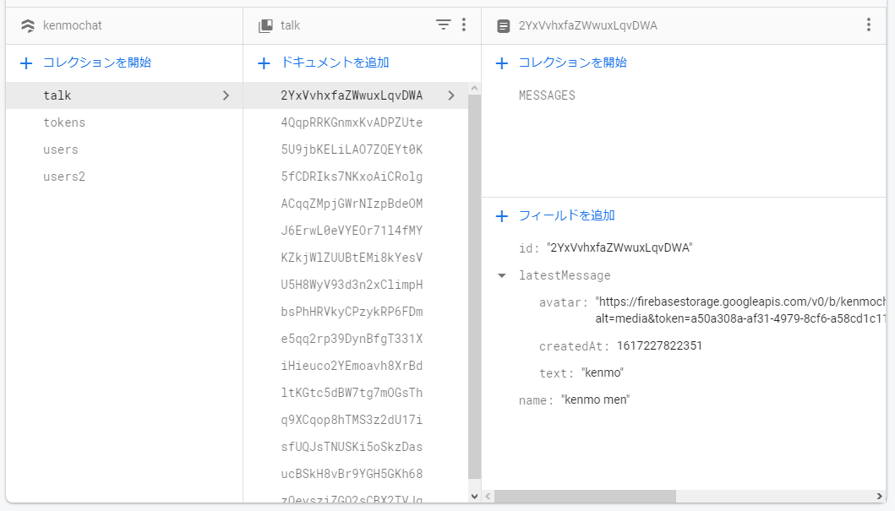
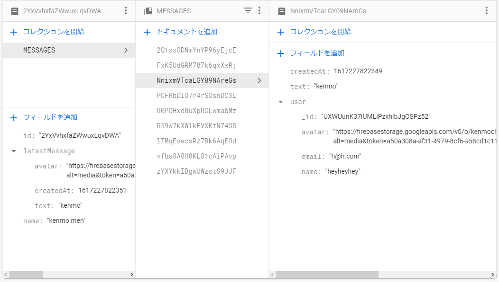
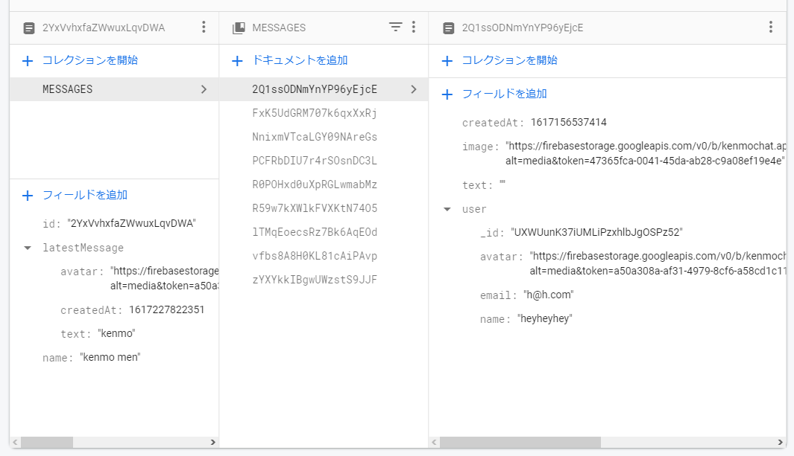
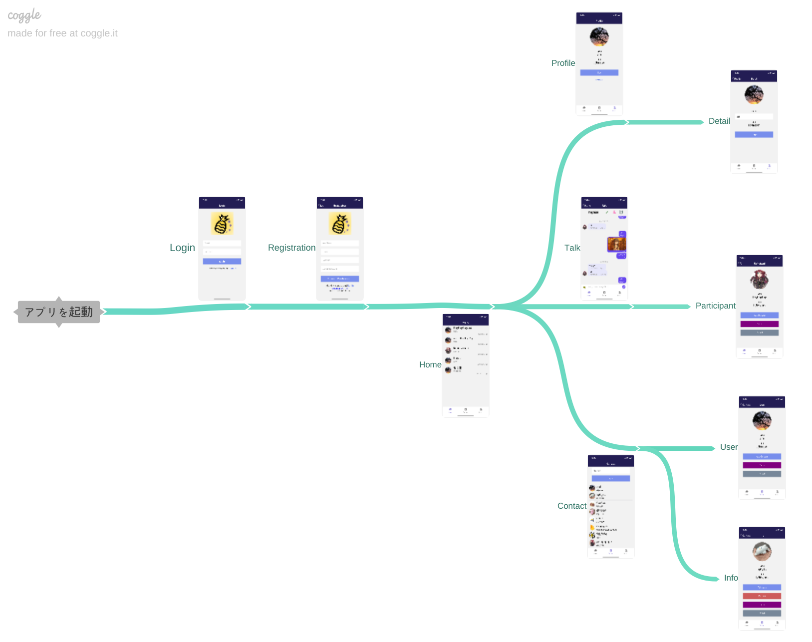

import { Link } from 'gatsby';

<Link to="/blog/2021-03-29">前回</Link>の続きです。

<br/><br/>

ひとまずPINEがAppStoreで公開されたのでコードを説明します。GooglePlayは現在審査中です。

## 使用技術

アプリの核となるライブラリやフレームワークです。バックエンドにはFirebaseを使いました。

[kenmo reader](https://kenmo-reader.ml)と[Grafhouse](https://grafhouse.ml/)ではクラスコンポーネントを使って書きましたが、新しい試みとして関数コンポーネントで書きました。

これは[React hooks](https://ja.reactjs.org/docs/hooks-intro.html)を使いたかったからです。特にkenmo readerにダークモードを実装しようとしたときにReact hooksを前提としたライブラリしかなくて実装を断念したからです。

まだダークモードを実装できていませんが、今の感想は「`this`を書かなくて済むのは良かった」です。

- #### React Native
  - [Expo](https://expo.io/)
    - [expo-server-sdk-node](https://www.npmjs.com/package/expo-server-sdk) - 通知機能
  - [react-native-gifted-chat](https://github.com/FaridSafi/react-native-gifted-chat) - チャット画面のUI
- #### Firebase
  - Authentication - ログインとサインアップ
  - Firestore - ユーザー情報やチャット内容のデータベース
  - Storage - アバターやチャット内の画像の保存
  - Cloud Functions - 通知機能

<br/><br/>

## Firestoreの構造

今は

- users - 名前やアバターなどユーザー情報
- users2 - userと同じ内容だがドキュメントのkeyはuidではなくメールアドレス
- tokens-  プッシュ通知用の各ユーザーのトークン
- talk - チャットの内容

4つのコレクションがあります。





各ユーザー情報です。アバター画像のURL(avatar)と名前(fullName)、連絡先に追加したユーザー一覧(contact)、参加しているチャットルームのID(talk)が格納されています。usersとusers2はドキュメントのkeyがuidかメールアドレスかが違うだけで内容は同一です。contactやtalkを追加/削除するときは両方のコレクションを更新します。



プッシュ通知用のトークンを保存します。ドキュメントのkeyはメールアドレスです。



チャット内容を格納するのがtalkコレクションです。ドキュメントのひとつひとつが各トークルームです。トーク一覧画面に最新の投稿を表示したいので`latestMessage`として最新の投稿をした`ユーザー(avatar)`と`時間(creadtedAt)`と`内容(text)`を保存しています。`name`はチャットルームのタイトルです。



`talk`のサブコレクションとして`MESSAGES`を持っています。これがチャット内容そのものです。ドキュメントのひとつひとつが各投稿です。`user`フィールドにその投稿をしたユーザーの情報が格納されています。




## 画面遷移

アプリの画面遷移です。図にするとこうなります。



- LoginNavigator
  - Login Screen
  - Registoration Screen
- TabNavigator
  - HomeNavigator
    - Home Screnn - トーク一覧
    - Talk Screen - チャット画面
    - Participant - ユーザー情報画面(チャット画面のアバターをタップしてそのユーザーの情報を表示)
  - ContactNavigator
    - Contact Screen - 連絡先一覧
    - User Sreen - メールアドレスを入力して該当するユーザーを表示
    - Info Screen - 連絡先に追加済みのユーザーの情報を表示
  - ProfileNavigator
    - Profile Screen - 自分の情報を表示
    - Detail Screen - 自分のプロフィールを編集(アバターと名前を変更)

ログイン後の画面を`TabNavigator`としてラップしており、`LoginNavigator`と同列に扱っています。

このことによってログイン状態のオンオフで、ログイン&サインアップスタックとその他のスタックを分けています。

## 実際のコード

ナビゲーション部分のコードです。コード全体はこんな感じです。

**src\routes\navigation\Navigation.js**

```javascript
import 'react-native-gesture-handler';
import React, { useEffect, useState } from 'react'
import { firebase } from '../../firebase/config'
import { colors } from 'theme'
import { NavigationContainer } from '@react-navigation/native'
import { createStackNavigator } from '@react-navigation/stack'
import { createBottomTabNavigator } from '@react-navigation/bottom-tabs'
import FontIcon from 'react-native-vector-icons/FontAwesome5'
import Login from '../../scenes/login'
import Registration from '../../scenes/registration'
import Home from '../../scenes/home'
import Profile from '../../scenes/profile'
import Detail from '../../scenes/details'
import Contact from '../../scenes/contact'
import User from '../../scenes/user'
import Info from '../../scenes/info'
import Talk from '../../scenes/talk'
import Participant from '../../scenes/participant'
import * as Notifications from 'expo-notifications'
import * as Permissions from "expo-permissions"
// import DrawerNavigator from './drawer'
import {decode, encode} from 'base-64'
if (!global.btoa) { global.btoa = encode }
if (!global.atob) { global.atob = decode }

const Stack = createStackNavigator()
const Tab = createBottomTabNavigator()

const navigationProps = {
  headerTintColor: 'white',
  headerStyle: { backgroundColor: colors.darkPurple },
  headerTitleStyle: { fontSize: 18 },
}

export default function App() {
  const [loading, setLoading] = useState(true)
  const [user, setUser] = useState(null)

  useEffect(() => {
    const usersRef = firebase.firestore().collection('users');
    firebase.auth().onAuthStateChanged(user => {
      if (user) {
        usersRef
          .doc(user.uid)
          .onSnapshot(function(document) {
            const userData = document.data()
            setLoading(false)
            setUser(userData)
          })
      } else {
        setLoading(false)
      }
    });
  }, []);

   (async () => {
    const { status: existingStatus } = await Permissions.getAsync(
      Permissions.NOTIFICATIONS
    );
    let finalStatus = existingStatus;
    if (existingStatus !== "granted") {
      const { status } = await Permissions.askAsync(Permissions.NOTIFICATIONS);
      finalStatus = status;
    }
    if (finalStatus !== "granted") {
      return;
    }
    const token = await Notifications.getExpoPushTokenAsync();
    await firebase.firestore().collection("tokens").doc(user.email).set({ token: token.data })
  })();

  if (loading) {
    return (
      <></>
    )
  }

  const HomeNavigator = () => {
    return (
      <Stack.Navigator headerMode="screen" screenOptions={navigationProps}>
        <Stack.Screen name="Home">
          {props => <Home {...props} extraData={user} />}
        </Stack.Screen>
        <Stack.Screen name="Talk">
          {props => <Talk {...props} extraData={user} />}
        </Stack.Screen>
        <Stack.Screen name="Participant">
          {props => <Participant {...props} extraData={user} />}
        </Stack.Screen>
      </Stack.Navigator>
    )
  }

  const ProfileNavigator = () => {
    return (
      <Stack.Navigator headerMode="screen" screenOptions={navigationProps}>
        <Stack.Screen name="Profile">
          {props => <Profile {...props} extraData={user} />}
        </Stack.Screen>
        <Stack.Screen name="Detail">
          {props => <Detail {...props} extraData={user} />}
        </Stack.Screen>
      </Stack.Navigator>
    )
  }

  const ContactNavigator = () => {
    return (
      <Stack.Navigator headerMode="screen" screenOptions={navigationProps}>
        <Stack.Screen name="Contact">
          {props => <Contact {...props} extraData={user} />}
        </Stack.Screen>
        <Stack.Screen name="User">
          {props => <User {...props} extraData={user} />}
        </Stack.Screen>
        <Stack.Screen name="Info">
          {props => <Info {...props} extraData={user} />}
        </Stack.Screen>
      </Stack.Navigator>
    )
  }

  const LoginNavigator = () => {
    return (
      <Stack.Navigator headerMode="screen" screenOptions={navigationProps}>
        <Stack.Screen name="Login" component={Login} />
        <Stack.Screen name="Registration" component={Registration} />
      </Stack.Navigator>
    )
  }

  const TabNavigator = () => (
    <Tab.Navigator
      screenOptions={({ route }) => ({
        tabBarIcon: ({ focused }) => {
          switch (route.name) {
            case 'Home':
              return (
                <FontIcon
                  name="home"
                  color={focused ? colors.lightPurple : colors.gray}
                  size={20}
                  solid
                />
              )
            case 'Contact':
              return (
                <FontIcon
                  name="address-book"
                  color={focused ? colors.lightPurple : colors.gray}
                  size={20}
                  solid
                />
              )
            case 'Profile':
            return (
              <FontIcon
                name="user"
                color={focused ? colors.lightPurple : colors.gray}
                size={20}
                solid
              />
            )
            default:
              return <View />
          }
        },
      })}
      tabBarOptions={{
        activeTintColor: colors.lightPurple,
        inactiveTintColor: colors.gray,
      }}
      initialRouteName="Home"
      swipeEnabled={false}
    >
      <Tab.Screen name="Home" component={HomeNavigator} />
      <Tab.Screen name="Contact" component={ContactNavigator} />
      <Tab.Screen name="Profile" component={ProfileNavigator} />
    </Tab.Navigator>
  )

  return(
    <NavigationContainer>
      { user ? (
        <TabNavigator/>
        ) : (
        <LoginNavigator/>
      )}
    </NavigationContainer>
  )
}
```

以下が`HomeNavigator` `ProfileNavigator` `ContactNavigator` `LoginNavigator`を定義、その後ログインスタック以外を`TabNavigator`としてラップしている部分です。

```javascript
const HomeNavigator = () => {
  return (
    <Stack.Navigator headerMode="screen" screenOptions={navigationProps}>
      <Stack.Screen name="Home">
        {props => <Home {...props} extraData={user} />}
      </Stack.Screen>
      <Stack.Screen name="Talk">
        {props => <Talk {...props} extraData={user} />}
      </Stack.Screen>
      <Stack.Screen name="Participant">
        {props => <Participant {...props} extraData={user} />}
      </Stack.Screen>
    </Stack.Navigator>
  )
}

const ProfileNavigator = () => {
  return (
    <Stack.Navigator headerMode="screen" screenOptions={navigationProps}>
      <Stack.Screen name="Profile">
        {props => <Profile {...props} extraData={user} />}
      </Stack.Screen>
      <Stack.Screen name="Detail">
        {props => <Detail {...props} extraData={user} />}
      </Stack.Screen>
    </Stack.Navigator>
  )
}

const ContactNavigator = () => {
  return (
    <Stack.Navigator headerMode="screen" screenOptions={navigationProps}>
      <Stack.Screen name="Contact">
        {props => <Contact {...props} extraData={user} />}
      </Stack.Screen>
      <Stack.Screen name="User">
        {props => <User {...props} extraData={user} />}
      </Stack.Screen>
      <Stack.Screen name="Info">
        {props => <Info {...props} extraData={user} />}
      </Stack.Screen>
    </Stack.Navigator>
  )
}

const LoginNavigator = () => {
  return (
    <Stack.Navigator headerMode="screen" screenOptions={navigationProps}>
      <Stack.Screen name="Login" component={Login} />
      <Stack.Screen name="Registration" component={Registration} />
    </Stack.Navigator>
  )
}

const TabNavigator = () => (
  <Tab.Navigator
    screenOptions={({ route }) => ({
      tabBarIcon: ({ focused }) => {
        switch (route.name) {
          case 'Home':
            return (
              <FontIcon
                name="home"
                color={focused ? colors.lightPurple : colors.gray}
                size={20}
                solid
              />
            )
          case 'Contact':
            return (
              <FontIcon
                name="address-book"
                color={focused ? colors.lightPurple : colors.gray}
                size={20}
                solid
              />
            )
          case 'Profile':
          return (
            <FontIcon
              name="user"
              color={focused ? colors.lightPurple : colors.gray}
              size={20}
              solid
            />
          )
          default:
            return <View />
        }
      },
    })}
    tabBarOptions={{
      activeTintColor: colors.lightPurple,
      inactiveTintColor: colors.gray,
    }}
    initialRouteName="Home"
    swipeEnabled={false}
  >
    <Tab.Screen name="Home" component={HomeNavigator} />
    <Tab.Screen name="Contact" component={ContactNavigator} />
    <Tab.Screen name="Profile" component={ProfileNavigator} />
  </Tab.Navigator>
)
```

`useEffect`を使ってFirebase Authenticationを使ってログイン状態を確認して、ログインしている場合`user`にそのユーザーの情報を格納します。ログインしてない場合`user`は**undefind**になります。`.get`ではなく`.onSnapshot`メソッドを使って取得することで、ユーザー情報をリアルタイムでリッスンしています。

```javascript
useEffect(() => {
  const usersRef = firebase.firestore().collection('users');
  firebase.auth().onAuthStateChanged(user => {
    if (user) {
      usersRef
        .doc(user.uid)
        .onSnapshot(function(document) {
          const userData = document.data()
          setLoading(false)
          setUser(userData)
        })
    } else {
      setLoading(false)
    }
  });
}, []);
```

最終的に`user`を三項演算子で評価して、ユーザー情報が入ってれば`TabNavigator`を、**undefind**なら`LoginNavigator`を表示するようにします。

```javascript
return(
  <NavigationContainer>
    { user ? (
      <TabNavigator/>
      ) : (
      <LoginNavigator/>
    )}
  </NavigationContainer>
)
```

プッシュ通知の許可を得ているか確認している部分です。プッシュ通知は**Expo Push Notifications**を利用しているので、通知用のトークンを取得してFirestoreに格納しています。

```javascript
(async () => {
  const { status: existingStatus } = await Permissions.getAsync(
    Permissions.NOTIFICATIONS
  );
  let finalStatus = existingStatus;
  if (existingStatus !== "granted") {
    const { status } = await Permissions.askAsync(Permissions.NOTIFICATIONS);
    finalStatus = status;
  }
  if (finalStatus !== "granted") {
    return;
  }
  const token = await Notifications.getExpoPushTokenAsync();
  await firebase.firestore().collection("tokens").doc(user.email).set({ token: token.data })
})();
```

ナビゲーションの実装は以上です。ここからは実際に各画面の中身を作っていきます。

ログインとサインアップ画面のコードは<Link to="/blog/2021-03-21">以前の投稿</Link>を参照してください。

---