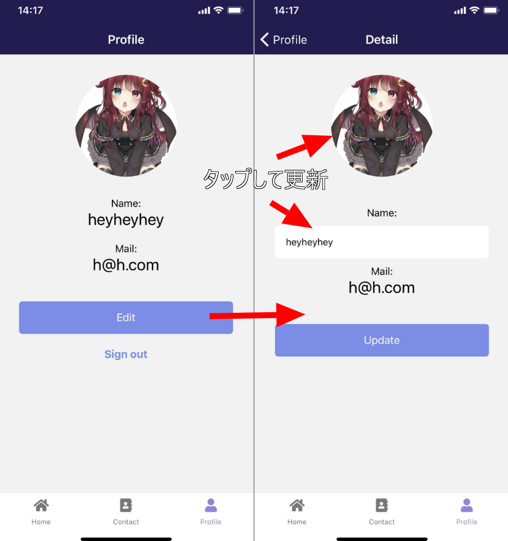

import { Link } from 'gatsby';

<Link to="/blog/2021-04-03">前回</Link>の続きです。

<br/><br/>

ここからは実際に各画面を作っていきます。

## 自分のプロフィール画面

ProfileとDetail画面を作ります。

`Edita`ボタンをタップしてEdit(編集画面)に遷移、アバター画像をタップしてフォトギャラリーから画像を選択してアップロード、Nameのテキストボックスで名前を編集、`Update`をタップして更新します。



### Profile

自分のユーザー情報を表示する画面です。


**src\scenes\profile\Profile.js**

```javascript
import React, { useEffect, useState } from 'react'
import { Text, View, TouchableOpacity, StatusBar, ScrollView } from 'react-native'
import styles from './styles'
import { firebase } from '../../firebase/config'
import { Restart } from 'fiction-expo-restart'
import { Avatar } from 'react-native-elements'

export default function Profile(props) {
  const userData = props.extraData

  const goDetail = () => {
    props.navigation.navigate('Detail', { userData: userData })
  }

  const signOut = () => {
    firebase.auth().signOut()
    Restart()
  }
  
  return (
    <View style={styles.container}>
      <StatusBar barStyle="light-content" />
      <ScrollView style={{ flex: 1, width: '100%' }}>
        <View>
          <View style={styles.avatar}>
            <Avatar
              size="xlarge"
              rounded
              title="NI"
              source={{ uri: userData.avatar }}
            />
          </View>
          <Text style={styles.field}>Name:</Text>
          <Text style={styles.title}>{userData.fullName}</Text>
          <Text style={styles.field}>Mail:</Text>
          <Text style={styles.title}>{userData.email}</Text>
          <TouchableOpacity style={styles.button} onPress={goDetail}>
            <Text style={styles.buttonText}>Edit</Text>
          </TouchableOpacity>
          <View style={styles.footerView}>
            <Text onPress={signOut} style={styles.footerLink}>Sign out</Text>
          </View>
        </View>
      </ScrollView>
    </View>
  )
}
```

**Navigation**コンポーネントからpropsで渡されてきた`extraData(自分の情報)`を`userData`に代入して`Avatar`や`Text`などを使って表示しています。

```javascript
const userData = props.extraData
```

サインアウト関数です。サインアウト時はアプリを再起動してログイン状態の判定をやりなおしてログインスタックに誘導します。

```javascript
const signOut = () => {
  firebase.auth().signOut()
  Restart()
}
```

Detail画面に移動する関数です。`userData`をpropsで次の画面に渡します。

```javascript
const goDetail = () => {
  props.navigation.navigate('Detail', { userData: userData })
}
```

### Detail

プロフィール編集画面です。自分の情報を表示しつつアバターと名前を編集して更新することができます。


```javascript
import React, { useEffect, useState } from 'react'
import { Text, View, StatusBar, TextInput, TouchableOpacity } from 'react-native'
import styles from './styles'
import { firebase } from '../../firebase/config'
import { Avatar } from 'react-native-elements'
import { KeyboardAwareScrollView } from 'react-native-keyboard-aware-scroll-view'
import * as ImagePicker from 'expo-image-picker'
import * as Permissions from 'expo-permissions'
import Constants from 'expo-constants'

export default function Detail({ route, navigation }) {
  const [fullName, setFullName] = useState('')
  const [progress, setProgress] = useState('')
  const [avatar, setAvatar] = useState('https://firebasestorage.googleapis.com/v0/b/kenmochat.appspot.com/o/avatar%2Ficon.png?alt=media&token=8af3fe41-ad46-45a3-ab5e-7594a98a7c84')
  const userData = route.params.userData

  useEffect(() => {
    setAvatar(userData.avatar)
    setFullName(userData.fullName)
  },[])

  const ImageChoiceAndUpload = async () => {
    try {
      if (Constants.platform.ios) {
        const { status } = await Permissions.askAsync(Permissions.CAMERA);
        if (status !== 'granted') {
          alert("Permission is required for use.");
          return;
        }
      }
      const result = await ImagePicker.launchImageLibraryAsync();
        if (!result.cancelled) {
          const localUri = await fetch(result.uri);
          const localBlob = await localUri.blob();
          const filename = userData.id + new Date().getTime()
          const storageRef = firebase.storage().ref().child("avatar/" + filename);
          const putTask = storageRef.put(localBlob);
          putTask.on('state_changed', (snapshot) => {
            let progress = (snapshot.bytesTransferred / snapshot.totalBytes) * 100;
            setProgress(parseInt(progress) + '%')
          }, (error) => {
            console.log(error);
            alert("Upload failed.");
          }, () => {
            putTask.snapshot.ref.getDownloadURL().then(downloadURL => {
              setProgress('')
              setAvatar(downloadURL)
            })
          })
        }
    } catch (e) {
        console.log('error',e.message);
        alert("The size may be too much.");
    }
  }

  const profileUpdate = () => {
    const data = {
      id: userData.id,
      email: userData.email,
      fullName: fullName,
      avatar: avatar,
    }
    const userRef2 = firebase.firestore().collection('users2').doc(userData.email)
    userRef2.update(data)
    const userRef = firebase.firestore().collection('users').doc(userData.id)
    userRef.update(data)
    navigation.goBack()
  }

  return (
    <View style={styles.container}>
      <KeyboardAwareScrollView
        style={{ flex: 1, width: '100%' }}
        keyboardShouldPersistTaps="always">
        <StatusBar barStyle="light-content" />
          <View style={styles.avatar}>
            <Avatar
              size="xlarge"
              rounded
              title="NI"
              onPress={ImageChoiceAndUpload}
              source={{ uri: avatar }}
            />
          </View>
          <Text style={{ alignSelf: 'center' }}>{progress}</Text>
          <Text style={styles.field}>Name:</Text>
          <TextInput
            style={styles.input}
            placeholder={fullName}
            placeholderTextColor="#aaaaaa"
            onChangeText={(text) => setFullName(text)}
            value={fullName}
            underlineColorAndroid="transparent"
            autoCapitalize="none"
          />
          <Text style={styles.field}>Mail:</Text>
          <Text style={styles.title}>{userData.email}</Text>
          <TouchableOpacity style={styles.button} onPress={profileUpdate}>
            <Text style={styles.buttonText}>Update</Text>
          </TouchableOpacity>
      </KeyboardAwareScrollView>
    </View>
  )
}
```

アバター画像をアップロードする関数です。イメージピッカーで選択された画像をFirebase Storageにアップロード、アップロードした画像のURLを取得してuseStateを使って`avatar`stateにセットします。アップロード時にプログレスを%表示しています。

アップロードした画像はFirebase Storageの**avatar**ディレクトリにアップロードします。


```javascript
const ImageChoiceAndUpload = async () => {
  // iPhoneの場合はフォトライブラリのパーミッションを得ているか確認
  try {
    if (Constants.platform.ios) {
      const { status } = await Permissions.askAsync(Permissions.CAMERA);
      if (status !== 'granted') {
        alert("Permission is required for use.");
        return;
      }
    }
    const result = await ImagePicker.launchImageLibraryAsync();
      if (!result.cancelled) {
        // フォトライブラリから画像を取得してblobに変換
        const localUri = await fetch(result.uri);
        const localBlob = await localUri.blob();
        // 適当にファイル名をつける。ここではuid + アップロードしたときの時刻
        const filename = userData.id + new Date().getTime()
        // Firebase Storageのパスを指定してアップロード
        const storageRef = firebase.storage().ref().child("avatar/" + filename);
        const putTask = storageRef.put(localBlob);
        putTask.on('state_changed', (snapshot) => {
          let progress = (snapshot.bytesTransferred / snapshot.totalBytes) * 100;
          setProgress(parseInt(progress) + '%')
        }, (error) => {
          console.log(error);
          alert("Upload failed.");
        }, () => {
          putTask.snapshot.ref.getDownloadURL().then(downloadURL => {
            setProgress('')
            // アップロードが完了したらURLをstateにセット
            setAvatar(downloadURL)
          })
        })
      }
  } catch (e) {
      console.log('error',e.message);
      alert("The size may be too much.");
  }
}
```

state`avatar`に画像のURLが入ってるので[React Native Elements](https://reactnativeelements.com/)の**Avatar**コンポーネントのソースとして渡します。

Avatarの`onPress`イベントとして`ImageChoiceAndUpload`を発動させることでアバター画像をタップすると画像を選択できるようにします。

```javascript
<Avatar
  size="xlarge"
  rounded
  title="NI"
  onPress={ImageChoiceAndUpload}
  source={{ uri: avatar }}
/>
```

名前の変更は基本の通りにstate`setFullName`を変化させます。

```javascript
<TextInput
  style={styles.input}
  placeholder={fullName}
  placeholderTextColor="#aaaaaa"
  onChangeText={(text) => setFullName(text)}
  value={fullName}
  underlineColorAndroid="transparent"
  autoCapitalize="none"
/>
```

Firestoreに格納されている自分のユーザー情報を更新する関数を定義します。

前回書いた通りユーザー情報は`users`と`users2`の二つのコレクションに同じ内容を保存しているので両方`.update`します。

更新後に[React Navigation](https://reactnavigation.org/docs/navigation-prop/)の`goBack`を使って前の画面に遷移します。

```javascript
const profileUpdate = () => {
  const data = {
    id: userData.id,
    email: userData.email,
    fullName: fullName,
    avatar: avatar,
  }
  const userRef2 = firebase.firestore().collection('users2').doc(userData.email)
  userRef2.update(data)
  const userRef = firebase.firestore().collection('users').doc(userData.id)
  userRef.update(data)
  navigation.goBack()
}
```

### まとめ

これで自分のプロフィールを表示/編集できるようになりました。

---