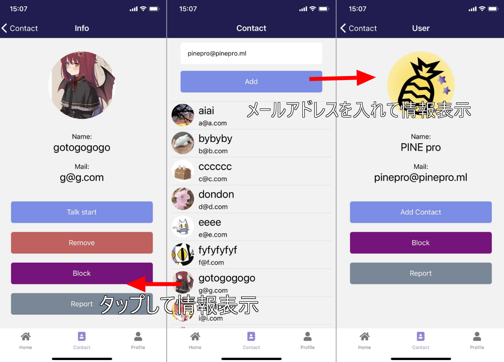
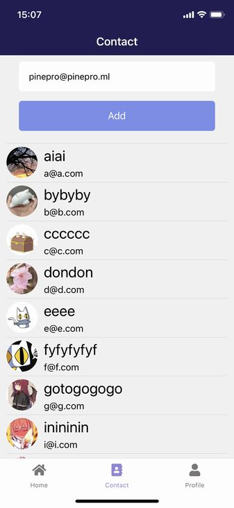
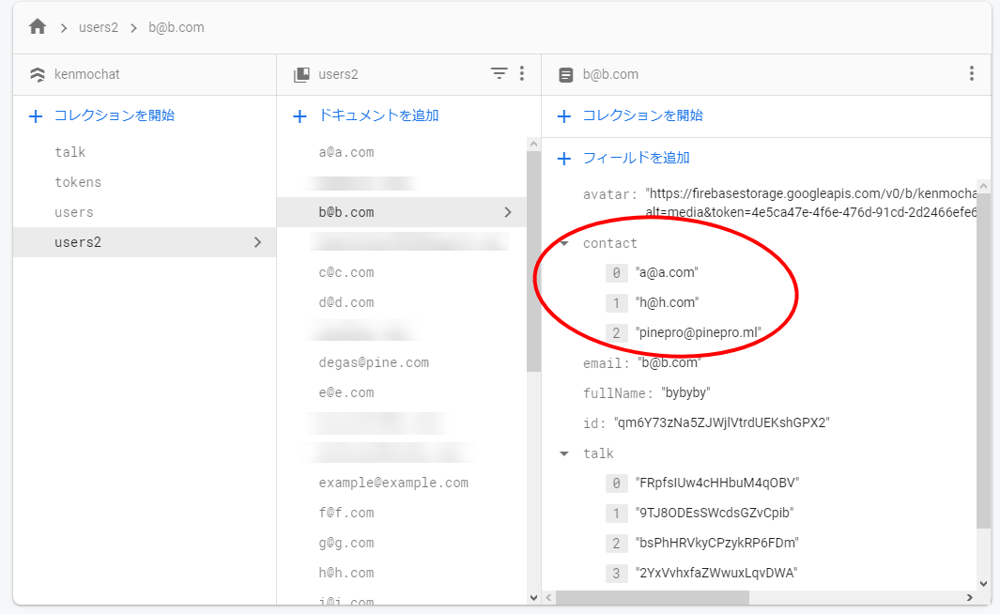
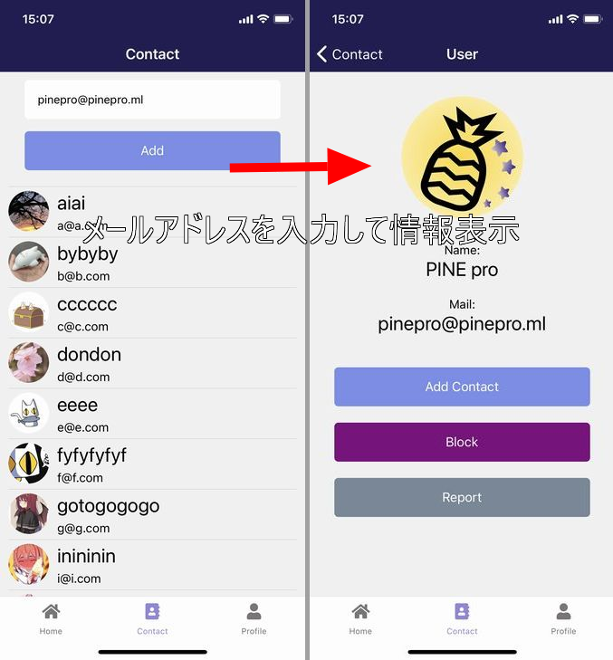
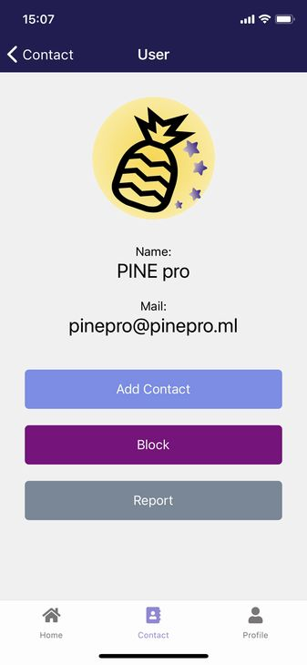
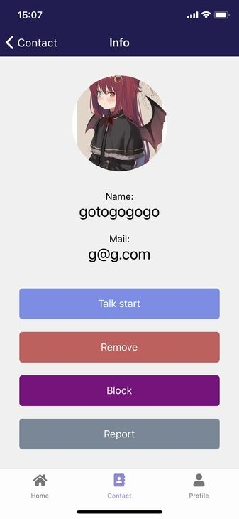
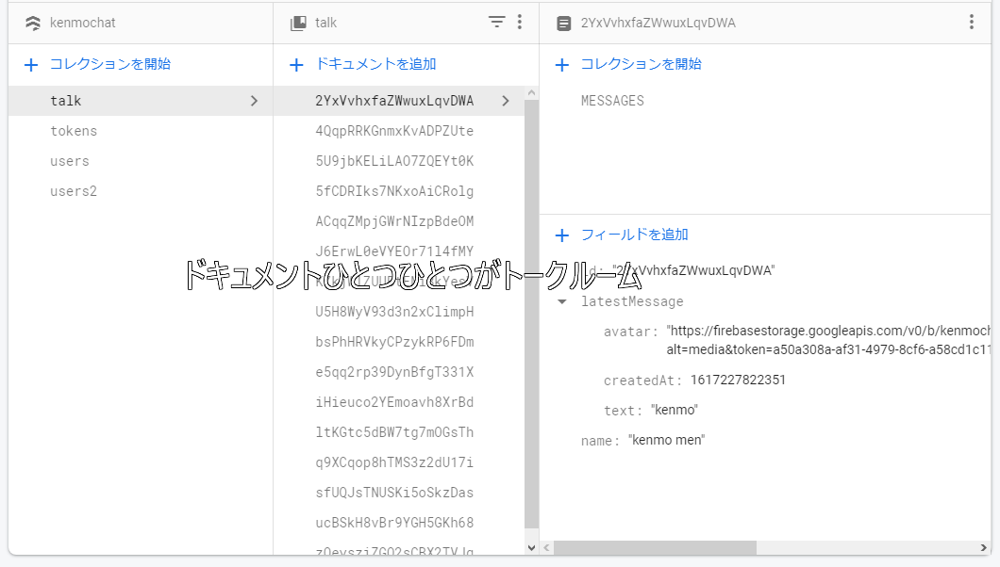
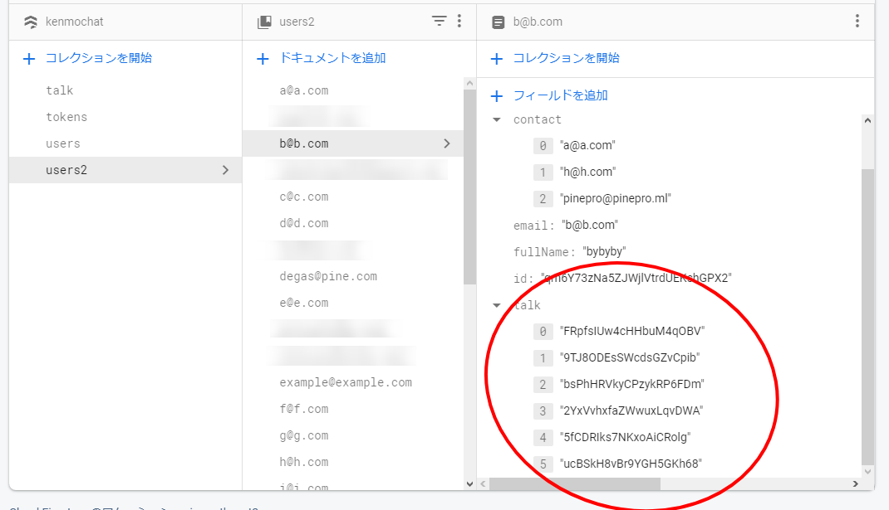
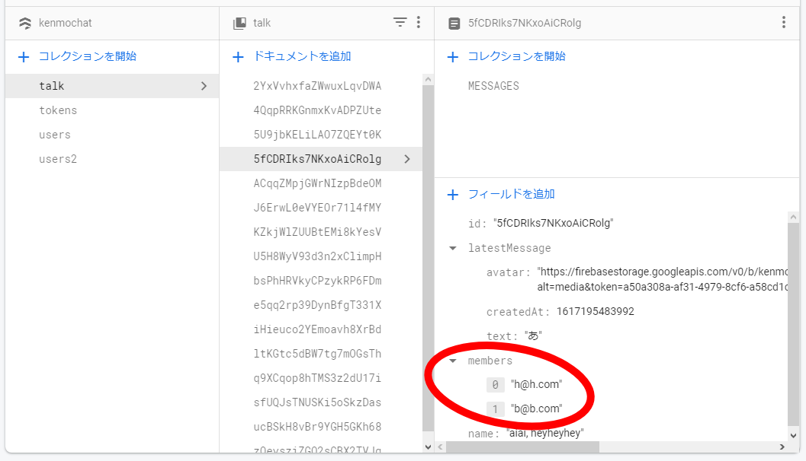

import { Link } from 'gatsby';

<Link to="/blog/2021-04-04">前回</Link>の続きです。

<br/><br/>

## 連絡先一覧

次は連絡先一覧画面を作ります。

**Contact**画面には連絡先に追加したユーザー一覧を表示します。テキストボックスに他のユーザーのメールアドレスを入力してそのユーザーの情報を表示します。



### Contact

#### ユーザー一覧の表示

連絡先に追加したユーザーを一覧表示します。



自分の連絡先一覧はFirestoreの`contact`フィールドに一次元の配列として保存されています。単に追加したユーザーのメールアドレスが一覧で並んでいるだけです。

この配列を利用して**users2**コレクションから各ユーザーの情報を拾ってきます。



**src\scenes\contact\Contact.js**

```javascript
import React, { useEffect, useState, useRef } from 'react'
import { Text, View, TextInput, TouchableOpacity, ScrollView, StatusBar } from 'react-native'
import styles from './styles'
import { firebase } from '../../firebase/config'
import { Divider } from 'react-native-elements'
import { Avatar } from 'react-native-elements'

export default function Contact(props) {
  const [email, setEmail] = useState('')
  const [theArray, setTheArray] = useState([])
  const userData = props.extraData
  const contactArray = Object.values(userData.contact?userData.contact:['example@example.com'])

  useEffect(() => {
    for (const elem of contactArray) {
      const userRef2 = firebase.firestore().collection('users2').doc(elem)
      userRef2.get().then((doc) => {
        if (doc.exists) {
          const data = doc.data()
          setTheArray(oldArray => [...oldArray, data])
        } else {
          null
        }
      })
    }
  },[])

  const addUser = () => {
    const usersRef2 = firebase.firestore().collection('users2').doc(email)
    usersRef2.get().then((doc) => {
      if (doc.exists) {
        const userProfile = doc.data()
        props.navigation.navigate('User', { user: userProfile, myProfile: userData })
      } else {
        alert("The user does not exist")
      }
    }).catch((error) => {
        console.log("Error getting document:", error);
    });
  }

  theArray.sort(function(a, b) {
    if (a.email < b.email) {
      return -1;
    } else {
      return 1;
    }
  })

  return (
    <View style={styles.container}>
      <StatusBar barStyle="light-content" />
      <View style={{ flex: 1, width: '100%' }}>
        <ScrollView>
        <TextInput
          style={styles.input}
          placeholder='Add user by email'
          placeholderTextColor="#aaaaaa"
          onChangeText={(text) => setEmail(text)}
          value={email}
          underlineColorAndroid="transparent"
          autoCapitalize="none"
        />
        {email?(
          <TouchableOpacity style={styles.button} onPress={addUser}>
            <Text style={styles.buttonText}>Add</Text>
          </TouchableOpacity>)
        :
        (<View style={styles.nonbutton}>
          <Text style={styles.buttonText}>Add</Text>
        </View>)}
        <Divider style={styles.item} />
        {
          theArray.map((user, i) => {
            return (
              <View key={i} style={styles.item}>
                <TouchableOpacity onPress={() => props.navigation.navigate('Info', { userInfo: user, myProfile: userData })}>
                  <View style={{flexDirection: 'row'}}>
                    <View style={styles.avatar}>
                      <Avatar
                        size="medium"
                        rounded
                        title="NI"
                        source={{ uri: user.avatar }}
                      />
                    </View>
                    <View>
                      <Text style={styles.title}>{user.fullName}</Text>
                      <Text style={styles.field}>{user.email}</Text>
                    </View>
                  </View>
                </TouchableOpacity>
                <Divider />
              </View>
            )
          })
        }
        </ScrollView>
      </View>
    </View>
  )
}
```

`userData.contact`に追加したユーザーのメールアドレスが格納されているので`Object.values`を使って配列として取り出します。誰も登録してないユーザーもいるので、三項演算子で評価して空の場合はsampleユーザーを表示するようにします。

取り出した配列を`for`文で回して表示用のstate(theArray)に格納していきます。

わざわざメールアドレスをkeyにしてFirestoreから情報を`get`するようにしてるのは、他のユーザーがアバターや名前を変えたときに対応するためです。

```javascript
const contactArray = Object.values(userData.contact?userData.contact:['example@example.com'])

useEffect(() => {
  for (const elem of contactArray) {
    const userRef2 = firebase.firestore().collection('users2').doc(elem)
    userRef2.get().then((doc) => {
      if (doc.exists) {
        const data = doc.data()
        setTheArray(oldArray => [...oldArray, data])
      } else {
        null
      }
    })
  }
},[])
```

ユーザー情報が入ってる配列`theArray`をemail順でソートします。

```javascript
theArray.sort(function(a, b) {
  if (a.email < b.email) {
    return -1;
  } else {
    return 1;
  }
})
```

ユーザー情報が入ってる配列を`.map`で回して**Avatar**や**Text**などの各コンポーネントに渡して画面に表示します。

```javascript
{
  theArray.map((user, i) => {
    return (
      <View key={i} style={styles.item}>
        <TouchableOpacity onPress={() => props.navigation.navigate('Info', { userInfo: user, myProfile: userData })}>
          <View style={{flexDirection: 'row'}}>
            <View style={styles.avatar}>
              <Avatar
                size="medium"
                rounded
                title="NI"
                source={{ uri: user.avatar }}
              />
            </View>
            <View>
              <Text style={styles.title}>{user.fullName}</Text>
              <Text style={styles.field}>{user.email}</Text>
            </View>
          </View>
        </TouchableOpacity>
        <Divider />
      </View>
    )
  })
}
```

#### メールアドレスを入力してそのユーザーを表示

自分の連絡先一覧にユーザーを追加できるようにします。入力されたメールアドレスから`users2`コレクションにそのドキュメントが存在するか確認して次の画面(User)に遷移します。



関数を定義するとこんな感じになります。

存在すればそのユーザーの情報と自分の情報を持って次の画面に遷移します。存在しなければアラートを出します。

```javascript
const addUser = () => {
  const usersRef2 = firebase.firestore().collection('users2').doc(email)
  usersRef2.get().then((doc) => {
    if (doc.exists) {
      const userProfile = doc.data()
      props.navigation.navigate('User', { user: userProfile, myProfile: userData })
    } else {
      alert("The user does not exist")
    }
  }).catch((error) => {
      console.log("Error getting document:", error);
  });
}
```

### User

ユーザーを自分の連絡先に追加する画面です。



`Add Contact`をタップすることで自分の連絡先に追加します。

**src\scenes\user\User.js**

```javascript
import React, { useEffect, useState } from 'react'
import { Text, View, StatusBar, TouchableOpacity, ScrollView } from 'react-native'
import styles from './styles'
import { firebase } from '../../firebase/config'
import { Avatar } from 'react-native-elements'

export default function User({ route, navigation }) {
  const userData = route.params.user
  const myProfile = route.params.myProfile

  const addContact = () => {
    const userRef2 = firebase.firestore().collection('users2').doc(myProfile.email)
    const userRef = firebase.firestore().collection('users').doc(myProfile.id)
    userRef2.update({
      contact: firebase.firestore.FieldValue.arrayUnion(userData.email)
    })
    userRef.update({
      contact: firebase.firestore.FieldValue.arrayUnion(userData.email)
    })
    navigation.goBack()
  }

  const block = () => {
    alert('Added to the block list.')
  }

  const report = () => {
    alert('Report has been sent.')
  }

  return (
    <View style={styles.container}>
      <StatusBar barStyle="light-content" />
      <ScrollView style={styles.main}>
        <View>
          <View style={styles.avatar}>
            <Avatar
              size="xlarge"
              rounded
              title="NI"
              source={{ uri: userData.avatar }}
            />
          </View>
          <Text style={styles.field}>Name:</Text>
          <Text style={styles.title}>{userData.fullName}</Text>
          <Text style={styles.field}>Mail:</Text>
          <Text style={styles.title}>{userData.email}</Text>
          <TouchableOpacity style={styles.button} onPress={addContact}>
            <Text style={styles.buttonText}>Add Contact</Text>
          </TouchableOpacity>
          <TouchableOpacity style={styles.block} onPress={block}>
            <Text style={styles.buttonText}>Block</Text>
          </TouchableOpacity>
          <TouchableOpacity style={styles.report} onPress={report}>
            <Text style={styles.buttonText}>Report</Text>
          </TouchableOpacity>
        </View>
      </ScrollView>
    </View>
  )
}
```

連絡先に追加する関数です。連絡先リストにはは上述した通り一次元の配列としてメールアドレスを格納しているので`.arrayUnion`メソッドを使って配列に追加します。

```javascript
const addContact = () => {
  const userRef2 = firebase.firestore().collection('users2').doc(myProfile.email)
  const userRef = firebase.firestore().collection('users').doc(myProfile.id)
  userRef2.update({
    contact: firebase.firestore.FieldValue.arrayUnion(userData.email)
  })
  userRef.update({
    contact: firebase.firestore.FieldValue.arrayUnion(userData.email)
  })
  navigation.goBack()
}
```

### Info

追加済みのユーザーの情報を表示する画面です。

`Talk start`をタップしてそのユーザーとのチャットルームを作ります。`Remove`をタップすると連絡先一覧から削除します。



**src\scenes\info\Info.js**

```javascript
import React, { useEffect, useState } from 'react'
import { Text, View, StatusBar, TouchableOpacity, ScrollView } from 'react-native'
import styles from './styles'
import { firebase } from '../../firebase/config'
import { Avatar } from 'react-native-elements'

export default function Info({ route, navigation }) {
  const userInfo = route.params.userInfo
  const myProfile = route.params.myProfile

  const removeContact = () => {
    const userRef2 = firebase.firestore().collection('users2').doc(myProfile.email)
    const userRef = firebase.firestore().collection('users').doc(myProfile.id)
    userRef2.update({
      contact: firebase.firestore.FieldValue.arrayRemove(userInfo.email)
    })
    userRef.update({
      contact: firebase.firestore.FieldValue.arrayRemove(userInfo.email)
    })
    navigation.goBack()
  }

  const talkStart = () => {
    const talkRef = firebase.firestore().collection('talk').doc()
    talkRef.set({ 
      id: talkRef.id,
      name:userInfo.fullName + ', ' + myProfile.fullName,
      members: [myProfile.email, userInfo.email],
      latestMessage: {
        text: 'Talk start',
        createdAt: new Date().getTime()
      }
     })
    .then(() => {
      talkRef.get().then(doc => {
        console.log(doc.data())
      })
    })
    const userRef1 = firebase.firestore().collection('users2').doc(myProfile.email)
    const userRef2 = firebase.firestore().collection('users2').doc(userInfo.email)
    const userRef3 = firebase.firestore().collection('users').doc(myProfile.id)
    const userRef4 = firebase.firestore().collection('users').doc(userInfo.id)
    userRef1.update({
      talk: firebase.firestore.FieldValue.arrayUnion(talkRef.id)
    })
    userRef2.update({
      talk: firebase.firestore.FieldValue.arrayUnion(talkRef.id)
    })
    userRef3.update({
      talk: firebase.firestore.FieldValue.arrayUnion(talkRef.id)
    })
    userRef4.update({
      talk: firebase.firestore.FieldValue.arrayUnion(talkRef.id)
    })
    navigation.navigate('Home', { talkID: talkRef.id, myProfile: myProfile, newTalk: talkRef.id, userInfo: userInfo })
  }

  const block = () => {
    alert('Added to the block list.')
  }

  const report = () => {
    alert('Report has been sent.')
  }

  return (
    <View style={styles.container}>
      <StatusBar barStyle="light-content" />
      <ScrollView style={styles.main}>
        <View>
          <View style={styles.avatar}>
            <Avatar
              size="xlarge"
              rounded
              title="NI"
              source={{ uri: userInfo.avatar }}
            />
          </View>
          <Text style={styles.field}>Name:</Text>
          <Text style={styles.title}>{userInfo.fullName}</Text>
          <Text style={styles.field}>Mail:</Text>
          <Text style={styles.title}>{userInfo.email}</Text>
          <TouchableOpacity style={styles.button} onPress={talkStart}>
            <Text style={styles.buttonText}>Talk start</Text>
          </TouchableOpacity>
          <TouchableOpacity style={styles.remove} onPress={removeContact}>
            <Text style={styles.buttonText}>Remove</Text>
          </TouchableOpacity>
          <TouchableOpacity style={styles.block} onPress={block}>
            <Text style={styles.buttonText}>Block</Text>
          </TouchableOpacity>
          <TouchableOpacity style={styles.report} onPress={report}>
            <Text style={styles.buttonText}>Report</Text>
          </TouchableOpacity>
        </View>
      </ScrollView>
    </View>
  )
}
```

ユーザーを連絡先から削除する関数です。上述の通り、連絡先はメールアドレスを列挙した一次元の配列になっているので`.arrayRemove`を使って配列から削除します。

```javascript
const removeContact = () => {
  const userRef2 = firebase.firestore().collection('users2').doc(myProfile.email)
  const userRef = firebase.firestore().collection('users').doc(myProfile.id)
  userRef2.update({
    contact: firebase.firestore.FieldValue.arrayRemove(userInfo.email)
  })
  userRef.update({
    contact: firebase.firestore.FieldValue.arrayRemove(userInfo.email)
  })
  navigation.goBack()
}
```

`Talk start`関数を作ります。

Firestoreの構造はこうなっています。

`talk`コレクションのドキュメントひとつひとつがトークルームです。



自分が参加しているトークルームは自分の`talk`フィールドに各トークルームのidを一次元の配列として持っています。



つまり、トークルームを作って、発行されたトークルームのIDを自分と相手の`talk`フィールドに追加することになります。自分だけじゃなくて相手の`talk`フィールドにも追加してあげることで、相手にトークルームが作られたことを伝えられます。

関数にするとこうなります。

```javascript
const talkStart = () => {
  // トークルームを作成してIDを発行
  const talkRef = firebase.firestore().collection('talk').doc()
  talkRef.set({ 
    id: talkRef.id,
    // デフォルトのトークルームタイトルは自分の名前+相手の名前
    name:userInfo.fullName + ', ' + myProfile.fullName,
    // トークルーム参加者として自分と相手を設定
    members: [myProfile.email, userInfo.email],
    // デフォルトのlatestMessageを設定
    latestMessage: {
      text: 'Talk start',
      createdAt: new Date().getTime()
    }
    })
  .then(() => {
    talkRef.get().then(doc => {
      console.log(doc.data())
    })
  })
  // 自分と相手のtalk一覧に追加
  const userRef1 = firebase.firestore().collection('users2').doc(myProfile.email)
  const userRef2 = firebase.firestore().collection('users2').doc(userInfo.email)
  const userRef3 = firebase.firestore().collection('users').doc(myProfile.id)
  const userRef4 = firebase.firestore().collection('users').doc(userInfo.id)
  userRef1.update({
    talk: firebase.firestore.FieldValue.arrayUnion(talkRef.id)
  })
  userRef2.update({
    talk: firebase.firestore.FieldValue.arrayUnion(talkRef.id)
  })
  userRef3.update({
    talk: firebase.firestore.FieldValue.arrayUnion(talkRef.id)
  })
  userRef4.update({
    talk: firebase.firestore.FieldValue.arrayUnion(talkRef.id)
  })
  navigation.navigate('Home', { talkID: talkRef.id, myProfile: myProfile, newTalk: talkRef.id, userInfo: userInfo })
}
```

`members`の部分はプッシュ通知を実装するときに後から追加しました。これは、そのトークルームに参加しているユーザーの一覧です。これをプッシュ通知の送信先に使用します。



```javascript
members: [myProfile.email, userInfo.email],
```

### まとめ

これで連絡先の基本機能ができました。あとはアプリの本体であるチャット画面を作っていきます。

---