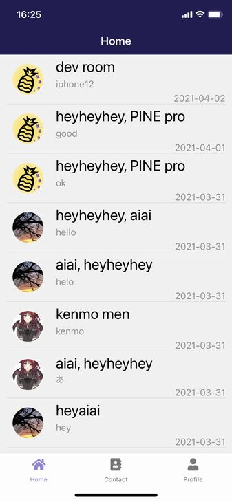
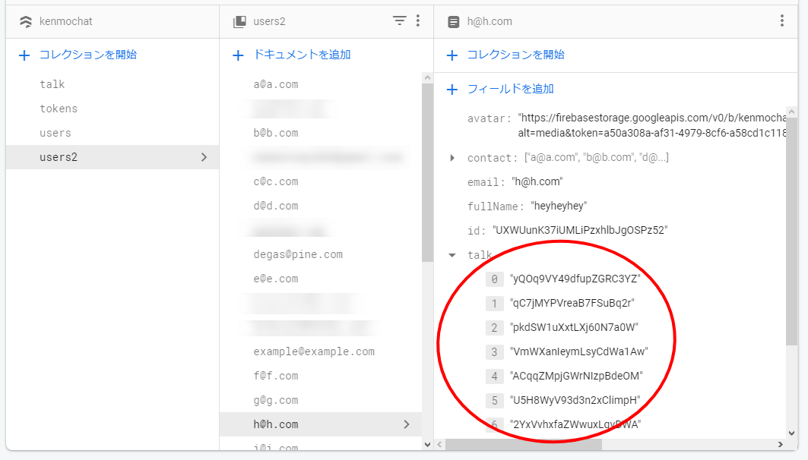
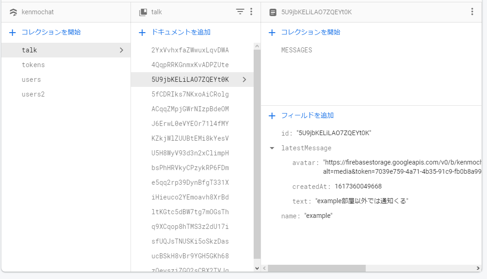

import { Link } from 'gatsby';

<Link to="/blog/2021-04-05">前回</Link>の続きです。

<br/><br/>

## トークルーム一覧画面

自分が参加しているトークルームの一覧画面を作っていきます。



### Home

ユーザーは参加しているトークルームのIDを一次元の配列として持っています。



この配列を利用して`talk`コレクションから情報をロードします。



各トークルームの最新のメッセージと日付を、日付の新しい順で表示します。もちろんメッセンジャーなのでリアルタイムで情報が更新されるようにする必要があります。

**src\scenes\home\Home.js**

```javascript
import React, { useEffect, useState } from 'react'
import { Text, View, TouchableOpacity, ScrollView, StatusBar } from 'react-native'
import styles from './styles'
import { firebase } from '../../firebase/config'
import { Divider, Avatar } from 'react-native-elements'

export default function Home(props) {
  const [theArray, setTheArray] = useState([])
  const userData = props.extraData
  const talkArray = Object.values(userData.talk?userData.talk:['5U9jbKELiLAO7ZQEYt0K'])

  useEffect(() => {
    setTheArray([])
    for (const elem of talkArray) {
      const userRef2 = firebase.firestore().collection('talk').doc(elem)
      userRef2.get().then((doc) => {
        if (doc.exists) {
          userRef2
          .onSnapshot(function(document) {
            const data = document.data()
            setTheArray(oldArray => [...oldArray, data])
          })
        } else {
          null
        }
      })
    }
  },[])

  theArray.sort(function(a, b) {
    if (a.latestMessage.createdAt > b.latestMessage.createdAt) {
      return -1;
    } else {
      return 1;
    }
  })

  var talks = theArray.filter(function(v1,i1,a1){ 
    return (a1.findIndex(function(v2){ 
      return (v1.id===v2.id) 
    }) === i1);
  });

  function displaytime(timestamp) {
     const time = new Date(timestamp).toISOString().substr(0, 10)
     return time
  }

  return (
    <View style={styles.container}>
      <StatusBar barStyle="light-content" />
      <View style={{ flex: 1, width: '100%' }}>
        <ScrollView>
          {
            talks.map((talk, i) => {
              return (
                <View key={i} style={styles.item}>
                  <TouchableOpacity onPress={() => props.navigation.navigate('Talk', { talkData: talk, myProfile: userData })}>
                    <View style={{flexDirection: 'row'}}>
                      <View style={styles.avatar}>
                        <Avatar
                          size="medium"
                          rounded
                          title="NI"
                          source={{ uri: talk.latestMessage.avatar }}
                        />
                      </View>
                      <View style={{ flex: 1, width: '100%' }}>
                        <Text style={styles.title}>{talk.name}</Text>
                        <Text style={styles.latestMessage}>{talk.latestMessage.text}</Text>
                        <Text style={styles.latestDate}>{displaytime(talk.latestMessage.createdAt)}</Text>
                      </View>
                    </View>
                  </TouchableOpacity>
                  <Divider />
                </View>
              )
            })
          }
        </ScrollView>
      </View>
    </View>
  )
}
```

連絡先一覧と同じ要領でtalkルームのID一覧を配列として`talkArray`に格納します。三項演算子で評価して、参加ルームがない場合にはsampleルームのIDを入れるようにします。

取り出した配列を`for`文で回して各ルームの情報を`.onSnapshot`で取得します。これでリアルタイムの情報が取得できます。

`useState`フックを使って各ルームの情報をstate`theArray`に格納していきます。

```javascript
const talkArray = Object.values(userData.talk?userData.talk:['5U9jbKELiLAO7ZQEYt0K'])

useEffect(() => {
  setTheArray([])
  for (const elem of talkArray) {
    const userRef2 = firebase.firestore().collection('talk').doc(elem)
    userRef2.get().then((doc) => {
      if (doc.exists) {
        userRef2
        .onSnapshot(function(document) {
          const data = document.data()
          setTheArray(oldArray => [...oldArray, data])
        })
      } else {
        null
      }
    })
  }
},[])
```

格納されたトークルームを`latestMessage`の時間順に並べ替えます。

```javascript
theArray.sort(function(a, b) {
  if (a.latestMessage.createdAt > b.latestMessage.createdAt) {
    return -1;
  } else {
    return 1;
  }
})
```

これだけだと、更新があったときに同じトークルームの情報が重複してしまうため、重複するIDを探して取り除く処理を入れてあげる必要があります。実はここが今回のアプリで一番苦労したところでした。

```javascript
var talks = theArray.filter(function(v1,i1,a1){ 
  return (a1.findIndex(function(v2){ 
    return (v1.id===v2.id) 
  }) === i1);
});
```

画面に表示するときには日付も出したいのですが、そのままだと13桁のUNIX時間なため日付に置き換える関数を用意しておきます。

```javascript
function displaytime(timestamp) {
  const time = new Date(timestamp).toISOString().substr(0, 10)
  return time
}
```

重複するトークIDを取り除いたあとのデータ`talks`を`.map`で回して**Avatar**や**Text**などの各コンポーネントに渡して表示します。

```javascript
{
  talks.map((talk, i) => {
    return (
      <View key={i} style={styles.item}>
        <TouchableOpacity onPress={() => props.navigation.navigate('Talk', { talkData: talk, myProfile: userData })}>
          <View style={{flexDirection: 'row'}}>
            <View style={styles.avatar}>
              <Avatar
                size="medium"
                rounded
                title="NI"
                source={{ uri: talk.latestMessage.avatar }}
              />
            </View>
            <View style={{ flex: 1, width: '100%' }}>
              <Text style={styles.title}>{talk.name}</Text>
              <Text style={styles.latestMessage}>{talk.latestMessage.text}</Text>
              <Text style={styles.latestDate}>{displaytime(talk.latestMessage.createdAt)}</Text>
            </View>
          </View>
        </TouchableOpacity>
        <Divider />
      </View>
    )
  })
}
```

### まとめ

トークルーム一覧画面は以上です。次はチャット画面を作っていきます。

---