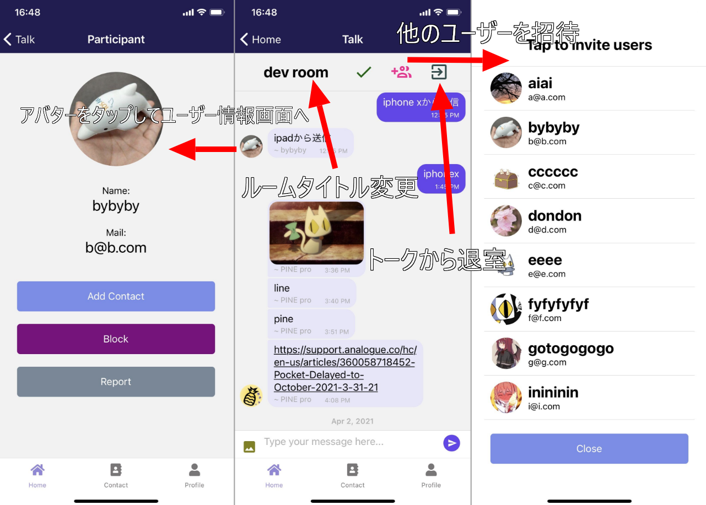
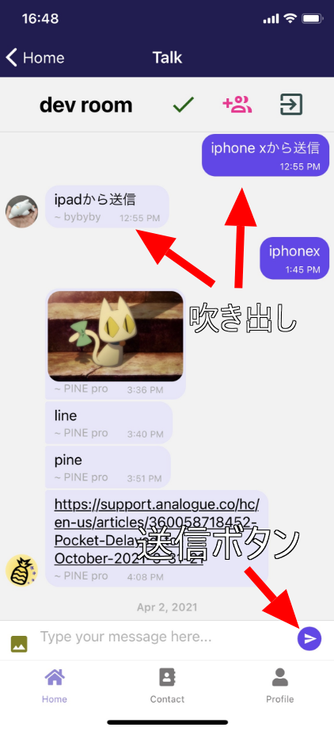
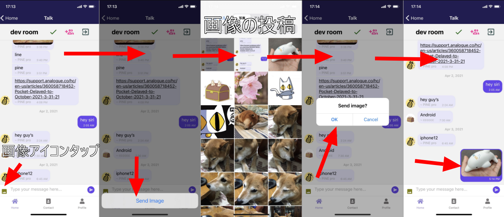
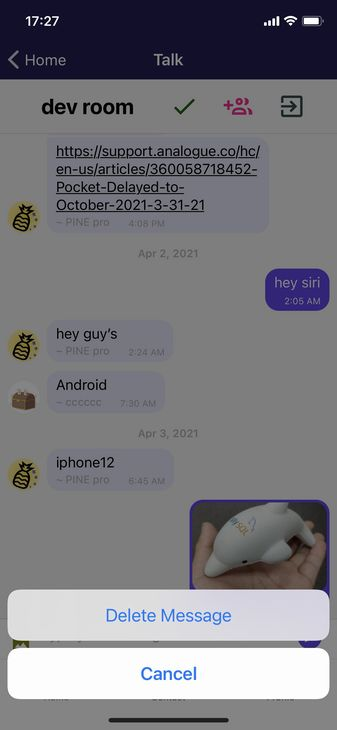
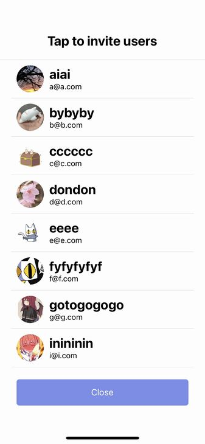
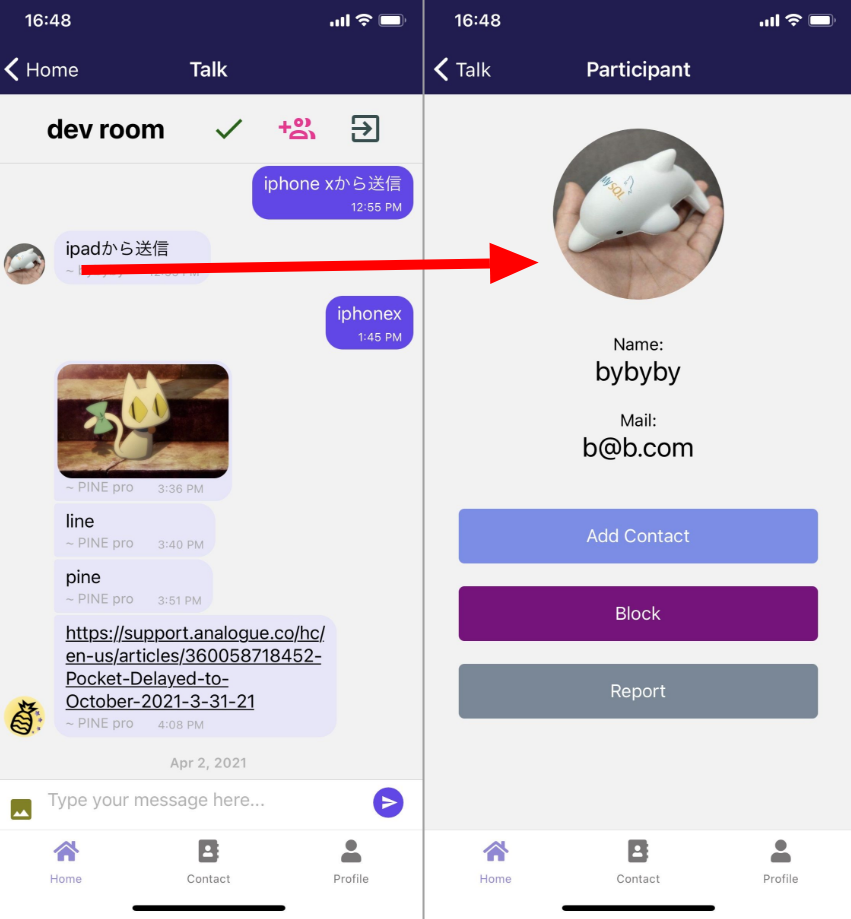

import { Link } from 'gatsby';

<Link to="/blog/2021-04-06">前回</Link>の続きです。

<br/><br/>

## チャットルーム画面

アプリのメイン機能であるチャットルーム画面を作っていきます。



最も多機能な画面です。

- モーダルで自分の連絡先一覧を表示してユーザーをトークに招待
- 画像を送信
- トークルームのタイトルを変更
- アバターをタップしてユーザー情報画面へ遷移(他の人が招待したユーザーを連絡先に追加するとき便利)
- メッセージ長押しでそのメッセージを削除
- 送信ボタンやメッセージバブルなどの見た目をカスタマイズ

<br/><br/>

### Talk

[react-native-gifted-chat](https://github.com/FaridSafi/react-native-gifted-chat)のドキュメント通りにカスタマイズしていきます。

まずはコード全体です。

**src\scenes\talk\Talk.js**

```javascript
import React, { useEffect, useState } from 'react'
import { Text, View, Modal, ScrollView, TouchableOpacity, TextInput } from 'react-native'
import styles from './styles'
import { GiftedChat, Send, SystemMessage, Bubble, Actions, ActionsProps } from 'react-native-gifted-chat'
import { firebase } from '../../firebase/config'
import { IconButton } from 'react-native-paper'
import { Divider, Avatar } from 'react-native-elements'
import * as ImagePicker from 'expo-image-picker'
import * as Permissions from 'expo-permissions'
import Constants from 'expo-constants'
import Dialog from 'react-native-dialog'

export default function Talk({ route, navigation }) {
  const talkData = route.params.talkData
  const myProfile = route.params.myProfile
  const [messages, setMessages] = useState([])
  const [modal, setToggle] = useState(false)
  const [title, setTitle] = useState(talkData.name)
  const [theArray, setTheArray] = useState([])
  const [image, setImage] = useState('')
  const [dialog, setDialog] = useState(false)
  const contactArray = Object.values(myProfile.contact?myProfile.contact:['example@example.com'])

  async function handleSend(messages) {
    const text = messages[0].text;
    const messageRef = firebase.firestore().collection('talk')
    messageRef
      .doc(talkData.id)
      .collection('MESSAGES')
      .add({
        text,
        createdAt: new Date().getTime(),
        user: {
          _id: myProfile.id,
          email: myProfile.email,
          avatar: myProfile.avatar,
          name: myProfile.fullName,
        }
      });
    await messageRef
      .doc(talkData.id)
      .set(
        {
          latestMessage: {
            text,
            avatar: myProfile.avatar,
            createdAt: new Date().getTime()
          }
        },
        { merge: true }
      );
  }

  useEffect(() => {
    firebase.firestore()
      .collection('talk')
      .doc(talkData.id)
      .onSnapshot(function(document) {
        const data = document.data()
        const title = data.name
        setTitle(title)
      })
  }, []);

  useEffect(() => {
    const messagesListener = firebase.firestore()
      .collection('talk')
      .doc(talkData.id)
      .collection('MESSAGES')
      .orderBy('createdAt', 'desc')
      .onSnapshot(querySnapshot => {
        const messages = querySnapshot.docs.map(doc => {
          const firebaseData = doc.data();
          const data = {
            _id: doc.id,
            text: '',
            createdAt: new Date().getTime(),
            name: '',
            ...firebaseData
          };
          if (!firebaseData.system) {
            data.user = {
              ...firebaseData.user,
              name: firebaseData.user.name
            };
          }
          return data;
        });
        setMessages(messages);
      });
    // Stop listening for updates whenever the component unmounts
    return () => messagesListener();
  }, []);

  function renderSend(props) {
    return (
      <Send {...props}>
        <View style={styles.sendingContainer}>
          <IconButton icon='send-circle' size={32} color='#6646ee' />
        </View>
      </Send>
    );
  }

  function renderSystemMessage(props) {
    return (
      <SystemMessage
        {...props}
        wrapperStyle={styles.systemMessageWrapper}
        textStyle={styles.systemMessageText}
      />
    );
  }

  function renderBubble(props) {
    return (
      <Bubble
        {...props}
        wrapperStyle={{
          right: {
            backgroundColor: '#6646ee'
          },
          left: {
            backgroundColor: '#e6e6fa'
          }
        }}
        textStyle={{
          right: {
            color: '#fff'
          },
        }}
      />
    );
  }

  async function handlePickImage() {
    try {
      if (Constants.platform.ios) {
        const { status } = await Permissions.askAsync(Permissions.CAMERA);
        if (status !== 'granted') {
          alert("Permission is required for use.");
          return;
        }
      }
      const result = await ImagePicker.launchImageLibraryAsync();
        if (!result.cancelled) {
          const localUri = await fetch(result.uri);
          const localBlob = await localUri.blob();
          const filename = myProfile.id + new Date().getTime()
          const storageRef = firebase.storage().ref().child("images/" + filename);
          const putTask = storageRef.put(localBlob);
          putTask.on('state_changed', (snapshot) => {
            let progress = (snapshot.bytesTransferred / snapshot.totalBytes) * 100;
            setProgress(parseInt(progress) + '%')
          }, (error) => {
            console.log(error);
            alert("Upload failed.");
          }, () => {
            putTask.snapshot.ref.getDownloadURL().then(downloadURL => {
              setProgress('')
              setImage(downloadURL)
              setDialog(true)
            })
          })
        }
    } catch (e) {
        console.log('error',e.message);
        alert("The size may be too much.");
    }
  }

  function sendImage() {
    const messageRef = firebase.firestore().collection('talk')
    messageRef
      .doc(talkData.id)
      .collection('MESSAGES')
      .add({
        text: '',
        image: image,
        createdAt: new Date().getTime(),
        user: {
          _id: myProfile.id,
          email: myProfile.email,
          avatar: myProfile.avatar,
          name: myProfile.fullName,
        }
      });
    setDialog(false)
    setImage('')
  }

  function renderActions(props) {
    return (
      <Actions
        {...props}
        options={{
           ['Send Image']: handlePickImage,
        }}
        icon={() => (
          <View>
            <IconButton icon='image' size={24} color='#808000' style={{ alignSelf: 'center', marginTop: 0 }} />
          </View>
        )}
      />
    )
  }

  function delMessage(context, message) {
    const options = ['Delete Message', 'Cancel'];
    const cancelButtonIndex = options.length - 1;
    context.actionSheet().showActionSheetWithOptions({
      options,
      cancelButtonIndex
    }, (buttonIndex) => {
      switch (buttonIndex) {
        case 0:
          firebase.firestore().collection('talk').doc(talkData.id).collection('MESSAGES').doc(message._id).delete()
          break
      }
    });
  }

  function exitTalk() {
    const userRef2 = firebase.firestore().collection('users2').doc(myProfile.email)
    const userRef = firebase.firestore().collection('users').doc(myProfile.id)
    const talkRef = firebase.firestore().collection('talk').doc(talkData.id)
    userRef2.update({
      talk: firebase.firestore.FieldValue.arrayRemove(talkData.id)
    })
    userRef.update({
      talk: firebase.firestore.FieldValue.arrayRemove(talkData.id)
    })
    talkRef.update({
      members: firebase.firestore.FieldValue.arrayRemove(myProfile.email)
    })
    navigation.goBack()
  }

  function openModal() {
    setTheArray([])
    for (const elem of contactArray) {
      const userRef2 = firebase.firestore().collection('users2').doc(elem)
      userRef2.get().then((doc) => {
        if (doc.exists) {
          const data = doc.data()
          setTheArray(oldArray => [...oldArray, data])
        } else {
          null
        }
      })
    }
    setToggle(true)
  }

  function showProfile(user) {
    const usersRef2 = firebase.firestore().collection('users2').doc(user.email)
    usersRef2.get().then((doc) => {
      const userProfile = doc.data()
      navigation.navigate('Participant', { user: userProfile, myProfile: myProfile })
    }).catch((error) => {
      console.log("Error getting document:", error);
    });
  }

  function addUser(invUser) {
    const userRef2 = firebase.firestore().collection('users2').doc(invUser.email)
    const userRef1 = firebase.firestore().collection('users').doc(invUser.id)
    const talkRef = firebase.firestore().collection('talk').doc(talkData.id)
    userRef2.update({
      talk: firebase.firestore.FieldValue.arrayUnion(talkData.id)
    })
    userRef1.update({
      talk: firebase.firestore.FieldValue.arrayUnion(talkData.id)
    })
    talkRef.update({
      members: firebase.firestore.FieldValue.arrayUnion(invUser.email)
    })
    setToggle(false)
  }

  function titleUpdate() {
    const talkRef = firebase.firestore().collection('talk').doc(talkData.id)
    talkRef.update({ name: title})
  }

  theArray.sort(function(a, b) {
    if (a.email < b.email) {
      return -1;
    } else {
      return 1;
    }
  })

  return (
    <View style={styles.root}>
      <View style={styles.header}>
        <View style={styles.headertext}>
          <TextInput
            style={styles.title}
            placeholderTextColor="black"
            onChangeText={(text) => setTitle(text)}
            value={title}
            underlineColorAndroid="transparent"
            autoCapitalize="none"
          />
        </View>
        <IconButton icon='check' size={32} color='#006400' alignSelf='flex-end' onPress={titleUpdate} />
        <IconButton icon='account-multiple-plus-outline' size={32} color='#ff1493' alignSelf='flex-end' onPress={openModal} />
        <IconButton icon='exit-to-app' size={32} color='#2f4f4f'alignSelf='flex-end' onPress={exitTalk} />
      </View>
      <Divider/>
      <GiftedChat
        messages={messages}
        onSend={newMessage => handleSend(newMessage)}
        user={{ _id: myProfile.id }}
        renderSend={renderSend}
        alwaysShowSend
        renderSystemMessage={renderSystemMessage}
        renderBubble={renderBubble}
        onPressAvatar={showProfile}
        renderUsernameOnMessage={true}
        renderActions={renderActions}
        onLongPress={delMessage}
        placeholder='Type your message here...'
      />
      <Modal
        visible={modal}
        transparent={false}
        animationType={"slide" || "fade"}
        presentationStyle={"fullScreen" || "pageSheet" || "formSheet" || "overFullScreen"}
      >
        <View style={styles.modalcontainer}>
          <View style={{ flex: 1, width: '100%' }}>
            <View style={styles.modaltitle}>
              <Text style={styles.title}>Tap to invite users</Text>
            </View>
            <Divider />
            <ScrollView>
              {
                theArray.map((user, i) => {
                  return (
                    <View key={i} style={styles.item}>
                      <TouchableOpacity onPress={() => addUser(user)}>
                        <View style={{flexDirection: 'row'}}>
                          <View style={styles.avatar}>
                            <Avatar
                              size="medium"
                              rounded
                              title="NI"
                              source={{ uri: user.avatar }}
                            />
                          </View>
                          <View style={styles.userinfo}>
                            <Text style={styles.title}>{user.fullName}</Text>
                            <Text style={styles.field}>{user.email}</Text>
                          </View>
                        </View>
                      </TouchableOpacity>
                      <Divider />
                    </View>
                  )
                })
              }
            </ScrollView>
            <View style={styles.footerContainer}>
              <TouchableOpacity style={styles.button} onPress={() => setToggle(false)}>
                <Text style={styles.buttonText}>Close</Text>
              </TouchableOpacity>
            </View>
          </View>
        </View>
      </Modal>
      <Dialog.Container visible={dialog}>
        <Dialog.Title>Send image?</Dialog.Title>
        <Dialog.Button label="OK" bold={true} onPress={() => sendImage()} />
        <Dialog.Button label="Cancel" onPress={() => setDialog(false)} />
      </Dialog.Container>
    </View>
  )
}
```

### 各関数の説明

メッセージを投稿する関数です。Firestoreに`add`するだけです。`latestMessage`にトーク一覧で表示するように投稿者のアバターを入れてるところがポイントです。

```javascript
async function handleSend(messages) {
  const text = messages[0].text;
  const messageRef = firebase.firestore().collection('talk')
  messageRef
    .doc(talkData.id)
    .collection('MESSAGES')
    .add({
      text,
      createdAt: new Date().getTime(),
      user: {
        _id: myProfile.id,
        email: myProfile.email,
        avatar: myProfile.avatar,
        name: myProfile.fullName,
      }
    });
  await messageRef
    .doc(talkData.id)
    .set(
      {
        latestMessage: {
          text,
          avatar: myProfile.avatar,
          createdAt: new Date().getTime()
        }
      },
      { merge: true }
    );
}
```

トークルームのタイトルをリッスンするフックです。他のユーザーがタイトルを変更するとリアルタイムで他のユーザーの画面にも反映されます。

```javascript
useEffect(() => {
  firebase.firestore()
    .collection('talk')
    .doc(talkData.id)
    .onSnapshot(function(document) {
      const data = document.data()
      const title = data.name
      setTitle(title)
    })
}, []);
```

チャット内容そのものをリッスンするフックです。これはReact Native GiftedChatのドキュメント通りに配列を渡してあげるようにします。

```javascript
useEffect(() => {
  const messagesListener = firebase.firestore()
    .collection('talk')
    .doc(talkData.id)
    .collection('MESSAGES')
    .orderBy('createdAt', 'desc')
    .onSnapshot(querySnapshot => {
      const messages = querySnapshot.docs.map(doc => {
        const firebaseData = doc.data();
        const data = {
          _id: doc.id,
          text: '',
          createdAt: new Date().getTime(),
          name: '',
          ...firebaseData
        };
        if (!firebaseData.system) {
          data.user = {
            ...firebaseData.user,
            name: firebaseData.user.name
          };
        }
        return data;
      });
      setMessages(messages);
    });
  return () => messagesListener();
}, []);
```

送信ボタンとメッセージの吹き出しをカスタマイズします。これもドキュメント通りです。



```javascript
function renderSend(props) {
  return (
    <Send {...props}>
      <View style={styles.sendingContainer}>
        <IconButton icon='send-circle' size={32} color='#6646ee' />
      </View>
    </Send>
  );
}
```

```javascript
function renderBubble(props) {
  return (
    <Bubble
      {...props}
      wrapperStyle={{
        right: {
          backgroundColor: '#6646ee'
        },
        left: {
          backgroundColor: '#e6e6fa'
        }
      }}
      textStyle={{
        right: {
          color: '#fff'
        },
      }}
    />
  );
}
```

画像の投稿機能を作ります。

1. 画像アイコンをタップ
1. ポップアップした[Send Image]をタップ
1. イメージピッカーから画像を選択
1. ダイアログでOK/Cancelの確認
1. OKなら投稿

という流れです。



ダイアログ表示には[react-native-dialog](https://www.npmjs.com/package/react-native-dialog)を使いました。画像のアップロードはアバター画像の変更でやったことの繰り返しになります。

```javascript
// イメージピッカーで画像をFirebase Storageにアップロード
async function handlePickImage() {
  try {
    if (Constants.platform.ios) {
      const { status } = await Permissions.askAsync(Permissions.CAMERA);
      if (status !== 'granted') {
        alert("Permission is required for use.");
        return;
      }
    }
    const result = await ImagePicker.launchImageLibraryAsync();
      if (!result.cancelled) {
        const localUri = await fetch(result.uri);
        const localBlob = await localUri.blob();
        const filename = myProfile.id + new Date().getTime()
        const storageRef = firebase.storage().ref().child("images/" + filename);
        const putTask = storageRef.put(localBlob);
        putTask.on('state_changed', (snapshot) => {
          let progress = (snapshot.bytesTransferred / snapshot.totalBytes) * 100;
          setProgress(parseInt(progress) + '%')
        }, (error) => {
          console.log(error);
          alert("Upload failed.");
        }, () => {
          putTask.snapshot.ref.getDownloadURL().then(downloadURL => {
            setProgress('')
            // アップロードしたら画像のURLをstateにセット
            setImage(downloadURL)
            // 同時にダイアログ表示用のstateをtrueにしてダイアログを表示する
            setDialog(true)
          })
        })
      }
  } catch (e) {
      console.log('error',e.message);
      alert("The size may be too much.");
  }
}
// ダイアログでOKを押されたときに動かす関数。
function sendImage() {
  const messageRef = firebase.firestore().collection('talk')
  messageRef
    .doc(talkData.id)
    .collection('MESSAGES')
    .add({
      text: '',
      image: image, // React Native GiftedChatではimageフィールドに画像のURLを入れてあげると自動的に画像として表示してくれる
      createdAt: new Date().getTime(),
      user: {
        _id: myProfile.id,
        email: myProfile.email,
        avatar: myProfile.avatar,
        name: myProfile.fullName,
      }
    });
  setDialog(false)
  setImage('')
}
// 画像アイコンを表示する用の関数を定義
function renderActions(props) {
  return (
    <Actions
      {...props}
      options={{
          ['Send Image']: handlePickImage,
      }}
      icon={() => (
        <View>
          <IconButton icon='image' size={24} color='#808000' style={{ alignSelf: 'center', marginTop: 0 }} />
        </View>
      )}
    />
  )
}
```

ダイアログ表示箇所

```javascript
<Dialog.Container visible={dialog}>
  <Dialog.Title>Send image?</Dialog.Title>
  <Dialog.Button label="OK" bold={true} onPress={() => sendImage()} />
  <Dialog.Button label="Cancel" onPress={() => setDialog(false)} />
</Dialog.Container>
```

メッセージを削除する関数を定義します。



```javascript
function delMessage(context, message) {
  const options = ['Delete Message', 'Cancel'];
  const cancelButtonIndex = options.length - 1;
  context.actionSheet().showActionSheetWithOptions({
    options,
    cancelButtonIndex
  }, (buttonIndex) => {
    switch (buttonIndex) {
      case 0:
        firebase.firestore().collection('talk').doc(talkData.id).collection('MESSAGES').doc(message._id).delete()
        break
    }
  });
}
```

トークルームから退出する関数を定義します。自分のトークルームリストと、トークルームの参加者一覧からそれぞれ`.arrayRemove`でトークルームIDやメールアドレスを削除します。

```javascript
function exitTalk() {
  const userRef2 = firebase.firestore().collection('users2').doc(myProfile.email)
  const userRef = firebase.firestore().collection('users').doc(myProfile.id)
  const talkRef = firebase.firestore().collection('talk').doc(talkData.id)
  userRef2.update({
    talk: firebase.firestore.FieldValue.arrayRemove(talkData.id)
  })
  userRef.update({
    talk: firebase.firestore.FieldValue.arrayRemove(talkData.id)
  })
  talkRef.update({
    members: firebase.firestore.FieldValue.arrayRemove(myProfile.email)
  })
  navigation.goBack()
}
```

トークルームにユーザーを招待する機能を作ります。追加するユーザーは自分の連絡先一覧から選択します。連絡先一覧は別画面に遷移したくないのでモーダルで表現します。



モーダルを開くと同時に`for`文を回してそれぞれのユーザー情報を取得します。Contact(自分の連絡先一覧)でやったことの繰り返しです。取得し終わったらモーダル表示用のstateをtrueにしてモーダルを表示します。

```javascript
function openModal() {
  setTheArray([])
  for (const elem of contactArray) {
    const userRef2 = firebase.firestore().collection('users2').doc(elem)
    userRef2.get().then((doc) => {
      if (doc.exists) {
        const data = doc.data()
        setTheArray(oldArray => [...oldArray, data])
      } else {
        null
      }
    })
  }
  setToggle(true)
}
```

モーダル内のユーザー一覧をemail順で並べ替えます。

```javascript
theArray.sort(function(a, b) {
  if (a.email < b.email) {
    return -1;
  } else {
    return 1;
  }
})
```

トークルームにユーザーを招待する関数です。これも以前やったことの繰り返しになります。相手の参加トーク一覧にトークルームのIDを追加して、トークルームの参加者一覧に相手のメールアドレスを追加してあげます。

```javascript
function addUser(invUser) {
  const userRef2 = firebase.firestore().collection('users2').doc(invUser.email)
  const userRef1 = firebase.firestore().collection('users').doc(invUser.id)
  const talkRef = firebase.firestore().collection('talk').doc(talkData.id)
  userRef2.update({
    talk: firebase.firestore.FieldValue.arrayUnion(talkData.id)
  })
  userRef1.update({
    talk: firebase.firestore.FieldValue.arrayUnion(talkData.id)
  })
  talkRef.update({
    members: firebase.firestore.FieldValue.arrayUnion(invUser.email)
  })
  setToggle(false)
}
```

モーダル画面です。Flexbox苦手なので結構苦労しました。

```javascript
<Modal
  visible={modal}
  transparent={false}
  animationType={"slide" || "fade"}
  presentationStyle={"fullScreen" || "pageSheet" || "formSheet" || "overFullScreen"}
>
  <View style={styles.modalcontainer}>
    <View style={{ flex: 1, width: '100%' }}>
      <View style={styles.modaltitle}>
        <Text style={styles.title}>Tap to invite users</Text>
      </View>
      <Divider />
      <ScrollView>
        {
          theArray.map((user, i) => {
            return (
              <View key={i} style={styles.item}>
                <TouchableOpacity onPress={() => addUser(user)}>
                  <View style={{flexDirection: 'row'}}>
                    <View style={styles.avatar}>
                      <Avatar
                        size="medium"
                        rounded
                        title="NI"
                        source={{ uri: user.avatar }}
                      />
                    </View>
                    <View style={styles.userinfo}>
                      <Text style={styles.title}>{user.fullName}</Text>
                      <Text style={styles.field}>{user.email}</Text>
                    </View>
                  </View>
                </TouchableOpacity>
                <Divider />
              </View>
            )
          })
        }
      </ScrollView>
      <View style={styles.footerContainer}>
        <TouchableOpacity style={styles.button} onPress={() => setToggle(false)}>
          <Text style={styles.buttonText}>Close</Text>
        </TouchableOpacity>
      </View>
    </View>
  </View>
</Modal>
```

トークルームのタイトルをアップデートする関数です。

```javascript
function titleUpdate() {
  const talkRef = firebase.firestore().collection('talk').doc(talkData.id)
  talkRef.update({ name: title})
}
```

最後に`GiftedChat`のporpにここまで定義してきた各関数を入れます。

```javascript
<GiftedChat
  messages={messages}
  onSend={newMessage => handleSend(newMessage)}
  user={{ _id: myProfile.id }}
  renderSend={renderSend}
  alwaysShowSend
  renderSystemMessage={renderSystemMessage}
  renderBubble={renderBubble}
  onPressAvatar={showProfile}
  renderUsernameOnMessage={true}
  renderActions={renderActions}
  onLongPress={delMessage}
  placeholder='Type your message here...'
/>
```

### Participant

アバターをタップしたときにそのユーザーのプロフィール画面に遷移するようにします。



ユーザー情報を持って画面遷移する関数を定義します。Firestoreから情報を取得してから`navigation.navigate`で画面を移動します。

**src\scenes\talk\Talk.js**

```javascript
function showProfile(user) {
  const usersRef2 = firebase.firestore().collection('users2').doc(user.email)
  usersRef2.get().then((doc) => {
    const userProfile = doc.data()
    navigation.navigate('Participant', { user: userProfile, myProfile: myProfile })
  }).catch((error) => {
    console.log("Error getting document:", error);
  });
}
```

遷移先の画面を作ります。これまで何度か作ってきた画面とほぼ同じものです。

**src\scenes\participant\Participant.js**

```javascript
import React, { useEffect, useState } from 'react'
import { Text, View, StatusBar, TouchableOpacity, ScrollView } from 'react-native'
import styles from './styles'
import { firebase } from '../../firebase/config'
import { Avatar } from 'react-native-elements'

export default function Participant({ route, navigation }) {
  const userData = route.params.user
  const myProfile = route.params.myProfile

  const addContact = () => {
    const userRef2 = firebase.firestore().collection('users2').doc(myProfile.email)
    const userRef = firebase.firestore().collection('users').doc(myProfile.id)
    userRef2.update({
      contact: firebase.firestore.FieldValue.arrayUnion(userData.email)
    })
    userRef.update({
      contact: firebase.firestore.FieldValue.arrayUnion(userData.email)
    })
    navigation.goBack()
  }

  const block = () => {
    alert('Added to the block list.')
  }

  const report = () => {
    alert('Report has been sent.')
  }

  return (
    <View style={styles.container}>
      <StatusBar barStyle="light-content" />
      <ScrollView style={styles.main}>
        <View>
          <View style={styles.avatar}>
            <Avatar
              size="xlarge"
              rounded
              title="NI"
              source={{ uri: userData.avatar }}
            />
          </View>
          <Text style={styles.field}>Name:</Text>
          <Text style={styles.title}>{userData.fullName}</Text>
          <Text style={styles.field}>Mail:</Text>
          <Text style={styles.title}>{userData.email}</Text>
          <TouchableOpacity style={styles.button} onPress={addContact}>
            <Text style={styles.buttonText}>Add Contact</Text>
          </TouchableOpacity>
          <TouchableOpacity style={styles.block} onPress={block}>
            <Text style={styles.buttonText}>Block</Text>
          </TouchableOpacity>
          <TouchableOpacity style={styles.report} onPress={report}>
            <Text style={styles.buttonText}>Report</Text>
          </TouchableOpacity>
        </View>
      </ScrollView>
    </View>
  )
}
```

### まとめ

トーク画面は以上です。次はFirebase Cloudfunctionsを利用して通知機能を実装します。

---