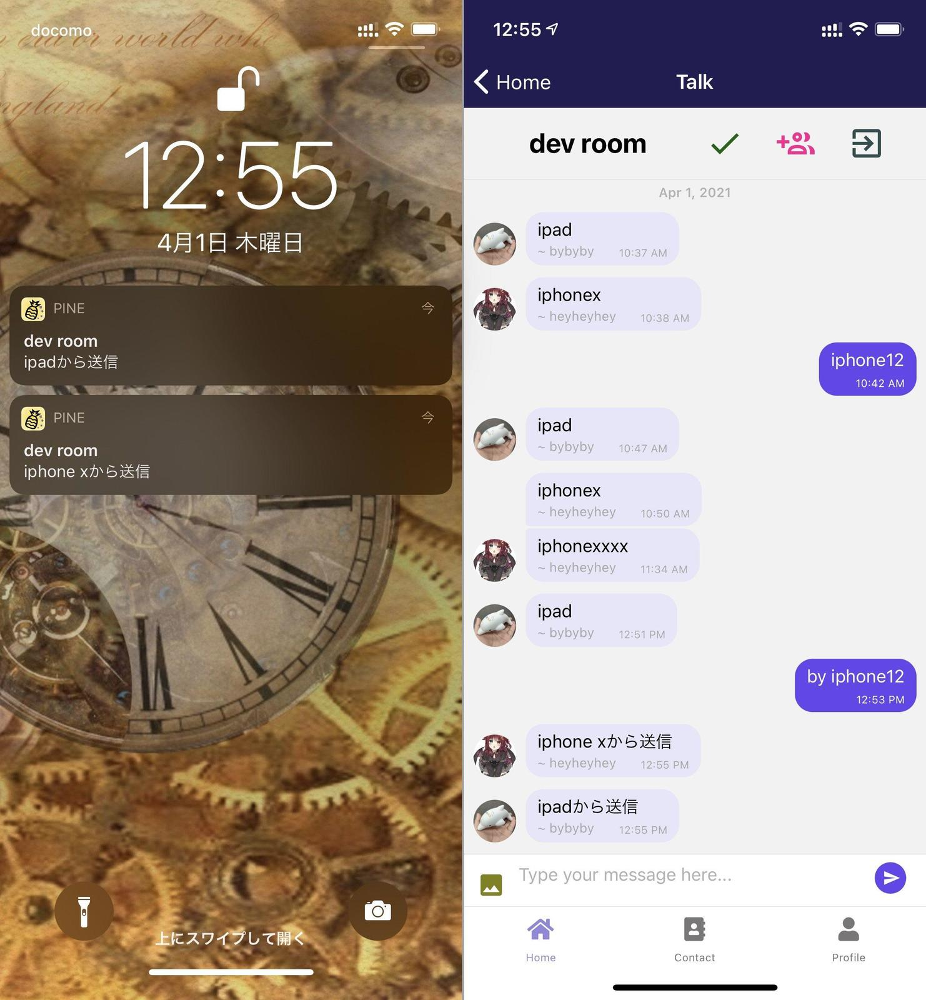
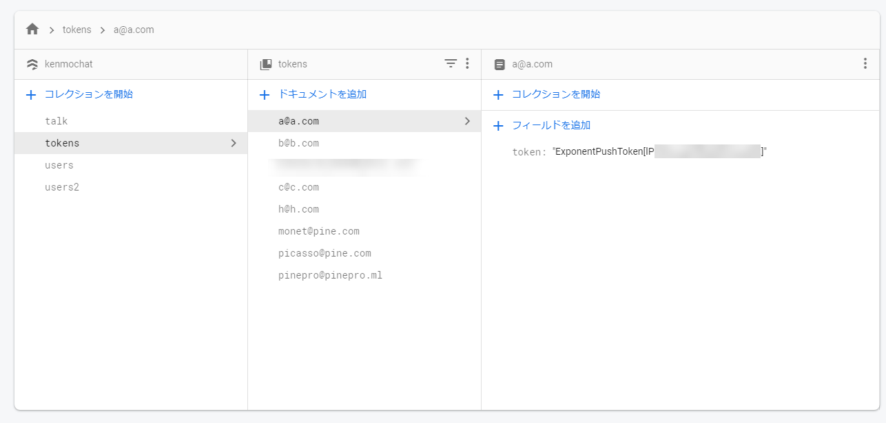
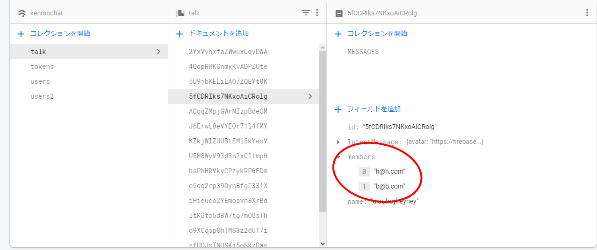
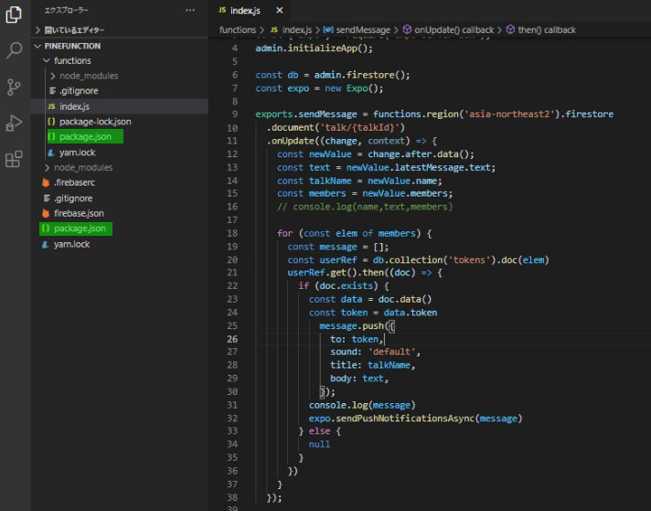

import { Link } from 'gatsby';

<Link to="/blog/2021-04-07">前回</Link>の続きです。

<br/><br/>

## プッシュ通知を実装する

メッセンジャーアプリにはPush Notificationsが必須です。

- [Expo Push API](https://github.com/kiyohken2000/pinefunction)
- [Cloud Functions for Firebase](https://firebase.google.com/docs/functions?hl=ja)

を使って実装していきます。



Expo Push APIに

```javascript
const pushMessage = {
  to: expoPushToken, //通知送信先のトークン
  sound: 'default', //受信時のサウンド
  title: title, //通知のタイトル
  body: body, //通知本文
}
```

こんな感じで通知内容を渡してあげるとプッシュ通知を送信してくれます。

トークンは、アプリ起動時にFirestoreに保存済みです。



トークルームにはそのルームに参加しているユーザーを配列で保存しています。



Cloud FunctionsではFirestoreの更新をトリガーにして関数を動かせます。

なので、

1. トーク内容がアップデートされたらCloud Functionsを発動
1. トークに参加しているユーザーのデバイストークンを取得
1. Expo Push APIを叩く

という流れでプッシュ通知を送信します。

### Android用の設定

PINE proはAndroid用アプリでもあるので`google-services.json`を用意しておく必要があります。

- 概要からアンドロイドマーク、または追加を行う
- パッケージ名com.xxx.任意のパッケージ名
- google-services.jsonをダウンロード
- ダウンロードしたファイルを、プロジェクトのルートディレクトリに配置する
- app.jsonにgoogle-services.jsonの相対パスを追加

**app.json**

```javascript
"android": {
  "package": "net.votepurchase.pine",
  "versionCode": 2,
  "googleServicesFile": "./google-services.json", // ここに追加
  "permissions": [
    "VIBRATE"
  ]
},
```

Firebase consoleにて以下を実行します。

- 設定>cloud messagingタブのサーバーキーを取得する
- サーバキーをExpoにpushする

```shell
expo push:android:upload --api-key <your-token-here>
```

### Cloud Functionsのコード

実際にCloud Functionsに配置するコードを書きます。ドキュメント通りです。`.onUpdate`でFirestoreの更新をリッスンしています。

ユーザーにはの**トークルームのタイトル**と**最新メッセージ(latestMessage)**を通知します。

node.jsのバージョンは`12`です。

**functions\package.json**

```javascript
  "engines": {
    "node": "12"
  },
```

**functions\index.js**

```javascript
const functions = require('firebase-functions');
const admin = require('firebase-admin');
const { Expo } = require('expo-server-sdk'); //expo-server-sdkのインポート
admin.initializeApp();

const db = admin.firestore();
const expo = new Expo();

exports.sendMessage = functions.region('asia-northeast2').firestore
  .document('talk/{talkId}')
  .onUpdate((change, context) => {
    const newValue = change.after.data(); //更新されたドキュメント
    const text = newValue.latestMessage.text; //最新のメッセージを格納
    const talkName = newValue.name; //トークルームのタイトルを格納
    const members = newValue.members; //トークルームの参加者を格納(参加者のメールアドレスが列挙された一次元の配列)
    // トーク参加者の配列をfor文で回してデバイストークンを取得
    for (const elem of members) {
      const message = [];
      const userRef = db.collection('tokens').doc(elem)
      userRef.get().then((doc) => {
        if (doc.exists) {
          const data = doc.data()
          const token = data.token
            message.push({ //トークンとルームタイトルと最新メッセージを格納
              to: token,
              sound: 'default',
              title: talkName,
              body: text,
            });
          expo.sendPushNotificationsAsync(message) //Expo Push APIに送信
        } else {
          null
        }
      })
    }
  });
```

コードはこれだけです。

通知の実装で最も詰まったのは**expo-server-sdkのインポート**でした。



`package.json`が二つあることにしばらく気づかなかったのです。

```shell
yarn add expo-server-sdk
```

をルートディレクトリでのみ実行してたせいでデプロイに失敗してしまい、しばらく悩みました。

`functions`の中でもSDKをインストールしないといけなかったのですが、しばらく気づきませんでした。

hello worldだけならデプロイできるのに

```javascript
const { Expo } = require('expo-server-sdk');
```

の一行を入れるとデプロイに失敗する、という状態で結構悩みました。

### まとめ

プッシュ通知は難しいというイメージがあったのですがExpo Push APIを使って簡単にできました。Cloud Functionsを初めて使ったので多少詰まったところはありましたが無事に実装できました。

[レポジトリ](https://github.com/kiyohken2000/pinefunction)

---