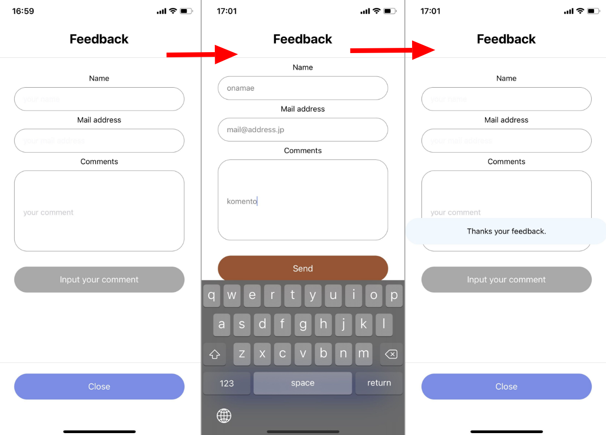
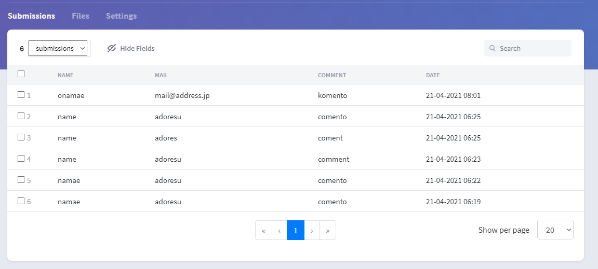

import { Link } from 'gatsby';

<Link to='/blog/2021-04-16'>前回</Link>の補足。

<br/><br/>

前回、Expo SDK　41にしたところ[kenmo reader](https://kenmo-reader.ml/)がぶっ壊れたことを報告しましたが、nodeを入れ直したら直りました。SDK 41版はすでにGoogle PlayとApp Storeで配信済みです。アップデートしてないのは[Grafhouse](https://grafhouse.ml/)とRetwpayのみですが、気が向いたら更新しようと思います。


## getfrom.ioをReact Nativeで使う

[getform.io](https://getform.io/)はウェブページにコンタクトフォームを設置するためのSaaSです。Gatsbyを含むReactとかVueのサイトのコンタクトフォームはだいたいこれを使って実装してると思います。

自分のアプリではないですが、React Nativeアプリ内に問い合わせフォームを実装したのでコードを共有します。

## 作ったもの

モーダル内に`名前`、`メールアドレス`、`本文`の入力箇所があって、入力して送信すると**Thanksメッセージ**が表示されるというよくあるやつです。



受け取ったメッセージはgetform.ioの自分のダッシュボードで確認できます。



## 実際のコード

今回も関数コンポーネントで書きました。

**使ったライブラリ**

- [Galio](https://galio.io/) テキスト入力とトースト通知のUI
- [react-native-axios](https://www.npmjs.com/package/react-native-axios) HTTPクライアント
- [react-native-keyboard-aware-scroll-view](https://github.com/APSL/react-native-keyboard-aware-scroll-view) キーボード表示の制御

<br/>

**必要なライブラリをインポート**

```javascript
import { Input, Toast } from 'galio-framework'
import axios from 'axios'
import { KeyboardAwareScrollView } from 'react-native-keyboard-aware-scroll-view'
```

**フックを定義**

```javascript
const [isShow, setShow] = useState(false) // Toast表示のオンオフ
const [name, setName] = useState('') // 名前欄のハンドリング
const [mail, setMail] = useState('') // メール欄のハンドリング
const [comment, setComment] = useState('') // コメント欄のハンドリング
```

**フォーム送信処理用の関数を定義**

```javascript
function hideToast() {
  setShow(false)
}

function sendComment() {
  var bodyFormData = new FormData()
  bodyFormData.append('name', name)
  bodyFormData.append('mail', mail)
  bodyFormData.append('comment', comment)
  axios({
    method: "post",
    url: "https://getform.io/f/{見せられないよ}",
    data: bodyFormData,
    headers: { "Content-Type": "multipart/form-data" }
  })
    .then(r => {
      console.log('success');
      setName('')
      setMail('')
      setComment('')
      setShow(true)
      setTimeout(hideToast, 2000)
    })
    .catch(r => {
      console.log(r);
    })
}
```

特に工夫した点はないですが、`setTimeout`を使ってトースト通知が自動的に消えるようにしています。

**表示部**

```javascript
<Modal
  visible={modal}
  transparent={false}
  animationType={"slide" || "fade"}
  presentationStyle={"fullScreen" || "pageSheet" || "formSheet" || "overFullScreen"}
>
  <View style={styles.modalcontainer}>
    <View style={{ flex: 1, width: '100%' }}>
      <View style={styles.modaltitle}>
        <Text style={styles.modalText}>Feedback</Text>
      </View>
      <Divider />
      <Toast isShow={isShow} positionIndicator="center" color="#f0f8ff" round={true}>
        <Text style={styles.toastText}>Thanks your feedback.</Text>
      </Toast>
        <KeyboardAwareScrollView keyboardShouldPersistTaps="always">
          <View style={styles.container}>
            <Text>Name</Text>
            <Input
              name='name'
              placeholder="your name"
              rounded
              onChangeText={(text) => setName(text)}
              value={name}
            />
            <Text>Mail address</Text>
            <Input
              name='mail'
              placeholder="your mail address"
              rounded
              onChangeText={(text) => setMail(text)}
              value={mail}
            />
            <Text>Comments</Text>
            <Input
              name='comment'
              style={{height:150}}
              placeholder="your comment"
              rounded
              multiline
              onChangeText={(text) => setComment(text)}
              value={comment}
            />
          </View>
          {comment?
          <TouchableOpacity style={styles.Sbutton} onPress={sendComment}>
            <Text style={styles.buttonText}>Send</Text>
          </TouchableOpacity>:
          <View style={styles.nonbutton} >
            <Text style={styles.buttonText}>Input your comment</Text>
          </View>
          }
        </KeyboardAwareScrollView>
      <Divider />
      <View style={styles.footerContainer}>
        <TouchableOpacity style={styles.Pbutton} onPress={closeModal}>
          <Text style={styles.buttonText}>Close</Text>
        </TouchableOpacity>
      </View>
    </View>
  </View>
</Modal>
```

`comment`を三項演算子で評価して、文字が入ってれば**Send**ボタンを表示するようにしています。

## まとめ

getform.ioの実装についてググっても、ReactとかVueの記事しか出てこなかったので、自分のブログに備忘録として残しておきます。

---