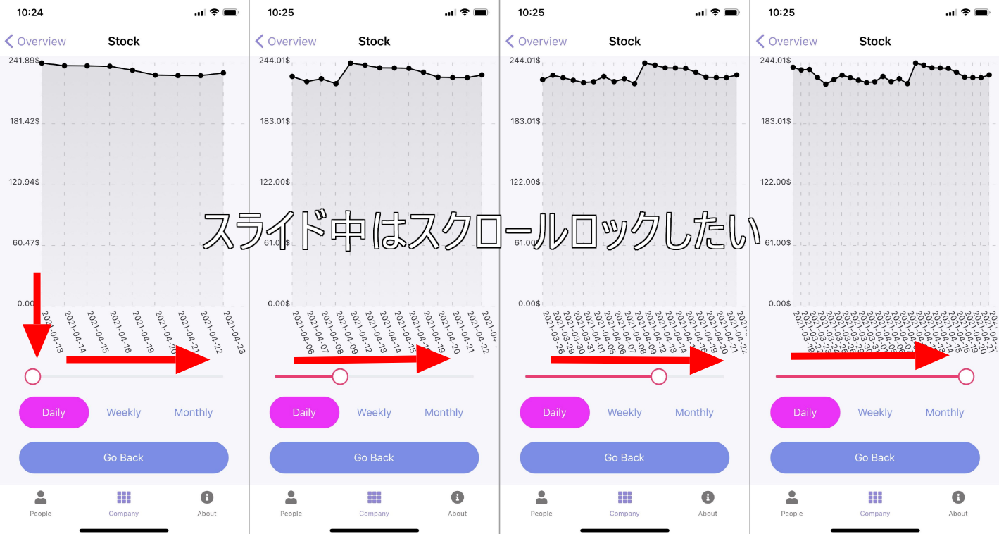

import { Link } from 'gatsby';

## SrollViewとSliderを組み合わせるときのScroll制御

自分のアプリではないですが、縦スクロールする画面の中に横向きのSliderを設置する機会があったのでコードを共有します。

## 作ったもの

Sliderを左右にスライドすると横軸の要素が増えていくグラフを作りました。



## 使ったライブラリ

- [react-native-chart-kit](https://github.com/indiespirit/react-native-chart-kit) 主題とは関係ないですがグラフ描画用コンポーネント
- [Galio](https://galio.io/docs/#/components/slider) Sliderコンポーネント
- [ScrollView](https://reactnative.dev/docs/scrollview) React Native標準のScrollViewコンポーネント

<br/>

## 問題点と解決方法

単に`<ScrollView></ScrollView>`の中に`<Slider/>`を配置してしまうとUXが著しく悪いです。横向きの**スライド中に縦向きのスクロールに切り替わってしまいます**。思うようにSliderを動かせません。

そこで、Slider操作中は、ScrollViewを無効にする必要があります。

具体的には、**Slider**の`onSlidingStart`と`onSlidingComplete`propと**ScrollView**の`scrollEnabled`propを組み合わせて使用します。

## 実際のコード

**ScrollView**では`scrollEnabled`のtrue/falseでスクロールの有効無効を切り替えられます。これと、**Slider**の`onSlidingStart`と`onSlidingComplete`でスライド操作の開始と終了を検知して、動的に`scrollEnabled`のtrue/falseを切り替えてあげるようにします。

### ライブラリのインポート

```javascript
import { LineChart, BarChart } from 'react-native-chart-kit'
import { Slider } from 'galio-framework'
```

### 制御用フックを定義

`scrollEnabled`の有効無効を制御するフックを定義します。無効にしたいのはスライダー操作中だけなので初期値は`true`です。

```javascript
const [slide, setSlider] = useState(9) // Sliderの値を制御するフック、主題とは関係ない
const [scrollEnable, setScrollEnable] = useState(true) // Scroll制御用フック
```

### 表示部

```javascript
<ScrollView scrollEnabled={scrollEnable}> {/* propに制御用のstateを渡して動的に切り替える */}
{/* 途中は省略 */}
  <Slider
    minimumValue={9}
    maximumValue={25}
    value={slide}
    onValueChange={(val) => setSlider(val)}
    step={1}
    onSlidingStart={() => setScrollEnable(false)} // スライドが始まったらスクロールを無効にする
    onSlidingComplete={() => setScrollEnable(true)} // スライドが終わったらスクロールを有効にする
  />
{/* 途中は省略 */}
</ScrollView>
```

## まとめ

以上です。フックを使うと簡潔に記述できて良いですね。

---