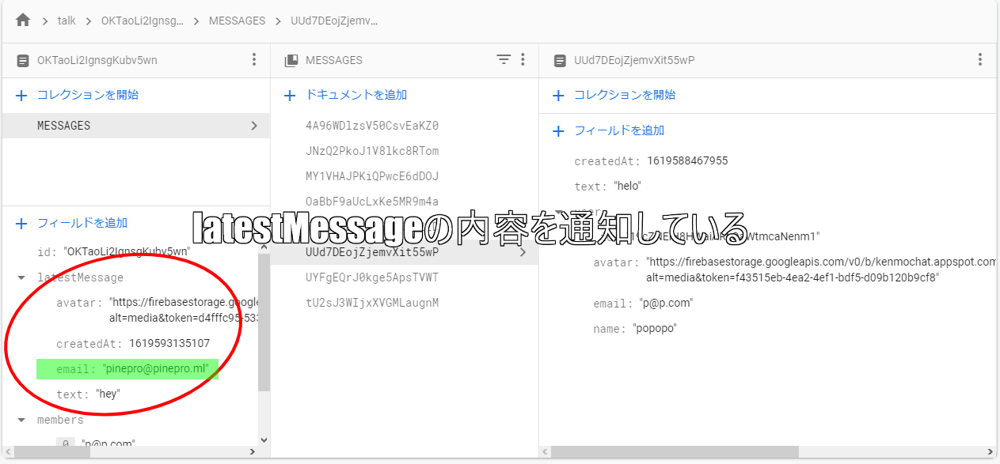
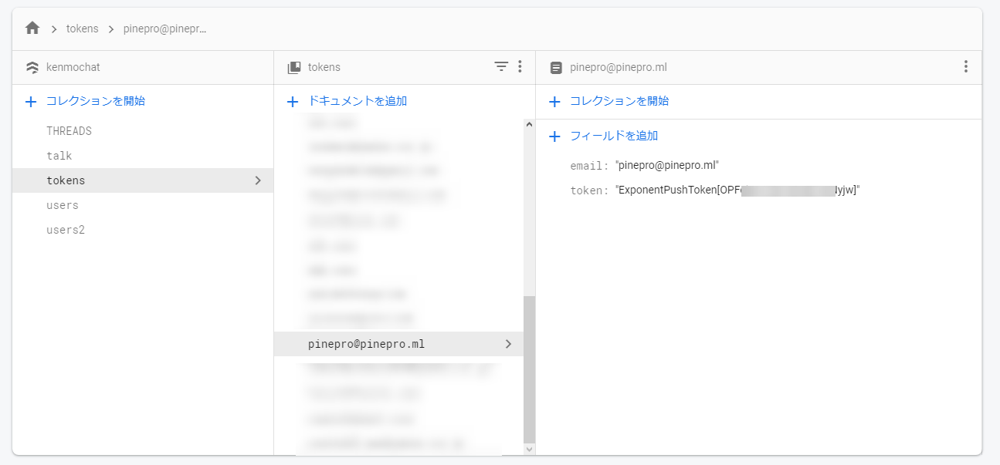

import { Link } from 'gatsby';

## PINE proのプッシュ通知を改善しました

<Link to="/blog/2021-04-08">PINEのプッシュ通知はExpo Push APIとFirebase Cloud Functionsを使って実装しています。</Link>

以前の実装だと自分の発言でも通知されていたので、**自分の発言では通知されないように変更**しました。

## 今の実装方法

現在プッシュ通知は、

1. Firestoreの更新をリッスンして
1. 更新をトリガーにしてCloud Functionsを実行
1. トークの参加者のPush tokenを探して
1. Expo Push APIに最新メッセージを送信

という感じの実装です。

## 変更内容

**latestMessage**に発言者のメールアドレス(PINEではメールアドレスがIDでもある)フィールドを追加しました。



そして、**tokensコレクション**にもメールアドレスフィールドを追加しました。



Cloud Functionsを実行するときに、発言者のメールアドレスとtokensのメールアドレスが一致するか調べて、一致した場合には通知を送信しないようにしました。

## 実際のコード

### tokensコレクションにメールアドレスを保存するように変更

**src\routes\navigation\Navigation.js**

```javascript
(async () => {
  const { status: existingStatus } = await Permissions.getAsync(
    Permissions.NOTIFICATIONS
  );
  let finalStatus = existingStatus;
  if (existingStatus !== "granted") {
    const { status } = await Permissions.askAsync(Permissions.NOTIFICATIONS);
    finalStatus = status;
  }
  if (finalStatus !== "granted") {
    return;
  }
  const token = await Notifications.getExpoPushTokenAsync();
  await firebase.firestore().collection("tokens").doc(user.email)
  .set({
    token: token.data,
    email: user.email // メールアドレスを保存するように変更
  })
})();
```

### 最新メッセージを保存するときに発言者のメールアドレスを保存するように変更

**src\scenes\talk\Talk.js**

```javascript
async function handleSend(messages) {
  const text = messages[0].text;
  const messageRef = firebase.firestore().collection('talk')
  messageRef
    .doc(talkData.id)
    .collection('MESSAGES')
    .add({
      text,
      createdAt: new Date().getTime(),
      user: {
        _id: myProfile.id,
        email: myProfile.email,
        avatar: myProfile.avatar,
        name: myProfile.fullName,
      }
    });
  await messageRef
    .doc(talkData.id)
    .set(
      {
        latestMessage: {
          text,
          avatar: myProfile.avatar,
          createdAt: new Date().getTime(),
          email: myProfile.email // 発言者のメールアドレスを保存
        }
      },
      { merge: true }
    );
}
```

アプリ側の変更は以上です。

### Cloud Functionsを変更

次に、Cloud Functionsにメールアドレスを比較するコードを追加しました。

```javascript
exports.sendMessage = functions.region('asia-northeast2').firestore
  .document('talk/{talkId}')
  .onUpdate((change, context) => {
    const newValue = change.after.data();
    const text = newValue.latestMessage.text;
    const talkName = newValue.name;
    const members = newValue.members;
    const email = newValue.latestMessage.email; // latestMessageのメールアドレスを取得

    for (const elem of members) {
      const message = [];
      const userRef = db.collection('tokens').doc(elem)
      userRef.get().then((doc) => {
        if (doc.exists) {
          const data = doc.data()
          const token = data.token
          const id = data.email // tokensコレクションからメールアドレスを取得
          if (id != email) { // latestMessageとtokensのメールアドレスを比較、一致しなければ発言者ではないのでプッシュ通知を送信する処理へ
            message.push({
              to: token,
              sound: 'default',
              title: talkName,
              body: text,
            });
          console.log(message)
          expo.sendPushNotificationsAsync(message)
          } else { null } // 一致すれば発言者本人なので何もしない
        } else { null }
      })
    }
  });
```

## まとめ

以上です。

通知を実装した当初からこの問題は分かってて、今回変更した実装も思いついていたのですが、検証が面倒だったので放置していました。

実験用のFirebaseを用意するのが面倒で、本番環境にいきなりデプロイしたのですがうまく動いて良かったです。

---