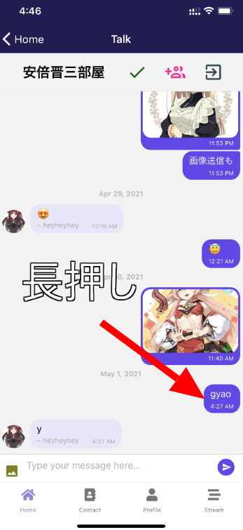

import { Link } from 'gatsby';

## 更新内容

- 発言を長押ししてテキストをクリップボードにコピーできるように変更
- 自分の発言のみを削除できるように変更

<br/>

## 実装したコード

とりあえず、メッセージ長押ししたときに取得できてる内容を`console.log(message)`で見てみる

**src\scenes\talk\Talk.js**

```javascript
function delMessage(context, message) {
  console.log(message) // 長押ししたときに取得できてる内容を見てみる
  const options = ['Delete Message', 'Cancel'];
  const cancelButtonIndex = options.length - 1;
  context.actionSheet().showActionSheetWithOptions({
    options,
    cancelButtonIndex
  }, (buttonIndex) => {
    switch (buttonIndex) {
      case 0:
        firebase.firestore().collection('talk').doc(talkData.id).collection('MESSAGES').doc(message._id).delete()
        break
    }
  });
}
```



```javascript
Object {
  "_id": "X0LNmPWPv1HxATs5yhLn",
  "createdAt": 1619810847705,
  "name": "",
  "text": "gyao",
  "user": Object {
    "_id": "XDKfXDJXzPYizpVKes4Lnfn9dJC3",
    "avatar": "https://firebasestorage.googleapis.com/v0/b/kenmochat.appspot.com/o/avatar%2FXDKfXDJXzPYizpVKes4Lnfn9dJC31617107738417?alt=media&token=d4fffc95-5330-4767-8b47-cc045f360b79",
    "email": "pinepro@pinepro.ml",
    "name": "PINE pro",
  },
}
```

発言内容`text`とか`user._id`とか`user.email`とか必要そうな情報はだいたい取得できてる。

というわけでコードを変更していく。

```javascript
import Clipboard from 'expo-clipboard' // クリップボード操作用のライブラリをインポート
```

```javascript
function delMessage(context, message) {
  const options = ['Delete Message', 'Copy Text', 'Cancel']; // コピーする選択肢を追加
  const cancelButtonIndex = options.length - 1;
  context.actionSheet().showActionSheetWithOptions({
    options,
    cancelButtonIndex
  }, (buttonIndex) => {
    switch (buttonIndex) {
      case 0:
        if (message.user.email == myProfile.email) { // 発言者のID(メールアドレス)と自分のID(メールアドレス)を比較
          firebase.firestore().collection('talk').doc(talkData.id).collection('MESSAGES').doc(message._id).delete() // 一致すれば自分の発言なので削除
        } else {
          alert('You can only delete own messages.') // 一致しない場合は削除できないことをアラート表示
        }
        break
      case 1: // Copy Textを選択した場合の処理を追加
        const text = message.text
        Clipboard.setString(text) // クリップボードに発言内容をコピー
        break
    }
  });
}
```

## まとめ

以上です。

誰でも誰のメッセージでも削除できる仕様のほうが面白いかなと思ってたのですが、それだと普通のアプリっぽくないので実用度を上げる方向に修正した。

---