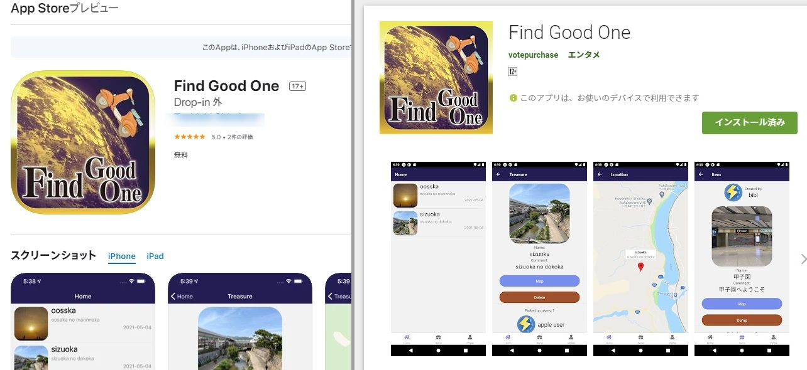
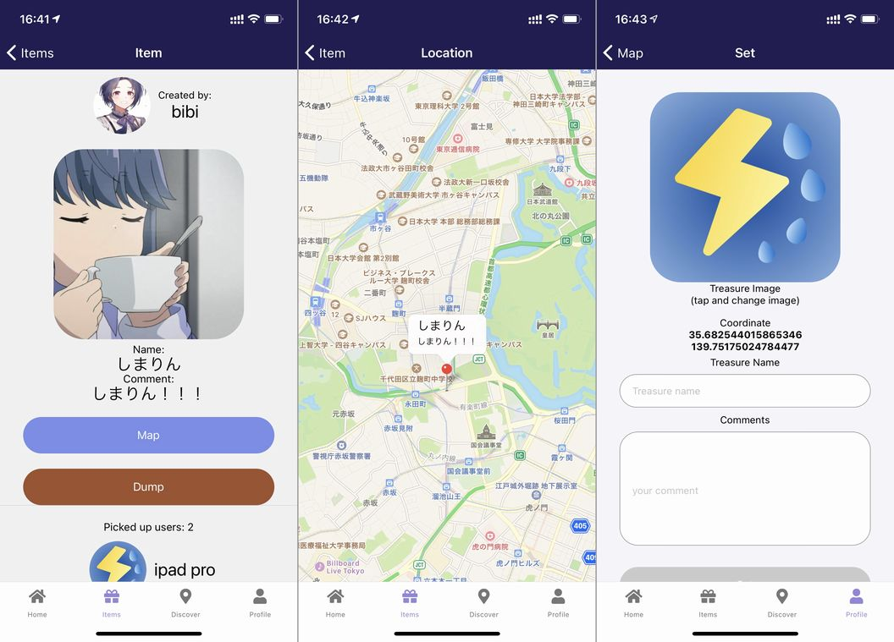
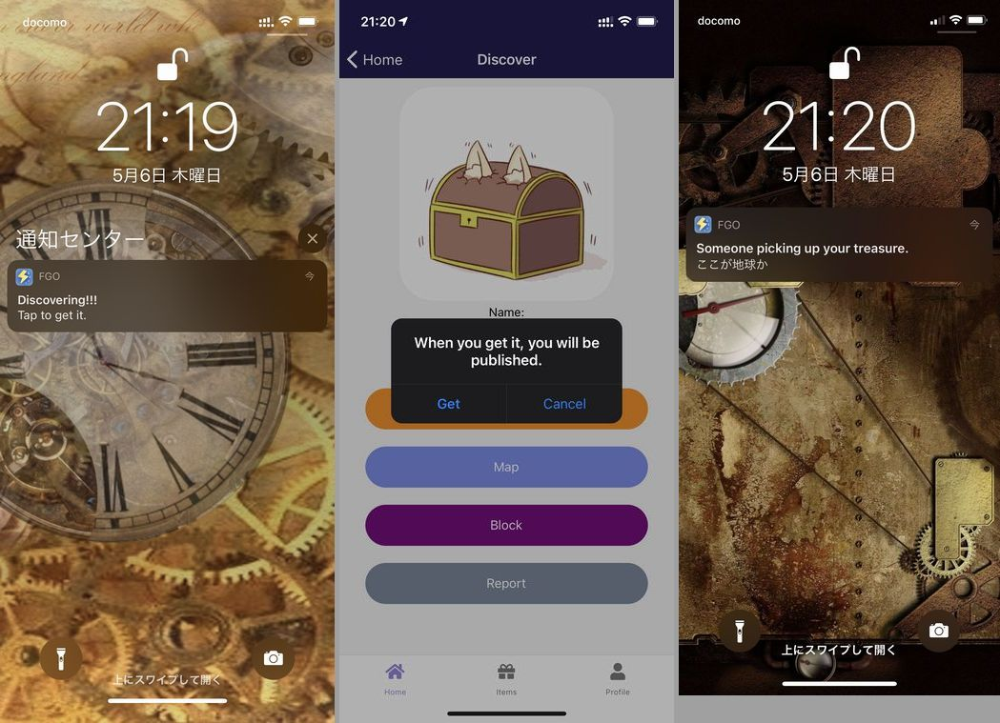
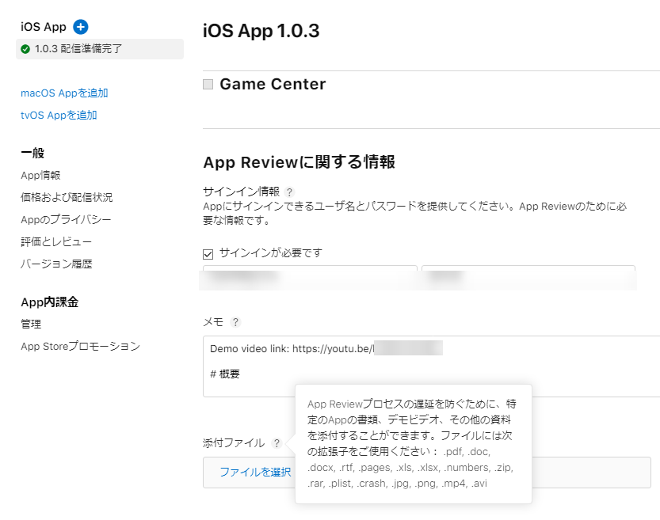
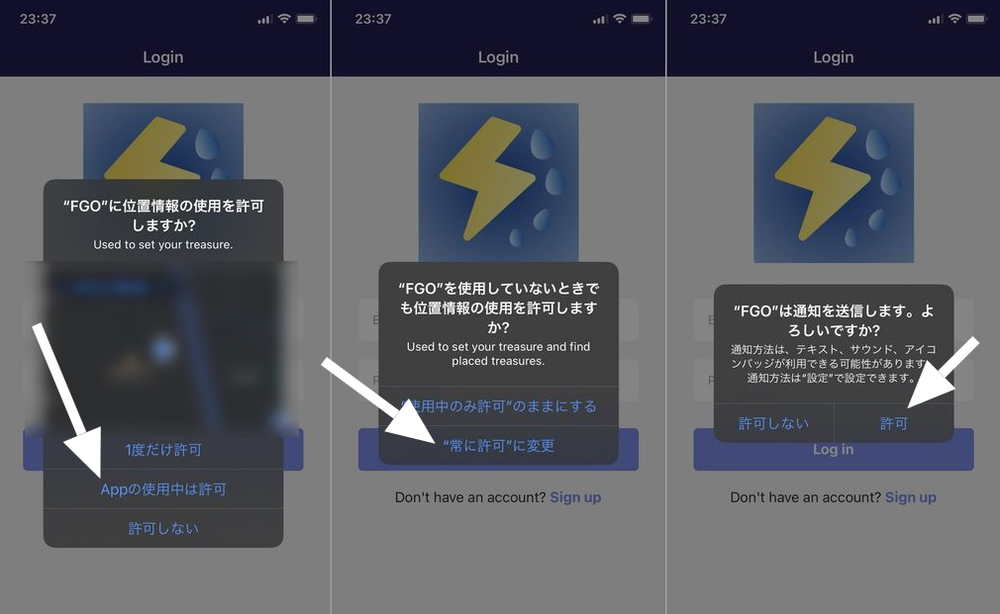
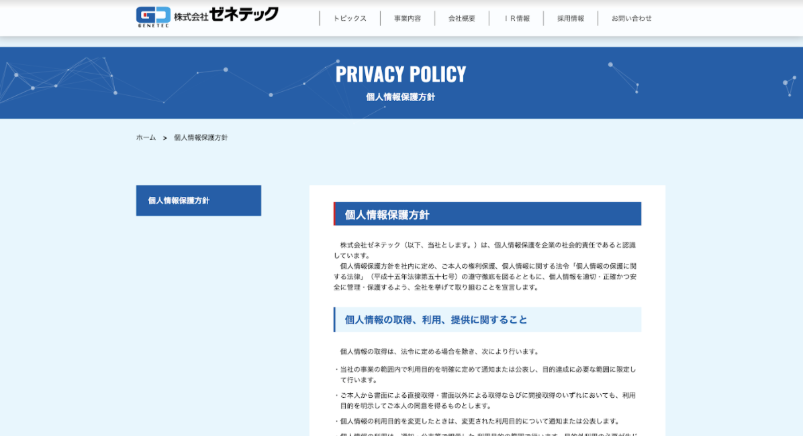
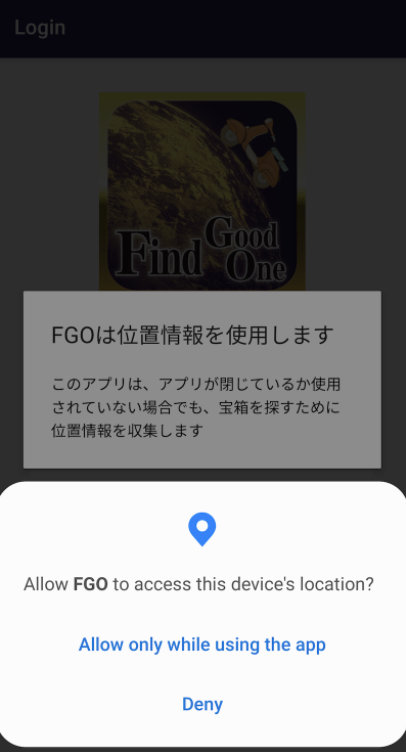
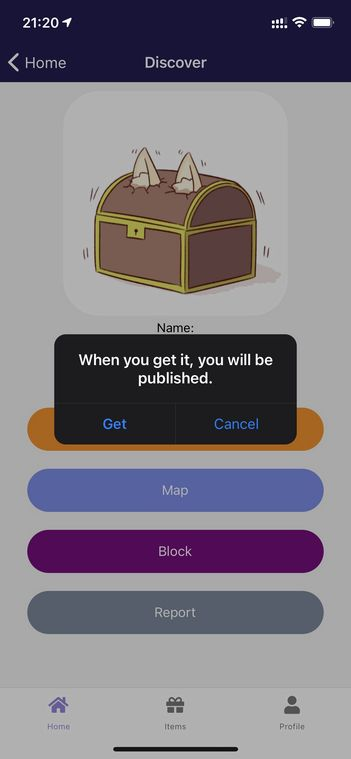

import { Link } from 'gatsby';

## 新作アプリをリリースしました

この2週間、ブログもアプリも更新せずに何をやっていたかというと新作アプリを作っていました。



- [Find Good One](https://findgoodone.ml/)
- [App Store](https://apps.apple.com/jp/app/find-good-one/id1566080175)
- [Google Play](https://play.google.com/store/apps/details?id=net.votepurchase.fgo)

<br/>



## 簡単な説明

詳しい使い方は[ランディングページ](https://findgoodone.ml/)を見ていただきたいのですが、簡単に説明すると**バックグラウンド位置情報を利用した宝探しアプリ**です。

ユーザーはマップ上の任意の座標に架空の宝箱を自由に設置できます。宝箱には、発見した人へのメッセージや画像を設定できます。

他のユーザーが設置した宝箱に接近するとスマートフォンに宝箱を発見した事が通知されます。宝箱を取得することを選ぶと自分のアイテムリストにそれが追加されます。取得した宝箱はいつでも見返すことができます。



## 使用技術

PINE Proと同じくアプリはReact Native(Expo)、バックエンドはFirebaseという構成です。

[PINE pro](https://pinepro.ml/)と同じく関数コンポーネントを使って書きました。

- #### React Native
  - [Expo](https://expo.io/)
    - [expo-notifications](https://docs.expo.io/versions/latest/sdk/notifications/) - ローカル通知とリモート通知
    - [expo-location](https://docs.expo.io/versions/v41.0.0/sdk/location/) - 位置情報の取得
    - [expo-server-sdk-node](https://www.npmjs.com/package/expo-server-sdk) - バックエンド側の通知機能
  - [react-native-maps](https://github.com/react-native-maps/react-native-maps) - マップ画面のUI
  - [Maps SDK for Android](https://developers.google.com/maps/documentation/android-sdk/overview?hl=ja) - Androidのマップ画面
- #### Firebase
  - Authentication - ログインとサインアップ
  - Firestore - ユーザー情報や宝箱のデータベース
  - Storage - アバターや宝箱の画像の保存
  - Cloud Functions - 通知機能

<br/><br/>

## 苦労した点

バックエンドはFirestoreの構造をPINE proとほぼ同じにしました。コードを流用したためほとんど苦労しませんでした。

#### バックグラウンド位置情報のパーミッション

FGOはバックグラウンドで位置情報を取得して宝箱を探すアプリのためフォアグラウンドとバックグラウンドでの位置情報取得の権限が必要です。

App Storeの審査はこの点でのつまずきはなかったのですが、Google Playでは権限取得に関して2度リジェクトされてしまいました。

#### ローカル通知の実装

リモート通知はPINE proで経験済みのため苦労しませんでした。

FGOでは設置された宝箱に接近したらローカル通知で宝箱の存在をユーザーに知らせる必要があるため後述するジオフェンスと組み合わせたローカル通知の実装が必要でした。

#### プッシュ通知に関するイベントリスナー

PINE proのプッシュ通知は、通知を開くと単にアプリが立ち上がるというだけの単純なものでした。しかしFGOでは**宝箱発見の通知を開いたらその宝箱の情報画面に遷移する**という設定が必要です。

イベントリスナーの登録は新しい挑戦でした。

#### Google Maps SDK

iOS版では問題なかったのですが、Androidではマップを使う場合Google Maps APIを叩く必要があります。開発中のExpo GoアプリやAPKを直接インストールした場合はAPIの設定は不要ですが、ストア配布版(Android App Bundle)の場合は正しくAPIを設定しないとマップを開いたときにアプリがクラッシュします。

#### 設定できるジオフェンス数の制限

ジオフェンスとは位置情報を利用した仮想的な地理的境界のことです。**ある地点**に近づいた or 離れたことをトリガーにアプリにアクションさせることができます。**ある地点**として設定できる場所の数にiOSでは20、Androidでは100という制限があります。

バックグラウンドで端末の座標を取得し続けて、移動するたびにその端末の近くの宝箱をジオフェンスに設定する(全てバックグラウンドで)というやり方で回避できる問題です。

しかし、自分のiPhoneで試してたところバッテリーの消費が激しかったので実装しませんでした。FGOでは手動でジオフェンスを設定するようにしました。

#### バックグラウンド位置情報の動作確認

実装方法に関することではありませんが、バックグラウンド位置情報を利用した機能はExpo Goアプリでは確認できません。そのためiOSかAndroidのシミュレーターを使う必要があります。

<Link to="/blog/2021-01-09">以前</Link>に書いた通り、アプリ開発はメインの自作パソコンで行っています。

このパソコンは深夜アニメの録画やエンコードに使っており、安定動作させたいためなるべく余計なソフトは入れたくないのです。そのため、シミュレーターでの確認が必要な時にはサブのMac Book Air(2020 intel)を使用しました。

自作パソコンと比べると性能的にもI/O的にも快適度が圧倒的に劣るため苦労しました。

## ストアでのリジェクト

リリースまでに、App Storeで2回、Google Playでも2回リジェクトされました。それぞれ違う理由ですが、特にApp Storeでは珍しい理由でリジェクトされたので紹介します。

### App Store

#### 1度目のリジェクト

初回リリース時にリジェクトされたときに届いたメッセージがこちらです。

```
Guideline 2.1 - Information Needed

We're looking forward to completing our review of your app. Before we can continue, we need a video that demonstrates the current version in use on a physical iOS device.

Keep these requirements in mind as you make your demo video:

- Only use footage of your app running on a physical iOS device, not on a simulator.
- Make sure the video clearly documents all relevant app features, services, and user permission requests.
- You can use a screen recorder to capture footage of your app in use.

Next Steps

Create the demo video, add a link to the video in the App Review Information section of your app’s page in App Store Connect, and reply to this message in Resolution Center.

To add the video link:

- Sign in to App Store Connect.
- Click on My Apps.
- Select your app.
- Click on the app version on the left side of the screen.
- Scroll down to App Review Information.
- Provide the demo video link and any necessary access details in the Notes section.
- Click the Save button at the top of the Version Information page.

Please note that if your app can only be reviewed with a demo video, you’ll need to provide an updated demo video for every app submission.
```

実機で録画したデモビデオの提出を求められました。面白いと思ったのはその提出方法で、レビュアーへのメモにデモビデオへのリンクを書いてほしいとのことでした。

App Store Connectの管理画面にはmp4にも対応したアップロードフォームがあるのですが、ビデオのリンクを求められたのは興味深かったです。



求められた通り、デモビデオをiPhone実機で録画してYouTubeにアップロードしてリンクを伝えたところ無事に承認されました。

#### 2度目のリジェクト

次の日にアプリアイコンを変更するためにアップデートを提出したところリジェクトされました。そのときにレビュアーから届いたメッセージです。

```
Guideline 4.0 - Design

We noticed an issue in your app that contributes to a lower quality user experience than Apple users expect:

- Your app's modal alerts are written in English while the app is set to the Japanese localization. To help users understand why your app is requesting access to a specific feature, your app's modal alerts should be in the same language as your app's current localization.

Next Steps

To resolve this issue, please revise your app to address all instances of this type of issue.
```

フォトライブラリや位置情報のパーミッションを取得するときにモーダルを出して使用目的を説明しないといけないのですが、それを英語で書いていたことが原因でした。日本語に設定されているアプリだからユーザーが理解できるように日本語で書いてほしいとのことです。



初回リリースの時には英語で書いて承認されたのでイマイチ納得出来なかったのですが、日本語で書き直して提出したところ承認されました。多分私の英語が壊れていて意味不明だったのが原因でしょう。

他にも、初回リリース前に**App Store Connectが壊れていて価格が設定できず審査に提出できない**という問題はあったのですが、App Storeのレビューはコードの変更を要求されることもなく意外とスムーズに承認されました。

### Google Play

#### 1回目のリジェクト

Google Playでは最初の何回かは問題なくリリースできたのですが、バックグラウンドの位置情報取得権限を設定しておらずアプリが機能しない(宝箱を見つけられない)という問題がありました。バックグラウンド位置情報の取得権限の要求を入れたアップデートを提出したところリジェクトされました。

そのとき届いたメッセージがこちらです。

```
Prominent disclosure not found
Your app must display a prominent disclosure through a pop-up alert before your app’s location runtime permission. Based on our review, a prominent disclosure did not appear before the runtime permission.

Please add a prominent disclosure before the runtime permission.

Remember, your prominent disclosure must:
Appear before your app’s location runtime permission.
Include at least the following sentence, adapted to include all the relevant features requesting access to location in the background in the app that are readily visible to the user: “This app collects location data to enable ["feature"], ["feature"], & ["feature"] even when the app is closed or not in use.” If you extend permitted usage to ads, please also include: “This data is also used to provide ads/support advertising/support ads.”
Include any other details necessary to make it clear to the user how and why you are using location in the background. While additional content is permitted, it should not cause the required content to not be immediately visible.
```

パーミッションを要求する前に、何のためにバックグラウンド位置情報のパーミッションが必要なのか説明するポップアップを出して欲しいとのことです。そして、このメッセージには画像が添付されていました。

こちらです。



意味がわかりません。そもそもアプリのスクリーンショットですらないし。

文句を言っても進まないので、指示通りポップアップを出すコードを追加して再提出しました。

#### 2回目のリジェクト

ダイアログを出すライブラリを入れて提出したところまたリジェクトされてしまいました。

届いたメッセージは1回目と同じですが、添付されていたスクリーンショットは違ってました。それがこちらです。



**パーミッションを要求する前**にポップアップを出すという部分を見落としていたのでリジェクトされてしまいました。これは指示通りに直して提出して承認されました。

ポップアップ画面は[React Native Simple Dialogs](https://www.npmjs.com/package/react-native-simple-dialogs)を使って実装したのですが、後から考えるとその必要はありませんでした。

なぜなら、宝箱取得時の確認ダイアログを出すために似たようなライブラリを入れていたからです。



このダイアログは[react-native-dialog](https://www.npmjs.com/package/react-native-dialog)を使って実装しています。

Google Playはコードを変更する必要があったり、審査が遅かったりしてApp Storeよりも苦労しました

## まとめ

新しいチャレンジの多いアプリでしたが無事にリリースできて良かったです。次回からは実装したコードやアプリの仕組みなどを記事に書いていこうと思っています。

---