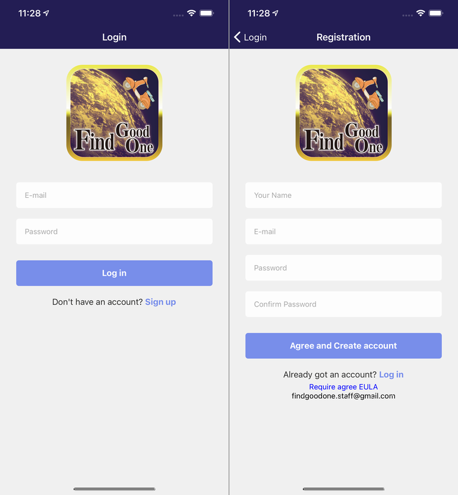
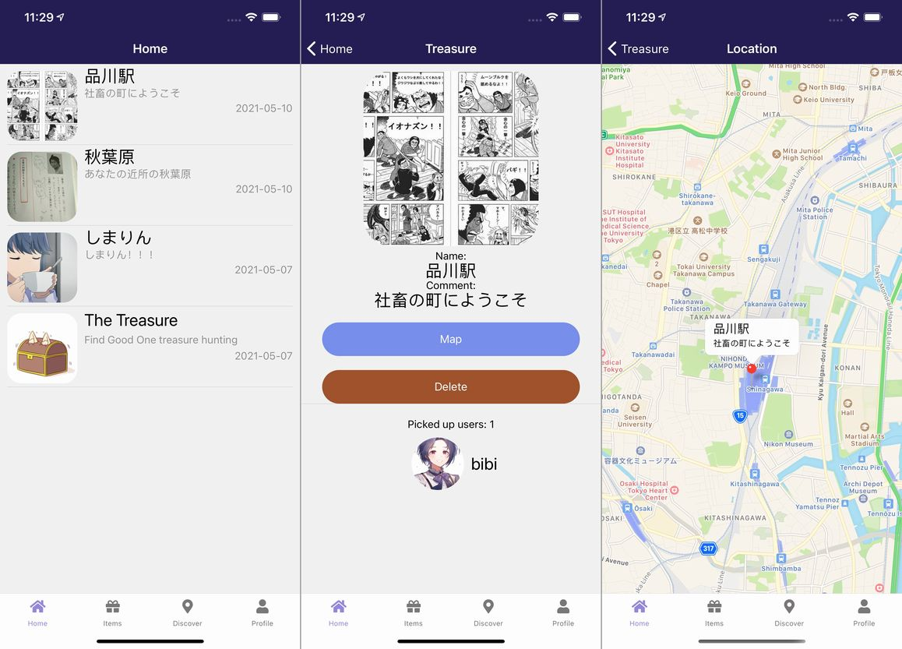
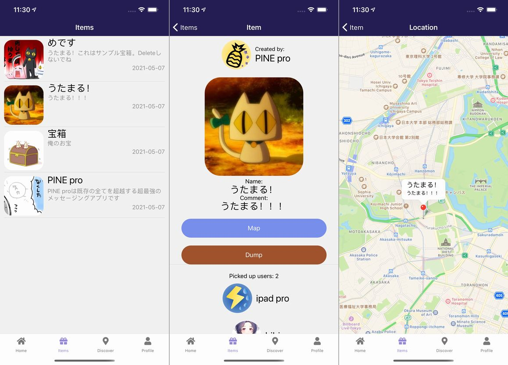
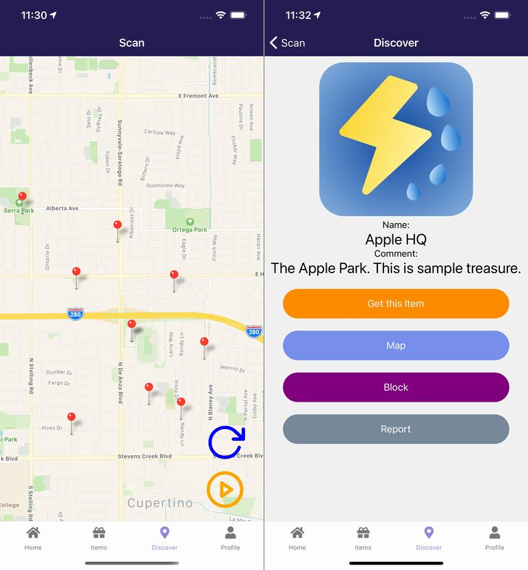
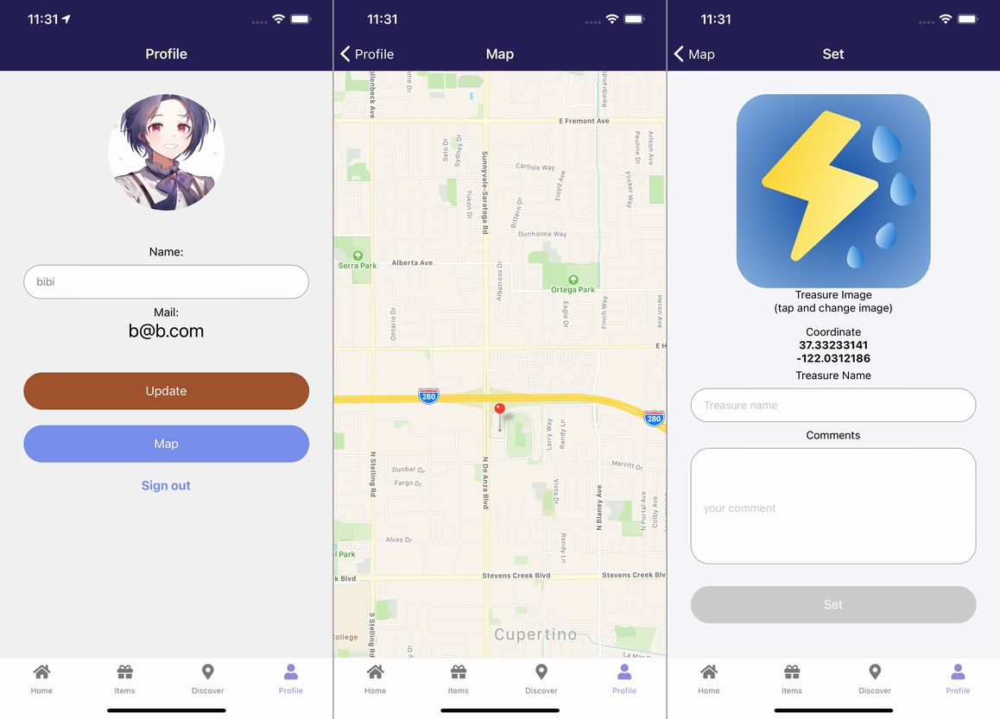
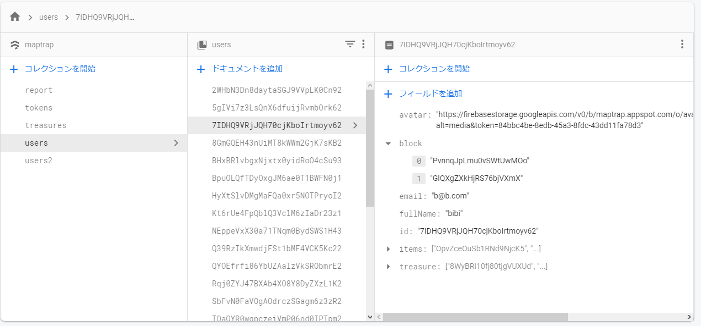
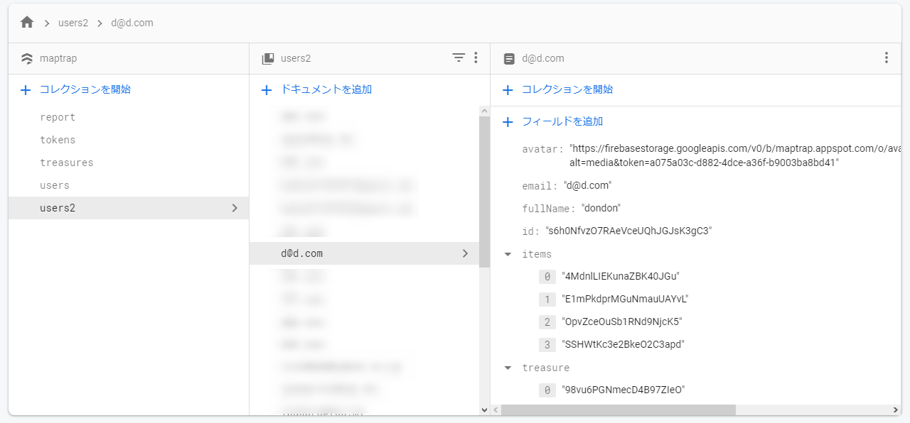
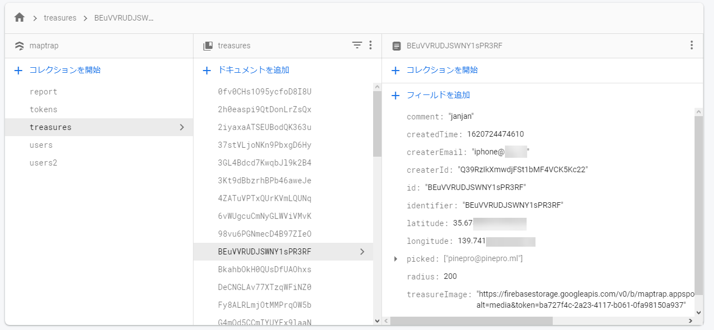
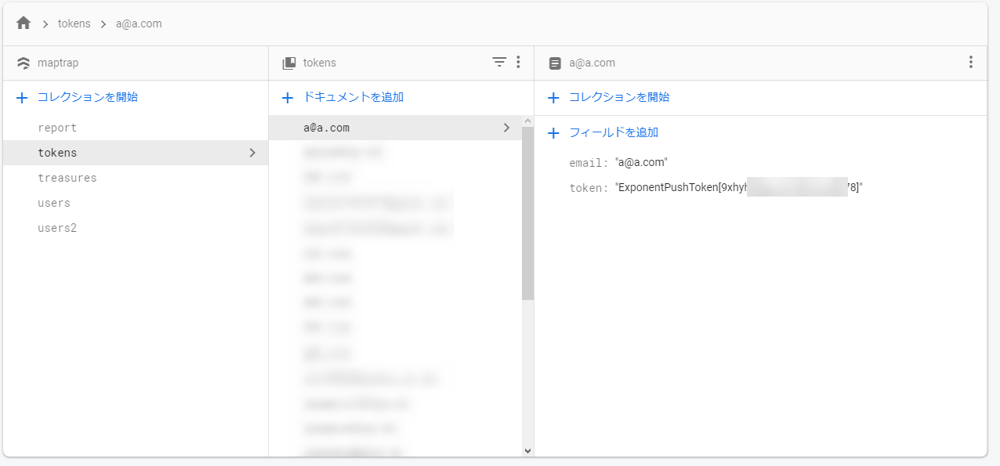
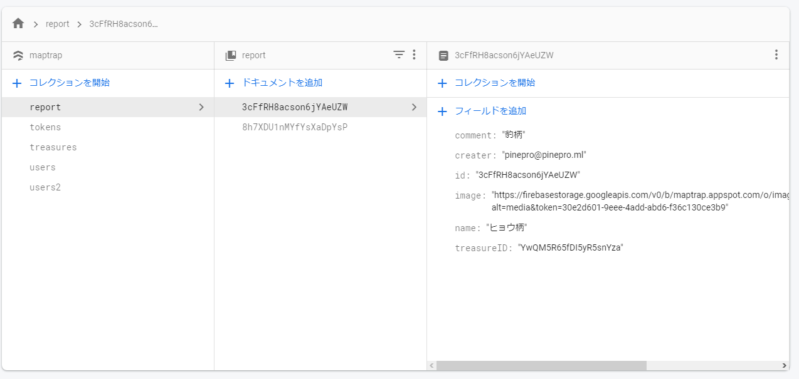

import { Link } from 'gatsby';

## 新作アプリをリリースしました

<Link to="/blog/2021-05-14">前回</Link>の続きです。

リリースした新作アプリ**Find Good One**の仕組みやコードを書きます。

## 画面遷移

アプリの画面遷移です。以下の5個のスタックで構成されています。

- LoginNavigator ログインとサインアップ
- TabNavigator
  - HomeNavigator 自分が設置した宝箱の管理
  - ItemsNavigator 取得した宝箱の管理
  - DiscoverNavigator 周辺の宝箱を探す、ジオフェンスの開始、発見した宝箱の閲覧
  - ProfileNavigator プロフィール編集、宝箱の設置

 

ログイン後の画面を`TabNavigator`としてラップして`LoginNavigator`と分けています。

**LoginNavigator**

- Login ログイン画面
- Registoration サインアップ画面

**HomeNavigator**

- Home 設置した宝箱の一覧
- Treasure 宝箱個別の画面
- Location 宝箱の座標をマップ上に表示

**ItemsNavigator**

- Items 取得した宝箱の一覧
- Item 宝箱個別の画面
- Location 宝箱の座標をマップ上に表示

**DiscoverNavigator**

- Scan 周辺の宝箱をマップ上に表示
- Discover 発見した宝箱を表示する画面
- Location 発見した宝箱の座標をマップ上に表示

**ProfileNavigator**

- Profile 自分のプロフィール画面、編集もできる
- Map 宝箱を設置する座標を設定するマップ画面
- Set 設置する宝箱の名前、コメント、画像を設定する画面

## Firestoreの構造

以下の5つのコレクションで構成されています。PINE proと同じくメールアドレスをIDとしても利用したかったのでドキュメントkeyをメールアドレスとしたコレクションも作ります。

- users ユーザーの情報 keyはuid
- users2 ユーザーの情報 keyはメールアドレス
- treasures 宝箱の情報 keyはuid
- tokens リモート通知送信用のトークン、keyはメールアドレス
- report 報告された宝箱の一覧(アプリでは表示しない。管理者が確認する用のコレクション)

 

**users**

- avatar プロフィールとして表示するアバター画像のURL
- block ブロックした宝箱のIDを列挙した一次元の配列
- email ユーザーのメールアドレス
- fullName ユーザーのハンドルネーム
- id ユーザーID
- Items 取得した宝箱のIDを列挙した一次元の配列
- treasure 設置した宝箱のIDを列挙した一次元の配列

**users2**

- usersと同じ

**treasures**

- comment 宝箱のコメント
- createdTime 作成日時
- createrEmail 作成者のメールアドレス
- createrId 作成者のID
- id 宝箱のuid
- identifier 宝箱のuid
- latitude 宝箱の緯度
- longitude 宝箱の経度
- picked 宝箱を取得したユーザーのメールアドレスを列挙した一次元の配列
- radius ジオフェンスの半径
- treasureImage 宝箱の画像
- treasureName 宝箱の名前

**tokens**

- email ユーザーのメールアドレス
- token プッシュ通知用のトークン

**report**

- comment 宝箱のコメント
- creater 宝箱の設置者のメールアドレス
- id レポートのuid
- image 宝箱の画像
- name 宝箱の名前
- treasureId 宝箱のuid

## まとめ

全体の構造は以上です。

---