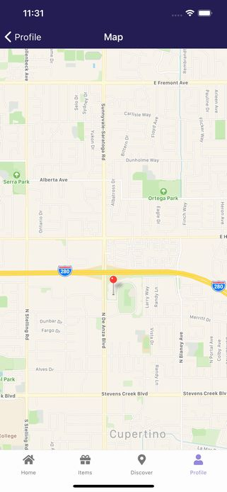

import { Link } from 'gatsby';

<Link to="/blog/2021-05-17">前回</Link>の続きです。

リリースした新作アプリ**Find Good One**の仕組みやコードを書きます。

## Profile Stack

プロフィール画面(編集可能)と宝箱設置機能を作っていきます。

## Profile

自分のプロフィールを表示する画面です。アバターをタップして画像を選択&アップロード、Nameはそのままテキストボックスになっており編集可能です。

`Update`ボタンをタップしてプロフィールを更新します。Mapを押したときには宝箱設置のためのマップ画面に遷移します。マップ画面では現在地を中心にしたいのでこの画面で現在の座標を取得しておきます。


**src\scenes\profile\Profile.js**

```javascript
import React, { useState, useEffect } from 'react'
import { Text, View, StatusBar, Image, ScrollView, TouchableOpacity, Platform } from 'react-native'
import styles from './styles'
import { firebase } from '../../../firebase'
import { Restart } from 'fiction-expo-restart'
import * as Location from 'expo-location'
import { Avatar } from 'react-native-elements'
import * as ImagePicker from 'expo-image-picker'
import Constants from 'expo-constants'
import { Input } from 'galio-framework'

export default function Profile( props ) {
  const [location, setLocation] = useState(null)
  const [fullName, setFullName] = useState(props.extraData.fullName)
  const [progress, setProgress] = useState('')
  const [avatar, setAvatar] = useState(props.extraData.avatar)
  const userData = props.extraData

  useEffect(() => {
    (async () => {
      let location = await Location.getCurrentPositionAsync({})
      setLocation(location)
    })();
  }, []);

  const ImageChoiceAndUpload = async () => {
    try {
      if (Constants.platform.ios) {
        const { status } = await ImagePicker.requestMediaLibraryPermissionsAsync()
        if (status !== 'granted') {
          alert("Permission is required for use.");
          return;
        }
      }
      const result = await ImagePicker.launchImageLibraryAsync();
        if (!result.cancelled) {
          const localUri = await fetch(result.uri);
          const localBlob = await localUri.blob();
          const filename = userData.id + new Date().getTime()
          const storageRef = firebase.storage().ref().child("avatar/" + filename);
          const putTask = storageRef.put(localBlob);
          putTask.on('state_changed', (snapshot) => {
            let progress = (snapshot.bytesTransferred / snapshot.totalBytes) * 100;
            setProgress(parseInt(progress) + '%')
          }, (error) => {
            console.log(error);
            alert("Upload failed.");
          }, () => {
            putTask.snapshot.ref.getDownloadURL().then(downloadURL => {
              setProgress('')
              setAvatar(downloadURL)
            })
          })
        }
    } catch (e) {
        console.log('error',e.message);
        alert("The size may be too much.");
    }
  }

  const profileUpdate = () => {
    const data = {
      id: userData.id,
      email: userData.email,
      fullName: fullName,
      avatar: avatar,
    }
    const userRef2 = firebase.firestore().collection('users2').doc(userData.email)
    userRef2.update(data)
    const userRef = firebase.firestore().collection('users').doc(userData.id)
    userRef.update(data)
  }

  function goMap() {
    if (userData.treasure != undefined) {
      const treasureNum = userData.treasure.length
      if (treasureNum < 10) {
        props.navigation.navigate('Map', {Data: userData, Location: location})
      } else {
        alert('The maximum number of treasures that can be placed is 10.')
      }
    } else {
      props.navigation.navigate('Map', {Data: userData, Location: location})
    }
  }

  const signOut = () => {
    firebase.auth().signOut()
    Restart()
  }

  return (
    <View style={styles.root}>
    <StatusBar barStyle="light-content" />
      <ScrollView style={{ flex: 1, width: '100%' }}>
        <View>
          <View style={styles.avatar}>
            <Avatar
              size="xlarge"
              rounded
              title="NI"
              source={{ uri: avatar }}
              onPress={ImageChoiceAndUpload}
            />
          </View>
          <Text style={{ alignSelf: 'center' }}>{progress}</Text>
          <Text style={styles.field}>Name:</Text>
          <View style={styles.input}>
            <Input
              name='name'
              placeholder={fullName}
              rounded
              onChangeText={(text) => setFullName(text)}
              value={fullName}
          />
          </View>
          <Text style={styles.field}>Mail:</Text>
          <Text style={styles.title}>{userData.email}</Text>
          <TouchableOpacity style={styles.pbutton} onPress={profileUpdate}>
            <Text style={styles.buttonText}>Update</Text>
          </TouchableOpacity>
          {location?
            <TouchableOpacity style={styles.button} onPress={goMap}>
              <Text style={styles.buttonText}>Map</Text>
            </TouchableOpacity>:
            <View style={styles.nonbutton}>
              <Text style={styles.buttonText}>Waiting...</Text>
            </View>
          }
          <View style={styles.footerView}>
            <Text onPress={signOut} style={styles.footerLink}>Sign out</Text>
          </View>
        </View>
      </ScrollView>
    </View>
  )
}
```

マウント時に`getCurrentPositionAsync`で現在の座標を取得して`location`にセットします。

```javascript
const [location, setLocation] = useState(null)
```

```javascript
useEffect(() => {
  (async () => {
    let location = await Location.getCurrentPositionAsync({})
    setLocation(location)
  })();
}, []);
```

アバター画像アップロード用の関数です。PINE proで実装したコードからの流用です。

```javascript
const ImageChoiceAndUpload = async () => {
  try {
    if (Constants.platform.ios) {
      const { status } = await ImagePicker.requestMediaLibraryPermissionsAsync()
      if (status !== 'granted') {
        alert("Permission is required for use.");
        return;
      }
    }
    const result = await ImagePicker.launchImageLibraryAsync();
      if (!result.cancelled) {
        const localUri = await fetch(result.uri);
        const localBlob = await localUri.blob();
        const filename = userData.id + new Date().getTime()
        const storageRef = firebase.storage().ref().child("avatar/" + filename);
        const putTask = storageRef.put(localBlob);
        putTask.on('state_changed', (snapshot) => {
          let progress = (snapshot.bytesTransferred / snapshot.totalBytes) * 100;
          setProgress(parseInt(progress) + '%')
        }, (error) => {
          console.log(error);
          alert("Upload failed.");
        }, () => {
          putTask.snapshot.ref.getDownloadURL().then(downloadURL => {
            setProgress('')
            setAvatar(downloadURL)
          })
        })
      }
  } catch (e) {
      console.log('error',e.message);
      alert("The size may be too much.");
  }
}
```

Updateボタンをタップしたときに動かす関数です。プロフィールをアップデートします。

```javascript
const profileUpdate = () => {
  const data = {
    id: userData.id,
    email: userData.email,
    fullName: fullName,
    avatar: avatar,
  }
  const userRef2 = firebase.firestore().collection('users2').doc(userData.email)
  userRef2.update(data)
  const userRef = firebase.firestore().collection('users').doc(userData.id)
  userRef.update(data)
}
```

Mapボタンをタップしたときに動かす関数です。宝箱を設置する座標を設定するためにマップ画面に遷移するためのものです。宝箱の最大設置数(10個)を制限しています。

```javascript
function goMap() {
  if (userData.treasure != undefined) { // userData.treasureは設置した宝箱のIDが列挙された配列。undefined(空)じゃないときは設置した宝箱の数を確認する
    const treasureNum = userData.treasure.length // 配列の要素を数える
    if (treasureNum < 10) { // 要素が10以下ならマップ画面に遷移する
      props.navigation.navigate('Map', {Data: userData, Location: location}) // マップ画面には取得した座標と自分のユーザーデータを渡す
    } else { // 要素が10以下じゃなければアラートを出して終了
      alert('The maximum number of treasures that can be placed is 10.')
    }
  } else { // undefined(空)であれば宝箱を設置してないということなのでマップ画面に遷移する
    props.navigation.navigate('Map', {Data: userData, Location: location})
  }
}
```

サインアウトボタンを押したときに動かす関数です。`signOut`メソッドでログアウトしたらアプリごと再起動してログイン判定をやりなおします。

```javascript
const signOut = () => {
  firebase.auth().signOut()
  Restart()
}
```

表示部です。座標取得には時間がかかるので`location`が空の間はグレーアウトさせておきます。

```javascript
{location?
  <TouchableOpacity style={styles.button} onPress={goMap}>
    <Text style={styles.buttonText}>Map</Text>
  </TouchableOpacity>:
  <View style={styles.nonbutton}>
    <Text style={styles.buttonText}>Waiting...</Text>
  </View>
}
```

Profile画面は以上です。

## Map

宝箱を設置する座標を選択する画面です。遷移時は前の画面で取得した座標にマーカーが表示されています。任意の箇所をタップするとマーカーが移動します。マーカーをタップすると次の画面(Set画面、宝箱の名前などを設定する)に遷移します。



**src\scenes\map\Map.js**

```javascript
import React, { useState, useEffect } from 'react'
import { View, StatusBar, Platform } from 'react-native'
import styles from './styles'
import MapView, { Marker, PROVIDER_GOOGLE } from 'react-native-maps'

export default function Map({ route, navigation }) {
  const data = route.params.Data
  const location = route.params.Location.coords
  const [region, setRegion] = useState(location)

  const initialRegion = {
    latitude : region.latitude,
    longitude : region.longitude,
    latitudeDelta : 0.0460,
    longitudeDelta : 0.0260,
  }

  const coordinate = {
    latitude : region.latitude,
    longitude : region.longitude,
  }

  const stopPropagation = thunk => e => {
    e.stopPropagation();
    thunk();
  };

  function setTreasure() {
    navigation.navigate('Set', {Data: data, Location: coordinate})
  }
  
  return (
    <View style={styles.root}>
    <StatusBar barStyle="light-content" />
      {Platform.OS === 'ios'?
      <View style={styles.mapcontainer}>
        <MapView
          style={styles.map}
          initialRegion={initialRegion}
          onPress={(e)=> { stopPropagation( setRegion(e.nativeEvent.coordinate) ) }}
        >
          <Marker
            coordinate={coordinate}
            onPress={setTreasure}
          />
        </MapView>
      </View>:
      <View style={styles.androidmapcontainer}>
        <MapView
          style={styles.android}
          initialRegion={initialRegion}
          provider={PROVIDER_GOOGLE}
          onPress={(e)=> { stopPropagation( setRegion(e.nativeEvent.coordinate) ) }}
        >
          <Marker
            coordinate={coordinate}
            onPress={setTreasure}
          />
        </MapView>
      </View>
      }
    </View>
  )
}
```

前の画面から受け取った自分の情報と現在地の座標を格納します。

```javascript
const data = route.params.Data // 自分の情報を格納
const location = route.params.Location.coords // 現在地の座標を格納
const [region, setRegion] = useState(location) // 格納した座標をstateにセット

const initialRegion = { // 受け取った座標の緯度経度を格納。マップ用
    latitude : region.latitude,
    longitude : region.longitude,
    latitudeDelta : 0.0460,
    longitudeDelta : 0.0260,
  }

  const coordinate = { // 受け取った座標の緯度経度を格納。マーカー用
    latitude : region.latitude,
    longitude : region.longitude,
  }
```

マーカーをタップしたときに、そのままではマップをタップしたことになってしまうのでマーカーと同じ座標であればタップとして判定しないようにする必要があります。以下がそのための関数です。

```javascript
const stopPropagation = thunk => e => {
  e.stopPropagation();
  thunk();
};
```

次の画面(Set、宝箱の名前などを設定する画面)に遷移するための関数です。自分の情報`data`とマーカーの座標`coordinate`を渡します。

```javascript
function setTreasure() {
  navigation.navigate('Set', {Data: data, Location: coordinate})
}
```

表示部です。iOSかAndroidかによってマップのプロバイダーを出し分けます。AndroidのときにはGoogle Mapsを表示します。`MapView`と`Marker`の初期値には上で定義した座標を渡します。

```javascript
{Platform.OS === 'ios'?
<View style={styles.mapcontainer}>
  <MapView
    style={styles.map}
    initialRegion={initialRegion}
    onPress={(e)=> { stopPropagation( setRegion(e.nativeEvent.coordinate) ) }}
  >
    <Marker
      coordinate={coordinate}
      onPress={setTreasure}
    />
  </MapView>
</View>:
<View style={styles.androidmapcontainer}>
  <MapView
    style={styles.android}
    initialRegion={initialRegion}
    provider={PROVIDER_GOOGLE}
    onPress={(e)=> { stopPropagation( setRegion(e.nativeEvent.coordinate) ) }}
  >
    <Marker
      coordinate={coordinate}
      onPress={setTreasure}
    />
  </MapView>
</View>
}
```

Map画面は以上です。

## Set

宝箱の画像、名前、コメントを設置する画面です。画像をタップしてイメージピッカーから選択した画像をアップロードします。


**src\scenes\set\Set.js**

```javascript
import React, { useState, useEffect } from 'react'
import { Text, View, StatusBar, Image, TouchableOpacity } from 'react-native'
import styles from './styles'
import { Divider, Avatar } from 'react-native-elements'
import { KeyboardAwareScrollView } from 'react-native-keyboard-aware-scroll-view'
import { Input } from 'galio-framework'
import { firebase } from '../../../firebase'
import * as ImagePicker from 'expo-image-picker'
import Constants from 'expo-constants'

export default function Set({ route, navigation }) {
  const data = route.params.Data
  const region = route.params.Location
  const [treasureName, setTreasureName] = useState('')
  const [comment, setComment] = useState('')
  const [progress, setProgress] = useState('')
  const [treasureImage, setTreasureImage] = useState('https://firebasestorage.googleapis.com/v0/b/maptrap.appspot.com/o/logo.jpg?alt=media&token=761783a0-6e90-4b9f-a46d-c753523e9f25')

  const ImageChoiceAndUpload = async () => {
    try {
      if (Constants.platform.ios) {
        const { status } = await ImagePicker.requestMediaLibraryPermissionsAsync()
        if (status !== 'granted') {
          alert("Permission is required for use.");
          return;
        }
      }
      const result = await ImagePicker.launchImageLibraryAsync();
        if (!result.cancelled) {
          const localUri = await fetch(result.uri);
          const localBlob = await localUri.blob();
          const filename = data.id + new Date().getTime()
          const storageRef = firebase.storage().ref().child("images/" + filename);
          const putTask = storageRef.put(localBlob);
          putTask.on('state_changed', (snapshot) => {
            let progress = (snapshot.bytesTransferred / snapshot.totalBytes) * 100;
            setProgress(parseInt(progress) + '%')
          }, (error) => {
            console.log(error);
            alert("Upload failed.");
          }, () => {
            putTask.snapshot.ref.getDownloadURL().then(downloadURL => {
              setProgress('')
              setTreasureImage(downloadURL)
            })
          })
        }
    } catch (e) {
        console.log('error',e.message);
        alert("The size may be too much.");
    }
  }

  function setTreasure() {
    const treasureRef = firebase.firestore().collection('treasures').doc()
    treasureRef.set({
      identifier: treasureRef.id,
      radius: 200,
      id: treasureRef.id,
      treasureName: treasureName,
      comment: comment,
      latitude: region.latitude,
      longitude: region.longitude,
      createdTime: new Date().getTime(),
      createrEmail: data.email,
      createrId: data.id,
      treasureImage: treasureImage
    })
    const userRef1 = firebase.firestore().collection('users').doc(data.id)
    userRef1.update({
      treasure: firebase.firestore.FieldValue.arrayUnion(treasureRef.id)
    })
    const userRef2 = firebase.firestore().collection('users2').doc(data.email)
    userRef2.update({
      treasure: firebase.firestore.FieldValue.arrayUnion(treasureRef.id)
    })
    setTreasureName('')
    setComment('')
  }
  
  return (
    <View style={styles.root}>
    <StatusBar barStyle="light-content" />
      <View style={{ flex: 1, width: '100%' }}>
        <KeyboardAwareScrollView keyboardShouldPersistTaps="always">
          <View style={styles.container}>
            <TouchableOpacity style={styles.imagecontainer} onPress={ImageChoiceAndUpload}>
              <Image source={{uri: treasureImage}} style={styles.image}/>
            </TouchableOpacity>
            <Text style={styles.description}>Treasure Image</Text>
            <Text style={styles.description}>(tap and change image)</Text>
            <Text style={{ alignSelf: 'center' }}>{progress}</Text>
            <View style={styles.regionContainer}>
              <Text style={styles.description}>Coordinate</Text>
              <Text style={styles.coordinate}>{region.latitude}</Text>
              <Text style={styles.coordinate}>{region.longitude}</Text>
            </View>
            <Text>Treasure Name</Text>
            <Input
              name='name'
              placeholder="Treasure name"
              rounded
              onChangeText={(text) => setTreasureName(text)}
              value={treasureName}
            />
            <Text>Comments</Text>
            <Input
              name='comment'
              style={{height:150}}
              placeholder="your comment"
              rounded
              multiline={true}
              onChangeText={(text) => setComment(text)}
              value={comment}
            />
            <View style={styles.buttonContainer}>
              {comment?
                <TouchableOpacity style={styles.tbutton} onPress={setTreasure}>
                  <Text style={styles.buttonText}>Set</Text>
                </TouchableOpacity>:
                <View style={styles.nonbutton}>
                  <Text style={styles.buttonText}>Set</Text>
                </View>
              }
            </View>
          </View>
        </KeyboardAwareScrollView>
      </View>
    </View>
  )
}
```

画像のアップロードや前の画面から受け取った情報の格納などはここまでやってきたことの繰り返しです。

コメントが空のときに宝箱を設置できないように`comment`を三項演算子で評価して空のときはグレーアウトさせます。

```javascript
{comment?
  <TouchableOpacity style={styles.tbutton} onPress={setTreasure}>
    <Text style={styles.buttonText}>Set</Text>
  </TouchableOpacity>:
  <View style={styles.nonbutton}>
    <Text style={styles.buttonText}>Set</Text>
  </View>
}
```

## Google Maps SDKを接続する

<Link to="/blog/2021-05-14">Part 1</Link>で書いたように、Androidでマップを表示するためにはGoogle Maps SDKのAPI keyを設定する必要があります。

[Expoのドキュメント](https://docs.expo.io/versions/latest/sdk/map-view/)に従うのですが、Expo Goアプリで動作確認ができないこともあり少し詰まりました。

ドキュメントには

- Play ConsoleからAPI keyを取得する方法
- expoからfetchする方法

の二つが説明されてますが、自分がどっちなのか分かりませんでした。私の場合は**Play Consoleから取得**する方が正解でした。

Play Consoleのアプリの完全性で取得できるSHA-1です。


上で取得したSHA-1をGCP管理画面に設定する必要があります。


そして、取得したAPI keyを**app.json**に記述します。

```javascript
"android": {
  "package": "net.votepurchase.fgo",
  "versionCode": 10,
  "googleServicesFile": "./google-services.json",
  "config": {
    "googleMaps": {
      "apiKey": "見せられないよ"
    }
  },
  "permissions": [
    "ACCESS_COARSE_LOCATION",
    "ACCESS_FINE_LOCATION",
    "ACCESS_BACKGROUND_LOCATION",
    "FOREGROUND_SERVICE"
  ]
},
```

当たり前すぎることだからなんだろうと思いますが、意外とここまで書いてくれている記事やトピックがなくて苦労しました。

## まとめ

プロフィール編集と宝箱の設置は以上です。

[レポジトリ](https://github.com/kiyohken2000/maptrap)

---