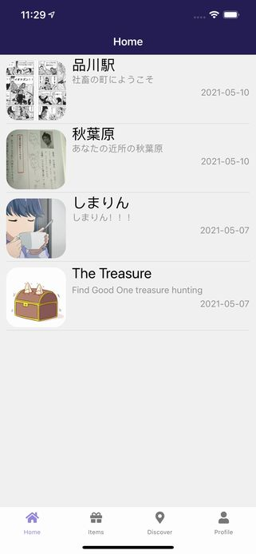
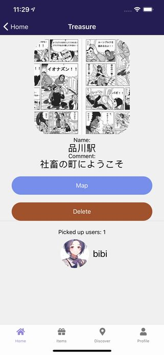
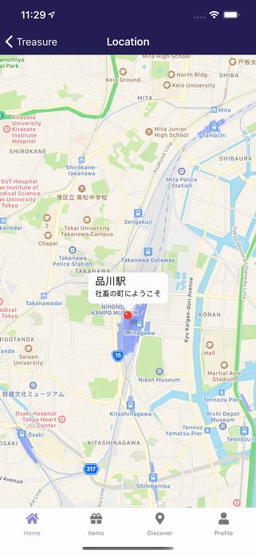

import { Link } from 'gatsby';

<Link to="/blog/2021-05-18">前回</Link>の続きです。

リリースした新作アプリ**Find Good One**の仕組みやコードを書きます。

## Home Stack

設置した宝箱の管理機能を作っていきます。設置した宝箱の表示と削除を行います。

## Home

設置した宝箱を一覧する画面です。それぞれの宝箱をタップすると個々の宝箱の画面に遷移します。自分の持ってる配列を元にFirestoreから情報をフェッチするというのはPINE proで経験しているのでコードを流用できました。



**src\scenes\home\Home.js**

```javascript
import React, { useState, useEffect } from 'react'
import { Text, View, StatusBar, Image, ScrollView, TouchableOpacity } from 'react-native'
import styles from './styles'
import { firebase } from '../../../firebase'
import { Divider, Avatar } from 'react-native-elements'
import * as Location from "expo-location"

export default function Home(props) {
  const [theArray, setTheArray] = useState([])
  const [errorMsg, setErrorMsg] = useState(null)
  const userData = props.extraData
  const treasures = userData.treasure?userData.treasure:['8WyBRI10fj80tjgVUXUd', 'KKOq3faOBaZSA2hNUZ6l']

  useEffect(() => { // 本来アプリ起動時に位置情報権限の取得をしたかったがGoogle Play対策としてログイン後最初に開くこの画面でパーミッションを取得する
    (async () => {
      let { status } = await Location.requestForegroundPermissionsAsync(); // フォアグラウンドロケーション権限を取得
        if (status !== "granted") {
          setErrorMsg("Permission to access location was denied");
          return;
        }
        let bg = await Location.requestBackgroundPermissionsAsync(); // バックグラウンドロケーション権限を取得
        if (bg.status !== "granted") {
          setErrorMsg("Permission to access location was denied");
          return;
        }
    })();
  },[])

  useEffect(() => { // マウント時にFirestoreから宝箱の情報を取得する
    setTheArray([])
    for (const treasure of treasures) { // 自分の持ってる宝箱の配列をfor loopで回してstateに格納していく
      const treasureRef = firebase.firestore().collection('treasures').doc(treasure)
      treasureRef.get().then((doc) => {
        if (doc.exists) {
          treasureRef
          .onSnapshot(function(document) {
            const data = document.data()
            setTheArray(oldArray => [...oldArray, data])
          })
        } else {
          null
        }
      })
    }
  },[])

  theArray.sort(function(a, b) { // 格納した宝箱を作成日時順に並べ替え
    if (a.createdTime > b.createdTime) {
      return -1;
    } else {
      return 1;
    }
  })

  var myTreasure = theArray.filter(function(v1,i1,a1){ // 同じIDがあれば重複を防ぐために取り除く
    return (a1.findIndex(function(v2){ 
      return (v1.id===v2.id) 
    }) === i1);
  });

  function displaytime(timestamp) { // FirestoreにはUNIX時間で保存しているので表示時は分かりやすいようにyyyy-mm-dd表記に変換する
    const time = new Date(timestamp).toISOString().substr(0, 10)
    return time
 }

  return (
    <View style={styles.root}>
    <StatusBar barStyle="light-content" />
      <View style={{ flex: 1, width: '100%' }}>
        {treasures?<ScrollView>
          {
            myTreasure.map((treasure, i) => {
              return (
                <View key={i} style={styles.item}>
                  <TouchableOpacity onPress={() => props.navigation.navigate('Treasure', { treasureData: treasure, myProfile: userData })}> {/*宝箱の情報と自分の情報を次の画面に渡す*/}
                    <View style={{flexDirection: 'row'}}>
                      <View style={styles.imagecontainer}>
                        <Image source={{uri: treasure.treasureImage}} style={styles.image}/>
                      </View>
                      <View style={{ flex: 1, width: '100%' }}>
                        <Text style={styles.title} numberOfLines={2}>{treasure.treasureName}</Text>
                        <Text style={styles.comment} numberOfLines={2}>{treasure.comment}</Text>
                        <Text style={styles.date}>{displaytime(treasure.createdTime)}</Text>
                      </View>
                    </View>
                  </TouchableOpacity>
                  <Divider />
                </View>
              )
            })
          }
        </ScrollView>:
        <Text>No data</Text>}
      </View>
    </View>
  )
}
```

アプリを起動したときに表示されるのがこの画面です。初めてアプリを開いたときにいきなり空の画面が表示されるのはよろしくありません。なので自分の設置した宝箱`userData.treasure`が空の時はサンプル宝箱を表示するようにしました。空の時に`treasures`にセットしているのはサンプル宝箱のIDです。

```javascript
const treasures = userData.treasure?userData.treasure:['8WyBRI10fj80tjgVUXUd', 'KKOq3faOBaZSA2hNUZ6l']
```

## Treasure

個々の宝箱の情報を表示する画面です。Mapをタップしてマップ画面に遷移して座標を表示、Deleteで宝箱を削除できるようにします。宝箱を取得したユーザーも表示します。



**src\scenes\treasure\Treasure.js**

```javascript
import React, { useState, useEffect } from 'react'
import { Text, View, StatusBar, Image, ScrollView, TouchableOpacity, Platform } from 'react-native'
import styles from './styles'
import { firebase } from '../../../firebase'
import { Divider, Avatar } from 'react-native-elements'

export default function Treasure({ route, navigation}) {
  const treasure = route.params.treasureData // 前の画面から受け取った宝箱の情報を格納
  const myProfile = route.params.myProfile // 前の画面から受け取った自分の情報を格納
  const picked = treasure.picked?treasure.picked:[myProfile.email] // 宝箱を取得したユーザーを列挙した配列を格納する。空だとエラーになるのでそのときは自分が拾ったことにする
  const [theArray, setTheArray] = useState([])

  useEffect(() => { // マウント時に宝箱を取得したユーザーの情報を取得する
    setTheArray([])
    for (const u of picked) { // 宝箱を取得したユーザーを列挙した配列をfor loopで回して情報をstateに格納する
      const usersRef = firebase.firestore().collection('users2').doc(u)
      usersRef.get().then((doc) => {
        if (doc.exists) {
          usersRef
          .onSnapshot(function(document) {
            const data = document.data()
            setTheArray(oldArray => [...oldArray, data])
          })
        } else {
          null
        }
      })
    }
  },[])

  theArray.reverse() // 最近取得したユーザーを先頭にしたいので.reverse()メソッドを使用

  const n = theArray.length // この宝箱を取得したユーザー数も表示したいので配列の要素を数える

  function goMap() { // 宝箱の座標をマップ上にマーカーとして表示したい。そのためマップに遷移すると同時に宝箱の座標を渡す。
    navigation.navigate('Location', {Location: treasure})
  }

  function delTreasure() { // 宝箱を削除する関数
    const userRef2 = firebase.firestore().collection('users2').doc(myProfile.email)
    const userRef = firebase.firestore().collection('users').doc(myProfile.id) 
    const treasureRef = firebase.firestore().collection('treasures').doc(treasure.id)
    userRef2.update({
      treasure: firebase.firestore.FieldValue.arrayRemove(treasure.id) // 自分の配列から宝箱のIDを削除
    })
    userRef.update({
      treasure: firebase.firestore.FieldValue.arrayRemove(treasure.id) // 自分の配列から宝箱のIDを削除
    })
    treasureRef.delete().then(() => { // この宝箱のドキュメントを削除
      console.log("Document successfully deleted!");
    }).catch((error) => {
        console.error("Error removing document: ", error);
    })
    navigation.goBack()
  }

  return (
    <View style={styles.root}>
    <StatusBar barStyle="light-content" />
      <ScrollView style={{ flex: 1, width: '100%' }}>
        <View style={styles.imagecontainer}>
          <Image source={{uri: treasure.treasureImage}} style={styles.image}/>
        </View>
        <Text style={styles.field}>Name:</Text>
        <Text style={styles.title}>{treasure.treasureName}</Text>
        <Text style={styles.field}>Comment:</Text>
        <Text style={styles.title}>{treasure.comment}</Text>
        <TouchableOpacity style={styles.button} onPress={goMap}>
          <Text style={styles.buttonText}>Map</Text>
        </TouchableOpacity>
        <TouchableOpacity style={styles.delbutton} onPress={delTreasure}>
          <Text style={styles.buttonText}>Delete</Text>
        </TouchableOpacity>
        <Divider />
        <Text style={styles.picked}>Picked up users: {n}</Text>
        {
          theArray.map((u, i) => {
            return (
              <View key={i} style={{flexDirection: 'row', flex: 1, alignItems: 'center', justifyContent: 'center'}}>
                <View style={styles.avatar}>
                  <Avatar
                    size="large"
                    rounded
                    title="NI"
                    source={{ uri: u.avatar }}
                  />
                </View>
                  <Text style={styles.title} numberOfLines={1}>{u.fullName}</Text>
              </View>
            )
          })
        }
      </ScrollView>
    </View>
  )
}
```

## Location

宝箱の座標をマップ上に表示する画面です。マーカーで示して、タップしたら宝箱の名前とコメントを表示します。

宝箱の設置時とほぼ同じですが、設置のときと違いここからの画面遷移がないため記述は少ないです。



**src\scenes\location\Location.js**

```javascript
import React, { useState, useEffect } from 'react'
import { Text, View, StatusBar, Platform } from 'react-native'
import styles from './styles'
import MapView, { Marker, PROVIDER_GOOGLE } from 'react-native-maps'

export default function Location({  route, navigation }) {
  const location = route.params.Location // 前の画面から受け取った宝箱の情報を格納

  const initialRegion = { // マップの初期座標に受け取った緯度経度をセット
    latitude : location.latitude,
    longitude : location.longitude,
    latitudeDelta : 0.0460,
    longitudeDelta : 0.0260,
  }

  const coordinate = { // マーカーの初期座標にも受け取った緯度経度をセット
    latitude : location.latitude,
    longitude : location.longitude,
  }

  return (
    <View style={styles.root}>
    <StatusBar barStyle="light-content" />
      {Platform.OS === 'ios'?
      <View style={styles.mapcontainer}>
        <MapView
          style={styles.map}
          initialRegion={initialRegion}
        >
          <Marker
            coordinate={coordinate}
            title={location.treasureName} // マーカーのタイトルと解説に宝箱の名前とコメントをセット
            description={location.comment}
          />
        </MapView>
      </View>:
      <View style={styles.androidmapcontainer}>
        <MapView
          style={styles.android}
          initialRegion={initialRegion}
          provider={PROVIDER_GOOGLE}
        >
          <Marker
            coordinate={coordinate}
            title={location.treasureName}
            description={location.comment}
          />
        </MapView>
      </View>
      }
    </View>
  )
}
```

## まとめ

自分の宝箱の管理機能は以上です。

[レポジトリ](https://github.com/kiyohken2000/maptrap)

---