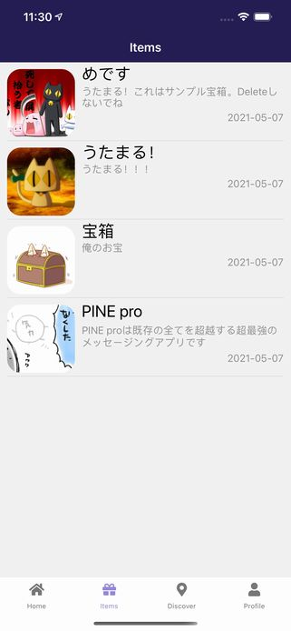
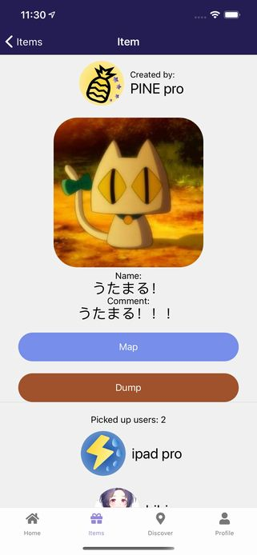
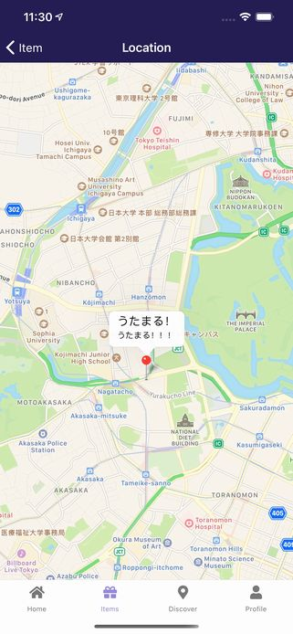

import { Link } from 'gatsby';

<Link to="/blog/2021-05-19">前回</Link>の続きです。

リリースした新作アプリ**Find Good One**の仕組みやコードを書きます。

## Items Stack

取得した宝箱を表示と管理する機能を作っていきます。取得した宝箱の表示と削除を行います。Home Stackとほとんど同じです。

## Items

取得した宝箱を一覧する画面です。それぞれの宝箱をタップして各宝箱の情報を表示する画面に遷移します。



**src\scenes\items\Items.js**

```javascript
import React, { useState, useEffect } from 'react'
import { Text, View, StatusBar, Image, ScrollView, TouchableOpacity, Platform } from 'react-native'
import styles from './styles'
import { firebase } from '../../../firebase'
import { Divider } from 'react-native-elements'

export default function Items(props) {
  const userData = props.extraData
  const [theArray, setTheArray] = useState([])
  const items = userData.items?userData.items:['F8574LKGHDWrFp8kiXSo', 'GlQXgZXkHjRS76bjVXmX'] // Home画面と同じく空の場合はサンプル宝箱のIDを入れる

  useEffect(() => { // マウント時に宝箱の情報を取得する
    setTheArray([])
    for (const item of items) { // 取得した宝箱のIDを列挙した配列をfor loopで回してstateに格納
      const treasureRef = firebase.firestore().collection('treasures').doc(item)
      treasureRef.get().then((doc) => {
        if (doc.exists) {
          treasureRef
          .onSnapshot(function(document) {
            const data = document.data()
            setTheArray(oldArray => [...oldArray, data])
          })
        } else {
          null
        }
      })
    }
  },[])

  theArray.reverse() // 宝箱は取得した逆順に並べ替える

  var myItems = theArray.filter(function(v1,i1,a1){  // 重複するIDを持つ宝箱を削除
    return (a1.findIndex(function(v2){ 
      return (v1.id===v2.id) 
    }) === i1);
  });

  function displaytime(timestamp) { // UNIX時間で保存されてる作成日時をyyyy-mm-dd表記に変換
    const time = new Date(timestamp).toISOString().substr(0, 10)
    return time
 }

  return (
    <View style={styles.root}>
    <StatusBar barStyle="light-content" />
      <View style={{ flex: 1, width: '100%' }}>
        {items?<ScrollView>
          {
            myItems.map((item, i) => {
              return (
                <View key={i} style={styles.item}>
                  <TouchableOpacity onPress={() => props.navigation.navigate('Item', { itemData: item, myProfile: userData })}>
                    <View style={{flexDirection: 'row'}}>
                      <View style={styles.imagecontainer}>
                        <Image source={{uri: item.treasureImage}} style={styles.image}/>
                      </View>
                      <View style={{ flex: 1, width: '100%' }}>
                        <Text style={styles.title} numberOfLines={2}>{item.treasureName}</Text>
                        <Text style={styles.comment} numberOfLines={2}>{item.comment}</Text>
                        <Text style={styles.date}>{displaytime(item.createdTime)}</Text>
                      </View>
                    </View>
                  </TouchableOpacity>
                  <Divider />
                </View>
              )
            })
          }
        </ScrollView>:
        <Text>No data</Text>}
      </View>
    </View>
  )
}
```

## Item

個々の宝箱の情報を表示する画面です。Mapをタップしてマップ画面に遷移して座標を表示します。Dumpをタップして自分のアイテムリストから削除します。ここでは自分の一覧から削除するだけで宝箱は削除されません。

宝箱の名前、画像、コメントの他にも宝箱を設置したユーザーと宝箱を取得したユーザーも表示します。



**src\scenes\item\Item.js**

```javascript
import React, { useState, useEffect } from 'react'
import { Text, View, StatusBar, Image, ScrollView, TouchableOpacity, Platform } from 'react-native'
import styles from './styles'
import { firebase } from '../../../firebase'
import { Divider, Avatar } from 'react-native-elements'

export default function Item({ route, navigation }) {
  const userData = route.params.myProfile // 前の画面から受け取った自分の情報を格納
  const item = route.params.itemData // 前の画面から受け取った宝箱の情報を格納
  const picked = item.picked?item.picked:[userData.email] // 宝箱を取得したユーザーを列挙した配列を格納、空ならとりあえず自分を入れておく
  const [theArray, setTheArray] = useState([])
  const [user, setUser] = useState([])

  useEffect(() => { // マウント時に宝箱を設置したユーザー、取得したユーザーの情報を取得
    const treasureRef = firebase.firestore().collection('users2').doc(item.createrEmail) // 宝箱を設置したユーザーの情報を取得
    treasureRef.get().then((doc) => {
      if (doc.exists) {
        treasureRef
        .onSnapshot(function(document) {
          const data = document.data()
          setUser(data)
        })
      } else {
        null
      }
    })
    setTheArray([])
    for (const u of picked) { // 宝箱を取得したユーザーを列挙した配列をfor loopで回してそれぞれのユーザー情報を取得
      const usersRef = firebase.firestore().collection('users2').doc(u)
      usersRef.get().then((doc) => {
        if (doc.exists) {
          usersRef
          .onSnapshot(function(document) {
            const data = document.data()
            setTheArray(oldArray => [...oldArray, data])
          })
        } else {
          null
        }
      })
    }
  },[])

  theArray.reverse() // 宝箱を取得したユーザーを取得した逆順に並べ替える

  const n = theArray.length // 取得したユーザーの数を数える

  function goMap() { // マップ画面に遷移する関数、宝箱の情報を渡す
    navigation.navigate('Location', {Location: item})
  }

  function dump() { // 取得した宝箱リストから削除する関数
    const userRef2 = firebase.firestore().collection('users2').doc(userData.email)
    const userRef = firebase.firestore().collection('users').doc(userData.id)
    userRef2.update({
      items: firebase.firestore.FieldValue.arrayRemove(item.id)
    })
    userRef.update({
      items: firebase.firestore.FieldValue.arrayRemove(item.id)
    })
    navigation.goBack()
  }

  return (
    <View style={styles.root}>
    <StatusBar barStyle="light-content" />
      <ScrollView style={{ flex: 1, width: '100%' }}>
        <View style={{flexDirection: 'row', flex: 1, alignItems: 'center', justifyContent: 'center'}}>
          <View style={styles.avatar}>
            <Avatar
              size="large"
              rounded
              title="NI"
              source={{ uri: user.avatar }}
            />
          </View>
          <View>
            <Text style={styles.filed}>Created by:</Text>
            <Text style={styles.title} numberOfLines={1}>{user.fullName}</Text>
          </View>
        </View>
        <View style={styles.imagecontainer}>
          <Image source={{uri: item.treasureImage}} style={styles.image}/>
        </View>
        <Text style={styles.field}>Name:</Text>
        <Text style={styles.title}>{item.treasureName}</Text>
        <Text style={styles.field}>Comment:</Text>
        <Text style={styles.title}>{item.comment}</Text>
        <TouchableOpacity style={styles.button} onPress={goMap}>
          <Text style={styles.buttonText}>Map</Text>
        </TouchableOpacity>
        <TouchableOpacity style={styles.dumpbutton} onPress={dump}>
          <Text style={styles.buttonText}>Dump</Text>
        </TouchableOpacity>
        <Divider />
        <Text style={styles.picked}>Picked up users: {n}</Text>
        {
          theArray.map((u, i) => {
            return (
              <View key={i} style={{flexDirection: 'row', flex: 1, alignItems: 'center', justifyContent: 'center'}}>
                <View style={styles.avatar}>
                  <Avatar
                    size="large"
                    rounded
                    title="NI"
                    source={{ uri: u.avatar }}
                  />
                </View>
                  <Text style={styles.title} numberOfLines={1}>{u.fullName}</Text>
              </View>
            )
          })
        }
      </ScrollView>
    </View>
  )
}
```

## Location

宝箱の座標をマップ上に表示する画面です。Home Stackで使ったものと同じコンポーネントのため省略します。



## まとめ

取得した宝箱の管理機能は以上です。

[レポジトリ](https://github.com/kiyohken2000/maptrap)

---