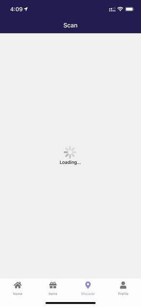
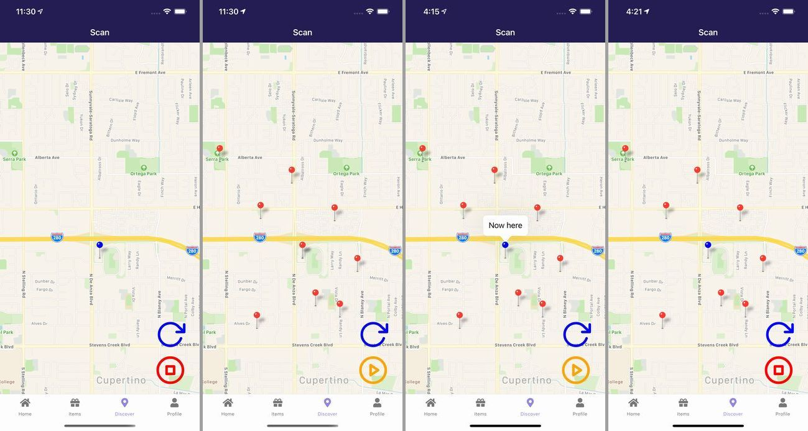

import { Link } from 'gatsby';

<Link to="/blog/2021-05-20">前回</Link>の続きです。

リリースした新作アプリ**Find Good One**の仕組みやコードを書きます。

## Scan

周囲の宝箱を探してジオフェンスに設定する画面です。

- 自分の位置情報を取得
- ローカル通知を定義
- 通知を開いたときの画面遷移を定義
- Firestoreから宝箱リストを取得して近い座標の宝箱だけを選り分ける
- 選り分けた宝箱リストをジオフェンスに設定

<br/>

ということで初めての挑戦が多くて苦労しました。

### ローディング表示

位置情報の取得には時間がかかるので、取得している最中はローディング画面を表示しておきます。



### 現在の座標と周囲の宝箱を表示

位置情報の取得が完了したら自分の座標をマップ上に表示(青いマーカー)します。右下の更新アイコンをタップしたらFirestoreから宝箱の情報を取得して座標による選り分けを行い赤いマーカーとしてマップ上に表示します。

オレンジの再生ボタンをタップしたらジオフェンスを開始(宝箱に接近したら通知される)、停止ボタンをタップしたらジオフェンスを終了(接近しても通知されない)という動きにします。

前述したようにジオフェンスに設定できる座標はiOSで20、Androidでは100までという制限があります。なので選り分けた自分の周囲の宝箱だけをジオフェンスにセットします。

つまり、マップ上に表示されている宝箱のみがジオフェンスに設定されるということです。

なので、更新ボタンを押して表示される宝箱が変わったらもう一度ジオフェンスを開始してもらうために、更新ボタンをタップしてもジオフェンスを終了するようにしました。



### 実際のコード

**src\scenes\scan\Scan.js**

```javascript
import React, { useState, useEffect } from 'react'
import { Text, View, StatusBar, Image, ScrollView, TouchableOpacity, Platform, ActivityIndicator } from 'react-native'
import styles from './styles'
import MapView, { Marker, PROVIDER_GOOGLE } from 'react-native-maps'
import { firebase } from '../../../firebase'
import * as Location from "expo-location"
import * as TaskManager from 'expo-task-manager'
import * as Notifications from 'expo-notifications'
import Icon from 'react-native-vector-icons/Feather'

Notifications.setNotificationHandler({
  handleNotification: async () => ({
    shouldShowAlert: true,
    shouldPlaySound: true,
    shouldSetBadge: false,
  }),
});

TaskManager.defineTask("test", ({ data: { eventType, region }, error }) => {
  if (error) {
    // check `error.message` for more details.
    return;
  }
  if (eventType === Location.LocationGeofencingEventType.Enter) {
    Notifications.scheduleNotificationAsync({
      content: {
        title: 'Discovering!!!',
        body: 'Open the Discover tab!',
        sound: 'default',
        data: { message: 'geofence notification message', id: region.identifier, type: 'local' },
      },
      trigger: null //{ seconds: 1 }
    });
  }
});

export default function Scan(props) {
  const [location, setLocation] = useState(null)
  const [treasuresArray, setTreasures] = useState([])
  const [scan, setScan] = useState(false)
  const [isLoading, setLoding] = useState(false)
  const userData = props.extraData
  const t = userData.treasure?userData.treasure:['D3N1apQknuBQX51MxFmG']
  const i = userData.items?userData.items:['D3N1apQknuBQX51MxFmG']
  const b = userData.block?userData.block:['D3N1apQknuBQX51MxFmG']
  const l = t.concat(i, b)

  Notifications.addNotificationResponseReceivedListener(e => {
    if (e.notification.request.content.data.type === 'local') {
      const treasureID = e.notification.request.content.data.id
      props.navigation.navigate('Discover', { treasureID: treasureID, myProfile: userData })
    } else { 
      props.navigation.navigate('Scan')
     }
  });

  async function start() {
    setScan(true)
    const arry = treasuresArray
    console.log('start scan')
    Location.startGeofencingAsync("test", arry);
  }

  function stop() {
    console.log('stop scan')
    setScan(false)
    Location.stopGeofencingAsync("test")
  }

  async function get() {
    (async () => {
      setLoding(true)
      let position = await Location.getCurrentPositionAsync({})
      setLocation(position)
      let p = location ? location : position
      await firebase.firestore().collection('treasures')
      .onSnapshot(querySnapshot => {
        const treasures = querySnapshot.docs.map(documentSnapshot => {
          const data = documentSnapshot.data()
          const e = l.includes(data.identifier)
          const lttd = p.coords.latitude - data.latitude
          const lngtd = p.coords.longitude - data.longitude
          if ( e != true && -0.08 <= lttd && lttd <= 0.08 && -0.08 <= lngtd && lngtd <= 0.08 ) {
            return {
              identifier: data.identifier,
              latitude: data.latitude,
              longitude: data.longitude,
              radius: data.radius,
            };
          } else {
            return
          }
        });
        const y = treasures.filter(v => !!v)
        console.log('y=',y)
        setTreasures(y);
      });
      setLoding(false)
      Location.stopGeofencingAsync("test")
      setScan(false)
    })();
  }

  useEffect(() => {
    let unmounted = false;
    (async () => {
      let position = await Location.getCurrentPositionAsync({})
      setLocation(position)
    })();
    return () => { unmounted = true };
  },[])

  useEffect(() => {
    async function getLocationAsync() {
      let isGeofencing = await Location.hasStartedGeofencingAsync("test");
      console.log(isGeofencing)
      if (!isGeofencing) {
        setScan(false)
      } else {
        setScan(true)
      }
    }
    getLocationAsync();
  }, []);

  const initialRegion = {
    latitude : location ? location.coords.latitude : 35.67594029207871,
    longitude : location ? location.coords.longitude : 139.74487945765574,
    latitudeDelta : 0.0460,
    longitudeDelta : 0.0260,
  }

  const coordinate = {
    latitude : location ? location.coords.latitude : 35.67594029207871,
    longitude : location ? location.coords.longitude : 139.74487945765574,
  }

  return (
    <View style={styles.root}>
    <StatusBar barStyle="light-content" />
    {location ?
    (
      Platform.OS === 'ios'?
        <View style={styles.mapcontainer}>
          <MapView
            style={styles.map}
            initialRegion={initialRegion}
          >
            <Marker
              coordinate={coordinate}
              pinColor='blue'
              title='Now here'
            />
            {treasuresArray.map((marker, index) => (
              <Marker
                key={index}
                coordinate={{ latitude : marker.latitude , longitude : marker.longitude }}
              />
            ))}
          </MapView>
        </View>:
        <View style={styles.androidmapcontainer}>
          <MapView
            style={styles.android}
            initialRegion={initialRegion}
            provider={PROVIDER_GOOGLE}
          >
            <Marker
              coordinate={coordinate}
              pinColor='blue'
              title='Now here'
            />
            {treasuresArray.map((marker, index) => (
              <Marker
                key={index}
                coordinate={{ latitude : marker.latitude , longitude : marker.longitude }}
              />
            ))}
          </MapView>
        </View>
    ) :
    (<View>
      <ActivityIndicator size="large" />
      <Text>Loading...</Text>
    </View>)
    }
      <View style={styles.Overlay}>
        <View style={{ position: 'absolute', right: 0, alignSelf:'center' }}>
          {location ?
            (isLoading ?
              (<View style={styles.serch}>
                <ActivityIndicator size="large" />
              </View>):
              (<TouchableOpacity style={styles.serch} onPress={get}>
                <Icon name="rotate-cw" size={65} color="blue"/>
              </TouchableOpacity>)
            ) :null
          }
          {location ?
            (scan ?
              (<TouchableOpacity onPress={stop}>
                <Icon name="stop-circle" size={65} color="red"/>
              </TouchableOpacity>) :
              (<TouchableOpacity onPress={start}>
                <Icon name="play-circle" size={65} color="orange"/>
              </TouchableOpacity>)
            ) :null
          }
        </View>
      </View>
    </View>
  )
}
```

以下2つはグローバルスコープで定義する必要があるため注意が必要でした。

`Notifications.setNotificationHandler`ではアプリがフォアグラウンドにあるときに通知が来た時の設定をしています。

```javascript
Notifications.setNotificationHandler({
  handleNotification: async () => ({
    shouldShowAlert: true,
    shouldPlaySound: true,
    shouldSetBadge: false,
  }),
});
```

`TaskManager.defineTask`は宝箱を発見したときに通知する内容を定義します。

`id: region.identifier`には見つけた宝箱のIDが入っています。これを利用して次の画面(Discover、宝箱の情報を表示する)に遷移したときに宝箱の情報をFirestoreから取得します。

```javascript
TaskManager.defineTask("test", ({ data: { eventType, region }, error }) => {
  if (error) {
    // check `error.message` for more details.
    return;
  }
  if (eventType === Location.LocationGeofencingEventType.Enter) { // ジオフェンスにEntryしたときの振る舞い(ここではローカル通知)
    Notifications.scheduleNotificationAsync({
      content: {
        title: 'Discovering!!!', // 通知のタイトル
        body: 'Open the Discover tab!', // 通知の本文
        sound: 'default', // 通知音の設定
        data: { message: 'geofence notification message', id: region.identifier, type: 'local' }, // 通知には表示されないがメタデータを設定できる
      },
      trigger: null // アラームとかスケジュール系の通知の場合、時間によって通知を送信するので設定する。今回は時間関係ないのでnull
    });
  }
});
```

ここからはローカルスコープに定義していきます。

フックなどを定義します。

```javascript
const [location, setLocation] = useState(null) // 現在地座標をセットするフック、これでローディング画面のオンオフも判定する
const [treasuresArray, setTreasures] = useState([]) // ジオフェンスに設定する宝箱を格納するフック
const [scan, setScan] = useState(false) // ジオフェンスの開始/終了ボタンの表示非表示を制御するフック
const [isLoading, setLoding] = useState(false) // 更新ボタンを押したときに表示するActivityIndicatorを制御するフック
const userData = props.extraData // 自分の情報
const t = userData.treasure?userData.treasure:['D3N1apQknuBQX51MxFmG'] // 自分の設置した宝箱が列挙された配列、空の場合は仮の宝箱ID
const i = userData.items?userData.items:['D3N1apQknuBQX51MxFmG'] // 取得済みの宝箱が列挙された配列、空の場合は仮の宝箱ID
const b = userData.block?userData.block:['D3N1apQknuBQX51MxFmG'] // ブロックした宝箱が列挙された配列、空の場合は仮の宝箱ID
const l = t.concat(i, b) // 上記3種類の宝箱はジオフェンスに設定しない宝箱です。ということで3つの配列を合体させておきます
```

通知をタップしたときのアクションを定義します。上で定義したローカル通知から受け取った`region.identifier`を`treasureID`に格納して、**Discover**に遷移するときに自分の情報`userData`と一緒に渡します。

```javascript
Notifications.addNotificationResponseReceivedListener(e => {
  if (e.notification.request.content.data.type === 'local') {
    const treasureID = e.notification.request.content.data.id
    props.navigation.navigate('Discover', { treasureID: treasureID, myProfile: userData })
  } else { 
    props.navigation.navigate('Scan')
    }
});
```

ジオフェンスの開始と終了をする関数を定義します。

```javascript
async function start() {
  setScan(true) // ジオフェンス中はハンドル用のフックをtrueにする
  const arry = treasuresArray // ジオフェンスとして設定する配列を変数に格納
  console.log('start scan')
  Location.startGeofencingAsync("test", arry); // ジオフェンス開始メソッドに配列を渡してジオフェンススタート
}

function stop() {
  console.log('stop scan')
  setScan(false) // ジオフェンス停止中はハンドル用のフックをfalseにする
  Location.stopGeofencingAsync("test") // ジオフェンス終了メソッドを呼び出す
}
```

Firestoreから全部の宝箱の情報を取得してその後に選り分ける関数です。非常に複雑になってしまいました。

```javascript
async function get() {
  (async () => {
    setLoding(true) // trueにしてActivityIndicatorを表示する
    let position = await Location.getCurrentPositionAsync({}) // 最初に画面を開いたときから現在地が変わってるかもしれないのでもう一度現在地の座標を取得する
    setLocation(position) // 取得した座標をstateにセット
    let p = location ? location : position // 更新ボタンを押せてる時点でlocationは空ではないはずだが念のため三項演算子で判定して現在地の座標を変数に格納
    await firebase.firestore().collection('treasures') // Firestoreから全宝箱の情報を取得
    .onSnapshot(querySnapshot => {
      const treasures = querySnapshot.docs.map(documentSnapshot => {
        const data = documentSnapshot.data() // 取得した宝箱1つ1つを.mapで回して配列に格納していく、その過程で上で定義した3種類のジオフェンスに設定しない宝箱を取り除く
        const e = l.includes(data.identifier) // 今取得した宝箱のIDが、自分の/取得済みの/ブロック済みの宝箱に含まれてないか真偽値を判定
        const lttd = p.coords.latitude - data.latitude // 取得した宝箱の緯度経度が現在地の緯度経度とどれくらい離れているかを計算しておく
        const lngtd = p.coords.longitude - data.longitude
        if ( e != true && -0.08 <= lttd && lttd <= 0.08 && -0.08 <= lngtd && lngtd <= 0.08 ) { // 条件の多いif文
          return { // 真(不要な宝箱の配列に含まれてる)じゃない場合、緯度経度がプラスマイナス0.08に収まってる場合は宝箱の情報を配列に格納
            identifier: data.identifier, // 宝箱のID
            latitude: data.latitude, // 宝箱の緯度経度
            longitude: data.longitude,
            radius: data.radius, // ジオフェンスの半径
          };
        } else {
          return // 条件に一致しない場合(不要な宝箱に含まれてる、現在地から緯度経度がプラスマイナス0.08に収まってない)もいったんundefinedとして配列に格納する
        }
      });
      const y = treasures.filter(v => !!v) // mapが終わったらndefinedを取り除く
      console.log('y=',y)
      setTreasures(y); // ジオフェンスとして設定するstateに選り分けし終わった配列をセット
    });
    setLoding(false) // ActivityIndicatorをオフに戻す(更新アイコンが表示されるようにする)
    Location.stopGeofencingAsync("test") // 新しい配列でジオロケーションをやりなおしてほしいので、現在のジオロケーションは終了させる
    setScan(false) // ジオロケーションを終了したので開始/終了ボタンの表示はfalse(ジオロケーション中じゃない、開始ボタンを表示する)
  })();
}
```

画面マウント時に現在地の座標を取得してstateに格納します。

```javascript
useEffect(() => {
  let unmounted = false;
  (async () => {
    let position = await Location.getCurrentPositionAsync({})
    setLocation(position)
  })();
  return () => { unmounted = true };
},[])
```

画面マウント時に現在ジオフェンス中かどうかを判定するようにします。stateに格納するだけだとアプリ切り替えで初期値に戻ってしまうのでマウント時に判定します。

```javascript
useEffect(() => {
  async function getLocationAsync() {
    let isGeofencing = await Location.hasStartedGeofencingAsync("test");
    console.log(isGeofencing)
    if (!isGeofencing) {
      setScan(false)
    } else {
      setScan(true)
    }
  }
  getLocationAsync();
}, []);
```

取得した座標を元にマップやマーカーを表示するので座標を格納します。取得が完了するまではundefinedになってしまうので空の場合は仮の座標をセットします。

実際には取得中はローディング画面なので仮の座標はマップに表示されません。

```javascript
const initialRegion = {
  latitude : location ? location.coords.latitude : 35.67594029207871,
  longitude : location ? location.coords.longitude : 139.74487945765574,
  latitudeDelta : 0.0460,
  longitudeDelta : 0.0260,
}

const coordinate = {
  latitude : location ? location.coords.latitude : 35.67594029207871,
  longitude : location ? location.coords.longitude : 139.74487945765574,
}
```

マップ表示部

現在地の座標`location`が空かを三項演算子で判定して空ならloadingを表示します。

ジオフェンス用のstate`treasuresArray`を`.map`で回してマーカーを複数表示します。

現在地の座標もそれとは別に青いマーカーとして表示します。

```javascript
{location ?
  (
    Platform.OS === 'ios'?
      <View style={styles.mapcontainer}>
        <MapView
          style={styles.map}
          initialRegion={initialRegion}
        >
          <Marker
            coordinate={coordinate}
            pinColor='blue'
            title='Now here'
          />
          {treasuresArray.map((marker, index) => (
            <Marker
              key={index}
              coordinate={{ latitude : marker.latitude , longitude : marker.longitude }}
            />
          ))}
        </MapView>
      </View>:
      <View style={styles.androidmapcontainer}>
        <MapView
          style={styles.android}
          initialRegion={initialRegion}
          provider={PROVIDER_GOOGLE}
        >
          <Marker
            coordinate={coordinate}
            pinColor='blue'
            title='Now here'
          />
          {treasuresArray.map((marker, index) => (
            <Marker
              key={index}
              coordinate={{ latitude : marker.latitude , longitude : marker.longitude }}
            />
          ))}
        </MapView>
      </View>
  ) :
  (<View>
    <ActivityIndicator size="large" />
    <Text>Loading...</Text>
  </View>)
  }
```

ボタン表示部

各stateを三項演算子で判定して表示非表示を切り替えています。

```javascript
<View style={styles.Overlay}>
  <View style={{ position: 'absolute', right: 0, alignSelf:'center' }}>
    {location ?
      (isLoading ?
        (<View style={styles.serch}>
          <ActivityIndicator size="large" />
        </View>):
        (<TouchableOpacity style={styles.serch} onPress={get}>
          <Icon name="rotate-cw" size={65} color="blue"/>
        </TouchableOpacity>)
      ) :null
    }
    {location ?
      (scan ?
        (<TouchableOpacity onPress={stop}>
          <Icon name="stop-circle" size={65} color="red"/>
        </TouchableOpacity>) :
        (<TouchableOpacity onPress={start}>
          <Icon name="play-circle" size={65} color="orange"/>
        </TouchableOpacity>)
      ) :null
    }
  </View>
</View>
```

## まとめ

非同期処理が多く、複雑な画面になってしまいました。

[レポジトリ](https://github.com/kiyohken2000/maptrap)

---