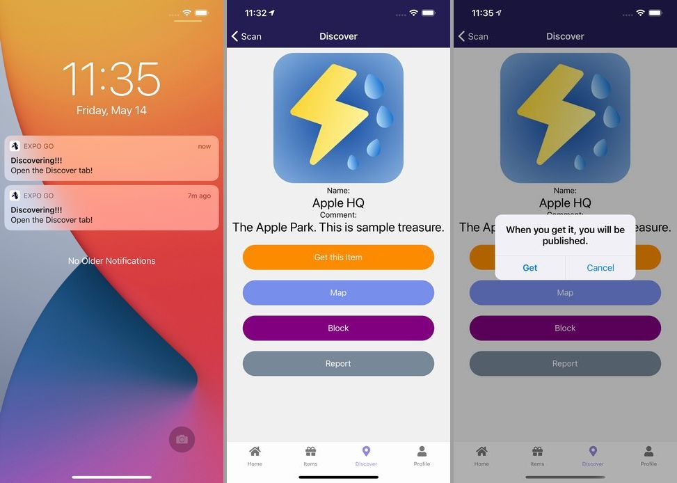

import { Link } from 'gatsby';

<Link to="/blog/2021-05-21">前回</Link>の続きです。

リリースした新作アプリ**Find Good One**の仕組みやコードを書きます。

## Discover

宝箱を発見したときに、通知をタップすると表示される画面です。

発見した宝箱を取得するか、ブロックするか、レポートを送るか選択します。Mapをタップしてマップ上で宝箱の座標を見ることもできます。



**src\scenes\discover\Discover.js**

```javascript
import React, { useState, useEffect } from 'react'
import { Text, View, StatusBar, Image, ScrollView, TouchableOpacity, Platform } from 'react-native'
import styles from './styles'
import { firebase } from '../../../firebase'
import Dialog from 'react-native-dialog'

export default function Discover({ route, navigation }) {
  const userData = route.params.myProfile // 前の画面(定義したローカル通知)から受け取った自分の情報を格納
  const treasureID = route.params.treasureID // 前の画面(定義したローカル通知)から受け取った宝箱のIDを格納
  const [treasure, setTreasure] = useState([]) // 宝箱の情報をセットするフック
  const [dialog, setDialog] = useState(false) // 取得時に出す確認ダイアログの表示非表示制御用フック

  useEffect(() => { // マウント時に受け取った宝箱のIDを使ってFirestoreからその宝箱の情報を取得する
    const treasureRef = firebase.firestore().collection('treasures').doc(treasureID)
    treasureRef.get().then((doc) => {
      if (doc.exists) {
        treasureRef
        .onSnapshot(function(document) {
          const data = document.data()
          setTreasure(data)
        })
      } else {
        null
      }
    })
  },[])

  const getItem = () => { // 宝箱を取得することを選んだときに動かす関数
    const userRef2 = firebase.firestore().collection('users2').doc(userData.email)
    const userRef = firebase.firestore().collection('users').doc(userData.id)
    userRef2.update({
      items: firebase.firestore.FieldValue.arrayUnion(treasure.id) // 取得した宝箱配列に宝箱のIDを追加
    })
    userRef.update({
      items: firebase.firestore.FieldValue.arrayUnion(treasure.id) // 取得した宝箱配列に宝箱のIDを追加
    })
    const treasureRef = firebase.firestore().collection('treasures').doc(treasure.id)
    treasureRef.update({
      picked: firebase.firestore.FieldValue.arrayUnion(userData.email) // この宝箱を取得したユーザー配列に自分のID(メールアドレス)を追加
    })
    setDialog(false) // Firestoreを更新したら確認ダイアログは非表示に戻す
  }

  const report = () => { // 見つけた宝箱を管理者に報告する関数
    const reportRef = firebase.firestore().collection('report').doc()
    reportRef.set({
      id: reportRef.id,
      treasureID: treasure.id,
      creater: treasure.createrEmail,
      name: treasure.treasureName,
      comment: treasure.comment,
      image: treasure.treasureImage
    })
    .then(() => {
      alert('Report has been sent.')
    })
    .catch((error) => {
      console.error("Error writing document: ", error);
    });
  }

  const block = () => { // 宝箱をブロックする関数
    const userRef2 = firebase.firestore().collection('users2').doc(userData.email)
    const userRef = firebase.firestore().collection('users').doc(userData.id)
    userRef2.update({
      block: firebase.firestore.FieldValue.arrayUnion(treasure.id) // ブロックした宝箱配列にこの宝箱IDを追加
    })
    userRef.update({
      block: firebase.firestore.FieldValue.arrayUnion(treasure.id) // ブロックした宝箱配列にこの宝箱IDを追加
    })
    alert('Added to the block list.')
  }

  function goMap() { // 宝箱の座標をマップで確認するときに動かす画面遷移用関数
    navigation.navigate('Location', {Location: treasure}) // HomeやItemsでも使っているLocationスクリーンに宝箱の情報を渡して遷移する
  }

  return (
    <View style={styles.root}>
    <StatusBar barStyle="light-content" />
      <ScrollView style={{ flex: 1, width: '100%' }}>
        <View style={styles.imagecontainer}>
          <Image source={{uri: treasure.treasureImage}} style={styles.image}/>
        </View>
        <Text style={styles.field}>Name:</Text>
        <Text style={styles.title}>{treasure.treasureName}</Text>
        <Text style={styles.field}>Comment:</Text>
        <Text style={styles.title}>{treasure.comment}</Text>
        <TouchableOpacity style={styles.get} onPress={() => setDialog(true)}>
          <Text style={styles.buttonText}>Get this Item</Text>
        </TouchableOpacity>
        <TouchableOpacity style={styles.button} onPress={goMap}>
          <Text style={styles.buttonText}>Map</Text>
        </TouchableOpacity>
        <TouchableOpacity style={styles.block} onPress={block}>
          <Text style={styles.buttonText}>Block</Text>
        </TouchableOpacity>
        <TouchableOpacity style={styles.report} onPress={report}>
          <Text style={styles.buttonText}>Report</Text>
        </TouchableOpacity>
      </ScrollView>
      <Dialog.Container visible={dialog}>
        <Dialog.Title>When you get it, you will be published.</Dialog.Title>
        <Dialog.Button label="Get" bold={true} onPress={() => getItem()} />
        <Dialog.Button label="Cancel" onPress={() => setDialog(false)} />
      </Dialog.Container>
    </View>
  )
}
```

## まとめ

これはFirestoreの更新や画面遷移だけなのでこれまでの繰り返しでできました。アプリ側のコードは以上です。

次は、設置した宝箱を誰かが取得したときに、それをリモート通知で受け取る機能をFirebase Cloud Functionsを使って実装します。

[レポジトリ](https://github.com/kiyohken2000/maptrap)

---