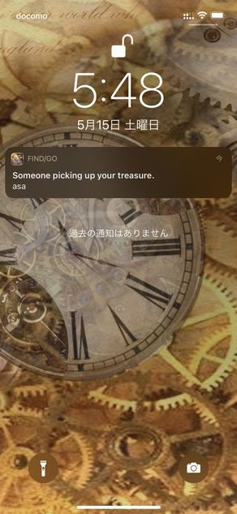

import { Link } from 'gatsby';

<Link to="/blog/2021-05-22">前回</Link>の続きです。

リリースした新作アプリ**Find Good One**の仕組みやコードを書きます。

## リモート通知を実装する

FGOでは、自分が設置した宝箱を他のユーザーが取得したときに、そのことが通知されます。これにはFirebase Cloud FunctionsとExpo Push APIを使用します。

- [Expo Push API](https://docs.expo.io/push-notifications/overview/)
- [Cloud Functions for Firebase](https://firebase.google.com/docs/functions?hl=ja)



<Link to ="/blog/2021-04-08">前にPINE proに実装した通知</Link>とまったく同じです。

1. treasureコレクションがアップデートされたらCloud Functionsを発動(宝箱の取得したユーザー配列フィールドに取得したユーザーのIDが追加される)
1. 宝箱を設置したユーザーのデバイストークンを取得
1. Expo Push APIを叩く

という流れでプッシュ通知を送信します。

### Android用の設定

FGOはAndroid用アプリでもあるので`google-services.json`を用意しておく必要があります。

- 概要からアンドロイドマーク、または追加を行う
- パッケージ名com.xxx.任意のパッケージ名
- google-services.jsonをダウンロード
- ダウンロードしたファイルを、プロジェクトのルートディレクトリに配置する
- app.jsonにgoogle-services.jsonの相対パスを追加

**app.json**

```javascript
"android": {
  "package": "net.votepurchase.fgo",
  "versionCode": 10,
  "googleServicesFile": "./google-services.json",
  "config": {
    "googleMaps": {
      "apiKey": "見せられないよ"
    }
  },
  "permissions": [
    "ACCESS_COARSE_LOCATION",
    "ACCESS_FINE_LOCATION",
    "ACCESS_BACKGROUND_LOCATION",
    "FOREGROUND_SERVICE"
  ]
},
```

Firebase consoleにて以下を実行します。

- 設定>cloud messagingタブのサーバーキーを取得する
- サーバキーをExpoにpushする

```shell
expo push:android:upload --api-key <your-token-here>
```

### Cloud Functionsのコード

実際にCloud Functionsに配置するコードを書きます。ドキュメント通りです。`.onUpdate`でFirestoreの更新をリッスンしています。

ユーザーには**宝箱の名前**を通知します。

node.jsのバージョンは`12`です。

**functions\package.json**

```javascript
  "engines": {
    "node": "12"
  },
```

```javascript
const functions = require('firebase-functions');
const admin = require('firebase-admin');
const { Expo } = require('expo-server-sdk');
admin.initializeApp();

const db = admin.firestore();
const expo = new Expo();

exports.sendMessage = functions.region('asia-northeast2').firestore
  .document('treasures/{treasure}')
  .onUpdate((change, context) => {
    const newValue = change.after.data(); // 更新されたドキュメント
    const email = newValue.createrEmail // 宝箱を設置したユーザーのID(メールアドレス)を格納
    const treasureName = newValue.treasureName // 宝箱の名前を格納

      const message = [];
      const userRef = db.collection('tokens').doc(email) // tokensコレクションから宝箱設置者のトークンを探す
      userRef.get().then((doc) => {
        if (doc.exists) { // トークンが存在した場合プッシュ通知を送信する
          const data = doc.data() // tokensコレクションのデータを取得
          const token = data.token // トークンを変数に格納
            message.push({ // トークンと通知内容を格納
              to: token,
              sound: 'default',
              title: 'Someone picking up your treasure.',
              body: treasureName,
            });
          console.log(email, treasureName)
          expo.sendPushNotificationsAsync(message) //Expo Push APIに送信
        } else { null } // トークンがなければプッシュ通知を拒否しているので何もしない
      })
  });
```

## まとめ

以上です。リモート通知はPINE proで経験済みだったのでコードを流用できました。

[Cloud Functionsのレポジトリ](https://github.com/kiyohken2000/treasurefunction)

---