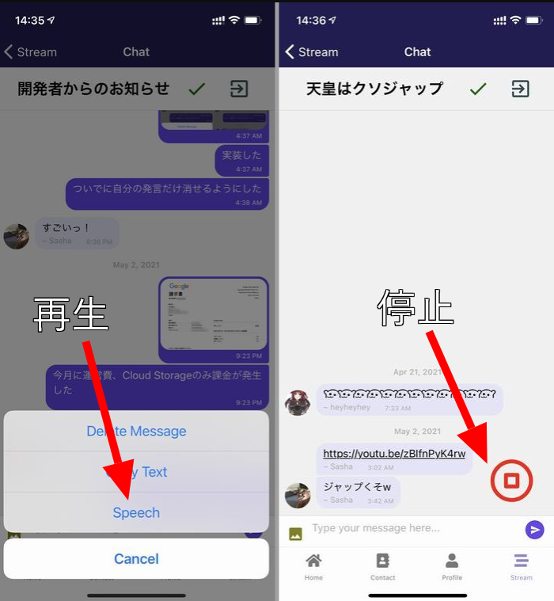

import { Link } from 'gatsby';

## PINE proをアップデートしました

今回の変更点は以下2点です。

- Expo SDK 41に合わせて通知パーミッション取得のコードを変更
- メッセージ読み上げ機能を追加

<br/>

### 通知パーミッションの取得

<Link to="/blog/2021-04-16">以前</Link>書いた通り、Expo SDK 41にてexpo-permissionsが非推奨になったため各種パーミッションの取得方法が変わりました。

Find Good OneではSDK41に合わせた書き方をしたのですが、PINE proはまだ変更してなかったので今回の機能追加に合わせてコードを直しました。

**src\routes\navigation\Navigation.js**

```javascript
(async () => {
  const { status: existingStatus } = await Notifications.getPermissionsAsync() // この辺が変わった
  let finalStatus = existingStatus;
  if (existingStatus !== "granted") {
    const { status } = await Notifications.requestPermissionsAsync(); // この辺が変わった
    finalStatus = status;
  }
  if (finalStatus !== "granted") {
    return;
  }
  const token = await Notifications.getExpoPushTokenAsync();
  await firebase.firestore().collection("tokens").doc(user.email).set({ token: token.data, email: user.email })
})();
```

### メッセージ読み上げ

メッセージの読み上げ機能を追加しました。

任意のメッセージを長押しして出てくるポップアップの**Speech**をタップすると読み上げが開始されます。

読み上げ中は画面右下に**停止ボタン**が表示されます。停止ボタンをタップして読み上げを停止するか、読み上げが終了すると停止ボタンは非表示になります。



### 変更したコード

Expoの[Speech API](https://docs.expo.io/versions/latest/sdk/speech/)を使いました。便利ですね。

**src\scenes\chat\Chat.js**

ライブラリをインポート

```javascript
import * as Speech from 'expo-speech'
```

停止ボタン表示非表示の制御用のフックを作成

```javascript
const [talking, setTalking] = useState(false)
```

メッセージ読み上げ開始と停止の関数を作成

```javascript
function speak(txt) {
  const thingToSay = txt
  Speech.speak(thingToSay,
    {
      language: "ja",
      onStart: setTalking(true),
      onDone: () => {done()}
    })
}

function stop() {
  Speech.stop()
  setTalking(false)
}

function done() {
  setTalking(false)
}
```

メッセージ長押ししたときのポップアップに今作った関数を追加。

```javascript
function delMessage(context, message) {
  const options = ['Delete Message', 'Copy Text', 'Speech', 'Cancel']; // Speechを追加
  const cancelButtonIndex = options.length - 1;
  context.actionSheet().showActionSheetWithOptions({
    options,
    cancelButtonIndex
  }, (buttonIndex) => {
    switch (buttonIndex) {
      case 0:
        if (message.user.email == myProfile.email) {
          firebase.firestore().collection('THREADS').doc(talkData.id).collection('MESSAGES').doc(message._id).delete()
        } else {
          alert('You can only delete own messages.')
        }
        break
        case 1:
          const text = message.text
          Clipboard.setString(text)
          break
        case 2:
          const script = message.text // いったんメッセージ本文を変数に格納
          speak(script) // 格納した変数を読み上げ関数に渡す
          break
    }
  });
}
```

停止ボタン表示部。

停止ボタンが常に表示されていても意味ないし邪魔なので、読み上げ中にだけ表示するようにします。真偽値`talking`の状態でボタンの表示非表示を制御しています。初期値は`false`、読み上げを開始したら`true`にして表示、停止か読み終わったら`false`をセットして非表示にしています。

```javascript
{talking?
<View style={styles.Overlay}>
  <TouchableOpacity onPress={stop}>
    <Icon name="stop-circle" size={65} color="red"/>
  </TouchableOpacity>
</View>:null}
```

## まとめ

ExpoにSpeech APIがあることをたまたま知って実装したら思いのほか簡単にできました。

---