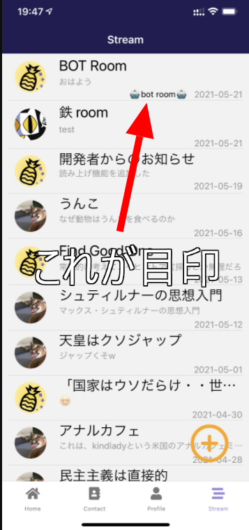
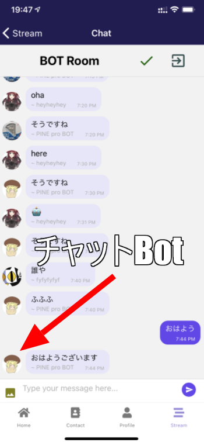
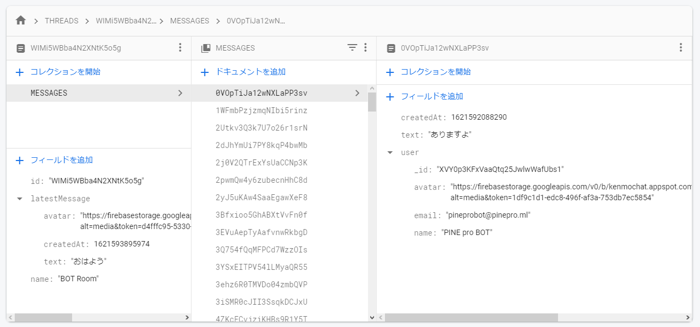

import { Link } from 'gatsby';

## Streamタブにチャットボットがいる部屋を作りました

日付の横に**ロボット絵文字**がついてる部屋にボットがいます。



ボット部屋内の全ての発言にボットが反応します。



## 仕組み

使用技術は以下の2つです。

- A3RT
- Firebase Cloud Functions

<br/>

### A3RT

リクルートのAI、[A3RT](https://a3rt.recruit-tech.co.jp/product/talkAPI/)のTalk AIを使って実装しました。

こんな感じでエンドポイントにリクエストを送ると

```
curl -X POST https://api.a3rt.recruit-tech.co.jp/talk/v1/smalltalk \
-F "apikey=AAAAAAAAAAAAAAAAAAAAAAAAAAAAAAAA" \
-F "query=おはよう"
```

こんな感じのレスポンスが返ってきます。

```
{
	status: 0,
	message: "ok",
	results: [{
		perplexity: 2.3688167429546714,
		reply: "おはようございます"
	}],
}
```

### Firebase Cloud Functions

上記のA3RTと<Link to="/blog/2021-04-08">プッシュ通知の実装にも使っている</Link>Cloud Functionsを組み合わせました。

チャットデータはFirestoreの

`THREADS(コレクション)`/`{チャット部屋のID}(ドキュメント)`/`MESSAGES(サブコレクション)`/`{発言ごとのID}(ドキュメント)`

の中に格納されています。



Cloud Functionsはドキュメントが書き込まれたことをトリガーにできる(onCreate)ので`{発言ごとのID}`が作成されたタイミングでエンドポイントにリクエストを送信して、レスポンスをFirestoreに格納することで実装しました。

## 実装したコード

### Cloud Functionsの実装

Cloud Functionsのコードがメインになります。BOTがいる部屋は固定のため`THREADS`直下のチャット部屋IDは固定です。

**functions\index.js**

```javascript
exports.botMessage = functions.region('asia-northeast2').firestore
  .document('THREADS/WIMi5WBba4N2XNtK5o5g/MESSAGES/{chatId}') // BOT部屋のパス
  .onCreate((snap, context) => { // 発言があったこと(ドキュメントが書き込まれる)をトリガーにする
    const newValue = snap.data(); 
    const comment = newValue.text; // 新着発言の内容を格納
    const u = newValue.user._id // 新着発言者のIDを格納

    if (u != 'XVY0p3KFxVaaQtq25JwlwWafUbs1') { // 発言者IDとBOTアカウントのIDを比較して、一致しなければ(BOTの発言じゃなければ)エンドポイントにリクエストを送信する処理へ
      const params = new URLSearchParams();
      params.append('apikey', "API key 見せられないよ");　// apikeyパラメーターをセット
      params.append('query', comment);　// queryパラメーターをセット
      fetch('https://api.a3rt.recruit-tech.co.jp/talk/v1/smalltalk',{ // エンドポイントにAPI keyと発言を送信
        method: 'post',
        body: params
      }).then(response => {
        response.json().then(data => {
          console.log(data.results[0].reply);
          const text = data.results[0].reply; // レスポンス本文を格納
          const messageRef = db.collection('THREADS'); // レスポンスをBOTの発言としてFirestoreに保存する処理
          messageRef
          .doc('WIMi5WBba4N2XNtK5o5g') // BOT部屋のID
          .collection('MESSAGES')
          .add({
            text, // 返ってきたレスポンス本文
            createdAt: new Date().getTime(),
            user: { // BOTのアカウント情報
              _id: 'XVY0p3KFxVaaQtq25JwlwWafUbs1',
              email: 'pineprobot@pinepro.ml',
              avatar: 'https://firebasestorage.googleapis.com/v0/b/kenmochat.appspot.com/o/avatar%2FXVY0p3KFxVaaQtq25JwlwWafUbs11621592754467?alt=media&token=f2366ddf-dc22-4977-a80c-496c5394c8fb',
              name: 'PINE pro BOT',
            }
          });
        })
      }).catch(error => console.log(error));
    } else { null }
});
```

### アプリ側の実装

アプリ側はほぼ変更ありません。BOT部屋に**ロボット絵文字**を表示する処理を追加しただけです。

**src\scenes\stream\Stream.js**

```javascript
{
  threads.map((talk, i) => {
    return (
      <View key={i} style={styles.item}>
        <TouchableOpacity onPress={() => props.navigation.navigate('Chat', { talkData: talk, myProfile: userData })}>
          <View style={{flexDirection: 'row'}}>
            <View style={styles.avatar}>
              <Avatar
                size="medium"
                rounded
                title="NI"
                source={{ uri: talk.latestMessage.avatar }}
              />
            </View>
            <View style={{ flex: 1, width: '100%' }}>
              <Text style={styles.title} numberOfLines={1}>{talk.name}</Text>
              <Text style={styles.latestMessage} numberOfLines={1}>{talk.latestMessage.text}</Text>
              <View style={styles.datecontainer}>
                {talk.id === 'WIMi5WBba4N2XNtK5o5g'?<Text>🤖bot room🤖</Text>:null} {/* チャット部屋のIDをBOT部屋のIDを比較して一致すれば印をつける */}
                <Text style={styles.latestDate}>{displaytime(talk.latestMessage.createdAt)}</Text>
              </View>
            </View>
          </View>
        </TouchableOpacity>
        <Divider />
      </View>
    )
  })
}
```

## まとめ

[Zapier](https://zapier.com/apps/chatbot/integrations)とか[Dialogflow](https://cloud.google.com/dialogflow/?hl=ja)とか[Microsoft Azure Bot Service](https://azure.microsoft.com/ja-jp/services/bot-services/)も試したのですが、BOT自体の性能にこだわりはなかったので最もお手軽にできそうなA3RTを使いました。

実際、かなり簡単に実装できて良かったです。

---