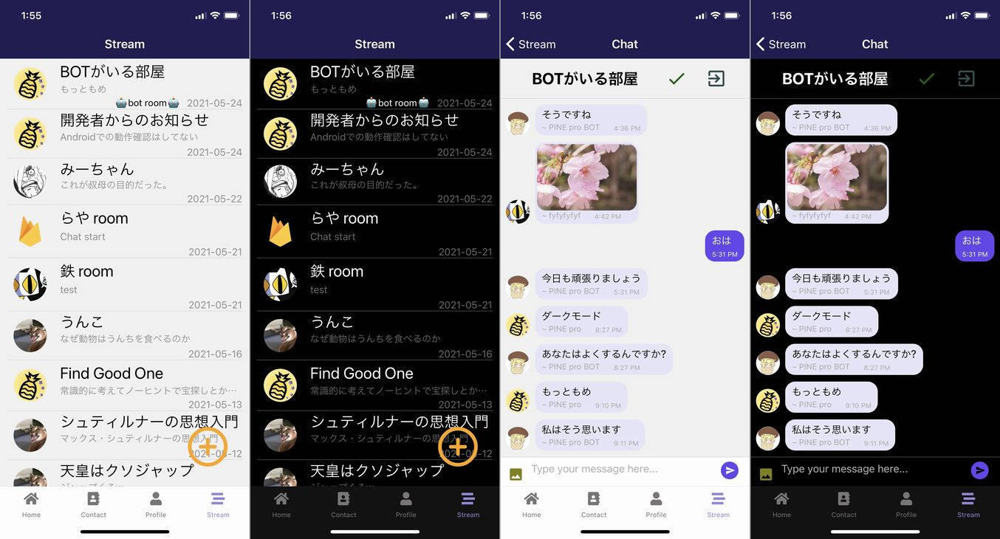
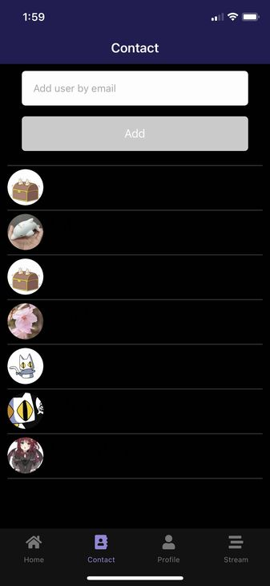
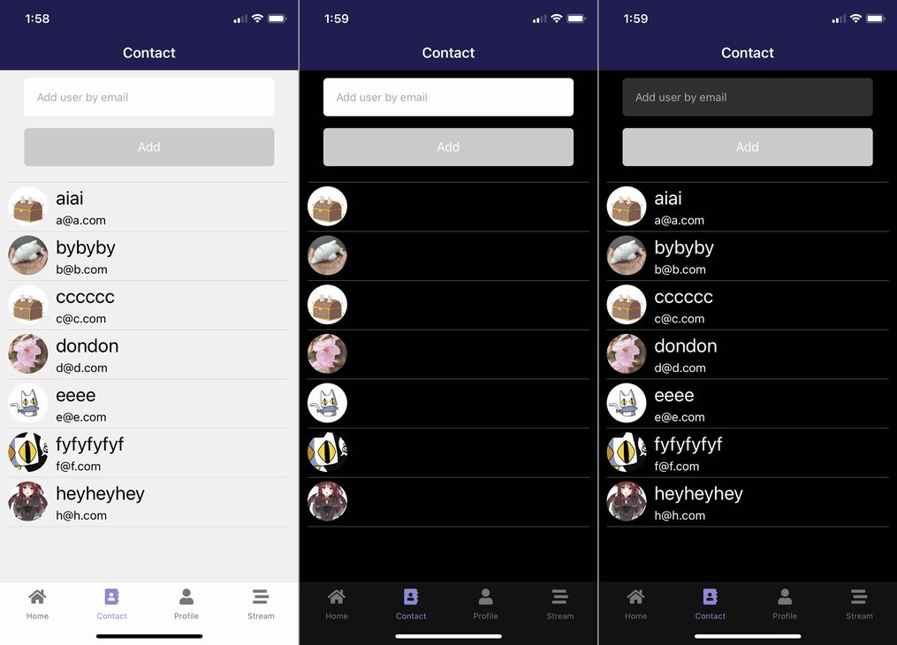
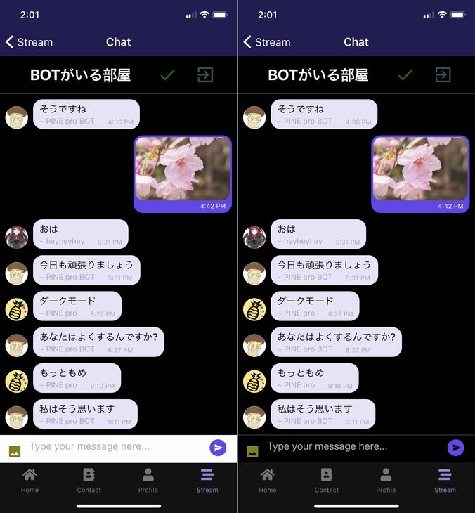

import { Link } from 'gatsby';

## PINE proがダークモードに対応しました

<Link to="/blog/2021-04-03">以前</Link>書きましたが、PINE proを関数コンポーネントで書いた理由にダークモード対応したいというのがありました。

というわけでダークモードに対応しました。



アプリ内にダークモードのオンオフスイッチがあるわけではなく、デバイスの設定と連動して自動的にアプリの外観が切り替わるタイプです。

## 実装したコード

[React Navigation](https://reactnavigation.org/docs/themes/)とか[React Native Elements](https://reactnativeelements.com/docs/customization/)とか色々と実装方法はありますが、今回は[ExpoのAppearance](https://docs.expo.io/versions/latest/sdk/appearance/)を使いました。あとから気づいたんですがSDK 43で削除予定でした。

### インストール

ライブラリをインストールします。

```shell
expo install react-native-appearance
```

### コードを変更する

**src\routes\navigation\Navigation.js**

まずアプリ全体を`AppearanceProvider`でラップします。

```javascript
import { AppearanceProvider, useColorScheme } from 'react-native-appearance'
import { DefaultTheme, DarkTheme } from '@react-navigation/native'
```

```javascript
export default function App() {
  const [loading, setLoading] = useState(true)
  const [user, setUser] = useState(null)
  const scheme = useColorScheme() // ここに追加
```

```javascript
return(
  <AppearanceProvider>
    <NavigationContainer theme={scheme === 'dark' ? DarkTheme : DefaultTheme}>
      { user ? (
        <TabNavigator/>
        ) : (
        <LoginNavigator/>
      )}
    </NavigationContainer>
  </AppearanceProvider>
)
```

これだけでもボトムタブとかバックグラウンドカラーが変わります。



ただ、テキストのカラーとかテキストボックスの色はそのままなので、必要な場所にダークモード用のスタイルを個別に当てていく必要があります。

**src\scenes\contact\Contact.js**

```javascript
import { Text, View, TextInput, TouchableOpacity, ScrollView, StatusBar, useColorScheme } from 'react-native' // useColorSchemeを追加
```

```javascript
const scheme = useColorScheme()
```

`scheme`はデバイスの状態によって`light/dark`が入ります。

そこで、各コンポーネントにスタイルを当てるときに`scheme`を三項演算子で評価して通常モードとダークモードを出し分ける形にしていきました。

```javascript
<TextInput
  style={scheme === 'dark' ? styles.darkinput : styles.input}
  placeholder='Add user by email'
  placeholderTextColor="#aaaaaa"
  onChangeText={(text) => setEmail(text)}
  value={email}
  underlineColorAndroid="transparent"
  autoCapitalize="none"
/>
```

```javascript
<Text style={scheme === 'dark' ? styles.darktitle : styles.title}>{user.fullName}</Text>
<Text style={scheme === 'dark' ? styles.darkfield : styles.field}>{user.email}</Text>
```

**src\scenes\contact\styles.js**

```javascript
title: {
  fontSize: 24,
  marginTop: 5,
  marginBottom: 5,
  marginLeft: 10,
},
darktitle: {
  fontSize: 24,
  marginTop: 5,
  marginBottom: 5,
  marginLeft: 10,
  color: 'white',
},
field: {
  fontSize: 15,
  marginBottom: 5,
  marginLeft: 10,
},
darkfield: {
  fontSize: 15,
  marginBottom: 5,
  marginLeft: 10,
  color: 'white',
},
input: {
  height: 48,
  borderRadius: 5,
  overflow: 'hidden',
  backgroundColor: 'white',
  marginTop: 10,
  marginLeft: 30,
  marginRight: 30,
  paddingLeft: 16
},
darkinput: {
  height: 48,
  borderRadius: 5,
  overflow: 'hidden',
  backgroundColor: '#303030',
  marginTop: 10,
  marginLeft: 30,
  marginRight: 30,
  paddingLeft: 16,
  color: 'white'
},
```

上のスタイルを当てるとこんな感じになります。



これを何度も繰り返していきます。

### react-native-gifted-chat



[react-native-gifted-chat](https://github.com/FaridSafi/react-native-gifted-chat)のバックグラウンドカラーは特に設定はいらなかったのですが、メッセージ入力欄はカスタムスタイルを当てる必要がありました。

**src\scenes\chat\Chat.js**

メッセージ入力欄用のファンクションを作成。

```javascript
function renderInputToolbar(props) {
  return (
    <InputToolbar {...props} containerStyle={scheme === 'dark' ? styles.darkinputToolbar : styles.inputToolbar}/>
  )
}
```

```javascript
<GiftedChat
  messages={messages}
  onSend={newMessage => handleSend(newMessage)}
  user={{ _id: myProfile.id }}
  renderSend={renderSend}
  alwaysShowSend
  renderSystemMessage={renderSystemMessage}
  renderBubble={renderBubble}
  onPressAvatar={showProfile}
  renderUsernameOnMessage={true}
  renderActions={renderActions}
  onLongPress={delMessage}
  renderInputToolbar={renderInputToolbar} // ここに追加
  textInputStyle={scheme === 'dark' ? styles.darktextInputStyle: styles.textInputStyle} // ここに追加
  placeholder='Type your message here...'
/>
```

**src\scenes\chat\styles.js**

```javascript
inputToolbar: {
},
darkinputToolbar: {
  backgroundColor: 'black',
  color: 'white'
},
textInputStyle: {
},
darktextInputStyle: {
  color: 'white'
},
```

### app.json

端末の外観設定を参照する必要があるので`app.json`も編集する必要があります。

具体的には`iOS.userInterfaceStyle`と`android.userInterfaceStyle`に`automatic`を追記します。

```javascript
"ios": {
  "supportsTablet": true,
  "bundleIdentifier": "net.votepurchase.pine",
  "buildNumber": "1.0.7",
  "infoPlist": {
    "NSCameraUsageDescription": "Use the camera to change your avatar and send images in chat.",
    "NSPhotoLibraryUsageDescription": "Use the photo library to change your avatar and send images in chat."
  },
  "userInterfaceStyle": "automatic"
},
"android": {
  "package": "net.votepurchase.pine",
  "versionCode": 9,
  "googleServicesFile": "./google-services.json",
  "userInterfaceStyle": "automatic",
  "permissions": [
    "VIBRATE"
  ]
},
```

## まとめ

ケンモリーダーの頃からダークモード対応は何度かやろうとして諦めてた機能だったので、今回はサクッと実装できて良かったです。

---