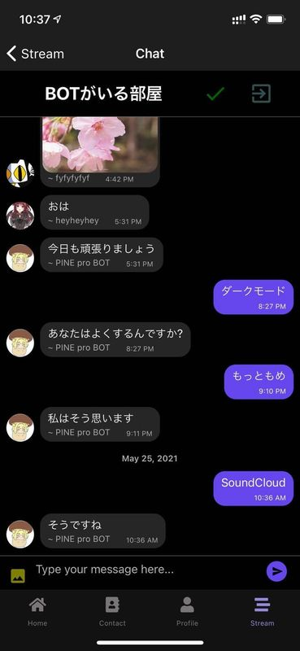
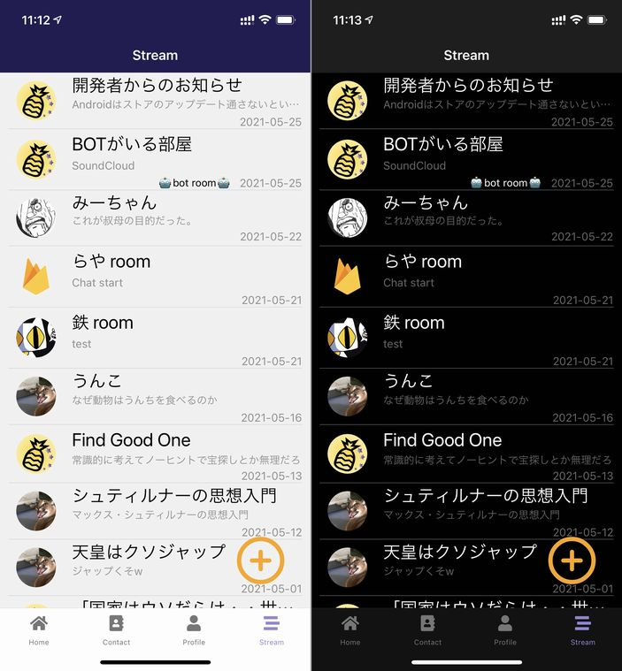
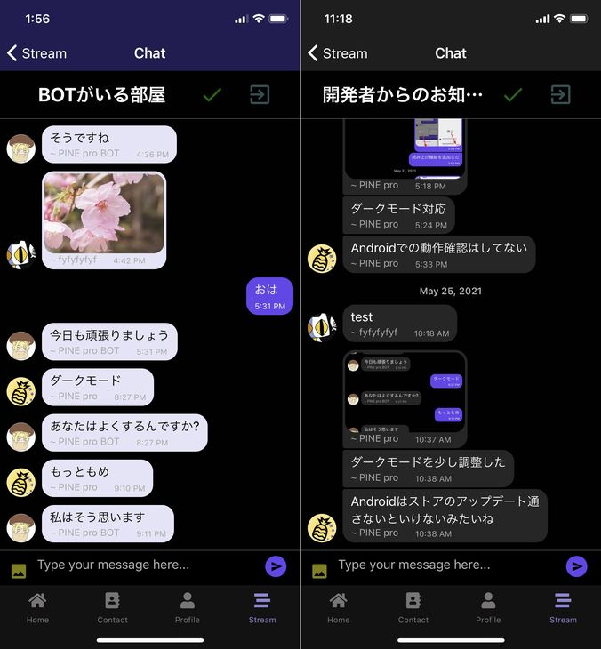

import { Link } from 'gatsby';

## ダークモードの漸進的な改善

<Link to='/blog/2021-05-26'>前回</Link>、PINE proにダークモードを実装しましたがExpoのAppearanceがSDK43にて削除予定だったため、あらかじめ対応しておくことにしました。

ついでに、ヘッダーとチャット画面の吹き出しも調整しました。



## 変更したコード

**src\routes\navigation\Navigation.js**

まずは前回追加した`react-native-appearance`を削除。

```javascript
import { AppearanceProvider, useColorScheme } from 'react-native-appearance'
```

代わりに`react-native`から`useColorScheme`だけインポートします。

```javascript
import { useColorScheme } from 'react-native'
```

`AppearanceProvider`を削除。

```javascript
return(
  <NavigationContainer theme={scheme === 'dark' ? DarkTheme : DefaultTheme}>
    { user ? (
      <TabNavigator/>
      ) : (
      <LoginNavigator/>
    )}
  </NavigationContainer>
)
```

### ヘッダーの色もダークモード対応

ヘッダーはもともと暗めの色だったので変更しなくてもよいかと思ってたのですが、気になったので変えました。



**src\routes\navigation\Navigation.js**

```javascript
const navigationProps = {
  headerTintColor: 'white',
  headerStyle: { 
    backgroundColor: scheme === 'dark' ? colors.dark : colors.darkPurple
  },
  headerTitleStyle: { fontSize: 18 },
}
```

### チャット画面の吹き出しもダークモード対応

ここも変更予定ではなかったのですが、気になったので変えました。



**src\scenes\talk\Talk.js**

```javascript
function renderBubble(props) {
  return (
    <Bubble
      {...props}
      wrapperStyle={{
        right: {
          backgroundColor: '#6646ee'
        },
        left: {
          backgroundColor: scheme === 'dark' ? '#262626':'#e6e6fa'
        }
      }}
      textStyle={{
        left: {
          color: scheme === 'dark' ? 'white':'#000000'
        },
        right: {
          color: '#fff'
        },
      }}
    />
  );
}
```

## まとめ

普段iPhoneをダークモードで使ってます。ダークモードは見た目がかっこ良いですな。

---