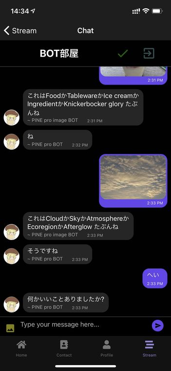
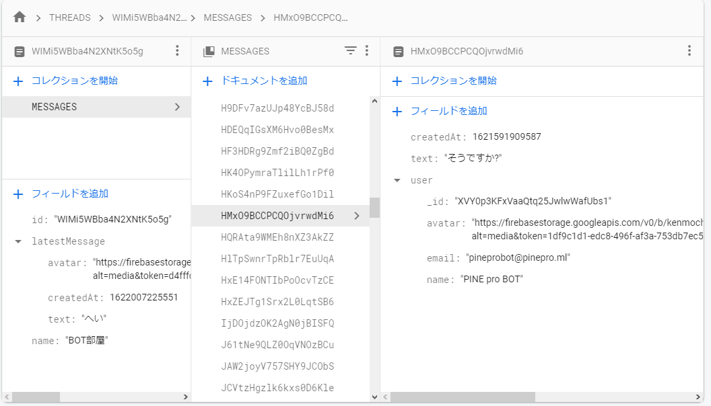
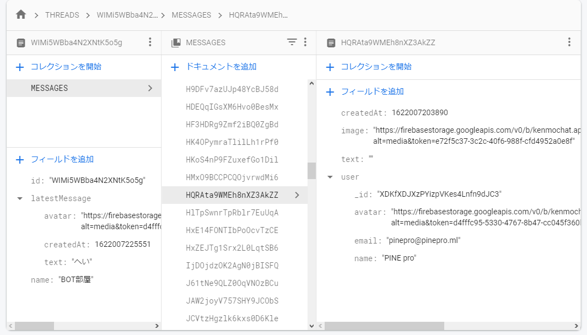
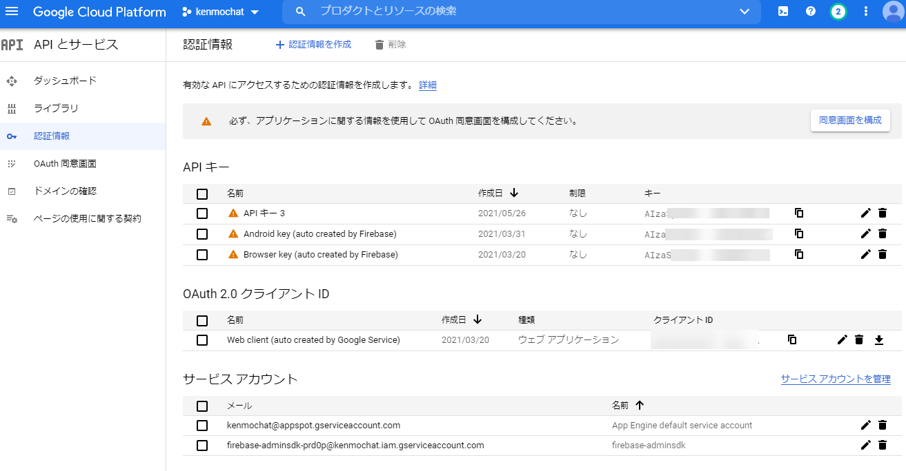
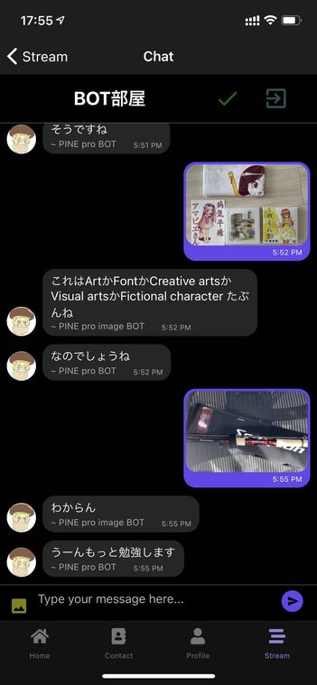
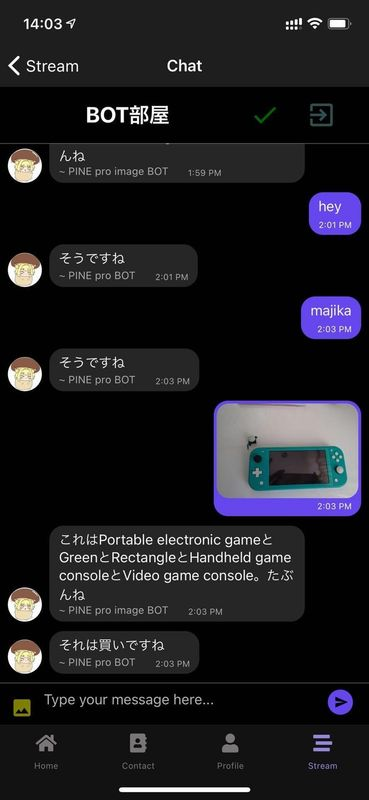

import { Link } from 'gatsby';

## チャットボットの漸進的な改善

<Link to="/blog/2021-05-25">以前</Link>、PINE proにチャットボットを実装しましたが、テキストに反応するのみでした。

PINE proは画像も投稿できるので、画像にもボットが反応するようにしました。



画像を投稿すると、何の画像か答えます。画像用のボットとテキスト用のボットを分けているので、テキスト用のボットが認識結果に対してコメントしてくれます。

## 使用技術

画像認識には[Cloud Vision API](https://cloud.google.com/vision/docs/labels?hl=ja#vision_label_detection-nodejs)を使用しました。

こんな感じでエンドポイントにリクエストを送ると

```javascript
{
  "requests": [
    {
      "features": [
        {
          "maxResults": 5,
          "type": "LABEL_DETECTION"
        }
      ],
      "image": {
        "source": {
          "imageUri": "https://firebasestorage.googleapis.com/v0/b/kenmochat.appspot.com/o/images%2FXDKfXDJXzPYizpVKes4Lnfn9dJC31622007202202?alt=media&token=e72f5c37-3c2c-40f6-988f-cfd4952a0e8f"
        }
      }
    }
  ]
}
```

こんな感じでレスポンスが返ってきます。

```javascript
{
  "responses": [
    {
      "labelAnnotations": [
        {
          "mid": "/m/0csby",
          "description": "Cloud",
          "score": 0.9792135,
          "topicality": 0.9792135
        },
        {
          "mid": "/m/01bqvp",
          "description": "Sky",
          "score": 0.97369313,
          "topicality": 0.97369313
        },
        {
          "mid": "/m/01ctsf",
          "description": "Atmosphere",
          "score": 0.9481808,
          "topicality": 0.9481808
        },
        {
          "mid": "/m/0cblv",
          "description": "Ecoregion",
          "score": 0.9277106,
          "topicality": 0.9277106
        },
        {
          "mid": "/m/013vs",
          "description": "Afterglow",
          "score": 0.9181483,
          "topicality": 0.9181483
        }
      ]
    }
  ]
}
```

前回実装したA3RT Talk APIと同じ要領で、画像が投稿されたときにFirebase Cloud Functionsを使ってAPIを叩き、整形したレスポンスをFirestoreに格納します。

Firestoreの構造は以下です。

テキスト投稿のときは`text`に投稿内容が入ります。



画像投稿のときは`image`に投稿した画像のURLが入ります。



というわけで、新規ドキュメントが作成されて`image`に値が入っている場合に画像を判定してレスポンスをFirestoreに格納する関数を作っていきます。

## 準備

### 依存関係のインストール

`axios`をインストールします。

```shell
npm i axios
```

### API Keyの準備

GCPの管理画面でAPI keyを作ります。



## 実装したコード

今回はCloud Functionsのコードのみの変更です。新しく関数を作ります。今回もボット部屋は固定です。

エラーの場合の処理も入れます。



**functions\index.js**

```javascript
exports.imageBotMessage = functions.region('asia-northeast2').firestore
  .document('THREADS/WIMi5WBba4N2XNtK5o5g/MESSAGES/{chatId}') // ボット部屋に新規ドキュメントが作成されたことを監視してトリガーにする
  .onCreate((snap, context) => {
    const newValue = snap.data();
    const image = newValue.image; // 投稿画像のURLを取得
    const apiKey = 'API keyは見せられないよ';
    const visionApiUrl = `https://vision.googleapis.com/v1/images:annotate?key=${apiKey}`; // API keyと合体させてエンドポイントのURLを定義
    const options = { // リクエスト内容を定義
      requests: [
        {
          "features": [
            {
              "maxResults": 5,
              "type": "LABEL_DETECTION"
            }
          ],
          "image": {
            "source": {
              "imageUri": image // 上で取得した投稿画像のURLをリクエストに格納
            }
          }
        }
      ]        
    };

    if (image) { // 画像投稿の場合(imageが空じゃないとき)に処理を開始
      (async function () {
        try {
          const result = await axios.post(visionApiUrl, options); // エンドポイントにリクエストを送信
          const messageRef = db.collection('THREADS').doc('WIMi5WBba4N2XNtK5o5g').collection('MESSAGES'); // レスポンスを格納する用にFirestoreの場所を定義
          // ここから BOTの投稿用に現在時刻とBOTアカウントの情報を定義
          const t = new Date().getTime(); 
          const u = {
            _id: 'cYx7BY4HJWVL7KT7iAelCwiDaUl2',
            email: 'pinproimagebot@pinepro.ml',
            avatar: 'https://firebasestorage.googleapis.com/v0/b/kenmochat.appspot.com/o/avatar%2FcYx7BY4HJWVL7KT7iAelCwiDaUl21622003719314?alt=media&token=c4f520cb-4591-4670-b17d-9c96caaab08c',
            name: 'PINE pro image BOT',
          };
          // ここまで
          console.log("Request success!");
          if (result.data) { // 認識結果が返ってきたときの処理
            const labels = await result.data.responses[0].labelAnnotations;
            if (labels) {
              const descriptions = labels.map(label => label.description); // descriptionだけ配列に格納(scoreやtopicalityはとりあえずいらない)
              const dStr = await descriptions.join('か'); // 上記配列を文字列に変換。羅列だと寂しいので 'か' でつなげる
              const text = `これは${dStr} たぶんね`; // BOTの返答として格納する文字列を作成
              console.log(text);
              messageRef // 用意した返答をFirestoreに保存
              .add({
                text,
                createdAt: t,
                user: u
              });
            } else {
              const text = 'わからん';
              console.log(text);
              messageRef
              .add({
                text,
                createdAt: t,
                user: u
              });
            }
          } else { // 認識がうまくいかなかったとき用の処理
            const text = 'わからん';
            console.log(text);
            messageRef // BOTには'わからん'と言わせておく
            .add({
              text,
              createdAt: t,
              user: u
            });
          }
        } catch (error) {
          console.error('error', error.response || error);
        }
      })();
    } else { null }
});
```

## まとめ

変更したコードは以上です。

テキストBOTと画像BOT共通ですが、しばらくBOTが動いてない状態だとCloud Functionsが起きるまでにタイムラグがあるため1分くらいレスポンスが遅れます。

エラーでBOTが答えてくれないことがありますがBOT同士の連携がたまにハマることがあります。



---