import { Link } from 'gatsby';

## Azure Computer Vision API

<Link to="/blog/2021-05-28">前回</Link>、GoogleのCloud Vision APIを利用して画像認識BOTを実装しました。

しかしエラーが多くて**わからん**を連発していました。

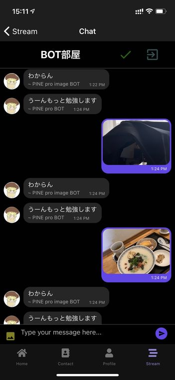

そこでAzureの[Computer Vision](https://azure.microsoft.com/ja-jp/services/cognitive-services/computer-vision/)を利用したBOTも用意しました。

実装した結果が以下です。

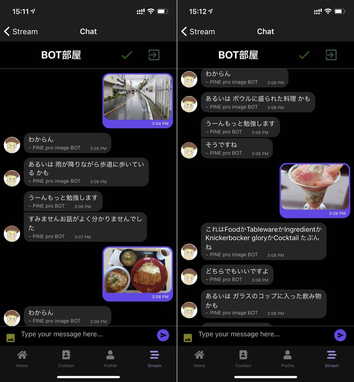

Cloud Visionが**わからん**と返してきた画像に対しても結構正確に答えています。あと日本語に対応しているのもグッドポイントです。

今回はComputer Visionの実装方法について書きます。

## 準備

Azureアカウントを用意します。無料アカウントで良いです。

### API keyの取得

Azureのダッシュボードから新しいリソースを作成します。

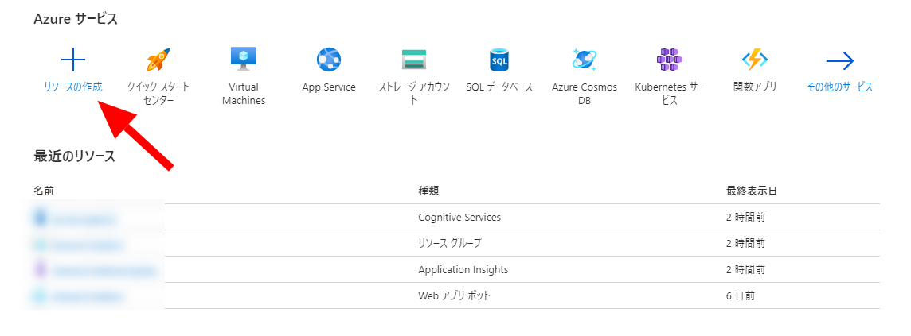

**AI + Machine Learning**から**Computer Vision**を選択します。

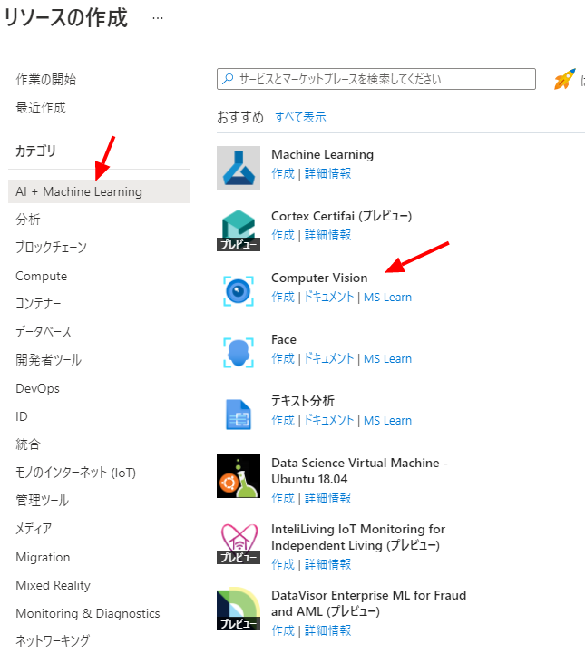

必要事項を入力して**確認および作成**をクリックします。

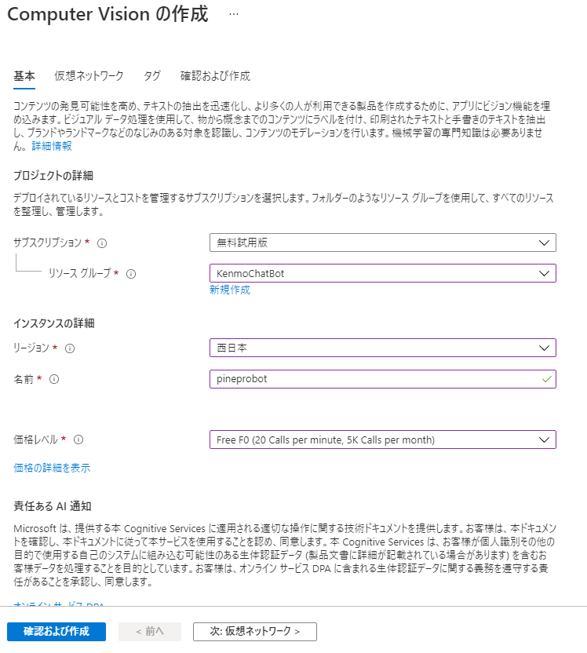

**作成**をクリックします。

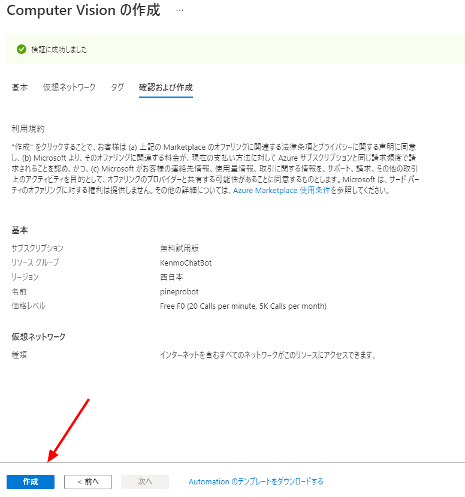

**リソースに移動**をクリックします。

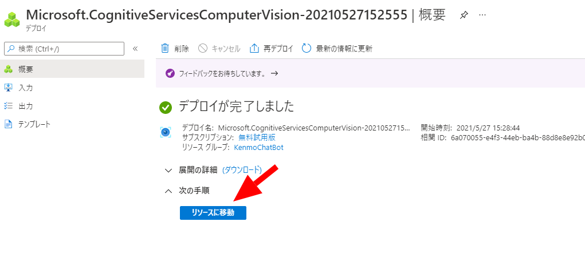

左の**キーとエンドポイント**をクリックしてAPI keyをコピーしておきます。

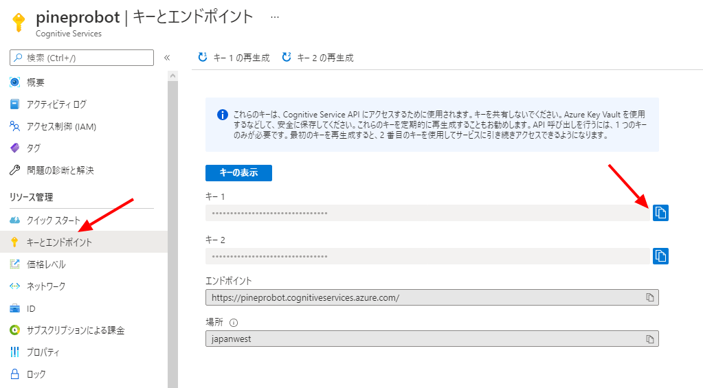

### APIのテスト

Azureのダッシュボード上でComputer Visionのテストができるので確認しておきます。

左の**クイックスタート**を開いて**APIコンソール**を開きます。

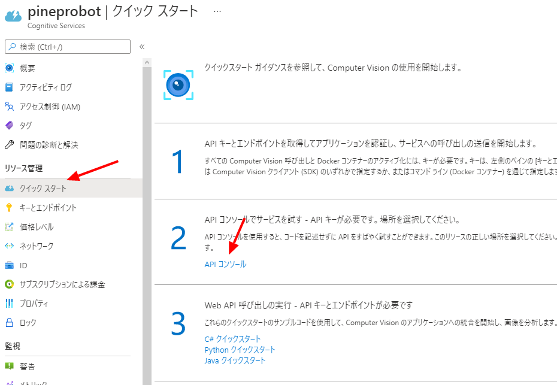

**Analyze Image**を選択します。

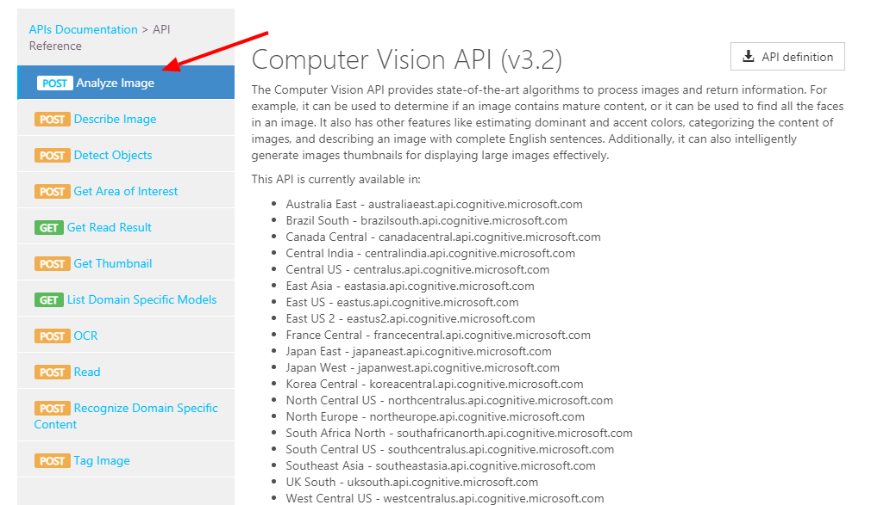

リソースの作成時に選択したリージョンをクリックします。

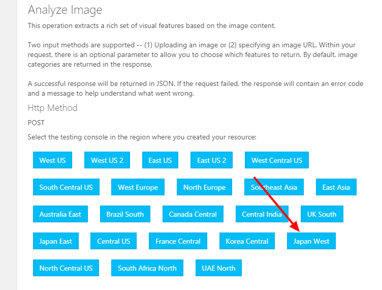

**visualFeatures**を`Description`、**language**を`ja`を選択します。

**Content-Type**は`application/json`のままで良いです。

**Ocp-Apim-Subscription-Key**には先ほどコピーしたAPI keyを貼り付けます。

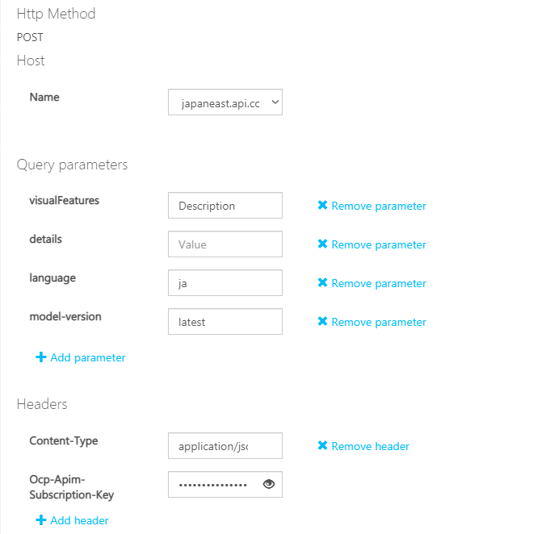

**Request body**にはAPIに判定させたい画像のURLをjson形式で入力します。

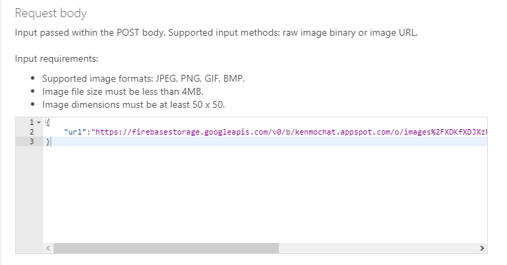

今回送った画像です。


**Send**をクリックしてリクエストが送信されます。

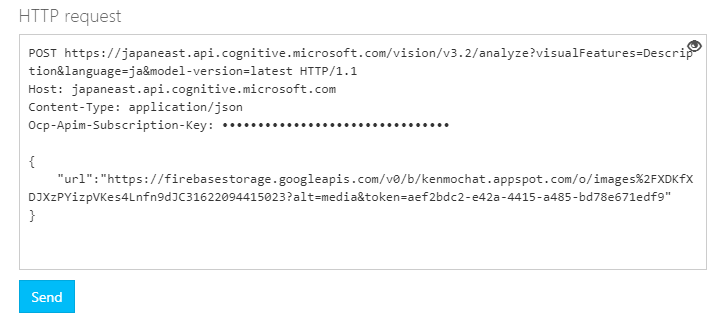

以下がレスポンスです。

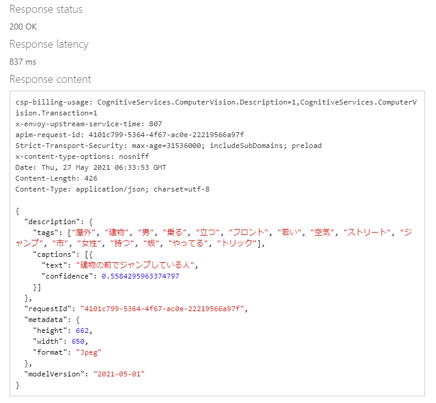

BOTには`description.captions[0].text`を投稿させます。

## 変更したコード

今回もFirebase Cloud Functionsを利用します。関数の実行回数で課金されるので、前回作った関数に**Computer Vision API**を叩いてレスポンスをFirestoreに格納する処理を追加していきます。

**functions\index.js**

```javascript
exports.imageBotMessage = functions.region('asia-northeast2').firestore
  .document('THREADS/WIMi5WBba4N2XNtK5o5g/MESSAGES/{chatId}')
  .onCreate((snap, context) => {
    const newValue = snap.data();
    const image = newValue.image;
    const messageRef = db.collection('THREADS').doc('WIMi5WBba4N2XNtK5o5g').collection('MESSAGES');
    const t = new Date().getTime();
    const u = { // Cloud Visionの結果を投稿するBOTのユーザー情報を定義
      _id: 'cYx7BY4HJWVL7KT7iAelCwiDaUl2',
      email: 'pinproimagebot@pinepro.ml',
      avatar: 'https://firebasestorage.googleapis.com/v0/b/kenmochat.appspot.com/o/avatar%2FcYx7BY4HJWVL7KT7iAelCwiDaUl21622003719314?alt=media&token=c4f520cb-4591-4670-b17d-9c96caaab08c',
      name: 'PINE pro image BOT',
    };
    const us = { // Computer Visionの結果を投稿するBOTのユーザー情報を定義
      _id: 'GrB69PO5oyaTTXbRmLJYqcKGFzf2',
      email: 'pineproimagebot@pinepro.ml',
      avatar: 'https://firebasestorage.googleapis.com/v0/b/kenmochat.appspot.com/o/avatar%2FGrB69PO5oyaTTXbRmLJYqcKGFzf21622094941027?alt=media&token=b82d4765-e603-46eb-ad8e-c213e286e2b0',
      name: 'PINE pro image BOT',
    };
    // ここからCloud Vision APIに渡すリクエストを定義
    const apiKey = 'API keyは見せられないよ';
    const visionApiUrl = `https://vision.googleapis.com/v1/images:annotate?key=${apiKey}`;
    const options = {
      requests: [
        {
          "features": [
            {
              "maxResults": 5,
              "type": "LABEL_DETECTION"
            }
          ],
          "image": {
            "source": {
              "imageUri": image
            }
          }
        }
      ]        
    };
    // ここまで

    // ここからComputer Vision APIに渡すリクエストを定義
    const COMPUTER_VISION_API_ENDPOINT_URL = 'https://japaneast.api.cognitive.microsoft.com/vision/v3.2/analyze?visualFeatures=Description&language=ja&model-version=latest';
    const configCustomVisionAPI = {
      url: COMPUTER_VISION_API_ENDPOINT_URL,
      method: 'post',
      headers: {
        'Content-type': 'application/json',
        'Ocp-Apim-Subscription-Key':'API keyは見せられないよ'
      },
      data: {
        url:image
      }
    };
    // ここまで

    if (image) {
      (async function () {
        // ここからはCloud Visionの処理
        try {
          const result = await axios.post(visionApiUrl, options);
          console.log("Request success!");
          if (result.data) {
            const labels = await result.data.responses[0].labelAnnotations;
            if (labels) {
              const descriptions = await labels.map(label => label.description);
              const dStr = descriptions.join('か');
              const text = `これは${dStr} たぶんね`;
              console.log(text);
              messageRef
              .add({
                text,
                createdAt: t,
                user: u
              });
            } else {
              const text = 'わからん';
              console.log(text);
              messageRef
              .add({
                text,
                createdAt: t,
                user: u
              });
            }
          } else {
            const text = 'わからん';
            console.log(text);
            messageRef
            .add({
              text,
              createdAt: t,
              user: u
            });
          }
        } catch (error) {
          console.error('error', error.response || error);
        }
        // ここまでCloud Visionの処理

        // ここからComputer Visionの処理
        try {
          const response = await axios.request(configCustomVisionAPI); // 上で定義したリクエストをComputer Vision APIで送信
          console.log(response.data.description.captions[0].text)
          const res = response.data.description.captions[0].text // レスポンスを格納
          const ti = new Date().getTime(); // BOTの発言時刻を改めて定義、Cloud Visionの結果を投稿するBOTと時刻が重ならないようにする
          if(res) {
            const text = `あるいは ${res} かも`; // BOTに投稿させるメッセージを定義
            messageRef // Firestoreにレスポンスを投稿
            .add({
              text,
              createdAt: ti,
              user: us
            });
          } else { // エラーの場合の処理
            const text = 'やっぱりわからん';
            messageRef
            .add({
              text,
              createdAt: ti,
              user: us
            });
          }
        } catch (error) {
          console.log("post Error");
          console.error(error);
        }
        // ここまでComputer Vision APIの処理
      })();
    } else { null }
});
```

## まとめ

Computer Visionはなかなか性能が高くて良いですな。

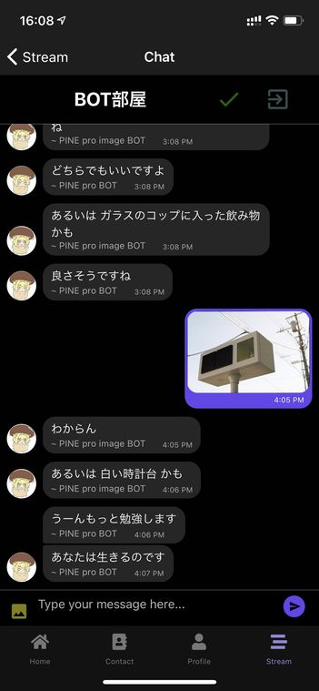

---