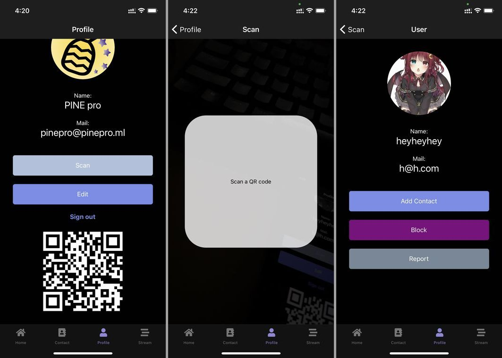
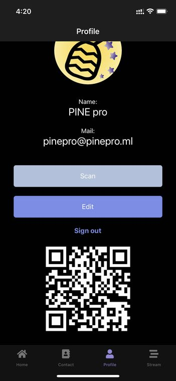
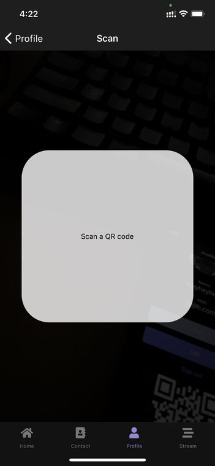
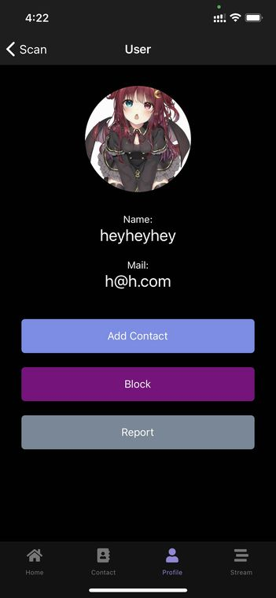

import { Link } from 'gatsby';

## PINE proを更新しました

QRコードを読み取ってユーザーを連絡先に追加する機能を追加しました。



プロフィール画面に自分の情報が埋め込まれているQRコードが表示されます。これを他のユーザーが読み込むとユーザー情報画面に遷移します。

ユーザー情報画面では連絡先に登録したりすることができます。

## 使用したライブラリ

- [react-native-custom-qr-codes-expo](https://www.npmjs.com/package/react-native-custom-qr-codes-expo) - QRコードの作成に使用
- [expo-barcode-scanner](https://docs.expo.io/versions/latest/sdk/bar-code-scanner/) - QRコードの読み取りに使用

<br/>

## 準備

### ライブラリのインストール

react-native-custom-qr-codes-expoをインストール。react-native-svgも入れる必要があるらしい。

```shell
yarn add react-native-custom-qr-codes-expo react-native-svg
```

```shell
expo install expo-barcode-scanner
```

### パーミッションを追記

**app.json**

`ios.infoPlist.NSCameraUsageDescription`と`android.permissions.CAMERA`を追記。

```javascript
"ios": {
  "supportsTablet": true,
  "bundleIdentifier": "net.votepurchase.pine",
  "buildNumber": "1.0.8",
  "infoPlist": {
    "NSCameraUsageDescription": "Used to add a user to your contacts with a QR code.",
    "NSPhotoLibraryUsageDescription": "Use the photo library to change your avatar and send images in chat."
  },
  "userInterfaceStyle": "automatic"
},
"android": {
  "package": "net.votepurchase.pine",
  "versionCode": 10,
  "googleServicesFile": "./google-services.json",
  "userInterfaceStyle": "automatic",
  "permissions": [
    "VIBRATE",
    "CAMERA"
  ]
},
```

## 変更したコード

### ナビゲーションを追加

**スキャン画面(Scan)**と**読み取ったユーザー情報を表示する画面(User)**を**プロフィール画面のスタック(ProfileNavigator)**に追加しました。ユーザー情報を表示する画面は他のスタックで使っているものを流用しました。

**src\routes\navigation\Navigation.js**

スキャン画面をインポート

```javascript
import Scan from '../../scenes/scan'
```

スキャン画面とユーザー情報画面をプロフィールスタックに追加

```javascript
const ProfileNavigator = () => {
  return (
    <Stack.Navigator headerMode="screen" screenOptions={navigationProps}>
      <Stack.Screen name="Profile">
        {props => <Profile {...props} extraData={user} />}
      </Stack.Screen>
      <Stack.Screen name="Detail">
        {props => <Detail {...props} extraData={user} />}
      </Stack.Screen>
      <Stack.Screen name="Scan">
        {props => <Scan {...props} extraData={user} />}
      </Stack.Screen>
      <Stack.Screen name="User">
        {props => <User {...props} extraData={user} />}
      </Stack.Screen>
    </Stack.Navigator>
  )
}
```

### 自分のプロフィール画面にQRコードを表示

自分の情報を埋め込んだQRコードをプロフィール画面に表示するようにします。User画面ではメールアドレスを元にFirestoreから情報をダウンロードするためQRコードに埋め込む情報はメールアドレスのみです。



QRコード表示用ライブラリをインポートする。

```javascript
import { QRCode } from 'react-native-custom-qr-codes-expo'
```

QRコード表示コンポーネントを表示部に追加する。

```javascript
<View style={styles.qr}>
  <QRCode
    content={userData.email}
    color={scheme === 'dark' ? 'white' : 'black'}
    size={200}
  />
</View>
```

QRコードの表示は以上です。

### スキャン画面に遷移

プロフィール画面からスキャン画面に遷移できるようにします。

**src\scenes\profile\Profile.js**

画面遷移する関数を作成する。読み取ったユーザーを連絡先に追加するときには、追加したいユーザーのメールアドレスの他に自分の情報も必要なので遷移時に渡します。

```javascript
const goScan = () => {
  props.navigation.navigate('Scan', { userData: userData })
}
```

表示部に画面遷移用のボタンを設置しました。

```javascript
<TouchableOpacity style={styles.sbutton} onPress={goScan}>
  <Text style={styles.buttonText}>Scan</Text>
</TouchableOpacity>
```

### スキャン画面を作成

QRコードを読み取る専用の画面を作ります。



QRコードを読み取ったら自動的にそのユーザーの画面に遷移するようにします。



**src\scenes\scan\Scan.js**

QRコードの読み取りには当然カメラを使うのでパーミッションを取得する必要があります。スキャン画面を開いたらパーミッションを要求するようにします。

```javascript
import React, { useEffect, useState } from 'react'
import { Text, View, StatusBar, useColorScheme } from 'react-native'
import styles from './styles'
import { firebase } from '../../firebase/config'
import { BarCodeScanner } from 'expo-barcode-scanner'

export default function Scan({ route, navigation }) {
  const [hasPermission, setHasPermission] = useState(null) // パーミッションの状態を制御
  const [scanned, setScanned] = useState(false) // QRコードの読み取り状態を制御
  const scheme = useColorScheme()
  const userData = route.params.userData // プロフィール画面から受け取った自分の情報

  useEffect(() => { // カメラパーミッションを取得
    (async () => {
      const { status } = await BarCodeScanner.requestPermissionsAsync();
      setHasPermission(status === 'granted');
    })();
  }, []);

  const handleBarCodeScanned = ({ type, data }) => { // QRコードを読み取った時に動かす関数、dataにはQRコードに埋め込まれていたメールアドレスが入っている
    setScanned(true)
    const usersRef2 = firebase.firestore().collection('users2').doc(data) // 読み込んだメールアドレスを元にFirestoreからユーザー情報を取得
    usersRef2.get().then((doc) => {
      const userProfile = doc.data()
      setScanned(false) // この画面に戻ってきたときに再びQRコードを読み取れるように、画面遷移前に読み取り状態をfalseにしておく
      navigation.navigate('User', { user: userProfile, myProfile: userData }) // 自分の情報とFirestoreから取得したユーザー情報を持って次の画面に遷移する
    }).catch((error) => {
      console.log("Error getting document:", error);
      setScanned(false)
    });
  };

  // パーミッション取得まで表示しておく待機メッセージ
  if (hasPermission === null) {
    return <Text style={scheme === 'dark' ? styles.darkfield : styles.field}>Requesting for camera permission</Text>;
  }

  // パーミッションが取得できなかった場合に表示するメッセージ
  if (hasPermission === false) {
    return <Text style={scheme === 'dark' ? styles.darkfield : styles.field}>No access to camera</Text>;
  }
  
  return (
    <View style={styles.container}>
      <StatusBar barStyle="light-content" />
      <BarCodeScanner
        onBarCodeScanned={scanned ? undefined : handleBarCodeScanned}
        style={styles.scan}
      >
        <View style={styles.overlay}>
          <View style={styles.preloader}>
            <Text>Scan a QR code</Text>
          </View>
        </View>
      </BarCodeScanner>
    </View>
  )
}
```

### スキャン画面のスタイリング

分かりやすく中央に読み取り範囲を表示するようにします。実際はカメラの範囲内のどこでもQRコードが入れば読み取れます。

**src\scenes\scan\styles.js**

```javascript
import { StyleSheet, Dimensions } from 'react-native';

const { width } = Dimensions.get('window')
const qrSize = width * 0.8

export default StyleSheet.create({
  container: {
    flex: 1,
    alignItems: 'center',
    justifyContent: 'center',
  },
  scan: {
    bottom: 0,
    left: 0,
    position: 'absolute',
    right: 0,
    top: 0,
  },
  field: {
    fontSize: 15,
  },
  darkfield: {
    fontSize: 15,
    color: 'white',
  },
  overlay: {
    backgroundColor: 'rgba(0, 0, 0, 0.7)',
    flex: 1,
    justifyContent: 'center',
    alignItems: 'center',
  },
  preloader: {
    backgroundColor: 'rgba(255, 255, 255, 0.8)',
    justifyContent: 'center',
    alignItems: 'center',
    width: qrSize,
    height: qrSize,
    borderRadius: 50,
  },
})
```

## まとめ

カメラを使用した機能は初めて実装しましたが意外とあっさり成功しました。

QRコードでもユーザー追加はアプリの構想の初期段階からあったので実装できてよかったです。

---