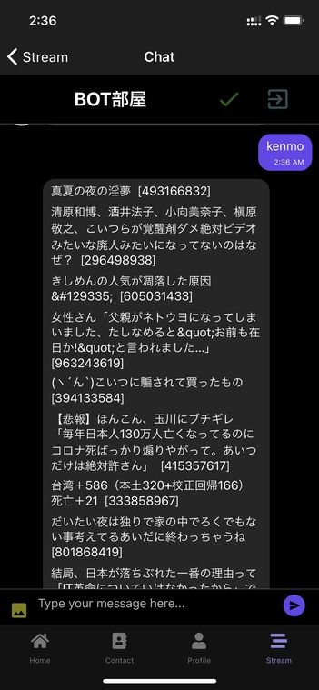
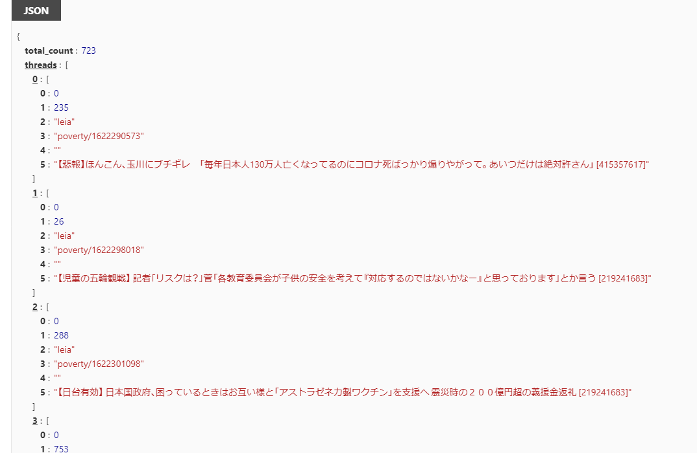
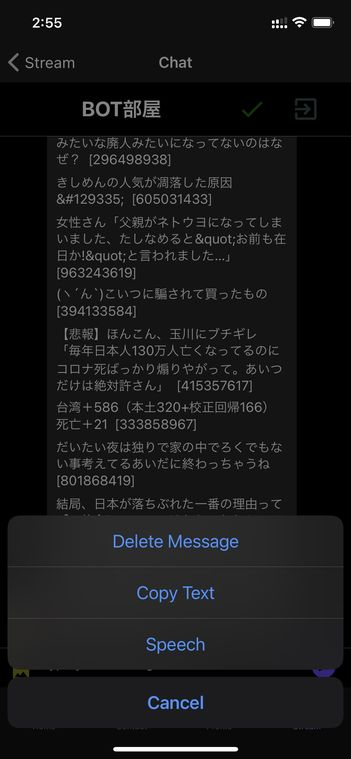

import { Link } from 'gatsby';

## チャットボットが嫌儲のスレタイを返すようにしました

BOT部屋で`kenmo`と発言するとチャットボットが嫌儲のスレタイ先頭10個を返すようにしました。



## 実装方法

今回もFirebase Cloud Functionsを使います。

### スレタイの取得方法

嫌儲のスレ一覧は`https://itest.5ch.net/subbacks/poverty.json`を開くとjson形式で取得できます。

取得したjsonを整形するとこんな感じになります。



これをBOTの発言用に整形してFirestoreに保存する処理を追加していきます。

### 変更したコード

requestのインストール

```shell
npm install request
```

**functions\index.js**

```javascript
const request = require('request')
```

```javascript
exports.kenmoBotMessage = functions.region('asia-northeast2').firestore
  .document('THREADS/rUp75QcwZnt5OuuzTfPo/MESSAGES/{chatId}') // チャット部屋の発言をトリガーにする
  .onCreate((snap, context) => {
    const newValue = snap.data();
    const comment = newValue.text; // 新規発言の内容を取得
    const messageRef = db.collection('THREADS').doc('rUp75QcwZnt5OuuzTfPo').collection('MESSAGES'); // BOT部屋のパス
    const t = new Date().getTime(); // BOTの発言時刻を定義
    const u = { // BOT情報を定義
      _id: 'XVY0p3KFxVaaQtq25JwlwWafUbs1',
      email: 'pineprobot@pinepro.ml',
      avatar: 'https://firebasestorage.googleapis.com/v0/b/kenmochat.appspot.com/o/avatar%2FXVY0p3KFxVaaQtq25JwlwWafUbs11621592754467?alt=media&token=f2366ddf-dc22-4977-a80c-496c5394c8fb',
      name: 'PINE pro BOT',
    };
    const options = { // リクエスト内容を定義
      url: 'https://itest.5ch.net/subbacks/poverty.json',
      method: 'GET',
      json: true
    }

    if (comment === 'kenmo') { // 新規発言が'kenmo'だったときに処理を開始
      request(options, function (error, response, body) { // 先述のURLからjsonを取得
        console.log('現在のスレッド数',body.total_count);
        const threads = body.threads; // 全スレ情報を格納、スレタイ、レス数、URLなど
        const titles = threads.map(thread => thread[5]); // スレタイだけを抽出した配列を作る
        const tts = titles.slice(0, 10) // 先頭から10スレを抽出
        const top = tts.join('\n'); // BOTの発言用に改行してつなげて文字列に変換
        console.log(top)
        const text = top;
          messageRef // 加工したスレタイをBOTの発言としてFirestoreに保存
          .add({
            text,
            createdAt: t,
            user: u
          });
        if (error) { // エラーの場合もBOTに発言させる
          const text = '失敗、嫌儲落ちてるかも';
            messageRef
            .add({
              text,
              createdAt: t,
              user: u
            });
        }
      })
    } else { null }
});
```

## まとめ

前に追加した読み上げ機能と組み合わせるとkenmo.fmっぽいことができる。



---