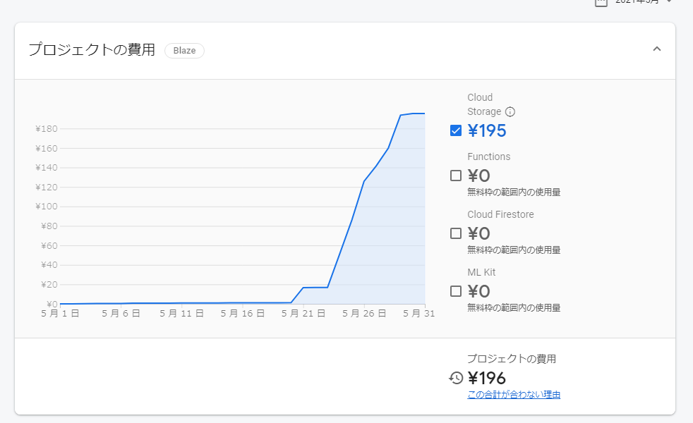
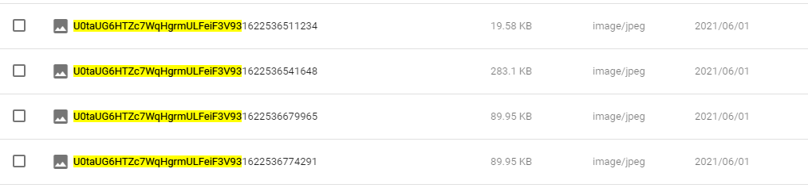

import { Link } from 'gatsby';

## PINE proの運営費が3桁の大台を突破した

先月はFirebase Cloud Storageの無料枠を使い切ったせいでFirebaseへの課金が発生しました。



Cloud Storageは1日1GBのダウンロードを使い切ると$0.12/GB課金されます。先月はチャットボットの実装のために画像を扱うことが多かったので巨額の課金が発生してしまいました。

これまで、画像は特に圧縮してなかったのですがさすがにこれは不味いので[ImageManipulator](https://docs.expo.io/versions/latest/sdk/imagemanipulator/)を使って圧縮するように変更しました。

## 変更したコード

ライブラリのインストール

```shell
expo install expo-image-manipulator
```

**src\scenes\chat\Chat.js**

```javascript
import * as ImageManipulator from 'expo-image-manipulator'
```

```javascript
async function handlePickImage() {
  try {
    if (Constants.platform.ios) {
      const { status } = await ImagePicker.requestMediaLibraryPermissionsAsync()
      if (status !== 'granted') {
        alert("Permission is required for use.");
        return;
      }
    }
    const result = await ImagePicker.launchImageLibraryAsync();
      if (!result.cancelled) {
        const actions = []; // 圧縮パラメーター用の配列を作成
        actions.push({ resize: { width: 1000 } }); // パラメーターを配列に追加、とりあえず解像度を下げる
        const manipulatorResult = await ImageManipulator.manipulateAsync( // ImageManipulatorを使って圧縮処理
          result.uri,
          actions,
          {
            compress: 0.4,
          },
        );
        const localUri = await fetch(manipulatorResult.uri);
        const localBlob = await localUri.blob();
        const filename = myProfile.id + new Date().getTime()
        const storageRef = firebase.storage().ref().child("images/" + filename);
        const putTask = storageRef.put(localBlob);
        putTask.on('state_changed', (snapshot) => {
          let progress = (snapshot.bytesTransferred / snapshot.totalBytes) * 100;
          setProgress(parseInt(progress) + '%')
        }, (error) => {
          console.log(error);
          alert("Upload failed.");
        }, () => {
          putTask.snapshot.ref.getDownloadURL().then(downloadURL => {
            setProgress('')
            setImage(downloadURL)
            setDialog(true)
          })
        })
      }
  } catch (e) {
      console.log('error',e.message);
      alert("The size may be too much.");
  }
}
```

## まとめ

以下は全て同じ画像をパラメーター変えて圧縮した結果です。ファイルサイズがそれぞれ違ってるのが分かると思います。



---