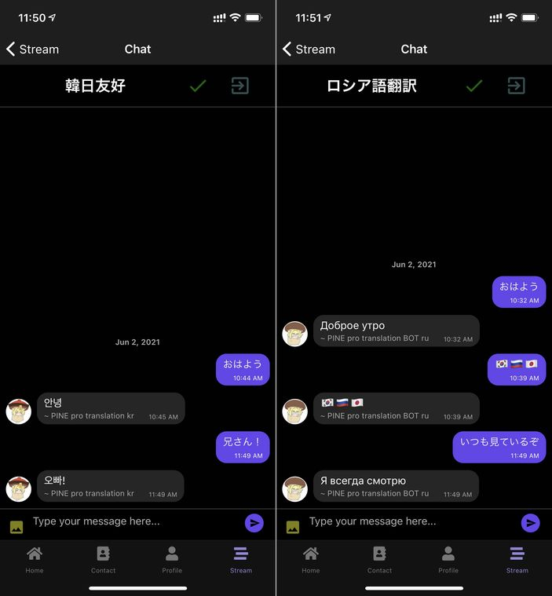
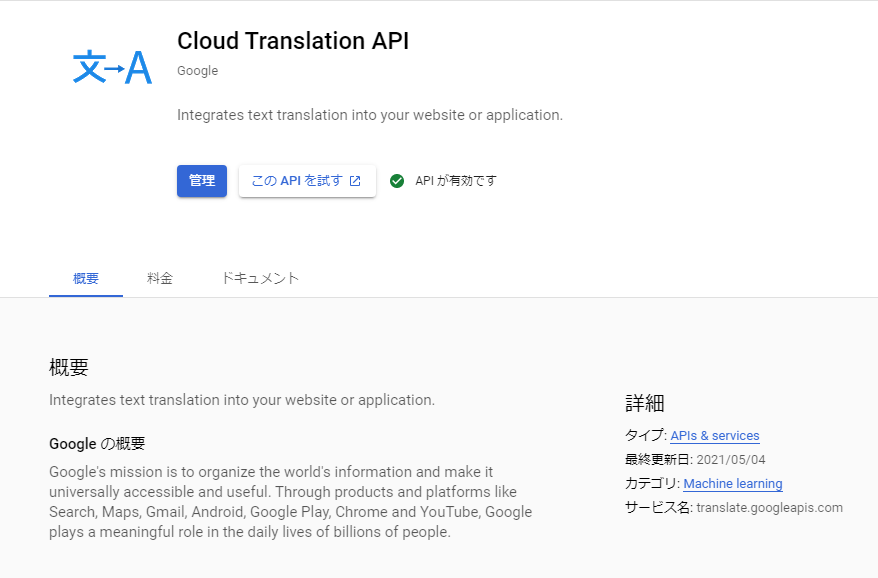
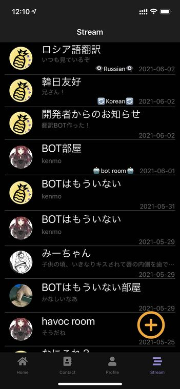

import { Link } from 'gatsby';

## 翻訳BOTを追加しました

**日本語→ロシア語**と**日本語→韓国語**の翻訳BOTがいる部屋を作りました。GCPのCloud Translation APIを利用して実装しました。



## 変更したコード

### 準備

GCPのダッシュボードでCloud Translation APIを有効にします。



APIキーはCloud Visionで使っているものから流用しました。

## コード

### Cloud Functionsの変更

ロシア語用と韓国語用の関数をそれぞれ作りました。

**functions\index.js**

```javascript
exports.translation = functions.region('asia-northeast2').firestore
  .document('THREADS/o65qDbjlphSbs281TDX3/MESSAGES/{chatId}') // 翻訳部屋は固定なのでチャットルームのIDをハードコードする
  .onCreate((snap, context) => {
    const newValue = snap.data();
    const comment = newValue.text; // 新規メッセージを取得
    const user = newValue.user._id; // 発言者のIDを取得
    const messageRef = db.collection('THREADS').doc('o65qDbjlphSbs281TDX3').collection('MESSAGES'); // チャットルームのパス定義
    const t = new Date().getTime(); // BOTの発言日時を定義
    const u = { // BOT情報を定義
      _id: 'vScvjdhKU8VgjrIwINThWEAYUro1',
      email: 'pineprotranslation@pinepro.ml',
      avatar: 'https://firebasestorage.googleapis.com/v0/b/kenmochat.appspot.com/o/avatar%2FvScvjdhKU8VgjrIwINThWEAYUro11622597058533?alt=media&token=ee015141-d7b5-4d1c-919a-8067b642f26a',
      name: 'PINE pro translation BOT ru',
    };

    const fromLang = 'ja' // 翻訳元の言語
    const toLang = 'ru' // 翻訳語の言語
    const apiKey = 'API keyは見せられないよ'

    // APIへのリクエスト内容を定義
    const URL = "https://translation.googleapis.com/language/translate/v2?key="+apiKey+"&q="+encodeURI(comment)+"&source="+fromLang+"&target="+toLang
    const options = {
      url: URL,
      method: 'GET',
      json: true
    }

    if (user != 'vScvjdhKU8VgjrIwINThWEAYUro1') { // BOTが自分の発言に反応しないようにする
      request(options, function (error, response, body) {
        console.log(body.data.translations[0].translatedText);
        const text = body.data.translations[0].translatedText; // レスポンスを取得
          messageRef
          .add({ // レスポンスをFirestoreにBOTの発言として追加する
            text,
            createdAt: t,
            user: u
          });
        if (error) {
          const text = 'わからん';
            messageRef
            .add({
              text,
              createdAt: t,
              user: u
            });
        }
      })
    } else { null }
});
```

### アプリ側の変更

トーク一覧画面ではBOT部屋に目印をつけているので、翻訳部屋にもそれぞれ追加します。



**src\scenes\stream\Stream.js**

部屋のIDを評価してそれぞれの部屋に印をつけるようにしました。

```javascript
<View style={styles.datecontainer}>
  {talk.id === 'Dj04ExLoykNI2sbmOVeW' ?
    (<Text style={scheme === 'dark' ? styles.darkbot : styles.bot}>🤖bot room🤖</Text>) :
    talk.id === 'o65qDbjlphSbs281TDX3' ?
    (<Text style={scheme === 'dark' ? styles.darkbot : styles.bot}>👁‍🗨Russian👁‍🗨</Text>) :
    talk.id === 'T5XMlAahT3dWwHfxFnqH' ?
    (<Text style={scheme === 'dark' ? styles.darkbot : styles.bot}>🔄Korean🔄</Text>) :
    null
  }
  <Text style={scheme === 'dark' ? styles.darklatestDate : styles.latestDate}>{displaytime(talk.latestMessage.createdAt)}</Text>
</View>
```

## まとめ

翻訳APIは以前から使いたかったので実装できてよかったです。

---