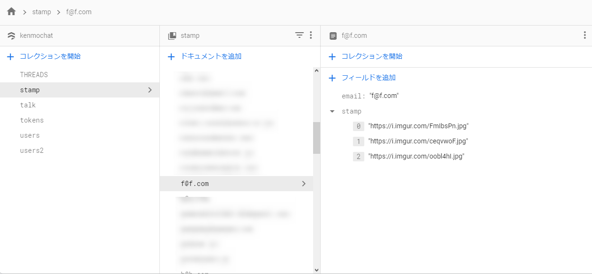
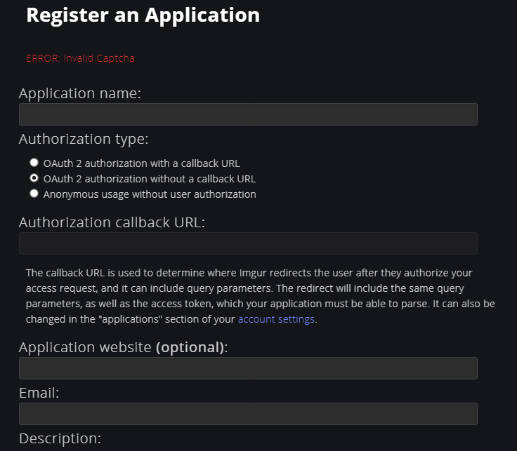

import { Link } from 'gatsby';

## スタンプ(っぽい)機能を追加しました

画像一覧がグリッド表示されたシートが画面下からポップアップします。画像を選択して投稿することができます。もちろん画像のアップロードや削除も可能です。

画像は[imgur.com](https://imgur.com)にアップロードするようにしました。


## 実装方法

imgurにAPI経由で画像をアップロードして、画像のURLをFirestoreに格納しています。



アプリ内で表示するときはURLをImageコンポーネントのソースとして渡して、各Imageをグリッドレイアウトで表示します。

ポップアップ画面のUIコンポーネントは[react-native-reanimated-bottom-sheet](https://github.com/osdnk/react-native-reanimated-bottom-sheet)を使用しました。

## imgurの準備

imgurのAPIを使うにはユーザー登録とAPI keyの取得が必要です。

アカウントを作成してから[Register an Application](https://api.imgur.com/oauth2/addclient)にアクセスしてkeyを取得します。



`OAuth 2 authorization without a callback URL`を選択します。

**Client ID**と**Client Secret**が取得できます。 


エンドポイント`https://api.imgur.com/3/upload`にヘッダーとして`Authorization: Client-ID {CLIENT_ID}`を、`image`にBase64エンコードした画像を渡すと画像をアップロードできます。

アップロードが成功すると以下のようなレスポンスが返ってきます。`data.link`が画像のURLとなります。アプリではこのURLを使います。FirestoreにはURLを列挙した配列を格納するようにします。

```javascript
Object {
  "data": Object {
    "account_id": 0,
    "account_url": null,
    "ad_type": 0,
    "ad_url": "",
    "animated": false,
    "bandwidth": 0,
    "datetime": 1622820068,
    "deletehash": "7nr2auhVneb5VjC",
    "description": null,
    "edited": "0",
    "favorite": false,
    "has_sound": false,
    "height": 1600,
    "id": "jIksl9y",
    "in_gallery": false,
    "in_most_viral": false,
    "is_ad": false,
    "link": "https://i.imgur.com/jIksl9y.jpg",
    "name": "",
    "nsfw": null,
    "section": null,
    "size": 203388,
    "tags": Array [],
    "title": null,
    "type": "image/jpeg",
    "views": 0,
    "vote": null,
    "width": 1200,
  },
  "status": 200,
  "success": true,
}
```

## 変更したコード

### keyを記述したコンポーネントを用意

imgurのAPI keyをアプリ内に記述します。ついでにデフォルトスタンプとして表示する画像も用意します。

**src\scenes\key.js**

```javascript
export const imgur = {
  clientID: '見せられないよ',
  clientSecret: '見せられないよ'
}

export const items = [
  'https://i.imgur.com/H4jdcug.jpg',
  'https://i.imgur.com/UOLkmLk.jpg',
  'https://i.imgur.com/rVWlMGJ.jpg',
  'https://i.imgur.com/2T7wCPS.jpg',
  'https://i.imgur.com/kbvzayW.jpg',
  'https://i.imgur.com/WmkMBNa.jpg',
  'https://i.imgur.com/g9t5CH5.jpg',
  'https://i.imgur.com/lr6v5YR.jpg',
  'https://i.imgur.com/cR4UZYk.jpg',
  'https://i.imgur.com/5aeKc4C.jpg',
];
```

## ポップアップコンポーネントを用意

**src\scenes\chat\Chat.js**

コンポーネントをインポートします。`useRef `も使用します。

```javascript
import React, { useEffect, useState, useRef } from 'react'
import BottomSheet from 'reanimated-bottom-sheet'
```

```javascript
const sheetRef = useRef(null) // ポップアップ画面の表示エリアを制御するフックを作成
const height = Dimensions.get('window').height // 画面の大きさに合わせてポップアップ画面の高さを変えたいので、画面の高さを取得
```

表示部にコンポーネントを設置します。ポップアップする大きさは`画面の高さの60%`と`250`と`20`にします。最小の高さを`20`にしているのは閉じている状態でも、頭を少し出して上に引っ張りあげるようにするためです。


```javascript
<BottomSheet
  ref={sheetRef}
  snapPoints={[height*0.6, 250, 20]}
  initialSnap={2}
  borderRadius={20}
  renderContent={renderContent}
/>
```

### ポップアップ画面の中身を作成

ポップアップコンポーネントで呼び出す中身を定義します。

画像をアップロードするためのボタンを表示して、その下にアップロードした画像をグリッド表示します。

グリッド表示には`FlatList`を使用しました。


```javascript
const renderContent = () => (
  <View style={scheme === 'dark' ? styles.darkbottomsheatcontainer : styles.bottomsheatcontainer}>
    <Divider style={styles.divide} />
      <View style={styles.uploadcontainer}>
        {isUpload ?
          <View style={styles.upload}>
            <IconButton icon='progress-upload' size={24} color='#32cd32' style={{ alignSelf: 'center', marginTop: 0, marginBottom: 0 }} />
          </View> :
          <TouchableOpacity style={styles.upload} onPress={imgurUpload}>
            <IconButton icon='cloud-upload-outline' size={24} color='#f0f8ff' style={{ alignSelf: 'center', marginTop: 0, marginBottom: 0 }} />
          </TouchableOpacity>
        }
      </View>
      <FlatList 
        data={stamps}
        keyExtractor={(item, index) => index.toString()}
        numColumns={3}
        renderItem={({item}) => (
          <TouchableOpacity onPress={() => {select(item)}}>
            <Image
              source={{ uri: item }}
              style={styles.imageStyle}
            />
          </TouchableOpacity>
        )}
      />
  </View>
)
```

アップロード中はアップロードボタン押せなくして、アップロード中の表示を出しておきます。


アップロード中の表示を出し分けるためのフックを定義します。

```javascript
const [isUpload, setUpload] = useState(false)
```

グリッド表示用のスタイリングを定義します。

```javascript
imageStyle: {
  width: ITEM_WIDTH / 3,
  height: ITEM_WIDTH / 3,
  margin: 1,
  resizeMode: 'cover',
},
```

### 自分のスタンプをリッスンする

imgurのAPI keyとデフォルトスタンプをインポートします。

```javascript
import { imgur, items } from '../key'
```

上で書いたように、スタンプはURLを列挙した配列になっています。配列を格納するフックを作成します。

```javascript
const [stamps, setStamps] = useState([])
```

`useEffect`を使って、マウント時にFirestoreからスナップショットを取得します。配列がundefinedだとエラーになるので三項演算子で評価して、undefinedの時はアプリアイコンを格納した配列を渡します。

画像の表示順は新しい順にしたいので`reverse()`を使って配列を逆転させます。その後`concat(items)`でデフォルトスタンプを格納した配列と結合します。

最後に配列をフックにセットします。

```javascript
useEffect(() => {
  const stampListener = firebase.firestore()
    .collection('stamp')
    .doc(myProfile.email)
    .onSnapshot(function(document) {
      const data = document.data()
      const d = data.stamp ? data.stamp : ['https://pinepro.ml/static/avatar-780242398e277f267092de9beaa077c9.png']
      const s = d.reverse()
      const stamps = s.concat(items)
      setStamps(stamps)
    })
  return () => stampListener()
}, []);
```

### imgurにアップロードする関数

アップロード用の関数です。イメージピッカーで画像を取得するときにBase64エンコードしておきます。

アップロードが完了したらURLをFirestoreの自分の配列に追加します。

```javascript
async function imgurUpload() {
  try {
    if (Constants.platform.ios) {
      const { status } = await ImagePicker.requestMediaLibraryPermissionsAsync()
      if (status !== 'granted') {
        alert("Permission is required for use.");
        return;
      }
    }
    const result = await ImagePicker.launchImageLibraryAsync({base64: true});
      if (!result.cancelled) {
        const stampRef = firebase.firestore().collection('stamp').doc(myProfile.email)
        const formdata = new FormData()
        formdata.append("image", result.base64)
        setUpload(true)
        fetch("https://api.imgur.com/3/image/", {
          method: "post",
          headers: {
            Authorization: `Client-ID ${imgur.clientID}`
          },
          body: formdata
        }).then(data => data.json()).then(data => {
          url = data.data.link
          console.log(url)
          stampRef.update({
            stamp: firebase.firestore.FieldValue.arrayUnion(url)
          })
          setUpload(false)
        })
        .catch(error => {
          alert('upload failed')
        })
      }
  } catch (e) {
      console.log('error',e.message);
      alert("The size may be too much.");
  }
}
```

### スタンプ削除用の関数を作成

任意のスタンプをFirestoreから削除する関数を定義します。

```javascript
function removeStamp() {
  const stampRef = firebase.firestore().collection('stamp').doc(myProfile.email)
  stampRef.update({
    stamp: firebase.firestore.FieldValue.arrayRemove(image)
  })
  setImage('')
  setSelectStamp(false)
}
```

### 画像を投稿、削除する機能を作成

ポップアップ画面で選択した画像を投稿したり削除する機能を作ります。画像をタップした時に**投稿**または**削除**を選択するダイアログを作ります。


ダイアログの表示非表示を制御するフックを作成します。

```javascript
const [selectStamp, setSelectStamp] = useState(false)
```

それぞれのボタンの`onPress`イベントにここまで作ってきた関数やフックを配置します。

```javascript
<Dialog.Container visible={selectStamp}>
  <Dialog.Title>Send image?</Dialog.Title>
  <Image
    style={styles.logo}
    source={{uri: image}}
  />
  <Dialog.Button label="Send" bold={true} onPress={() => sendImage()} />
  <Dialog.Button label="Remove" onPress={() => removeStamp()} />
  <Dialog.Button label="Cancel" onPress={() => setSelectStamp(false)} />
</Dialog.Container>
```


ポップアップ画面で画像を選択したときの関数を定義します。選択した画像のURLをフックに格納して、その後ダイアログ制御のフックを`true`にしてダイアログを表示します。

```javascript
function select(url) {
  console.log(url)
  setImage(url)
  setSelectStamp(true)
}
```

### 画像投稿用の関数に追記

画像投稿用の関数は以前からありました。投稿後にダイアログを非表示にしたり、ポップアップ画面を自動で閉じる処理を追記します。

```javascript
function sendImage() {
  const messageRef = firebase.firestore().collection('THREADS')
  messageRef
    .doc(talkData.id)
    .collection('MESSAGES')
    .add({
      text: '',
      image: image,
      createdAt: new Date().getTime(),
      user: {
        _id: myProfile.id,
        email: myProfile.email,
        avatar: myProfile.avatar,
        name: myProfile.fullName,
      }
    });
  setDialog(false)
  setSelectStamp(false) // ダイアログを非表示に
  sheetRef.current.snapTo(2) // ポップアップ画面を閉じる
  setImage('')
}
```

## まとめ

前からスタンプ機能(自分用の画像置き場)が欲しいという意見をもらっていましたが、ただでさえFirebase Cloud Storageの転送量が多くて課金が発生していたため画像を使った機能の追加には及び腰でした。

しかし、スレを立てたときにもらった**Firebaseの課金がヤバいならimgurにアップロードしたらいいじゃん**というアドバイスと、たまたま見つけたオシャレなUIコンポーネント(react-native-reanimated-bottom-sheet)を使ってみたくて実装する気になりました。

やってみたら想像以上にかっこいい機能になったので良かったです。ただAndroidで動きませんでした。どうしよう。

---