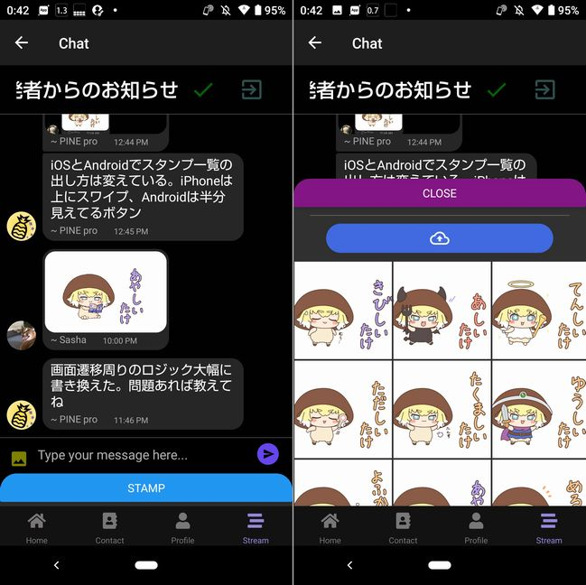

import { Link } from 'gatsby';

## スタンプ機能の改善

本題に入る前に<Link to="/blog/2021-06-04">前回</Link>の続きです。

前回、スタンプ機能を実装しましたがポップアップするスタンプ一覧画面がAndroidでだけ動きませんでした。それを直しました。

iPhoneの場合は下のグレーのバーを上にスワイプするとポップアップします。


Androidでは**STAMP**ボタンをタップすることでポップアップするようにしました。



### Androidで発生していた問題

Androidでは、下からスワイプしてスタンプ一覧の表示はできてましたが一覧部分をスクロールやタップができませんでした。

### コードの変更点

`react-native`からインポートしていた`FlatList`を`react-native-gesture-handler`からインポートするように変更します。

```javascript
import { FlatList } from "react-native-gesture-handler"
```

`BottomSheet`に`enabledContentGestureInteraction`を追加します。初期値は**true**です。iPhoneでは問題ないので`Platform.OS`を使ってAndroidのときだけ**false**になるようにします。これでスタンプのスクロールとタップができるようになります。

```javascript
<BottomSheet
  ref={sheetRef}
  snapPoints={[height*0.6, 250, Platform.OS === 'ios'?20:40]}
  initialSnap={2}
  borderRadius={20}
  renderContent={renderContent}
  enabledContentGestureInteraction={Platform.OS === 'ios'?true:false}
/>
```

ただし、これだと今度はAndroidのときにスワイプで一覧をポップアップすることができなくなります。そこでスワイプではなくボタンで開くように変更します。

そのボタンはポップアップ中は**閉じるボタンに**、閉じてるときは**開くボタン**を表示させるようにします。


ボタンの表示を切り替えるためのフックを定義します。

```javascript
const [isOpne, setOpne] = useState(false)
```

ポップアップを開く関数と閉じる関数を定義します。

```javascript
function opneSheet() {
  sheetRef.current.snapTo(0)
  setOpne(true)
}

function closeSheet() {
  sheetRef.current.snapTo(2)
  setOpne(false)
}
```

ここでも`Platform.OS`を使ってAndroidのときにだけ開く/閉じるボタンを表示します。

```javascript
const renderContent = () => (
  <View style={scheme === 'dark' ? styles.darkbottomsheatcontainer : styles.bottomsheatcontainer}>
    {Platform.OS != 'ios'?
      isOpne ?
        <Button
          title="Close"
          color="#841584"
          onPress={closeSheet}
        /> :
        <Button
          title="Stamp"
          onPress={opneSheet}
        />
      :null
    }
    <Divider style={styles.divide} />
    {/* 変更ないので以下は省略 */}
)
```

スタンプ機能の変更点は以上です。

## Reactコンポーネントの中にReactコンポーネントを書いてはいけない

今回の本題です。

リリース時から気づいていてずっと放置していた問題がありました。もっというとFindGoodOneにもまったく同じ問題があります。それはルーティングに関するものです。

**トーク一覧や連絡先一覧に変更があったとき、またはアバターや名前を変更したとき(要するにFirestoreでリッスンしている値)に変更があったときに、強制的にHome画面に戻ってしまう**というものです。

とてもユーザー体験が悪いです。

状態管理の問題かと思っていた(Reduxを学習しないといけない)のですが、調べてみたら[React Navigation](https://reactnavigation.org/docs/troubleshooting/#screens-are-unmountingremounting-during-navigation)のドキュメントにトラブルシュートがのっていました。


まさにこの問題でした。

>Sometimes you might have noticed that your screens unmount/remount, or your local component state or the navigation state resets when you navigate. This might happen if you are creating React components during render.


解決方法はこちらです。

>If you're unsure, it's always best to make sure that the components you are using as screens are defined outside of a React component. They could be defined in another file and imported, or defined at the top level scope in the same file:

要するに**Reactコンポーネントの中にReactコンポーネントを書いてはいけない**ということです。

問題のコードの抜粋がこちらです。

**src\routes\navigation\Navigation.js**

```javascript
import React, { useEffect, useState } from 'react'
/* 各画面とライブラリのインポート */
import 'react-native-gesture-handler';

const Stack = createStackNavigator()
const Tab = createBottomTabNavigator()

const navigationProps = {
  headerTintColor: 'white',
  headerStyle: { backgroundColor: colors.darkPurple },
  headerTitleStyle: { fontSize: 18 },
}

export default function App() {
  const [loading, setLoading] = useState(true)
  const [user, setUser] = useState(null)

  useEffect(() => {
    /* Firebase authとユーザー情報の取得 */
  }, []);

   (async () => {
     /* 通知のパーミッションを取得してFirestoreにトークンを保存 */
  })();

  if (loading) {
    return (
      <></>
    )
  }

  const HomeNavigator = () => {
    return (
      <Stack.Navigator headerMode="screen" screenOptions={navigationProps}>
        {/* Homeスタックを定義 */}
      </Stack.Navigator>
    )
  }

  const ProfileNavigator = () => {
    return (
      <Stack.Navigator headerMode="screen" screenOptions={navigationProps}>
        {/* Profileスタックを定義 */}
      </Stack.Navigator>
    )
  }

  const ContactNavigator = () => {
    return (
      <Stack.Navigator headerMode="screen" screenOptions={navigationProps}>
        {/* Contactスタックを定義 */}
      </Stack.Navigator>
    )
  }

  const LoginNavigator = () => {
    return (
      <Stack.Navigator headerMode="screen" screenOptions={navigationProps}>
        {/* Loginスタックを定義 */}
      </Stack.Navigator>
    )
  }

  const TabNavigator = () => ( // 各スタックをタブナビゲーターでラップ
    <Tab.Navigator
      screenOptions={({ route }) => ({
        tabBarIcon: ({ focused }) => {
          switch (route.name) {
            case 'Home':
              return (
                <FontIcon
                  name="home"
                  color={focused ? colors.lightPurple : colors.gray}
                  size={20}
                  solid
                />
              )
            case 'Contact':
              return (
                <FontIcon
                  name="address-book"
                  color={focused ? colors.lightPurple : colors.gray}
                  size={20}
                  solid
                />
              )
            case 'Profile':
            return (
              <FontIcon
                name="user"
                color={focused ? colors.lightPurple : colors.gray}
                size={20}
                solid
              />
            )
            default:
              return <View />
          }
        },
      })}
      tabBarOptions={{
        activeTintColor: colors.lightPurple,
        inactiveTintColor: colors.gray,
      }}
      initialRouteName="Home"
      swipeEnabled={false}
    >
      <Tab.Screen name="Home" component={HomeNavigator} />
      <Tab.Screen name="Contact" component={ContactNavigator} />
      <Tab.Screen name="Profile" component={ProfileNavigator} />
    </Tab.Navigator>
  )

  return(
    <NavigationContainer>
      { user ? ( // Firestoreから自分の情報を取得できてるか評価してログイン状態を判定
        <TabNavigator/>
        ) : (
        <LoginNavigator/>
      )}
    </NavigationContainer>
  )
}
```

`App`関数の中に全てのコンポーネントを書いていたのが原因でした。このせいで`user`が更新されたときにスタックがリセットされていました。

というわけで、各スタックとタブナビゲーターを別ファイルに切り出します。各スタックは`user`を使用して**トーク一覧**や**連絡先**、**ユーザープロファイル**を表示しているのでデータの受け渡しも必要です。

`App`関数内で`useEffect`を使いユーザー情報を取得して、それをタブナビゲーターを通じて各スタックに渡すように書き換えていきます。

### 変更したコード

**src\routes\navigation\Navigation.js**

```javascript
import 'react-native-gesture-handler';
import React, { useEffect, useState } from 'react'
import { firebase } from '../../firebase/config'
import { colors } from 'theme'
import { NavigationContainer } from '@react-navigation/native'
import * as Notifications from 'expo-notifications'
import { useColorScheme } from 'react-native'
import { DefaultTheme, DarkTheme } from '@react-navigation/native'
// import DrawerNavigator from './drawer'
import { LoginNavigator } from './stacks'
import TabNavigator from './tabs'
import {decode, encode} from 'base-64'
if (!global.btoa) { global.btoa = encode }
if (!global.atob) { global.atob = decode }

export default function App() {
  const [loading, setLoading] = useState(true)
  const [user, setUser] = useState(null)
  const scheme = useColorScheme()

  const navigationProps = {
    headerTintColor: 'white',
    headerStyle: { 
      backgroundColor: scheme === 'dark' ? colors.dark : colors.darkPurple
    },
    headerTitleStyle: { fontSize: 18 },
  }

  useEffect(() => {
    const usersRef = firebase.firestore().collection('users');
    firebase.auth().onAuthStateChanged(user => {
      if (user) {
        usersRef
          .doc(user.uid)
          .onSnapshot(function(document) {
            const userData = document.data()
            setLoading(false)
            setUser(userData)
          })
      } else {
        setLoading(false)
      }
    });
  }, []);

   (async () => {
    const { status: existingStatus } = await Notifications.getPermissionsAsync()
    let finalStatus = existingStatus;
    if (existingStatus !== "granted") {
      const { status } = await Notifications.requestPermissionsAsync();
      finalStatus = status;
    }
    if (finalStatus !== "granted") {
      return;
    }
    const token = await Notifications.getExpoPushTokenAsync();
    await firebase.firestore().collection("tokens").doc(user.email).set({ token: token.data, email: user.email })
  })();

  if (loading) {
    return (
      <></>
    )
  }

  return(
    <NavigationContainer theme={scheme === 'dark' ? DarkTheme : DefaultTheme}>
      { user ? (
        <TabNavigator user={user} scheme={scheme} navigationProps={navigationProps}/>
        ) : (
        <LoginNavigator scheme={scheme} navigationProps={navigationProps}/>
      )}
    </NavigationContainer>
  )
}
```

**src\routes\navigation\tabs\Tabs.js**

```javascript
import React from 'react'
import { View } from 'react-native'
import { createBottomTabNavigator } from '@react-navigation/bottom-tabs'
import FontIcon from 'react-native-vector-icons/FontAwesome5'
import { colors } from 'theme'

// stack navigators
import { HomeNavigator, ProfileNavigator, ContactNavigator, StreamNavigator } from '../stacks'

const Tab = createBottomTabNavigator()

const TabNavigator = (props) => {
  const user = props.user
  const scheme = props.scheme
  const navigationProps = props.navigationProps
  return (
    <Tab.Navigator
      screenOptions={({ route }) => ({
        tabBarIcon: ({ focused }) => {
          switch (route.name) {
            case 'Home':
              return (
                <FontIcon
                  name="home"
                  color={focused ? colors.lightPurple : colors.gray}
                  size={20}
                  solid
                />
              )
            case 'Contact':
              return (
                <FontIcon
                  name="address-book"
                  color={focused ? colors.lightPurple : colors.gray}
                  size={20}
                  solid
                />
              )
            case 'Profile':
            return (
              <FontIcon
                name="user"
                color={focused ? colors.lightPurple : colors.gray}
                size={20}
                solid
              />
            )
            case 'Stream':
            return (
              <FontIcon
                name="stream"
                color={focused ? colors.lightPurple : colors.gray}
                size={20}
                solid
              />
            )
            default:
              return <View />
          }
        },
      })}
      tabBarOptions={{
        activeTintColor: colors.lightPurple,
        inactiveTintColor: colors.gray,
      }}
      initialRouteName="Home"
      swipeEnabled={false}
    >
      <Tab.Screen
        name="Home" 
        children={()=> <HomeNavigator user={user} navigationProps={navigationProps}/>}
      />
      <Tab.Screen
        name="Contact"
        children={()=> <ContactNavigator user={user} navigationProps={navigationProps}/>}
      />
      <Tab.Screen
        name="Profile"
        children={()=> <ProfileNavigator user={user} navigationProps={navigationProps}/>}
      />
      <Tab.Screen 
        name="Stream"
        children={()=> <StreamNavigator user={user} navigationProps={navigationProps}/>}
      />
    </Tab.Navigator>
  )
}

export default TabNavigator
```

**src\routes\navigation\stacks\Stacks.js**

```javascript
import React from 'react'
import { createStackNavigator } from '@react-navigation/stack'
import Login from '../../../scenes/login'
import Registration from '../../../scenes/registration'
import Home from '../../../scenes/home'
import Profile from '../../../scenes/profile'
import Detail from '../../../scenes/details'
import Scan from '../../../scenes/scan'
import Contact from '../../../scenes/contact'
import User from '../../../scenes/user'
import Info from '../../../scenes/info'
import Talk from '../../../scenes/talk'
import Participant from '../../../scenes/participant'
import Stream from '../../../scenes/stream'
import Chat from '../../../scenes/chat'

const Stack = createStackNavigator()

export const LoginNavigator = (props) => {
  const navigationProps = props.navigationProps
  return (
    <Stack.Navigator headerMode="screen" screenOptions={navigationProps}>
      <Stack.Screen
        name="Login"
        component={Login}
      />
      <Stack.Screen
        name="Registration"
        component={Registration}
      />
    </Stack.Navigator>
  )
}

export const HomeNavigator = (props) => {
  const user = props.user
  const navigationProps = props.navigationProps
  return (
    <Stack.Navigator headerMode="screen" screenOptions={navigationProps}>
      <Stack.Screen name="Home">
        {props => <Home {...props} extraData={user} />}
      </Stack.Screen>
      <Stack.Screen name="Talk">
        {props => <Talk {...props} extraData={user} />}
      </Stack.Screen>
      <Stack.Screen name="Participant">
        {props => <Participant {...props} extraData={user} />}
      </Stack.Screen>
    </Stack.Navigator>
  )
}

export const ProfileNavigator = (props) => {
  const user = props.user
  const navigationProps = props.navigationProps
  return (
    <Stack.Navigator headerMode="screen" screenOptions={navigationProps}>
      <Stack.Screen name="Profile">
        {props => <Profile {...props} extraData={user} />}
      </Stack.Screen>
      <Stack.Screen name="Detail">
        {props => <Detail {...props} extraData={user} />}
      </Stack.Screen>
      <Stack.Screen name="Scan">
        {props => <Scan {...props} extraData={user} />}
      </Stack.Screen>
      <Stack.Screen name="User">
        {props => <User {...props} extraData={user} />}
      </Stack.Screen>
    </Stack.Navigator>
  )
}

export const ContactNavigator = (props) => {
  const user = props.user
  const navigationProps = props.navigationProps
  return (
    <Stack.Navigator headerMode="screen" screenOptions={navigationProps}>
      <Stack.Screen name="Contact">
        {props => <Contact {...props} extraData={user} />}
      </Stack.Screen>
      <Stack.Screen name="User">
        {props => <User {...props} extraData={user} />}
      </Stack.Screen>
      <Stack.Screen name="Info">
        {props => <Info {...props} extraData={user} />}
      </Stack.Screen>
    </Stack.Navigator>
  )
}

export const StreamNavigator = (props) => {
  const user = props.user
  const navigationProps = props.navigationProps
  return (
    <Stack.Navigator headerMode="screen" screenOptions={navigationProps}>
      <Stack.Screen name="Stream">
        {props => <Stream {...props} extraData={user} />}
      </Stack.Screen>
      <Stack.Screen name="Chat">
        {props => <Chat {...props} extraData={user} />}
      </Stack.Screen>
      <Stack.Screen name="Participant">
        {props => <Participant {...props} extraData={user} />}
      </Stack.Screen>
    </Stack.Navigator>
  )
}
```

ルーティングの設定は以上です。Reactっぽい`props`を多用するコードになりました。

各画面内の`useEffect`も修正しました。`userData`に**App**で取得したユーザー情報が入っているので`useEffect`の第二引数に設定して値が変わるたびにコールバックされるように変更しました。連絡先一覧でも同じ修正をしました。

**src\scenes\home\Home.js**

```javascript
const userData = props.extraData
```

```javascript
useEffect(() => {
  const talkListner = () => {
    setTheArray([])
    for (const elem of talkArray) {
      const userRef2 = firebase.firestore().collection('talk').doc(elem)
      userRef2.get().then((doc) => {
        if (doc.exists) {
          userRef2
          .onSnapshot(function(document) {
            const data = document.data()
            setTheArray(oldArray => [...oldArray, data])
          })
        } else {
          null
        }
      })
    }
  }
  talkListner()
},[userData])
```

## まとめ

ずっと放置していた不具合が(多分)なおって良かったです。

次は画像の保存と、トーク一覧画面(Homeタブ)の未読表示を追加したいと思っています。

---