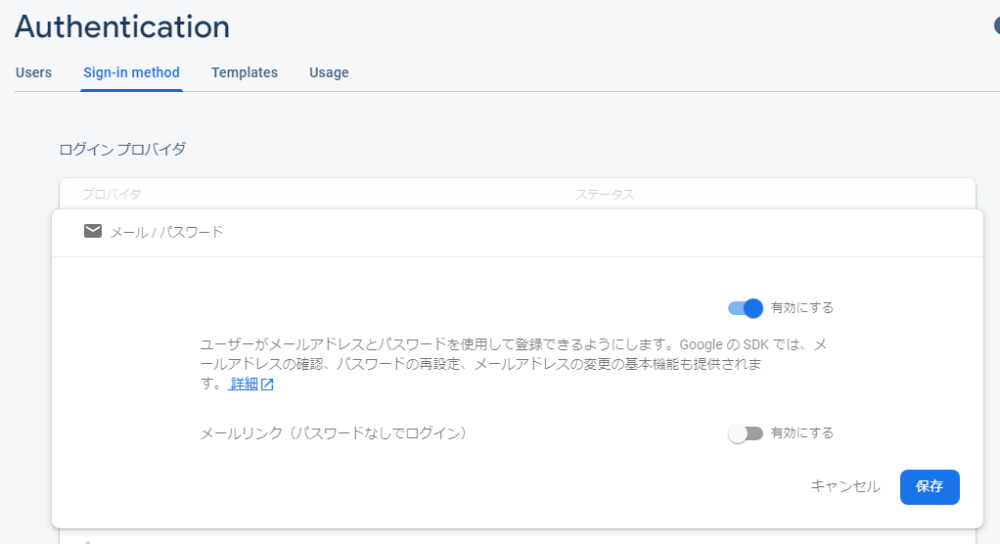
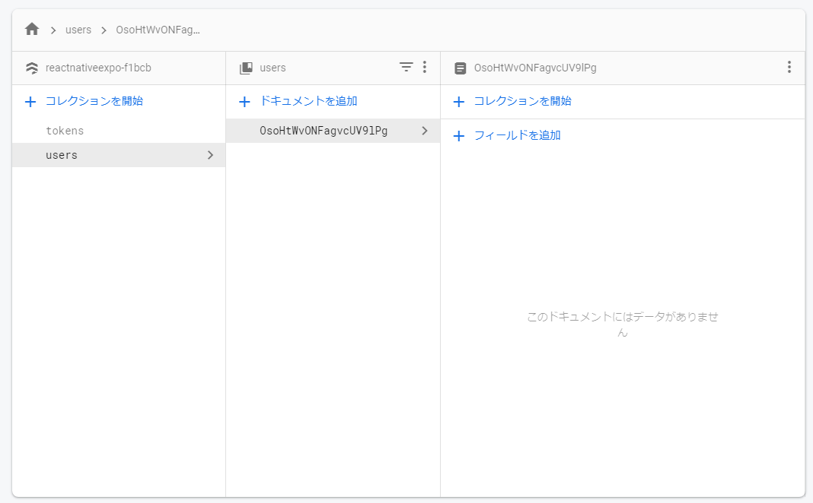
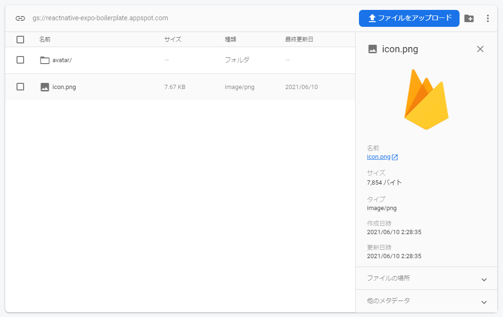
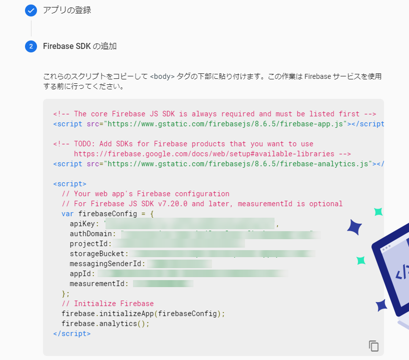

import { Link } from 'gatsby';

## React Native Expo with Firebase

新しいアプリを思いついたわけではないですが、今後のために自分用のボイラープレートを作りました。

- [kiyohken2000/reactnative-expo-firebase-boilerplate](https://github.com/kiyohken2000/reactnative-expo-firebase-boilerplate)
- [Expo Link](https://expo.io/@votepurchase/reactnative-expo-firebase-boilerplate)

<br/>

## Screens


<br/>

## Infrastructure

- React Native 
- Expo
- Firebase(Authentication, Firestore, Storage)

<br/>

## Libraries

- Expo 41
- axios
- react-navigation
- expo-constants
- expo-image-manipulator
- expo-image-picker
- expo-notifications
- firebase
- react-native-elements
- react-native-svg
- react-native-vector-icons

<br/>

## Feature

- Bottom tab and Stack navigation
- Registration with E-mail & Password
- Login with E-mail and Password
- Handling persisted login credentials
- Writing to Firestore Database
- Reading from Firestore Database
- Uploading images to Firebase Storage
- Update user profile
- Dynamic switching of dark themes by device appearance
- Retrieving Expo push tokens and saving them to Firestore

<br/>

## How to use

### 1. Install

```
git clone https://github.com/kiyohken2000/reactnative-expo-firebase-boilerplate.git
cd reactnative-expo-firebase-boilerplate
yarn install
```

### 2. Setting up Firebase

**Step 1: Create a Google Firebase Account**

- Go to [https://console.firebase.google.com/](https://console.firebase.google.com/)
- Sign up an account and create a new project
- Put in your project name, click "Continue".
- Google Analytics can be enabled or disabled.
- Click "Create Project" it is going to take a while before it says "Your new project is ready", click "Continue."

<br/>

**Step 2: Configure Firebase Console Sign-In Methods**

- On "Project Overview", click the "Authentication" on the left sidebar.
- Click on the second tab where it said "Sign-In method"
- Enable all the Sign-in method you would like to enable. For now, we will enable the "Email/Password" option.

<br/>



**Step 3: Configure Firebase Console Firestore**

- We will then click the "Cloud Firestore" on the left to create a database.
- Select the "Start in test mode" option, click "next."
- Select the "Cloud Firestore location", click "Enable"
- Create the "users" and "tokens" collections. An empty document is fine.

<br/>



**Step 4: Create a folder in Cloud Storage**

- Next. Click Storage on the left.
- Create an empty "avatar" folder.
- Upload the image file "icon.png" of your choice. This is the default icon for app users.

<br/>



**Step 5: Copy the API Key**

- On the Project Overview, click on the "Web" icon since we are building on Expo.
- Then give it a name, click "Register app".
- It will show you the Firebase configuration, copy the SDK keys, we will use it in the next step.

<br/>



**Step 6: Connect Firebase**

- Write the copied API key in your app.

<br/>

**src\firebase\config.js**

```javascript
import * as firebase from 'firebase'
import "firebase/auth"
import "firebase/firestore"
import "firebase/storage"

const firebaseConfig = {
  apiKey: "Your API Key",
  authDomain: "Your API Key",
  projectId: "Your API Key",
  storageBucket: "Your API Key",
  messagingSenderId: "Your API Key",
  appId: "Your API Key",
  measurementId: "Your API Key"
};

if (!firebase.apps.length) {
  firebase.initializeApp(firebaseConfig);
}

export { firebase };
```

### 3. Update app.json and default avatar

Replace the name and Slug with yours.

```
"name": "your-app-name",
"slug": "your-app-name",
```

**src\scenes\registration\Registration.js**

```javascript
const data = {
  id: uid,
  email,
  fullName,
  avatar: 'Your default icon URL',
};
```

### 4. Run Your App

```
expo start
```

## Licence

This project is available under the MIT license. See the [LICENSE](https://github.com/kiyohken2000/reactnative-expo-firebase-boilerplate/blob/master/LICENSE) file for more info.

## TODO

- Deleting account
- Add Sign in with Google

---